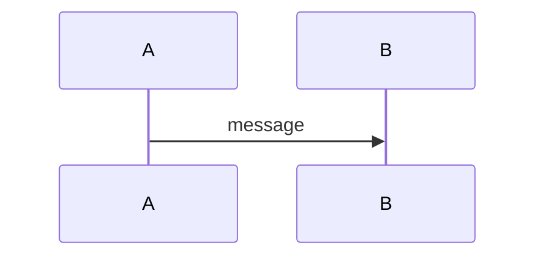

# Diagram Improvements Summary

## What Was Done

### 1. ✅ Added Professional Theming to Mermaid Diagrams
All Mermaid diagrams now use a consistent `base` theme with custom variables:
- Clean, professional grayscale color scheme
- Consistent indigo accents for actors
- Amber highlights for important notes
- Professional typography (system-ui fonts)

**Files updated:**
- `x402-integration/comparison.mdx` - Decision tree
- `contracts/examples.mdx` - E-commerce with freeze example (first of 8)
- More sequence diagrams need theming applied

### 2. ✅ Converted Key Diagrams to Static SVG
Created custom-designed static images for hero diagrams:

**Fee Distribution** (`/images/fee-distribution.svg`)
- Clean hierarchical flow showing payment split
- Used in 2 locations (core-contracts.mdx, architecture.mdx)
- Professional color coding matching brand
- Clear labels and calculations

**Escrow vs Exact Comparison** (`/images/escrow-vs-exact.svg`)
- Side-by-side comparison of payment schemes
- Visual distinction between immediate and deferred settlement
- Clear flow arrows showing different paths
- Warning/success callouts for key differences

### 3. ✅ Created ASCII Reference Files
- `fee-distribution-ascii.txt` - Text version for reference
- `mermaid-theme.txt` - Standard theme configuration

### 4. ✅ Documentation
- `DIAGRAM_GUIDE.md` - Complete guide on which diagrams are static vs Mermaid
- Recommendations for future conversions
- Best practices for diagram selection

## What Still Needs to Be Done

### Apply Theming to Remaining Sequence Diagrams
The following sequence diagrams in `contracts/examples.mdx` still need theming:
- Physical Goods with Extended Escrow (line ~192)
- Milestone-Based Payments (line ~253)
- Receiver-Initiated Refunds (line ~357)
- Subscription Payments (line ~409)
- DAO Treasury Controlled (line ~456)
- Platform-Controlled Streaming (line ~511)
- Self-Service Invoice Payment (line ~561)

### Other Files with Diagrams
- `x402-integration/escrow-scheme.mdx` - Main sequence diagram (line ~249)
- `x402-integration/overview.mdx` - Payment flow sequence (line ~116)
- `contracts/core-contracts.mdx` - State diagrams (lines 280, 389)
- `contracts/factories.mdx` - Relationship diagram (line ~237)
- `contracts/conditions.mdx` - Logic tree (line ~257)

### Optional Future Improvements
Consider converting these to static images for extra polish:
1. **Decision Tree** (comparison.mdx) - Could be an infographic
2. **Payment State Machine** (core-contracts.mdx) - Hero diagram
3. **Condition Logic Tree** (conditions.mdx) - Complex nested logic

## How to Apply Theme to Remaining Diagrams

1. Copy the theme init line from `images/mermaid-theme.txt`
2. Paste it as the first line inside the mermaid code block
3. Ensure no special characters in labels (use hyphens instead of colons)

Example:
```markdown

```

## Testing

Run `npx mint dev` and verify:
- ✅ No "Unsupported markdown" errors
- ✅ Static images load correctly from `/images/` folder
- ✅ Mermaid diagrams render with consistent theming
- ✅ Colors match brand guidelines
- ✅ All diagrams are readable on both light/dark backgrounds

## Next Steps

1. Apply theme to remaining 7 sequence diagrams in examples.mdx
2. Apply theme to main sequence diagrams in other files
3. Test on localhost with `npx mint dev`
4. Consider creating dark mode variants of static SVGs
5. Optional: Convert decision tree and state machine to static images
