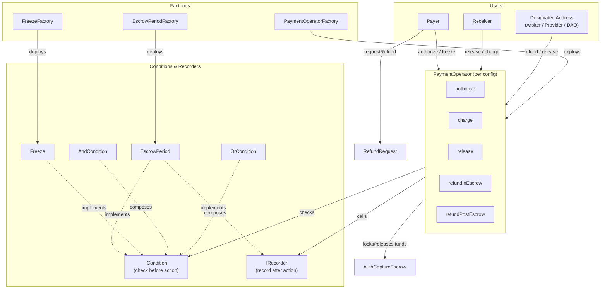

## System Overview



For additional visual diagrams, see the [x402r-contracts repository](https://github.com/BackTrackCo/x402r-contracts#architecture).

## Payment Flow Sequence

### Standard Payment (Happy Path)

1. **Payer** calls `operator.authorize(paymentInfo, amount, tokenCollector, collectorData)`
2. **Operator** checks `AUTHORIZE_CONDITION` (if set)
3. **Operator** validates fee bounds and stores fees at authorization time
4. **Operator** calls `escrow.authorize()` to lock funds
5. **Operator** calls `AUTHORIZE_RECORDER` to record timestamp
6. **Escrow period** begins (e.g., 7 days) - if configured
7. After escrow period: **Authorized address(es)** call `operator.release(paymentInfo, amount)` (e.g., receiver, designated address, or both)
8. **Operator** checks `RELEASE_CONDITION` (configurable - can include time checks, role checks, etc.)
9. **Operator** calls `escrow.capture()` to transfer funds to receiver
10. **Operator** accumulates protocol fees for later distribution
11. **Operator** calls `RELEASE_RECORDER` to update state

### Refund Flow (In-Escrow)

**Example: Marketplace with arbiter dispute resolution**

1. **Payer** calls `refundRequest.requestRefund(paymentInfo, amount, nonce)`
2. **RefundRequest** creates request with status `Pending`
3. **Designated address** (e.g., arbiter, DAO multisig) reviews dispute
4. **Designated address** calls `refundRequest.updateStatus(paymentInfo, nonce, Approved)`
5. **Designated address** calls `operator.refundInEscrow(paymentInfo, amount)`
6. **Operator** checks `REFUND_IN_ESCROW_CONDITION` (configured per operator)
7. **Operator** calls `escrow.partialVoid()` to return funds to payer
8. **Operator** calls `REFUND_IN_ESCROW_RECORDER`
9. Funds transferred back to payer

<Note>
Refund conditions are configurable. Can be arbiter-only (marketplace), receiver-allowed (return policy), DAO-controlled (governance), or disabled (subscriptions).
</Note>

### Freeze Flow

**Example: Marketplace with payer freeze protection**

**Timeline:**
- **Day 0:** Payment authorized, escrow period begins
- **Day 0-7:** Payer can freeze if suspicious (per Freeze contract configuration)
- **Day 3:** Payer freezes payment (freeze lasts 3 days per configuration)
- **Day 3-6:** Payment frozen, release blocked
- **Day 6:** Freeze expires automatically (or authorized address unfreezes early)
- **Day 7:** Escrow period ends
- **Day 7+:** Authorized address(es) can release (if not frozen)

<Note>
Freeze policies are optional and configurable. Define who can freeze, who can unfreeze, and how long freeze lasts.
</Note>

<Warning>
**MEV Protection:** Payers should freeze EARLY if suspicious, not at the deadline. Use private mempool (Flashbots Protect) if freezing near expiry to avoid front-running.
</Warning>

## Condition Evaluation Flow

### Authorization Check (Before Action)

When an action is called (e.g., `release()`):

1. **Load Condition** - Get the condition address from operator slot
2. **Evaluate Condition** - Call `condition.check(paymentInfo, amount, caller)`
   - Check if caller matches required role (e.g., receiver, arbiter)
   - Check state (e.g., escrow period passed, not frozen)
   - Check other requirements (e.g., time constraints)
3. **Result:**
   - `true` → Proceed to execute action
   - `false` → Revert with `ConditionNotMet` error
4. **Execute Action** - Call escrow method
5. **Call Recorder** - Update state after successful execution

### Combinator Example

**OrCondition([ReceiverCondition, StaticAddressCondition(arbiter)])**
- Checks if caller is receiver: Yes → PASS
- If not receiver, checks if caller is arbiter: Yes → PASS
- If neither: FAIL

**AndCondition([OrCondition(...), EscrowPeriod])**
- First checks OrCondition: PASS (caller is receiver or arbiter)
- Then checks EscrowPeriod: PASS (escrow period elapsed)
- Both passed → PASS (action allowed)

<Note>
This example shows marketplace configuration. For subscriptions, you might use `StaticAddressCondition(serviceProvider)` instead. For DAO governance, use `StaticAddressCondition(daoMultisig)`.
</Note>

## Data Flow

### Payment Information

```solidity
// PaymentInfo is from base commerce-payments (AuthCaptureEscrow)
// Passed as calldata to operator methods - not stored in operator
struct PaymentInfo {
    address payer;
    address receiver;
    address operator;           // The PaymentOperator address
    uint256 amount;
    address token;
    uint48 authorizationExpiry; // When authorization expires
    uint16 minFeeBps;           // Minimum fee in basis points
    uint16 maxFeeBps;           // Maximum fee in basis points
    address feeReceiver;        // Who receives fees (operator itself)
}
```

### Operator State (Minimal)

```solidity
// PaymentOperator stores only fee-related state
// Payment state is queried directly from escrow

// Fees locked at authorization time
mapping(bytes32 paymentInfoHash => AuthorizedFees) public authorizedFees;

// Protocol fees pending distribution
mapping(address token => uint256) public accumulatedProtocolFees;
```

### EscrowPeriod Recording

```solidity
// In EscrowPeriod (extends AuthorizationTimeRecorder)
mapping(bytes32 paymentInfoHash => uint256 authorizedAt) public authorizationTimes;
```

### Freeze State (Separate Contract)

```solidity
// In Freeze contract
mapping(bytes32 paymentInfoHash => uint256 frozenUntil) public frozenUntil;
```

### Fee Distribution (Additive Model)

Fees are **additive**: `totalFee = protocolFee + operatorFee`

For a 1000 USDC payment with 3 bps protocol fee + 2 bps operator fee:
- **Protocol Fee:** 0.30 USDC (3 bps) → `protocolFeeRecipient` on ProtocolFeeConfig
- **Operator Fee:** 0.20 USDC (2 bps) → `FEE_RECIPIENT` on operator
- **Total Fee:** 0.50 USDC (5 bps)
- **Receiver Gets:** 999.50 USDC

Fees accumulate in the operator and are distributed via `distributeFees(token)`.

**FEE_RECIPIENT** can be:
- Arbiter address (marketplace with disputes)
- Service provider address (subscriptions, APIs)
- Platform treasury (platform-controlled)
- DAO multisig (governance-controlled)

## Roles & Permissions

| Role | Capabilities | Restrictions |
|------|-------------|--------------|
| **Payer** | `authorize()`, `freeze()`, `unfreeze()`, `requestRefund()`, `cancelRefundRequest()` | Can only act on own payments |
| **Receiver** | `release()` (if condition allows), `charge()`, `requestRefund()` | Can only act on payments where they are receiver |
| **Designated Address** | Any action per conditions (e.g., `refundInEscrow()`, `release()`, `updateStatus()`) | Defined by StaticAddressCondition (arbiter, DAO, service provider, etc.) |
| **Protocol Owner** | `queueCalculator()`, `executeCalculator()`, `queueRecipient()`, `executeRecipient()` | 7-day timelock on ProtocolFeeConfig changes |

<Note>
"Designated Address" is configured per operator via StaticAddressCondition. Can be:
- **Arbiter** (marketplace with disputes)
- **Service Provider** (subscriptions, APIs)
- **DAO Multisig** (governance-controlled)
- **Platform Treasury** (platform-controlled)
- **Compliance Officer** (regulated services)
</Note>

## Security Features

### Reentrancy Protection

All state-changing functions use `ReentrancyGuardTransient` (EIP-1153):
- More gas-efficient than persistent storage
- Automatic cleanup after transaction
- Protection against cross-function reentrancy

### Timelock Protection

Protocol fee calculator changes require 7-day delay on `ProtocolFeeConfig`:

```typescript
// Step 1: Queue new calculator
await protocolFeeConfig.queueCalculator(newCalculatorAddress);

// Step 2: Wait 7 days

// Step 3: Execute
await protocolFeeConfig.executeCalculator();
```

Protocol fee recipient changes also require 7-day timelock:

```typescript
// Step 1: Queue new recipient
await protocolFeeConfig.queueRecipient(newRecipientAddress);

// Step 2: Wait 7 days

// Step 3: Execute
await protocolFeeConfig.executeRecipient();
```

<Note>
Operator fees are **immutable** - set at deploy time via `IFeeCalculator`. Only protocol fees can be changed (with 7-day timelock).
</Note>

### Two-Step Ownership

Ownership transfers use Solady's Ownable pattern:

1. Current owner calls `requestOwnershipHandover(newOwner)`
2. New owner calls `completeOwnershipHandover()`
3. 48-hour window for completion

## Event Architecture

### Core Events

```solidity
// Payment lifecycle (PaymentOperator events)
event AuthorizationCreated(bytes32 indexed paymentInfoHash, address indexed payer, address indexed receiver, uint256 amount, uint256 timestamp);
event ChargeExecuted(bytes32 indexed paymentInfoHash, address indexed payer, address indexed receiver, uint256 amount, uint256 timestamp);
event ReleaseExecuted(AuthCaptureEscrow.PaymentInfo paymentInfo, uint256 amount, uint256 timestamp);
event RefundInEscrowExecuted(AuthCaptureEscrow.PaymentInfo paymentInfo, address indexed payer, uint256 amount);
event RefundPostEscrowExecuted(AuthCaptureEscrow.PaymentInfo paymentInfo, address indexed payer, uint256 amount);

// Fee distribution
event FeesDistributed(address indexed token, uint256 protocolAmount, uint256 arbiterAmount);
event OperatorDeployed(address indexed operator, address indexed feeRecipient, address indexed releaseCondition);

// Freeze state (Freeze contract events)
event PaymentFrozen(bytes32 indexed paymentInfoHash, uint40 frozenAt);
event PaymentUnfrozen(bytes32 indexed paymentInfoHash);
```

These events enable off-chain monitoring and indexing.

## Next Steps

<CardGroup cols={2}>
  <Card title="Core Contracts" icon="file-contract" href="/contracts/core-contracts">
    Learn about individual contract implementations.
  </Card>
  <Card title="Factories" icon="industry" href="/contracts/factories">
    Understand factory deployment patterns.
  </Card>
  <Card title="Conditions" icon="filter" href="/contracts/conditions">
    Explore the condition system and combinators.
  </Card>
  <Card title="Examples" icon="code" href="/contracts/examples">
    See real-world configuration examples.
  </Card>
</CardGroup>
