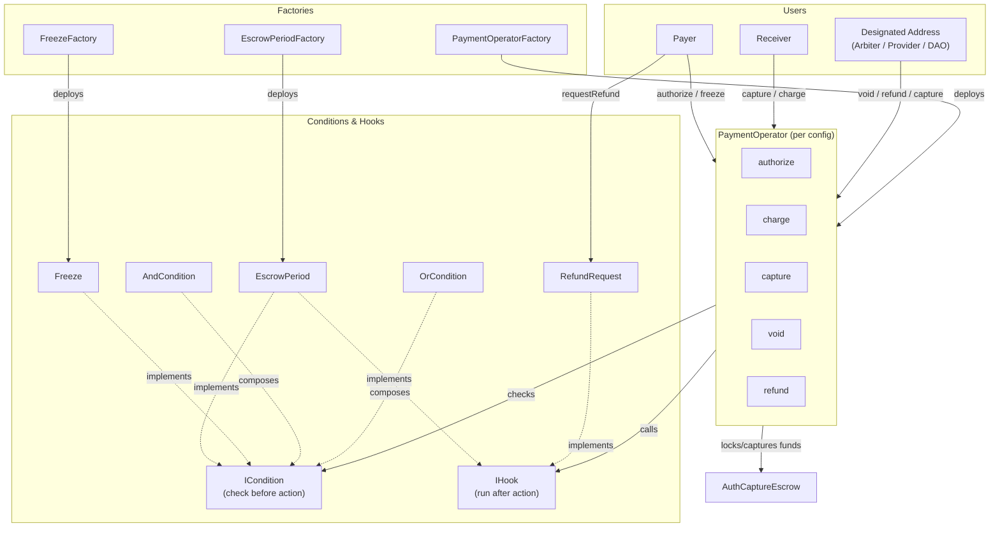

## System Overview



For more visual diagrams, see the [x402r-contracts repository](https://github.com/BackTrackCo/x402r-contracts#architecture).

## Payment Flow Sequence

### Standard Payment (Happy Path)

1. **Payer** calls `operator.authorize(paymentInfo, amount, tokenCollector, collectorData)`
2. **Operator** checks `AUTHORIZE_PRE_ACTION_CONDITION` (if set)
3. **Operator** validates fee bounds and stores fees at authorization time
4. **Operator** calls `escrow.authorize()` to lock funds
5. **Operator** calls `AUTHORIZE_POST_ACTION_HOOK` to record timestamp
6. **Escrow period** begins (for example, 7 days) if configured
7. After escrow period: **Authorized addresses** call `operator.capture(paymentInfo, amount)` (for example, receiver, designated address, or both)
8. **Operator** checks `CAPTURE_PRE_ACTION_CONDITION` (configurable, can include time checks or role checks)
9. **Operator** calls `escrow.capture()` to transfer funds to receiver
10. **Operator** accumulates protocol fees for later distribution
11. **Operator** calls `CAPTURE_POST_ACTION_HOOK` to update state

### Void Flow (before capture)

**Example: Marketplace with arbiter dispute resolution**

1. **Payer** calls `refundRequest.requestRefund(paymentInfo, amount)`
2. **RefundRequest** creates request with status `Pending`
3. **Designated address** (for example, arbiter or DAO multisig) reviews dispute
4. **Designated address** calls `operator.void(paymentInfo)`
5. **Operator** checks `VOID_PRE_ACTION_CONDITION` (configured per operator)
6. **Operator** calls `escrow.void()` to return all escrowed funds to payer
7. **Operator** calls `VOID_POST_ACTION_HOOK` (RefundRequest flips status to `Approved`)
8. Funds transferred back to payer

<Note>
Refund conditions are configurable. Can be arbiter-only (marketplace), receiver-allowed (return policy), DAO-controlled (governance), or disabled (subscriptions).
</Note>

### Freeze Flow

**Example: Marketplace with payer freeze protection**

**Timeline:**
- **Day 0:** Payment authorized, escrow period begins
- **Day 0-7:** Payer can freeze if suspicious (per Freeze contract configuration)
- **Day 3:** Payer freezes payment (freeze lasts 3 days per configuration)
- **Day 3-6:** Payment frozen, capture blocked
- **Day 6:** Freeze expires automatically (or authorized address unfreezes early)
- **Day 7:** Escrow period ends
- **Day 7+:** Authorized addresses can capture (if not frozen)

<Note>
Freeze policies are optional and configurable. Define who can freeze, who can unfreeze, and how long freeze lasts.
</Note>

<Warning>
**MEV Protection:** Payers should freeze EARLY if suspicious, not at the deadline. Use private mempool (Flashbots Protect) if freezing near expiry to avoid front-running.
</Warning>

## Condition Evaluation Flow

### Authorization Check (Before Action)

When you invoke an action (for example, `capture()`):

1. **Load Condition** - Get the condition address from operator slot
2. **Check Condition** - Call `condition.check(paymentInfo, amount, caller, data)`
   - Check if caller matches required role (for example, receiver or arbiter)
   - Check state (for example, escrow period passed, not frozen)
   - Check other requirements (for example, time constraints)
3. **Result:**
   - `true` → Proceed to execute action
   - `false` → Revert with `PreActionConditionNotMet` error
4. **Execute Action** - Call escrow method
5. **Call Hook** - Run the matching `*_POST_ACTION_HOOK` after successful execution

### Combinator Example

**OrCondition([ReceiverCondition, StaticAddressCondition(arbiter)])**
- Checks if caller is receiver: Yes → PASS
- If not receiver, checks if caller is arbiter: Yes → PASS
- If neither: FAIL

**AndCondition([OrCondition, EscrowPeriod])**
- First checks OrCondition: PASS (caller is receiver or arbiter)
- Then checks EscrowPeriod: PASS (escrow period elapsed)
- Both passed → PASS (action allowed)

<Note>
This example shows marketplace configuration. For subscriptions, you might use `StaticAddressCondition(serviceProvider)` instead. For DAO governance, use `StaticAddressCondition(daoMultisig)`.
</Note>

## Data Flow

### Payment Information

```solidity
// PaymentInfo is from base commerce-payments (AuthCaptureEscrow)
// Passed as calldata to operator methods - not stored in operator
struct PaymentInfo {
    address operator;           // The PaymentOperator address
    address payer;              // Client wallet
    address receiver;           // Fund recipient
    address token;              // ERC-20 token address
    uint120 maxAmount;          // Maximum authorized amount
    uint48  preApprovalExpiry;  // ERC-3009 validBefore / pre-approval deadline
    uint48  authorizationExpiry;// Capture deadline (authorize path only)
    uint48  refundExpiry;       // Refund request deadline
    uint16  minFeeBps;          // Minimum fee in basis points
    uint16  maxFeeBps;          // Maximum fee in basis points
    address feeReceiver;        // Who receives fees (operator itself)
    uint256 salt;               // Client-provided entropy
}
```

### Operator State (Minimal)

```solidity
// PaymentOperator stores only fee-related state
// Payment state is queried directly from escrow

// Fees locked at authorization time
mapping(bytes32 paymentInfoHash => AuthorizedFees) public authorizedFees;

// Protocol fees pending distribution
mapping(address token => uint256) public accumulatedProtocolFees;
```

### EscrowPeriod Recording

```solidity
// In EscrowPeriod (extends AuthorizationTimeRecorderHook)
mapping(bytes32 paymentInfoHash => uint256 authorizedAt) public authorizationTimes;
```

### Freeze State (Separate Contract)

```solidity
// In Freeze contract
mapping(bytes32 paymentInfoHash => uint256 frozenUntil) public frozenUntil;
```

### Fee Distribution (Additive Model)

Fees are **additive**: `totalFee = protocolFee + operatorFee`. They are split between the protocol fee recipient (on ProtocolFeeConfig) and the operator's `FEE_RECEIVER`. For a worked example with concrete amounts, see the [Fee System](/contracts/fees#example-calculation).

Fees accumulate in the operator. Anyone can call `distributeFees(token)` to disburse them.

**FEE_RECEIVER** can be:
- Arbiter address (marketplace with disputes)
- Service provider address (subscriptions, APIs)
- Platform treasury (platform-controlled)
- DAO multisig (governance-controlled)

## Roles & Permissions

| Role | Capabilities | Restrictions |
|------|-------------|--------------|
| **Payer** | `authorize()`, `freeze()`, `unfreeze()`, `requestRefund()`, `cancelRefundRequest()` | Can only act on own payments |
| **Receiver** | `capture()` (if condition allows), `charge()`, `requestRefund()` | Can only act on payments where they are receiver |
| **Designated Address** | Any action per conditions (for example, `void()`, `capture()`, or `refund()`) | Defined by StaticAddressCondition (arbiter, DAO, or service provider) |
| **Protocol Owner** | `queueCalculator()`, `executeCalculator()`, `queueRecipient()`, `executeRecipient()` | 7-day timelock on ProtocolFeeConfig changes |

<Note>
Each operator sets its "Designated Address" via StaticAddressCondition. Common roles include:
- **Arbiter** (marketplace with disputes)
- **Service Provider** (subscriptions, APIs)
- **DAO Multisig** (governance-controlled)
- **Platform Treasury** (platform-controlled)
- **Compliance Officer** (regulated services)
</Note>

## Security Features

### Reentrancy Protection

All state-changing functions use `ReentrancyGuardTransient` (EIP-1153):
- More gas-efficient than persistent storage
- Automatic cleanup after transaction
- Protection against cross-function reentrancy

### Timelock Protection

Protocol fee calculator and recipient changes require a 7-day delay on `ProtocolFeeConfig` (queue, wait, execute). See [Fee System: 7-day timelock](/contracts/fees#calculator-changes-7-day-timelock) for the full workflow with events and the cancel path.

<Note>
Operator fees are **immutable**: set at deploy time via `IFeeCalculator`. Only protocol fees can change, and only after a 7-day timelock.
</Note>

### Two-Step Ownership

Ownership transfers use Solady's Ownable pattern:

1. Current owner calls `requestOwnershipHandover(newOwner)`
2. New owner calls `completeOwnershipHandover()`
3. 48-hour window for completion

## Event Architecture

### Core Events

```solidity
// Payment lifecycle (PaymentOperator events)
event AuthorizeExecuted(AuthCaptureEscrow.PaymentInfo paymentInfo, bytes32 indexed paymentInfoHash, address indexed payer, address indexed receiver, uint256 amount);
event ChargeExecuted(AuthCaptureEscrow.PaymentInfo paymentInfo, bytes32 indexed paymentInfoHash, address indexed payer, address indexed receiver, uint256 amount);
event CaptureExecuted(AuthCaptureEscrow.PaymentInfo paymentInfo, bytes32 indexed paymentInfoHash, address indexed payer, address indexed receiver, uint256 amount);
event VoidExecuted(AuthCaptureEscrow.PaymentInfo paymentInfo, bytes32 indexed paymentInfoHash, address indexed payer, address indexed receiver);
event RefundExecuted(AuthCaptureEscrow.PaymentInfo paymentInfo, bytes32 indexed paymentInfoHash, address indexed payer, address indexed receiver, uint256 amount);

// Fee distribution
event FeesDistributed(address indexed token, uint256 protocolAmount, uint256 operatorAmount);
event OperatorDeployed(address indexed operator, address indexed deployer, address indexed feeReceiver);

// Freeze state (Freeze contract events)
event PaymentFrozen(bytes32 indexed paymentInfoHash, uint40 frozenAt);
event PaymentUnfrozen(bytes32 indexed paymentInfoHash);
```

These events enable off-chain monitoring and indexing.

## Next Steps

<CardGroup cols={2}>
  <Card title="PaymentOperator" icon="file-contract" href="/contracts/payment-operator">
    Learn about the core operator contract.
  </Card>
  <Card title="Conditions" icon="filter" href="/contracts/conditions/overview">
    Explore the condition system and combinators.
  </Card>
  <Card title="Deploy an Operator" icon="rocket" href="/sdk/deploy-operator">
    Deploy a PaymentOperator using the SDK.
  </Card>
</CardGroup>
