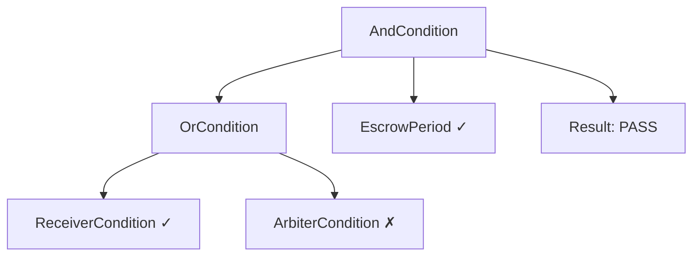

## Overview

Conditions and recorders enable flexible authorization and state tracking without modifying operator contracts. They follow simple interfaces that can be composed and reused.

## Condition System

### ICondition Interface

```solidity
interface ICondition {
    function check(
        AuthCaptureEscrow.PaymentInfo calldata paymentInfo,
        uint256 amount,
        address caller
    ) external view returns (bool allowed);
}
```

**Purpose:** Return `true` if the caller is authorized to perform an action, `false` otherwise.

**When Called:** Before operator actions (authorize, charge, release, refund)

**Parameters:**
- `paymentInfo` - The payment information struct
- `amount` - The amount involved in the action (0 for authorization-only checks like refund request status updates)
- `caller` - The address attempting the action

**Example:**
```solidity
// Check if caller is the payment receiver
function check(
    AuthCaptureEscrow.PaymentInfo calldata paymentInfo,
    uint256 amount,
    address caller
) external view returns (bool) {
    return caller == paymentInfo.receiver;
}
```

### IRecorder Interface

```solidity
interface IRecorder {
    function record(
        AuthCaptureEscrow.PaymentInfo calldata paymentInfo,
        uint256 amount,
        address caller
    ) external;
}
```

**Purpose:** Update state after an action successfully executes.

**When Called:** After operator actions complete

**Parameters:**
- `paymentInfo` - The payment information struct
- `amount` - The amount involved in the action
- `caller` - The address that executed the action (msg.sender on operator)

**Example:**
```solidity
// Record authorization timestamp
function record(
    AuthCaptureEscrow.PaymentInfo calldata paymentInfo,
    uint256 amount,
    address caller
) external {
    bytes32 hash = escrow.getHash(paymentInfo);
    authorizationTimes[hash] = uint40(block.timestamp);
}
```

### Default Behavior

**Condition slot = `address(0)`**
- Always returns `true` (allow)
- Action is always authorized

**Recorder slot = `address(0)`**
- No-op (does nothing)
- No state is recorded

---

## Access Conditions

Pre-deployed singletons for role-based access control.

### PayerCondition

Only the payment payer can call the action.

**Address (Base Sepolia):** `0xBAF68176FF94CAdD403EF7FbB776bbca548AC09D`

**Logic:**
```solidity
function check(PaymentInfo calldata payment, uint256, address caller)
    external pure returns (bool)
{
    return caller == payment.payer;
}
```

**Use cases:**
- Authorize: Let payer create payments
- Freeze: Let payer freeze suspicious payments
- Refund: Let payer request refunds

### ReceiverCondition

Only the payment receiver can call the action.

**Address (Base Sepolia):** `0x12EDefd4549c53497689067f165c0f101796Eb6D`

**Logic:**
```solidity
function check(PaymentInfo calldata payment, uint256, address caller)
    external pure returns (bool)
{
    return caller == payment.receiver;
}
```

**Use cases:**
- Release: Let receiver release funds after escrow
- Charge: Let receiver charge partial amounts
- Refund: Let receiver voluntarily refund

### StaticAddressCondition

Only a designated address can call the action.

**Deployment:** Deploy per use case (not a singleton)

**Logic:**
```solidity
contract StaticAddressCondition is ICondition {
    address public immutable DESIGNATED_ADDRESS;

    constructor(address _designatedAddress) {
        DESIGNATED_ADDRESS = _designatedAddress;
    }

    function check(PaymentInfo calldata payment, uint256, address caller)
        external view returns (bool)
    {
        return caller == DESIGNATED_ADDRESS;
    }
}
```

**Use cases:**
- **Arbiter:** Deploy with arbiter address for dispute resolution
- **Service Provider:** Deploy with provider address for subscriptions
- **DAO Treasury:** Deploy with multisig address for governance
- **Compliance Officer:** Deploy with compliance address for approvals
- **Platform:** Deploy with platform address for controlled releases

**Example:**
```typescript
// For marketplace arbiter
const arbiterCondition = new StaticAddressCondition(arbiterAddress);

// For subscription service provider
const providerCondition = new StaticAddressCondition(serviceProviderAddress);

// For DAO governance
const daoCondition = new StaticAddressCondition(daoMultisigAddress);
```

### AlwaysTrueCondition

Anyone can call the action (no restrictions).

**Address (Base Sepolia):** `0x785cC83DEa3d46D5509f3bf7496EAb26D42EE610`

**Logic:**
```solidity
function check(PaymentInfo calldata payment, uint256, address caller)
    external pure returns (bool)
{
    return true;
}
```

**Use cases:**
- Authorize: Let anyone create payments
- Open actions: Public function access

---

## Combinator Conditions

Compose multiple conditions with logical operators.

### AndCondition

All conditions must pass (`A && B && C`).

**Usage:**
```typescript
// Deploy via factory
const comboAddress = await andConditionFactory.write.deploy([
  [RECEIVER_CONDITION, ESCROW_PERIOD_ADDRESS]  // Must be receiver AND after escrow
]);

// Use in operator config
config.releaseCondition = comboAddress;
```

**Example:** Release requires receiver AND escrow passed

### OrCondition

At least one condition must pass (`A || B`).

**Usage:**
```typescript
// Receiver OR Arbiter can release
const comboAddress = await orConditionFactory.write.deploy([
  [RECEIVER_CONDITION, ARBITER_CONDITION]
]);

config.releaseCondition = comboAddress;
```

**Example:** Either receiver or arbiter can release

### NotCondition

Inverts a condition (`!A`).

**Usage:**
```typescript
// Anyone EXCEPT payer can call
const comboAddress = await notConditionFactory.write.deploy([PAYER_CONDITION]);

config.releaseCondition = comboAddress;
```

**Example:** Prevent payer from releasing their own payment

### Nested Combinators

Combine combinators for complex logic:

```typescript
// (Receiver OR Arbiter) AND EscrowPassed
const receiverOrArbiter = await orConditionFactory.write.deploy([
  [RECEIVER_CONDITION, ARBITER_CONDITION]
]);

const releaseCondition = await andConditionFactory.write.deploy([
  [receiverOrArbiter, ESCROW_PERIOD_ADDRESS]
]);

config.releaseCondition = releaseCondition;
```

**Logic Tree:**



(One branch of OR passed, AND both passed)

---

## Time-Based Conditions

### EscrowPeriod

Combined recorder and condition contract that tracks authorization time and enforces escrow period.

**Deployment:** Via EscrowPeriodFactory

**Architecture:**
- Extends `AuthorizationTimeRecorder` (implements `IRecorder`)
- Implements `ICondition`
- Use the SAME address for both `AUTHORIZE_RECORDER` and `RELEASE_CONDITION` slots

**Logic:**
```solidity
// ICondition implementation - check() returns true when escrow period has passed
function check(
    AuthCaptureEscrow.PaymentInfo calldata paymentInfo,
    uint256,
    address
) external view returns (bool allowed) {
    return !isDuringEscrowPeriod(paymentInfo);
}

// View function to check if still in escrow period
function isDuringEscrowPeriod(
    AuthCaptureEscrow.PaymentInfo calldata paymentInfo
) public view returns (bool) {
    bytes32 hash = escrow.getHash(paymentInfo);
    uint256 authTime = authorizationTimes[hash];
    if (authTime == 0) return false;
    return block.timestamp < authTime + ESCROW_PERIOD;
}
```

**Checks:**
1. Payment was authorized (has timestamp)
2. Current time ≥ authorization time + escrow period

**Use cases:**
- Time-lock releases (7-day escrow)
- Delayed fund access
- Grace periods before actions

<Note>
For freeze functionality, deploy a separate `Freeze` condition and compose both via `AndCondition([escrowPeriod, freeze])`.
</Note>

### Freeze

Standalone condition that blocks release when a payment is frozen. Manages freeze/unfreeze state with configurable authorization and optional escrow period time constraint.

**Deployment:** Via FreezeFactory

**Architecture:**
- Implements `ICondition`
- Freeze/unfreeze authorization via `ICondition` contracts (passed directly to constructor)
- Optionally linked to `EscrowPeriod` to restrict freezing to during the escrow period

**Logic:**
```solidity
// ICondition implementation - returns false when frozen (blocks release)
function check(
    AuthCaptureEscrow.PaymentInfo calldata paymentInfo,
    uint256,
    address
) external view returns (bool allowed) {
    return !isFrozen(paymentInfo);
}
```

**Composition Pattern:**
```solidity
// Escrow period only:  releaseCondition = escrowPeriod
// Freeze only:         releaseCondition = freeze
// Both:                releaseCondition = AndCondition([escrowPeriod, freeze])
```

**Example Configuration:**
```typescript
// Deploy Freeze with payer freeze, arbiter unfreeze, 3-day duration
const freeze = await freezeFactory.deploy(
  PAYER_CONDITION,      // freeze condition (payer protection)
  ARBITER_CONDITION,    // unfreeze condition (dispute resolution)
  3 * 24 * 60 * 60,     // 3 days (auto-expires, 0 = permanent)
  escrowPeriod          // optional: link to EscrowPeriod (address(0) = unconstrained)
);
```

**Freeze Duration:**
- Payment frozen at time `T`
- Freeze expires at `T + freezeDuration`
- After expiry, payment automatically unfrozen
- Can be manually unfrozen earlier by authorized party
- Duration of `0` means permanent freeze (until manually unfrozen)

---

## Recorders

### AuthorizationTimeRecorder

Records authorization timestamp for time-based conditions.

**State:**
```solidity
mapping(bytes32 paymentInfoHash => uint256 authorizedAt) public authorizationTimes;
```

**Methods:**
```solidity
// Called after authorize()
function record(
    AuthCaptureEscrow.PaymentInfo calldata paymentInfo,
    uint256 amount,
    address caller
) external {
    bytes32 hash = escrow.getHash(paymentInfo);
    authorizationTimes[hash] = block.timestamp;
}

// View function
function getAuthorizationTime(
    AuthCaptureEscrow.PaymentInfo calldata paymentInfo
) external view returns (uint256) {
    return authorizationTimes[escrow.getHash(paymentInfo)];
}
```

<Note>
`EscrowPeriod` extends `AuthorizationTimeRecorder` and adds `ICondition` implementation. Use `EscrowPeriod` directly instead of deploying `AuthorizationTimeRecorder` separately.
</Note>

### PaymentIndexRecorder

Records a sequential index for each payment action, enabling multiple refund requests per payment.

**State:**
```solidity
mapping(bytes32 paymentInfoHash => uint256 count) public paymentIndex;
```

**Methods:**
```solidity
function record(
    AuthCaptureEscrow.PaymentInfo calldata paymentInfo,
    uint256 amount,
    address caller
) external {
    bytes32 hash = escrow.getHash(paymentInfo);
    paymentIndex[hash]++;
}

function getPaymentIndex(
    AuthCaptureEscrow.PaymentInfo calldata paymentInfo
) external view returns (uint256) {
    return paymentIndex[escrow.getHash(paymentInfo)];
}
```

### RecorderCombinator

Combines multiple recorders into one, calling each in sequence.

**Usage:**
```typescript
const comboAddress = await recorderCombinatorFactory.write.deploy([
  [escrowPeriodAddress, paymentIndexRecorderAddress]  // Records auth time + payment index
]);

config.authorizeRecorder = comboAddress;
```

### Custom Recorders

You can create custom recorders for specialized tracking:

```solidity
contract ReleaseCountRecorder is IRecorder {
    mapping(bytes32 => uint256) public releaseCount;
    mapping(bytes32 => uint256) public totalReleased;

    function record(
        PaymentInfo calldata payment,
        uint256 amount,
        address caller
    ) external {
        releaseCount[payment.paymentId]++;
        totalReleased[payment.paymentId] += amount;
    }

    // Enable tracking partial releases
    function getStats(bytes32 paymentId)
        external view
        returns (uint256 count, uint256 total)
    {
        return (releaseCount[paymentId], totalReleased[paymentId]);
    }
}
```

---

## Configuration Patterns

### Pattern 1: Open Authorization, Restricted Release

```solidity
config = {
    authorizeCondition: ALWAYS_TRUE_CONDITION,  // Anyone can authorize
    authorizeRecorder: escrowRecorder,          // Record time
    // ...
    releaseCondition: releaseCondition,         // Restricted
    releaseRecorder: escrowRecorder,
    // ...
};
```

**Use case:** Public payment creation, but controlled release

### Pattern 2: Payer-Only Actions

```solidity
config = {
    authorizeCondition: PAYER_CONDITION,        // Only payer
    authorizeRecorder: address(0),              // No recording
    // ...
    releaseCondition: PAYER_CONDITION,          // Only payer
    releaseRecorder: address(0),
    // ...
};
```

**Use case:** Self-service payment system

### Pattern 3: Arbiter-Controlled Everything

```solidity
config = {
    authorizeCondition: ARBITER_CONDITION,      // Only arbiter
    authorizeRecorder: address(0),
    chargeCondition: ARBITER_CONDITION,         // Only arbiter
    chargeRecorder: address(0),
    releaseCondition: ARBITER_CONDITION,        // Only arbiter
    releaseRecorder: address(0),
    refundInEscrowCondition: ARBITER_CONDITION, // Only arbiter
    refundInEscrowRecorder: address(0),
    refundPostEscrowCondition: ARBITER_CONDITION,
    refundPostEscrowRecorder: address(0)
};
```

**Use case:** Fully managed escrow service

### Pattern 4: Multi-Party Release (2-of-3)

```typescript
// Requires any 2 of 3 parties to agree: Payer, Receiver, or Arbiter
// This creates three OR branches, each requiring a different pair to call simultaneously
const payerAndReceiver = await andConditionFactory.write.deploy([
  [PAYER_CONDITION, RECEIVER_CONDITION]
]);
const payerAndArbiter = await andConditionFactory.write.deploy([
  [PAYER_CONDITION, ARBITER_CONDITION]
]);
const receiverAndArbiter = await andConditionFactory.write.deploy([
  [RECEIVER_CONDITION, ARBITER_CONDITION]
]);

const twoOfThree = await orConditionFactory.write.deploy([
  [payerAndReceiver, payerAndArbiter, receiverAndArbiter]
]);

config.releaseCondition = twoOfThree;
```

**Use case:** Multi-sig style releases requiring coordination

<Warning>
This pattern requires that TWO parties call `release()` in a SINGLE transaction (e.g., via a multisig contract or meta-transaction). It does NOT allow separate calls from two parties. For most use cases, use `OrCondition` to allow ANY authorized party to release individually, or implement a custom voting condition.
</Warning>

---

## Gas Optimization

### Singleton Reuse

Deploy conditions once, reuse everywhere:

```typescript
// ✅ Good: Reuse singleton
const config1 = { authorizeCondition: PAYER_CONDITION };
const config2 = { authorizeCondition: PAYER_CONDITION }; // Same instance

// ❌ Bad: Deploy multiple times
const payer1 = await new PayerCondition();
const payer2 = await new PayerCondition(); // Wasteful
```

### Combinator Efficiency

Simpler combinators = less gas:

```typescript
// ✅ Better: 2 conditions
OrCondition([A, B])  // ~25K gas per check

// ❌ Worse: 4 conditions
OrCondition([A, B, C, D])  // ~45K gas per check
```

### Stateless Conditions

Prefer stateless conditions when possible:

```solidity
// ✅ Stateless: No storage reads
function check(PaymentInfo calldata payment, uint256, address caller)
    external pure returns (bool)
{
    return caller == payment.receiver;  // Pure computation
}

// ❌ Stateful: Storage reads
function check(PaymentInfo calldata payment, uint256, address caller)
    external view returns (bool)
{
    return allowList[caller];  // SLOAD costs gas
}
```

---

## Security Considerations

<Warning>
**Condition Reentrancy:** Conditions should be `view` or `pure` to prevent reentrancy attacks. Never make external calls in conditions.
</Warning>

<Warning>
**Recorder State:** Recorders modify state. Ensure they have proper access control and cannot be called by unauthorized addresses.
</Warning>

<Tip>
**Test Thoroughly:** Custom conditions/recorders should have comprehensive test coverage. Edge cases in authorization logic can lead to locked funds.
</Tip>

---

## Advanced: Custom Conditions

Create custom conditions for specialized logic:

```solidity
contract TimeOfDayCondition is ICondition {
    uint256 public immutable startHour;  // e.g., 9 (9 AM)
    uint256 public immutable endHour;    // e.g., 17 (5 PM)

    constructor(uint256 _startHour, uint256 _endHour) {
        startHour = _startHour;
        endHour = _endHour;
    }

    function check(
        PaymentInfo calldata payment,
        uint256,
        address caller
    ) external view returns (bool) {
        uint256 hour = (block.timestamp / 3600) % 24;
        return hour >= startHour && hour < endHour;
    }
}

// Usage: Only allow releases during business hours
const businessHours = await new TimeOfDayCondition(9, 17);
config.releaseCondition = businessHours.address;
```

## Next Steps

<CardGroup cols={2}>
  <Card title="Examples" icon="code" href="/contracts/examples">
    See complete configuration examples for common use cases.
  </Card>
  <Card title="Factories" icon="industry" href="/contracts/factories">
    Learn how to deploy condition instances.
  </Card>
  <Card title="Deploy an Operator" icon="rocket" href="/sdk/deploy-operator">
    Deploy operators with conditions using the SDK.
  </Card>
  <Card title="Escrow Management" icon="lock" href="/sdk/client/escrow-management">
    Interact with freeze and escrow conditions via the Client SDK.
  </Card>
</CardGroup>
