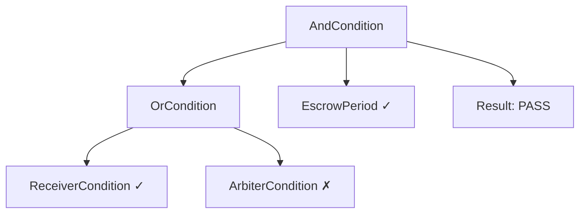

## Overview

Combinator conditions compose multiple conditions with logical operators. Deploy each via its respective factory.

## AndCondition

All conditions must pass (`A && B && C`).

```typescript
// Deploy via factory
const comboAddress = await andConditionFactory.write.deploy([
  [RECEIVER_CONDITION, ESCROW_PERIOD_ADDRESS]  // Must be receiver AND after escrow
]);

// Use in operator config
config.releaseCondition = comboAddress;
```

**Example:** Release requires receiver AND escrow period passed.

## OrCondition

At least one condition must pass (`A || B`).

```typescript
// Receiver OR Arbiter can release
const comboAddress = await orConditionFactory.write.deploy([
  [RECEIVER_CONDITION, ARBITER_CONDITION]
]);

config.releaseCondition = comboAddress;
```

**Example:** Either receiver or arbiter can release.

## NotCondition

Inverts a condition (`!A`).

```typescript
// Anyone EXCEPT payer can call
const comboAddress = await notConditionFactory.write.deploy([PAYER_CONDITION]);

config.releaseCondition = comboAddress;
```

**Example:** Prevent payer from releasing their own payment.

## Nested Combinators

Combine combinators for complex logic:

```typescript
// (Receiver OR Arbiter) AND EscrowPassed
const receiverOrArbiter = await orConditionFactory.write.deploy([
  [RECEIVER_CONDITION, ARBITER_CONDITION]
]);

const releaseCondition = await andConditionFactory.write.deploy([
  [receiverOrArbiter, ESCROW_PERIOD_ADDRESS]
]);

config.releaseCondition = releaseCondition;
```

**Logic Tree:**



(One branch of OR passed, AND both passed)

## Limits

<Warning>
**Max 10 conditions per combinator.** Keep combinators simple — deeply nested trees increase gas costs and make debugging harder.
</Warning>

## Gas

Simpler combinators = less gas:

```typescript
// Better: 2 conditions
OrCondition([A, B])  // ~25K gas per check

// Worse: 4 conditions
OrCondition([A, B, C, D])  // ~45K gas per check
```

Each additional condition adds one external call. Prefer fewer conditions where possible.

## Next Steps

<CardGroup cols={2}>
  <Card title="EscrowPeriod" icon="clock" href="/contracts/conditions/escrow-period">
    Time-based condition for escrow windows.
  </Card>
  <Card title="Freeze" icon="snowflake" href="/contracts/conditions/freeze">
    Block releases when payments are frozen.
  </Card>
  <Card title="Examples" icon="code" href="/contracts/examples">
    See combinators in real configurations.
  </Card>
  <Card title="Factories" icon="industry" href="/contracts/factories">
    Deploy combinators via factory contracts.
  </Card>
</CardGroup>
