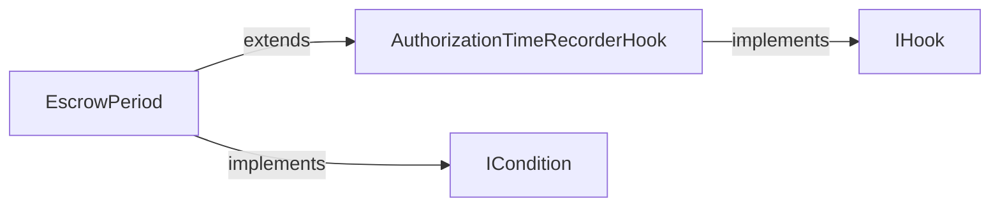

## Overview

EscrowPeriod is a dual-purpose contract, it functions as both a **hook** and a **condition**:

- **As a hook:** Records the `block.timestamp` at payment authorization
- **As a condition:** Returns `true` only after the escrow period has elapsed

Use the **same address** for both `AUTHORIZE_POST_ACTION_HOOK` and `CAPTURE_PRE_ACTION_CONDITION` slots on the operator.

**Type:** Per-deployment via [EscrowPeriodFactory](/contracts/factories)

## Architecture



EscrowPeriod extends [AuthorizationTimeRecorderHook](/contracts/hooks/authorization-time) and adds `ICondition` implementation. You don't need to deploy AuthorizationTimeRecorderHook on its own, use EscrowPeriod directly.

## Logic

```solidity
// ICondition, returns true when escrow period has passed
function check(
    AuthCaptureEscrow.PaymentInfo calldata paymentInfo,
    uint256,
    address
) external view returns (bool allowed) {
    return !isDuringEscrowPeriod(paymentInfo);
}

// View function to check if still in escrow period
function isDuringEscrowPeriod(
    AuthCaptureEscrow.PaymentInfo calldata paymentInfo
) public view returns (bool) {
    bytes32 hash = escrow.getHash(paymentInfo);
    uint256 authTime = authorizationTimes[hash];
    if (authTime == 0) return false;
    return block.timestamp < authTime + ESCROW_PERIOD;
}
```

**Checks:**
1. The payment has a recorded authorization timestamp
2. Current time >= authorization time + escrow period

## Deployment

Deploy via [EscrowPeriodFactory](/contracts/factories):

```typescript
const escrowPeriodAddress = await escrowPeriodFactory.write.deploy([
  7 * 24 * 60 * 60,    // 7 days in seconds
  zeroHash             // bytes32(0) = operator-only
]);
```

Then configure the operator:

```typescript
const config = {
  authorizePostActionHook: escrowPeriodAddress,   // Record auth time
  capturePreActionCondition: escrowPeriodAddress,    // Check escrow passed
  // ...
};
```

## Composition with Freeze

For freeze functionality, deploy a separate [Freeze](/contracts/conditions/freeze) condition and compose via [AndCondition](/contracts/conditions/combinators):

```solidity
// Escrow period only:  capturePreActionCondition = escrowPeriod
// Freeze only:         capturePreActionCondition = freeze
// Both:                capturePreActionCondition = AndCondition([escrowPeriod, freeze])
```

## Use Cases

- **Time-lock releases**: 7-day escrow for e-commerce
- **Delayed fund access**: Grace period before receiver can access funds
- **Buyer protection**: Give payers time to freeze or request refunds

## Gas

**Cost:** ~20k gas per `record()` call (one `SSTORE` for the timestamp). The `check()` call is a `view` function with one `SLOAD`.

## Next Steps

<CardGroup cols={2}>
  <Card title="Freeze" icon="snowflake" href="/contracts/conditions/freeze">
    Add freeze protection to escrow periods.
  </Card>
  <Card title="Factories" icon="industry" href="/contracts/factories">
    Deploy EscrowPeriod via factory.
  </Card>
</CardGroup>
