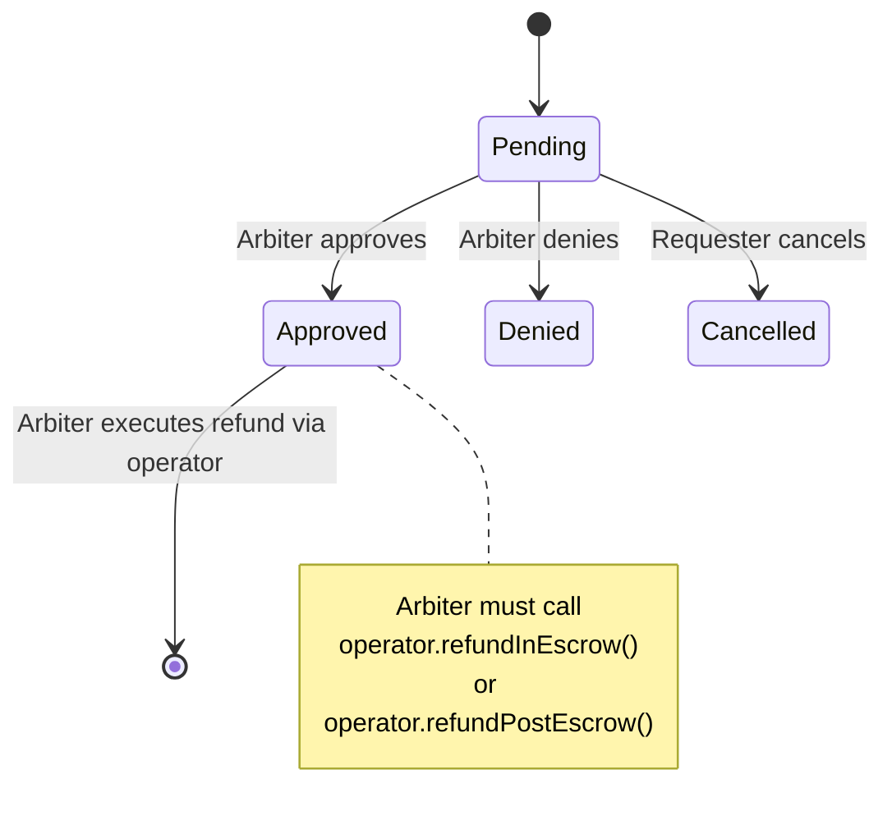

## PaymentOperator

The main payment operator contract with pluggable conditions for flexible authorization logic.

### Overview

- **Type:** Operator instance (one per fee recipient + configuration)
- **Deployment:** Via PaymentOperatorFactory
- **Immutability:** Cannot be paused or upgraded
- **Configuration:** 10 slots for conditions and recorders
- **Use Cases:** Marketplace, subscriptions, streaming, grants, custom flows

### Immutable Fields

```solidity
address public immutable ESCROW;              // AuthCaptureEscrow address
address public immutable FEE_RECIPIENT;       // Operator fee recipient
ProtocolFeeConfig public immutable PROTOCOL_FEE_CONFIG; // Shared protocol fee config
IFeeCalculator public immutable FEE_CALCULATOR; // Operator fee calculator
```

### State

```solidity
// Fee tracking for accurate distribution
mapping(address token => uint256) public accumulatedProtocolFees;

// Fees locked at authorization time
mapping(bytes32 paymentInfoHash => AuthorizedFees) public authorizedFees;
```

### 10-Slot Configuration

<Accordion title="Condition Slots (Before Actions)">
1. **AUTHORIZE_CONDITION** - Who can authorize payments
2. **CHARGE_CONDITION** - Who can charge partial amounts
3. **RELEASE_CONDITION** - Who can release from escrow
4. **REFUND_IN_ESCROW_CONDITION** - Who can refund during escrow
5. **REFUND_POST_ESCROW_CONDITION** - Who can refund after release

**Default:** `address(0)` = always allow
</Accordion>

<Accordion title="Recorder Slots (After Actions)">
1. **AUTHORIZE_RECORDER** - Record authorization (e.g., timestamp)
2. **CHARGE_RECORDER** - Record charge event
3. **RELEASE_RECORDER** - Record release
4. **REFUND_IN_ESCROW_RECORDER** - Record in-escrow refund
5. **REFUND_POST_ESCROW_RECORDER** - Record post-escrow refund

**Default:** `address(0)` = no recording (no-op)
</Accordion>

### Key Methods

#### authorize()

Authorizes a payment and locks funds in escrow.

```solidity
function authorize(
    AuthCaptureEscrow.PaymentInfo calldata paymentInfo,
    uint256 amount,
    address tokenCollector,
    bytes calldata collectorData
) external nonReentrant
```

**Parameters:**
- `paymentInfo` - Payment info struct (must have `operator == address(this)`, `feeReceiver == address(this)`)
- `amount` - Amount to authorize
- `tokenCollector` - Address of the token collector contract
- `collectorData` - Data to pass to the token collector

**Flow:**
1. Check `AUTHORIZE_CONDITION` (if set)
2. Validate fee bounds compatibility
3. Store fees at authorization time (prevents protocol fee changes from breaking capture)
4. Call `escrow.authorize()`
5. Call `AUTHORIZE_RECORDER` (if set)
6. Emit `AuthorizationCreated`

**Access:** Controlled by `AUTHORIZE_CONDITION` (default: anyone)

<Tip>
For details on `authorizationExpiry`, `refundExpiry`, and other `PaymentInfo` time fields, see [Payment Fields](/x402-integration/payment-fields).
</Tip>

#### charge()

Direct charge - collects payment and immediately transfers to receiver (no escrow hold).

```solidity
function charge(
    AuthCaptureEscrow.PaymentInfo calldata paymentInfo,
    uint256 amount,
    address tokenCollector,
    bytes calldata collectorData
) external nonReentrant
```

**Parameters:**
- `paymentInfo` - Payment info struct (must have `operator == address(this)`, `feeReceiver == address(this)`)
- `amount` - Amount to charge
- `tokenCollector` - Address of the token collector contract
- `collectorData` - Data to pass to the token collector

**Flow:**
1. Check `CHARGE_CONDITION` (if set)
2. Validate fee bounds compatibility
3. Call `escrow.charge()` - funds go directly to receiver
4. Accumulate protocol fees for later distribution
5. Call `CHARGE_RECORDER` (if set)
6. Emit `ChargeExecuted`

**Access:** Controlled by `CHARGE_CONDITION` (default: anyone)

<Note>
Unlike `authorize()`, funds go directly to receiver without escrow hold. Refunds are only possible via `refundPostEscrow()`.
</Note>

#### release()

Releases funds from escrow to receiver (capture).

```solidity
function release(
    AuthCaptureEscrow.PaymentInfo calldata paymentInfo,
    uint256 amount
) external nonReentrant
```

**Parameters:**
- `paymentInfo` - Payment info struct
- `amount` - Amount to release

**Flow:**
1. Check `RELEASE_CONDITION` (if set)
2. Use fees stored at authorization time
3. Call `escrow.capture()`
4. Accumulate protocol fees for later distribution
5. Call `RELEASE_RECORDER` (if set)
6. Emit `ReleaseExecuted`

**Access:** Controlled by `RELEASE_CONDITION`

<Note>
**Marketplace example:** Receiver OR StaticAddressCondition(arbiter) + escrow passed
**Subscription example:** StaticAddressCondition(serviceProvider)
**DAO example:** StaticAddressCondition(daoMultisig)
</Note>

#### refundInEscrow()

Refunds payment while still in escrow (partial void).

```solidity
function refundInEscrow(
    AuthCaptureEscrow.PaymentInfo calldata paymentInfo,
    uint120 amount
) external nonReentrant
```

**Parameters:**
- `paymentInfo` - Payment info struct
- `amount` - Amount to return to payer

**Flow:**
1. Check `REFUND_IN_ESCROW_CONDITION` (if set)
2. Call `escrow.partialVoid()` to return funds to payer
3. Call `REFUND_IN_ESCROW_RECORDER` (if set)
4. Emit `RefundInEscrowExecuted`

**Access:** Controlled by `REFUND_IN_ESCROW_CONDITION`

<Note>
**Marketplace example:** StaticAddressCondition(arbiter) - disputes
**Return policy example:** Receiver OR StaticAddressCondition(arbiter)
**DAO example:** StaticAddressCondition(daoMultisig)
**Subscription example:** address(0) - no refunds
</Note>

#### refundPostEscrow()

Refunds payment after it has been released (captured).

```solidity
function refundPostEscrow(
    AuthCaptureEscrow.PaymentInfo calldata paymentInfo,
    uint256 amount,
    address tokenCollector,
    bytes calldata collectorData
) external nonReentrant
```

**Parameters:**
- `paymentInfo` - Payment info struct
- `amount` - Amount to refund to payer
- `tokenCollector` - Address of the token collector that will source the refund
- `collectorData` - Data to pass to the token collector (e.g., signatures)

**Flow:**
1. Check `REFUND_POST_ESCROW_CONDITION` (if set)
2. Call `escrow.refund()` - token collector enforces permission
3. Call `REFUND_POST_ESCROW_RECORDER` (if set)
4. Emit `RefundPostEscrowExecuted`

**Access:** Controlled by `REFUND_POST_ESCROW_CONDITION`. Permission is also enforced by the token collector (e.g., receiver must have approved it, or collectorData contains receiver's signature).

<Note>
**Marketplace example:** StaticAddressCondition(arbiter) - post-delivery disputes
**Return policy example:** Receiver - voluntary returns
**Most configurations:** address(0) - no post-escrow refunds
</Note>

### Fee System (Modular, Additive)

Fees are additive and modular: `totalFee = protocolFee + operatorFee`

#### Fee Architecture

```solidity
// Shared protocol fee config (timelocked, swappable calculator)
ProtocolFeeConfig public immutable PROTOCOL_FEE_CONFIG;

// Per-operator fee calculator (immutable, set at deploy)
IFeeCalculator public immutable FEE_CALCULATOR;

// Fee recipients
address public immutable FEE_RECIPIENT;  // Operator fee recipient
// Protocol fee recipient is on ProtocolFeeConfig

// Fee tracking for accurate distribution
mapping(address token => uint256) public accumulatedProtocolFees;
```

**Example Fee Calculation (Additive):**

For a 1000 USDC payment:
- **Protocol Fee:** 3 bps (0.03%) = 0.30 USDC → goes to `protocolFeeRecipient`
- **Operator Fee:** 2 bps (0.02%) = 0.20 USDC → goes to `FEE_RECIPIENT`
- **Total Fee:** 5 bps (0.05%) = 0.50 USDC
- **Receiver Gets:** 999.50 USDC

**Fee Locking:**
Fees are calculated and stored at `authorize()` time in `authorizedFees[hash]`. This prevents protocol fee changes from breaking capture of already-authorized payments.

```solidity
struct AuthorizedFees {
    uint16 totalFeeBps;
    uint16 protocolFeeBps;
}
mapping(bytes32 paymentInfoHash => AuthorizedFees) public authorizedFees;
```

**FEE_RECIPIENT** can be:
- Arbiter (marketplace with disputes)
- Service Provider (subscriptions)
- Platform Treasury (platform-controlled)
- DAO Multisig (governance-controlled)

#### Fee Distribution

Fees accumulate in the operator contract and are distributed via `distributeFees(token)`:

```solidity
// Anyone can call to distribute fees for a token
operator.distributeFees(usdcAddress);
// Protocol share → protocolFeeRecipient
// Operator share → FEE_RECIPIENT
```

#### Protocol Fee Changes (7-day Timelock)

Protocol fee calculator changes require a 7-day timelock on `ProtocolFeeConfig`:

```solidity
// Step 1: Queue new calculator
protocolFeeConfig.queueCalculator(newCalculatorAddress);

// Step 2: Wait 7 days

// Step 3: Execute
protocolFeeConfig.executeCalculator();
```

<Warning>
Protocol fee changes require 7-day timelock. Operator fees are immutable (set at deploy time).
</Warning>

### Security Features

- **ReentrancyGuardTransient** - EIP-1153 transient storage for gas-efficient reentrancy protection
- **Ownership** - Solady's Ownable with 2-step transfer
- **Timelock** - 7-day delay on protocol fee changes (operator fees are immutable)
- **Immutable Core** - Escrow, conditions, and fee configuration cannot be changed

---

## RefundRequest

Manages refund requests independent of operator implementation.

### Overview

- **Type:** Singleton (one per network)
- **Deployment:** Direct deployment (no factory)
- **Purpose:** Track refund request lifecycle

### Request Types

<Tabs>
  <Tab title="In-Escrow Refunds">
    **Who can request:** Payer, Receiver, OR Arbiter

    **Typical flow:**
    1. Payer suspects fraud, requests refund
    2. Arbiter investigates
    3. Arbiter approves or denies request
    4. If approved, arbiter calls `operator.refundInEscrow()`

    **Use cases:**
    - Buyer remorse
    - Seller fraud
    - Payment error
  </Tab>

  <Tab title="Post-Escrow Refunds">
    **Who can request:** Receiver only

    **Typical flow:**
    1. Receiver realizes product defect after release
    2. Receiver requests refund
    3. Arbiter investigates
    4. If approved, arbiter calls `operator.refundPostEscrow()`

    **Use cases:**
    - Product defects discovered later
    - Service not as described
    - Voluntary refund by merchant
  </Tab>
</Tabs>

### Request Status States



### Key Methods

#### requestRefund()

Creates a new refund request.

```solidity
function requestRefund(
    AuthCaptureEscrow.PaymentInfo calldata paymentInfo,
    uint120 amount,
    uint256 nonce
) external
```

**Parameters:**
- `paymentInfo` - Payment info struct
- `amount` - Amount being requested for refund
- `nonce` - Record index (from PaymentIndexRecorder) identifying which charge/action

**Access Control:** Only the payer who made the authorization can request

<Note>
Each refund request is keyed by `(paymentInfoHash, nonce)` where nonce is the record index. This allows multiple refund requests per payment (one per charge/action).
</Note>

#### updateStatus()

Approve or deny a refund request.

```solidity
function updateStatus(
    AuthCaptureEscrow.PaymentInfo calldata paymentInfo,
    uint256 nonce,
    RequestStatus newStatus
) external
```

**Parameters:**
- `paymentInfo` - Payment info struct
- `nonce` - Record index identifying which refund request
- `newStatus` - The new status (`Approved` or `Denied`)

**Access:** Receiver can always approve/deny. While in escrow, anyone passing the operator's `REFUND_IN_ESCROW_CONDITION` can also approve/deny.

**Valid transitions:**
- `Pending` → `Approved`
- `Pending` → `Denied`

#### cancelRefundRequest()

Payer cancels their own request.

```solidity
function cancelRefundRequest(
    AuthCaptureEscrow.PaymentInfo calldata paymentInfo,
    uint256 nonce
) external
```

**Parameters:**
- `paymentInfo` - Payment info struct
- `nonce` - Record index identifying which refund request

**Access:** Only the payer who created the request

**Valid transition:**
- `Pending` → `Cancelled`

### Usage Example

```typescript
// 1. Payer requests refund (nonce 0 = first action on this payment)
await refundRequest.requestRefund(paymentInfo, requestedAmount, 0);
// Status: Pending

// 2. Receiver (or arbiter) reviews and approves
await refundRequest.updateStatus(
  paymentInfo,
  0,  // nonce
  RequestStatus.Approved
);
// Status: Approved

// 3. Execute refund via operator (separate transaction)
await operator.refundInEscrow(paymentInfo, refundAmount);
// Funds returned to payer
```

<Note>
RefundRequest is **advisory only**. Approval does not automatically execute refunds - the authorized party must call the operator's refund function.
</Note>

---

## AuthCaptureEscrow <span style={{opacity: 0.6, fontSize: '0.8em'}}>(Base Commerce Payments)</span>

<Info>
The contracts in this section are part of [Base Commerce Payments](https://github.com/base/commerce-payments), not x402r. x402r's PaymentOperator wraps these contracts and adds conditions, recorders, and fees on top. See the [commerce-payments documentation](https://github.com/base/commerce-payments) for the full reference.
</Info>

Core escrow contract for holding ERC-20 tokens during payments.

- **Type:** Singleton (one per network)
- **Source:** [commerce-payments](https://github.com/base/commerce-payments) ([x402r fork](https://github.com/BackTrackCo/commerce-payments) adds partial void)
- **Purpose:** Hold ERC-20 tokens during payment lifecycle
- **Access:** Operator-based (only registered operators can manage payments)

### Payment Lifecycle


Six core operations:

| Operation | What it does | State transition |
|-----------|-------------|------------------|
| **Authorize** | Lock payer funds in escrow | `NonExistent` → `InEscrow` |
| **Capture** | Transfer escrowed funds to receiver | `InEscrow` → `Released` |
| **Charge** | Combined authorize + capture (instant) | `NonExistent` → `Released` |
| **Void** | Cancel authorization, return funds to payer | `InEscrow` → `Settled` |
| **Reclaim** | Payer recovers funds after `authorizationExpiry` | `InEscrow` → `Settled` |
| **Refund** | Return captured funds from receiver to payer | `Released` → `Settled` |

### Contracts Architecture


Three components:

- **AuthCaptureEscrow** — Core contract managing fund movement and payment lifecycle
- **Token Collectors** — Pluggable modules for pulling tokens (ERC-3009, Permit2, pre-approval, spend permissions)
- **Token Stores** — Per-operator vaults using CREATE2 deterministic deployment

### What x402r Changes

<Note>
x402r uses a [fork of commerce-payments](https://github.com/BackTrackCo/commerce-payments) that adds **partial void** support (`partialVoid()`), enabling partial refunds during escrow. This is what powers `PaymentOperator.refundInEscrow()` with specific amounts rather than full-void only.
</Note>

---

## Contract Addresses

### Base Sepolia Testnet

| Contract | Address |
|----------|---------|
| AuthCaptureEscrow | [`0xb9488351E48b23D798f24e8174514F28B741Eb4f`](https://sepolia.basescan.org/address/0xb9488351E48b23D798f24e8174514F28B741Eb4f) |
| ERC3009PaymentCollector | [`0xed02d3E5167BCc9582D851885A89b050AB816a56`](https://sepolia.basescan.org/address/0xed02d3E5167BCc9582D851885A89b050AB816a56) |
| RefundRequest | [`0x6926c05193c714ED4bA3867Ee93d6816Fdc14128`](https://sepolia.basescan.org/address/0x6926c05193c714ED4bA3867Ee93d6816Fdc14128) |
| PaymentOperatorFactory | [`0xFa8C4Cb156053b867Ae7489220A29b5939E3Df70`](https://sepolia.basescan.org/address/0xFa8C4Cb156053b867Ae7489220A29b5939E3Df70) |

## Next Steps

<CardGroup cols={2}>
  <Card title="Factories" icon="industry" href="/contracts/factories">
    Learn about factory deployment patterns.
  </Card>
  <Card title="Conditions" icon="filter" href="/contracts/conditions/overview">
    Explore the pluggable condition system.
  </Card>
  <Card title="Deploy an Operator" icon="rocket" href="/sdk/deploy-operator">
    Deploy operators using the SDK's deployment utilities.
  </Card>
  <Card title="Examples" icon="code" href="/contracts/examples">
    See real-world configuration examples.
  </Card>
</CardGroup>
