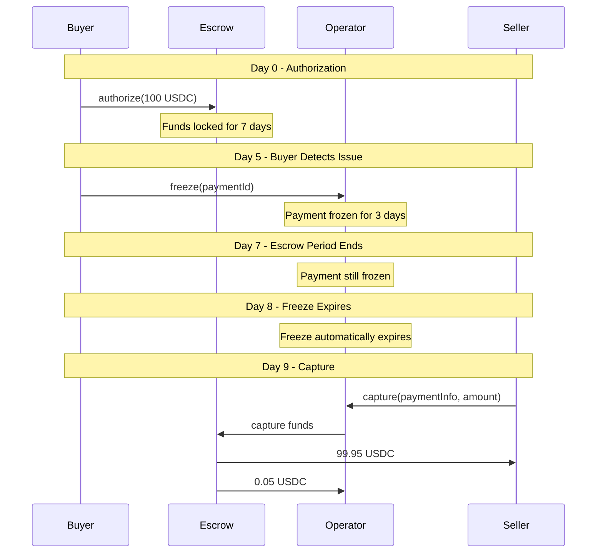
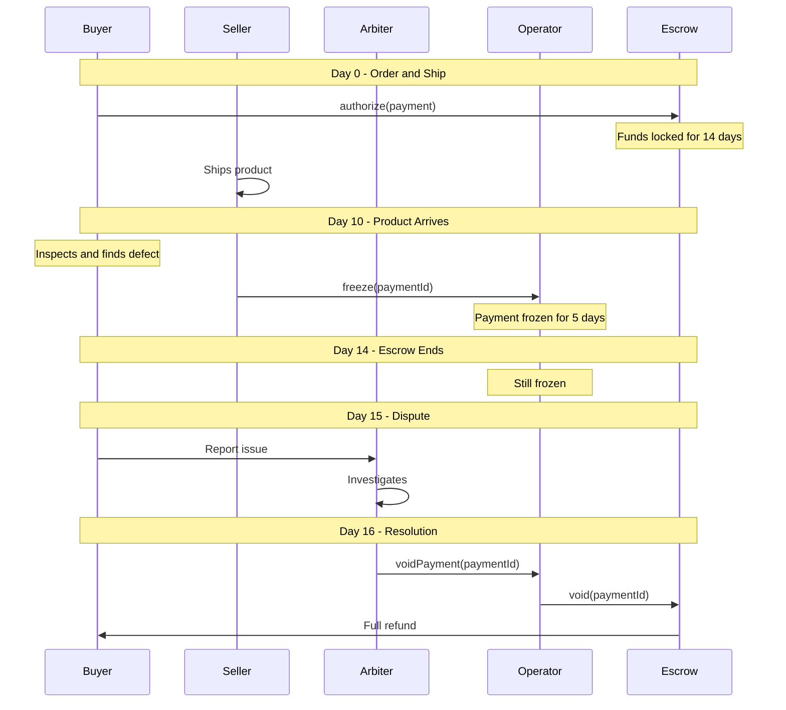
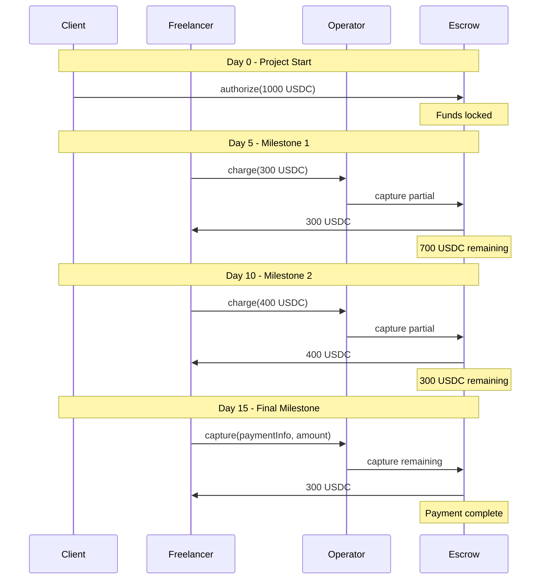
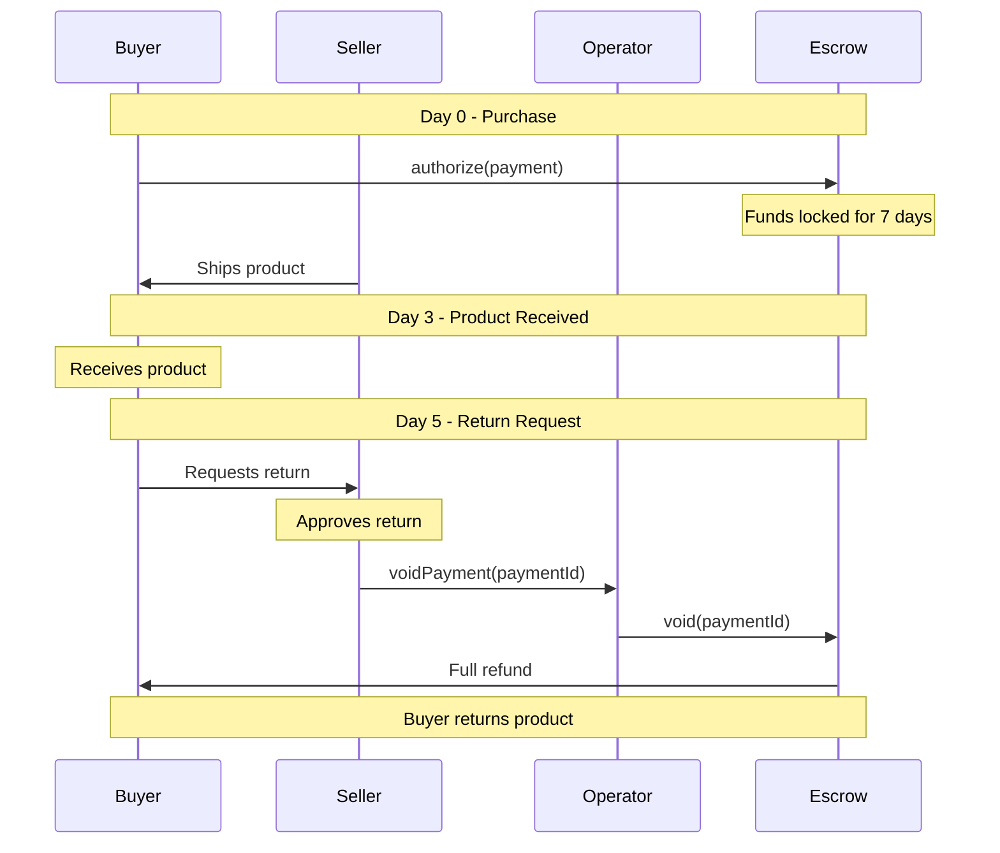
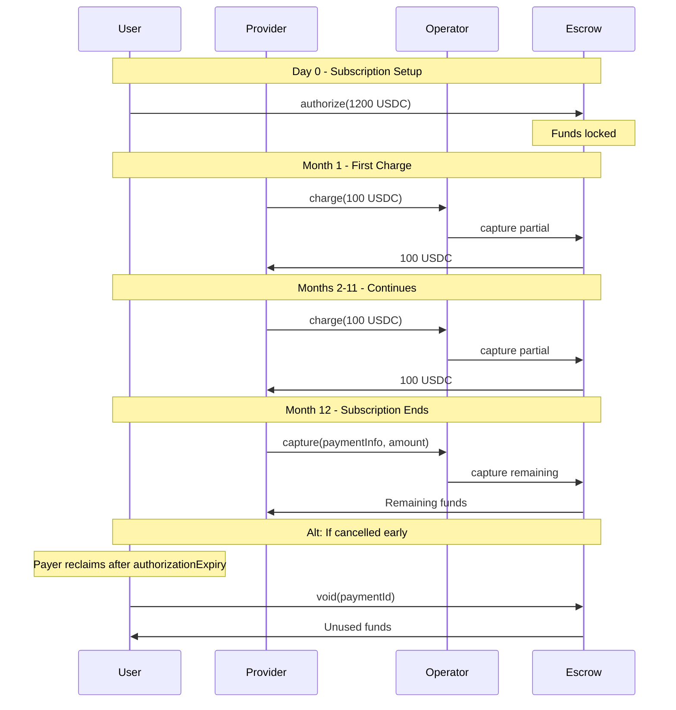
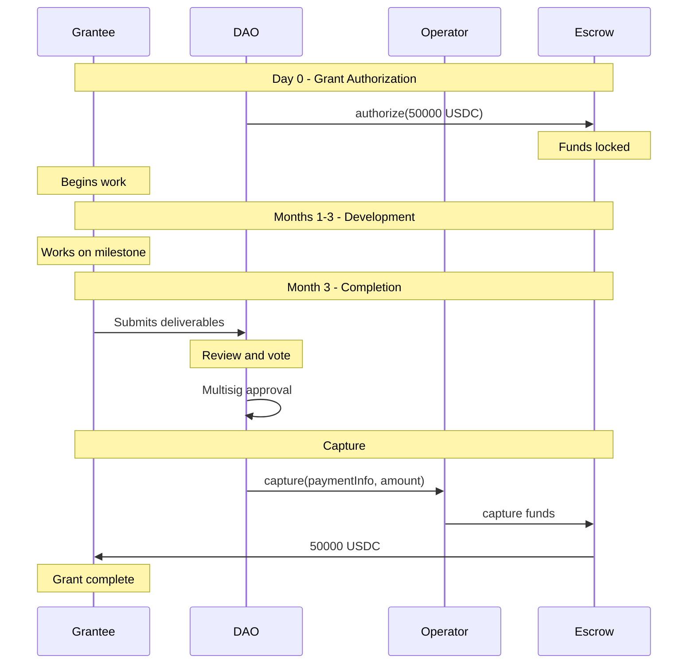
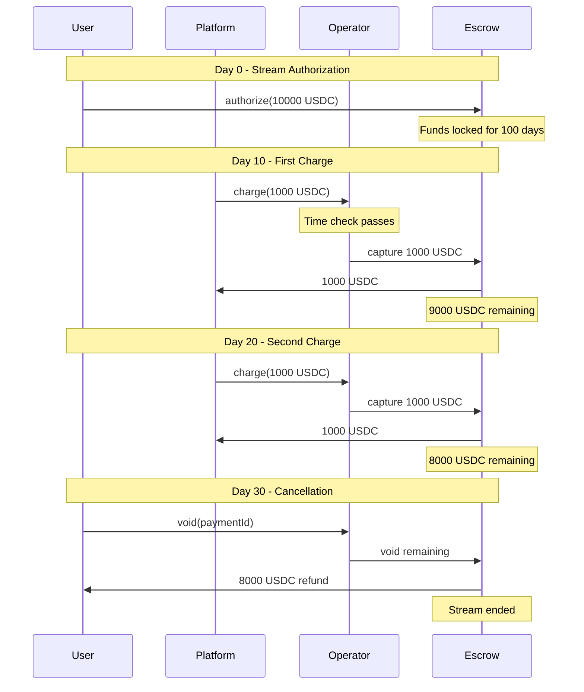
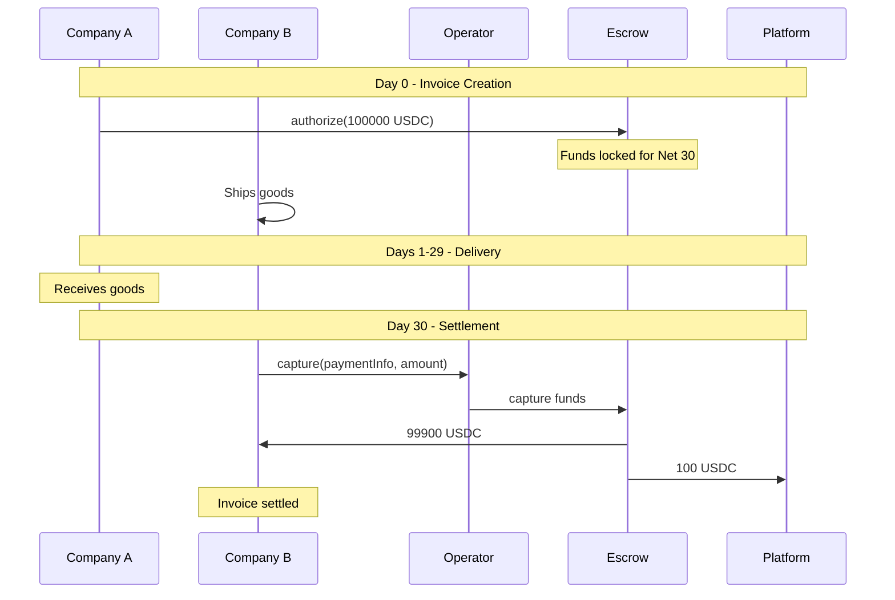

<Note>
The configuration examples below use simplified pseudo-code (e.g., `new StaticAddressCondition(...)`, `new AndCondition(...)`) to illustrate the logical composition of conditions. In practice, deploy conditions via their respective [factory contracts](/contracts/factories) using viem. See the [Deploy an operator guide](/sdk/deploy-operator) for executable code.
</Note>

## Example 1: Standard E-Commerce with 7-Day Escrow

**Use Case:** Online marketplace with buyer protection. 7-day escrow period, payer can freeze for 3 days, receiver or arbiter can capture after escrow.

### Complete Configuration

<Steps>
  <Step title="Deploy Arbiter Condition">
    ```typescript
    // Deploy designated address condition for arbiter
    const arbiterCondition = await new StaticAddressCondition(arbiterAddress);
    ```
  </Step>

  <Step title="Deploy Freeze Policy">
    ```typescript
    // Payer can freeze, arbiter can unfreeze (or wait for expiry)
    const freezePolicy = await freezePolicyFactory.deploy(
      PAYER_CONDITION,              // Only payer can freeze
      arbiterCondition.address,     // Only arbiter can unfreeze
      3 * 24 * 60 * 60              // 3 days (auto-expires)
    );
    ```
  </Step>

  <Step title="Deploy EscrowPeriod and Freeze">
    ```typescript
    // 7-day escrow period (combined hook + condition)
    const escrowPeriod = await escrowPeriodFactory.deploy(
      7 * 24 * 60 * 60,    // 7 days
      zeroHash             // bytes32(0) = operator-only
    );

    // Freeze condition linked to escrow period
    const freeze = await freezeFactory.deploy(
      freezePolicy,
      escrowPeriod         // Link to escrow period for time constraint
    );
    ```
  </Step>

  <Step title="Create capture condition">
    ```typescript
    // (Receiver OR Arbiter) AND (EscrowPassed AND NotFrozen)
    const receiverOrArbiter = await new OrCondition([
      RECEIVER_CONDITION,
      arbiterCondition.address
    ]);

    // Compose escrow period and freeze checks
    const escrowAndFreeze = await new AndCondition([
      escrowPeriod,        // Escrow period passed
      freeze               // Not frozen
    ]);

    const capturePreActionCondition = await new AndCondition([
      receiverOrArbiter,
      escrowAndFreeze
    ]);
    ```
  </Step>

  <Step title="Deploy Operator">
    ```typescript
    const config = {
      feeReceiver: arbiterAddress,         // Arbiter earns fees for dispute resolution
      feeCalculator: feeCalculatorAddress,  // Operator fee calculator
      authorizePreActionCondition: ALWAYS_TRUE_CONDITION,
      authorizePostActionHook: escrowPeriod,      // Same address for recording auth time
      chargePreActionCondition: RECEIVER_CONDITION,
      chargePostActionHook: '0x0000000000000000000000000000000000000000',
      capturePreActionCondition: capturePreActionCondition,
      capturePostActionHook: '0x0000000000000000000000000000000000000000',
      voidPreActionCondition: arbiterCondition.address,
      voidPostActionHook: '0x0000000000000000000000000000000000000000',
      refundPreActionCondition: arbiterCondition.address,
      refundPostActionHook: '0x0000000000000000000000000000000000000000'
    };

    const operator = await operatorFactory.deployOperator(config);
    ```
  </Step>
</Steps>

### Payment Flow



---

## Example 2: Instant Payment (Using Charge)

**Use Case:** Digital goods or services where immediate payment to seller is expected.

### Configuration

```typescript
// Deploy arbiter condition for disputes
const arbiterCondition = await new StaticAddressCondition(arbiterAddress);

const config = {
  feeReceiver: arbiterAddress,               // Arbiter earns fees
  feeCalculator: feeCalculatorAddress,        // Operator fee calculator
  authorizePreActionCondition: '0x0000000000000000000000000000000000000000',             // Not used (charge handles auth)
  authorizePostActionHook: '0x0000000000000000000000000000000000000000',
  chargePreActionCondition: RECEIVER_CONDITION,        // Only receiver can charge
  chargePostActionHook: '0x0000000000000000000000000000000000000000',
  capturePreActionCondition: RECEIVER_CONDITION,       // Fallback to capture remaining
  capturePostActionHook: '0x0000000000000000000000000000000000000000',
  voidPreActionCondition: arbiterCondition.address,
  voidPostActionHook: '0x0000000000000000000000000000000000000000',
  refundPreActionCondition: arbiterCondition.address,
  refundPostActionHook: '0x0000000000000000000000000000000000000000'
};

const operator = await operatorFactory.deployOperator(config);
```

### Payment Flow

```
Buyer approves tokens → Seller calls charge() → Funds transferred in one tx
                        (authorizes + charges atomically)
```

**Trade-offs:**
- ✅ Single transaction - no separate authorize step
- ✅ Instant delivery for digital goods
- ✅ Better UX - seller gets paid immediately
- ❌ No buyer protection escrow period
- ❌ Payment immediately moves to after capture state

---

## Example 3: Physical Goods with Extended Escrow

**Use Case:** International shipping with 14-day escrow and 5-day receiver freeze period.

### Configuration

```typescript
// Deploy arbiter condition
const arbiterCondition = await new StaticAddressCondition(arbiterAddress);

// Receiver can freeze for 5 days, arbiter can unfreeze
const freezePolicy = await freezePolicyFactory.deploy(
  RECEIVER_CONDITION,           // Receiver can freeze (product defect)
  arbiterCondition.address,     // Arbiter can unfreeze (dispute resolution)
  5 * 24 * 60 * 60              // 5 days (auto-expires)
);

// 14-day escrow (shipping + inspection)
const escrowPeriod = await escrowPeriodFactory.deploy(
  14 * 24 * 60 * 60,   // 14 days
  zeroHash             // bytes32(0) = operator-only
);

// Deploy Freeze linked to escrow period
const freeze = await freezeFactory.deploy(freezePolicy, escrowPeriod);

// Receiver OR Arbiter can capture (after escrow + not frozen)
const capturePreActionCondition = await new AndCondition([
  await new OrCondition([RECEIVER_CONDITION, arbiterCondition.address]),
  await new AndCondition([escrowPeriod, freeze])
]);

const config = {
  feeReceiver: arbiterAddress,         // Arbiter earns fees
  feeCalculator: feeCalculatorAddress,  // Operator fee calculator
  authorizePreActionCondition: ALWAYS_TRUE_CONDITION,
  authorizePostActionHook: escrowPeriod,      // Same address for recording auth time
  chargePreActionCondition: '0x0000000000000000000000000000000000000000',
  chargePostActionHook: '0x0000000000000000000000000000000000000000',
  capturePreActionCondition: capturePreActionCondition,
  capturePostActionHook: '0x0000000000000000000000000000000000000000',
  voidPreActionCondition: arbiterCondition.address,
  voidPostActionHook: '0x0000000000000000000000000000000000000000',
  refundPreActionCondition: arbiterCondition.address,
  refundPostActionHook: '0x0000000000000000000000000000000000000000'
};

const operator = await operatorFactory.deployOperator(config);
```

### Payment Flow



---

## Example 4: Service-Based Payments (Milestone Capture)

**Use Case:** Freelance work with milestone-based releases. Receiver can trigger partial releases.

### Configuration

```typescript
// Deploy arbiter condition for disputes
const arbiterCondition = await new StaticAddressCondition(arbiterAddress);

// 3-day escrow per milestone (no freeze)
const escrowPeriod = await escrowPeriodFactory.deploy(
  3 * 24 * 60 * 60,     // 3 days per milestone
  zeroHash              // bytes32(0) = operator-only
);

// Receiver can capture after short escrow
const capturePreActionCondition = await new AndCondition([
  RECEIVER_CONDITION,    // Only receiver
  escrowPeriod           // Escrow period passed
]);

const config = {
  feeReceiver: arbiterAddress,               // Arbiter earns fees
  feeCalculator: feeCalculatorAddress,        // Operator fee calculator
  authorizePreActionCondition: PAYER_CONDITION,        // Only payer authorizes
  authorizePostActionHook: escrowPeriod,            // Record auth time
  chargePreActionCondition: RECEIVER_CONDITION,        // Receiver can charge partials
  chargePostActionHook: '0x0000000000000000000000000000000000000000',
  capturePreActionCondition: capturePreActionCondition,
  capturePostActionHook: '0x0000000000000000000000000000000000000000',
  voidPreActionCondition: arbiterCondition.address,
  voidPostActionHook: '0x0000000000000000000000000000000000000000',
  refundPreActionCondition: arbiterCondition.address,
  refundPostActionHook: '0x0000000000000000000000000000000000000000'
};

const operator = await operatorFactory.deployOperator(config);
```

### Payment Flow



---

## Example 5: Arbiter-Controlled Escrow

**Use Case:** Fully managed escrow service where arbiter controls all actions.

### Configuration

```typescript
// Deploy arbiter condition
const arbiterCondition = await new StaticAddressCondition(arbiterAddress);

const config = {
  feeReceiver: arbiterAddress,               // Arbiter earns all fees
  feeCalculator: feeCalculatorAddress,        // Operator fee calculator
  authorizePreActionCondition: arbiterCondition.address,      // Arbiter creates payments
  authorizePostActionHook: '0x0000000000000000000000000000000000000000',
  chargePreActionCondition: arbiterCondition.address,         // Arbiter charges
  chargePostActionHook: '0x0000000000000000000000000000000000000000',
  capturePreActionCondition: arbiterCondition.address,        // Arbiter releases
  capturePostActionHook: '0x0000000000000000000000000000000000000000',
  voidPreActionCondition: arbiterCondition.address, // Arbiter refunds
  voidPostActionHook: '0x0000000000000000000000000000000000000000',
  refundPreActionCondition: arbiterCondition.address,
  refundPostActionHook: '0x0000000000000000000000000000000000000000'
};

const operator = await operatorFactory.deployOperator(config);
```

<Note>
Factory-level fees still apply (MAX_TOTAL_FEE_RATE and PROTOCOL_FEE_PERCENTAGE). This example assumes protocol takes no cut at factory level.
</Note>

**Use cases:**
- Professional escrow services
- Legal settlements
- High-value transactions requiring oversight

---

## Example 6: Receiver-Initiated Refunds

**Use Case:** Receiver can voluntarily offer refunds (e.g., return policy).

### Configuration

```typescript
// Deploy arbiter condition
const arbiterCondition = await new StaticAddressCondition(arbiterAddress);

// 7-day escrow (no freeze)
const escrowPeriod = await escrowPeriodFactory.deploy(
  7 * 24 * 60 * 60,
  zeroHash              // bytes32(0) = operator-only
);

// Receiver OR Arbiter can capture
const capturePreActionCondition = await new AndCondition([
  await new OrCondition([RECEIVER_CONDITION, arbiterCondition.address]),
  escrowPeriod          // Escrow period passed
]);

// Receiver OR Arbiter can refund
const refundCondition = await new OrCondition([
  RECEIVER_CONDITION,
  arbiterCondition.address
]);

const config = {
  feeReceiver: arbiterAddress,               // Arbiter earns fees
  feeCalculator: feeCalculatorAddress,        // Operator fee calculator
  authorizePreActionCondition: ALWAYS_TRUE_CONDITION,
  authorizePostActionHook: escrowPeriod,            // Record auth time
  chargePreActionCondition: '0x0000000000000000000000000000000000000000',
  chargePostActionHook: '0x0000000000000000000000000000000000000000',
  capturePreActionCondition: capturePreActionCondition,
  capturePostActionHook: '0x0000000000000000000000000000000000000000',
  voidPreActionCondition: refundCondition,    // Receiver OR Arbiter
  voidPostActionHook: '0x0000000000000000000000000000000000000000',
  refundPreActionCondition: RECEIVER_CONDITION, // Only receiver after capture
  refundPostActionHook: '0x0000000000000000000000000000000000000000'
};

const operator = await operatorFactory.deployOperator(config);
```

### Payment Flow



---

## Example 7: Subscription Payments

**Use Case:** Recurring payments with automatic charge capability.

### Configuration

```typescript
// Deploy condition for service provider (no arbiter needed for subscriptions)
const providerCondition = await new StaticAddressCondition(serviceProviderAddress);

// Receiver can charge immediately (no escrow)
const config = {
  feeReceiver: serviceProviderAddress,       // Service provider earns fees
  feeCalculator: feeCalculatorAddress,        // Operator fee calculator
  authorizePreActionCondition: PAYER_CONDITION,        // Payer sets up subscription
  authorizePostActionHook: '0x0000000000000000000000000000000000000000',
  chargePreActionCondition: providerCondition.address, // Provider charges monthly
  chargePostActionHook: '0x0000000000000000000000000000000000000000',
  capturePreActionCondition: providerCondition.address,// Provider releases
  capturePostActionHook: '0x0000000000000000000000000000000000000000',
  voidPreActionCondition: '0x0000000000000000000000000000000000000000',        // No refunds (no arbiter)
  voidPostActionHook: '0x0000000000000000000000000000000000000000',
  refundPreActionCondition: '0x0000000000000000000000000000000000000000',
  refundPostActionHook: '0x0000000000000000000000000000000000000000'
};

const operator = await operatorFactory.deployOperator(config);
```

<Note>
For subscriptions with dispute resolution, deploy an arbiter condition and use it for refund conditions. This example shows a simple subscription without arbiter.
</Note>

<Tip>
**Authorization Expiry for Subscriptions:** When authorizing, set `authorizationExpiry` to limit how long the service provider can charge. For example, a 12-month subscription would set expiry to `block.timestamp + 365 days`. After expiry, the payer can reclaim any unused funds by calling `void()`.
</Tip>

### Payment Flow



---

## Example 8: DAO Treasury Controlled

**Use Case:** DAO manages grant releases via multisig governance. No arbiter needed - DAO is the authority.

### Configuration

```typescript
// Deploy condition for DAO multisig
const daoCondition = await new StaticAddressCondition(DAO_MULTISIG_ADDRESS);

const config = {
  feeReceiver: DAO_MULTISIG_ADDRESS,         // DAO treasury earns fees
  feeCalculator: feeCalculatorAddress,        // Operator fee calculator
  authorizePreActionCondition: daoCondition.address,   // DAO authorizes grants
  authorizePostActionHook: '0x0000000000000000000000000000000000000000',
  chargePreActionCondition: '0x0000000000000000000000000000000000000000',
  chargePostActionHook: '0x0000000000000000000000000000000000000000',
  capturePreActionCondition: daoCondition.address,     // DAO must approve releases
  capturePostActionHook: '0x0000000000000000000000000000000000000000',
  voidPreActionCondition: daoCondition.address,  // DAO can refund if needed
  voidPostActionHook: '0x0000000000000000000000000000000000000000',
  refundPreActionCondition: '0x0000000000000000000000000000000000000000',      // No refunds
  refundPostActionHook: '0x0000000000000000000000000000000000000000'
};

const operator = await operatorFactory.deployOperator(config);
```

### Payment Flow



**Benefits:**
- Governance-controlled releases
- No third-party arbiter needed
- DAO earns fees back to treasury
- On-chain transparent decision making

---

## Example 9: Platform-Controlled Streaming Payments

**Use Case:** Platform manages time-proportional streaming payments. Users can cancel anytime.

### Configuration

```typescript
// Deploy condition for platform address
const platformCondition = await new StaticAddressCondition(PLATFORM_ADDRESS);

// Time-proportional charge condition (custom, not provided shipped with the SDK,
// this is a hypothetical custom condition you would implement yourself)
const timeProportionalCondition = await new TimeProportionalCondition();

const config = {
  feeReceiver: PLATFORM_ADDRESS,             // Platform earns fees
  feeCalculator: feeCalculatorAddress,        // Operator fee calculator
  authorizePreActionCondition: PAYER_CONDITION,        // Payer authorizes stream
  authorizePostActionHook: '0x0000000000000000000000000000000000000000',
  chargePreActionCondition: new AndCondition([
    RECEIVER_CONDITION,
    timeProportionalCondition                 // Can only charge proportional to time
  ]),
  chargePostActionHook: '0x0000000000000000000000000000000000000000',
  capturePreActionCondition: RECEIVER_CONDITION,       // Receiver releases remaining
  capturePostActionHook: '0x0000000000000000000000000000000000000000',
  voidPreActionCondition: PAYER_CONDITION,   // Payer can cancel stream
  voidPostActionHook: '0x0000000000000000000000000000000000000000',
  refundPreActionCondition: '0x0000000000000000000000000000000000000000',      // No refunds after charged
  refundPostActionHook: '0x0000000000000000000000000000000000000000'
};

const operator = await operatorFactory.deployOperator(config);
```

### Payment Flow



**Benefits:**
- Time-based fairness (can't charge ahead of time)
- User can cancel anytime
- No arbiter needed
- Platform controls no disputes

---

## Example 10: Self-Service Invoice Payment (No Arbiter)

**Use Case:** B2B invoice payments with no disputes. Companies trust each other directly.

### Configuration

```typescript
// No arbiter - receiver controls capture, platform earns fees
const platformCondition = await new StaticAddressCondition(PLATFORM_ADDRESS);

const config = {
  feeReceiver: PLATFORM_ADDRESS,             // Platform earns fees
  feeCalculator: feeCalculatorAddress,        // Operator fee calculator
  authorizePreActionCondition: PAYER_CONDITION,        // Payer creates invoice payment
  authorizePostActionHook: '0x0000000000000000000000000000000000000000',
  chargePreActionCondition: RECEIVER_CONDITION,        // Receiver charges on delivery
  chargePostActionHook: '0x0000000000000000000000000000000000000000',
  capturePreActionCondition: RECEIVER_CONDITION,       // Receiver releases on payment terms
  capturePostActionHook: '0x0000000000000000000000000000000000000000',
  voidPreActionCondition: RECEIVER_CONDITION,// Receiver can refund (invoice error)
  voidPostActionHook: '0x0000000000000000000000000000000000000000',
  refundPreActionCondition: '0x0000000000000000000000000000000000000000',      // No post-delivery refunds
  refundPostActionHook: '0x0000000000000000000000000000000000000000'
};

const operator = await operatorFactory.deployOperator(config);
```

### Payment Flow



**Benefits:**
- Trusted B2B relationship (no arbiter overhead)
- Standard payment terms enforced on-chain
- Receiver can self-correct invoice errors
- Platform monetizes via fees only

---

## Fee Configuration Comparison

| Use Case | Max Fee (bps) | Protocol % | Operator % | Fee Recipient | Total on 1000 USDC |
|----------|---------------|------------|------------|---------------|-------------------|
| E-Commerce (Arbiter) | 5 (0.05%) | 25% | 75% | Arbiter | 0.50 USDC |
| Instant Payment (Arbiter) | 10 (0.1%) | 50% | 50% | Arbiter | 1.00 USDC |
| Physical Goods (Arbiter) | 3 (0.03%) | 20% | 80% | Arbiter | 0.30 USDC |
| Service/Milestone (Arbiter) | 8 (0.08%) | 30% | 70% | Arbiter | 0.80 USDC |
| Managed Escrow (Arbiter) | 20 (0.2%) | 0% | 100% | Arbiter | 2.00 USDC |
| Receiver Refunds (Arbiter) | 5 (0.05%) | 25% | 75% | Arbiter | 0.50 USDC |
| Subscription (Provider) | 15 (0.15%) | 40% | 60% | Service Provider | 1.50 USDC |
| DAO Grants (DAO) | 5 (0.05%) | 20% | 80% | DAO Treasury | 0.50 USDC |
| Streaming (Platform) | 10 (0.1%) | 30% | 70% | Platform | 1.00 USDC |
| B2B Invoice (Platform) | 10 (0.1%) | 50% | 50% | Platform | 1.00 USDC |

---

## Configuration Checklist

Before deploying, verify:

- [ ] Freeze policy suits your use case
- [ ] Escrow period is appropriate for delivery time
- [ ] Capture condition prevents premature captures
- [ ] Refund conditions allow arbiter intervention
- [ ] Fee rates are competitive and sustainable
- [ ] Protocol fee percentage is reasonable
- [ ] Tested on testnet with same configuration
- [ ] Arbiter address is controlled (preferably multisig)
- [ ] Condition contracts are verified on block explorer

---

## Testing Your Configuration

```typescript
import { createTestClient, http, parseUnits, keccak256, toHex } from 'viem';
import { baseSepolia } from 'viem/chains';
import { paymentOperatorAbi } from '@x402r/core';

// Deploy on Base Sepolia first
const operatorAddress = await factory.write.deployOperator([config]);

const testClient = createTestClient({
  chain: baseSepolia,
  transport: http(),
  mode: 'anvil',
});

// 1. Authorize
await walletClient.writeContract({
  address: operatorAddress,
  abi: paymentOperatorAbi,
  functionName: 'authorize',
  args: [paymentInfo, parseUnits('100', 6), tokenCollectorAddress, collectorData],
});

// 2. Try to capture immediately (should fail if escrow configured)
// Expect revert with ConditionNotMet
try {
  await walletClient.writeContract({
    address: operatorAddress,
    abi: paymentOperatorAbi,
    functionName: 'capture',
    args: [paymentInfo, parseUnits('100', 6)],
  });
} catch (e) {
  console.log('Expected revert: escrow period not passed');
}

// 3. Fast forward time (requires Anvil/Hardhat test node)
await testClient.increaseTime({ seconds: 7 * 24 * 60 * 60 });
await testClient.mine({ blocks: 1 });

// 4. Capture after escrow
await walletClient.writeContract({
  address: operatorAddress,
  abi: paymentOperatorAbi,
  functionName: 'capture',
  args: [paymentInfo, parseUnits('100', 6)],
});

// Verify funds transferred correctly
```

---

## Best Practices

<Accordion title="Start Conservative">
Use well-tested configurations for your first deployments:
- Standard 7-day escrow
- 3-day payer freeze
- Arbiter-only refunds
- Low fee rates (3-5 bps)
</Accordion>

<Accordion title="Match Industry Standards">
Research competitors' escrow periods and fees:
- E-commerce: 3-7 days typical
- Freelance: 3-14 days per milestone
- High-value: 14-30 days common
</Accordion>

<Accordion title="Test Edge Cases">
Test your configuration handles:
- Immediate capture attempts
- Freeze during escrow
- Freeze expiry
- Refunds in both states
- Fee distribution
- Multiple partial charges
</Accordion>

<Accordion title="Document Your Config">
Keep records of deployed configurations:
```json
{
  "operator": "0x...",
  "arbiter": "0x...",
  "escrowPeriod": "7 days",
  "freezeDuration": "3 days",
  "freezeBy": "payer",
  "releaseBy": "receiver OR arbiter",
  "maxFeeBps": 5,
  "protocolFeePct": 25,
  "network": "base-mainnet",
  "deployedAt": "2025-01-25"
}
```
</Accordion>

## Next Steps

<CardGroup cols={2}>
  <Card title="PaymentOperator" icon="file-contract" href="/contracts/payment-operator">
    Review contract methods and security features.
  </Card>
  <Card title="Conditions" icon="filter" href="/contracts/conditions/overview">
    Learn more about custom conditions.
  </Card>
  <Card title="SDK Examples" icon="code" href="/sdk/examples">
    Run working TypeScript examples for each role.
  </Card>
  <Card title="Deploy an Operator" icon="rocket" href="/sdk/deploy-operator">
    Deploy these configurations using the SDK.
  </Card>
</CardGroup>
