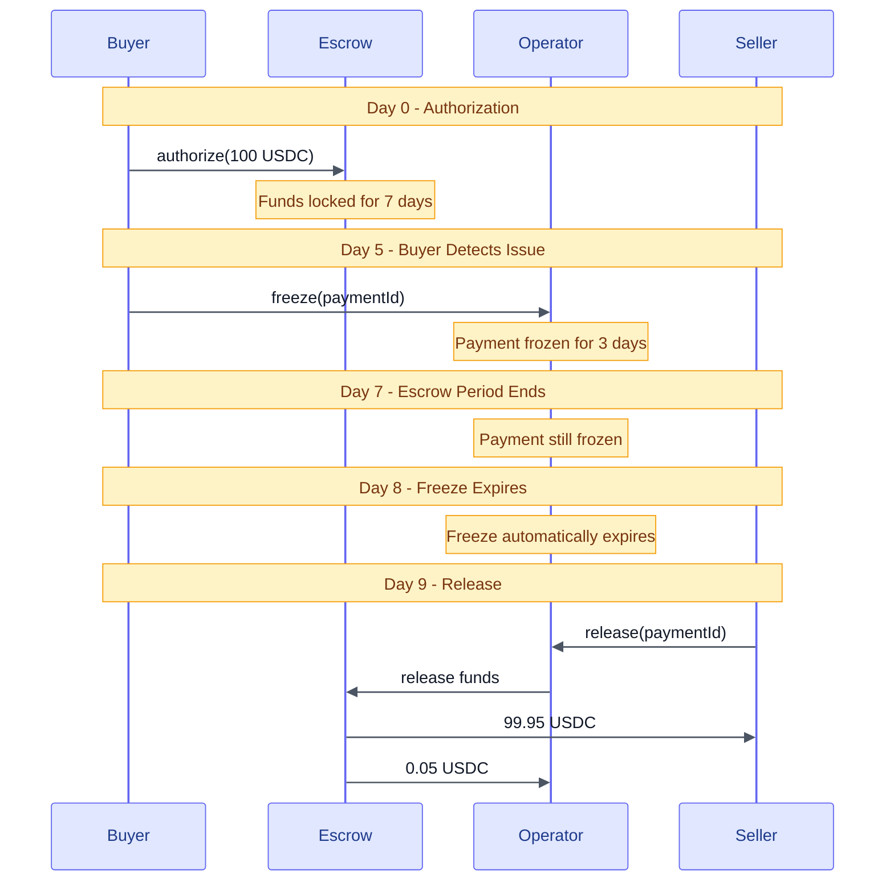
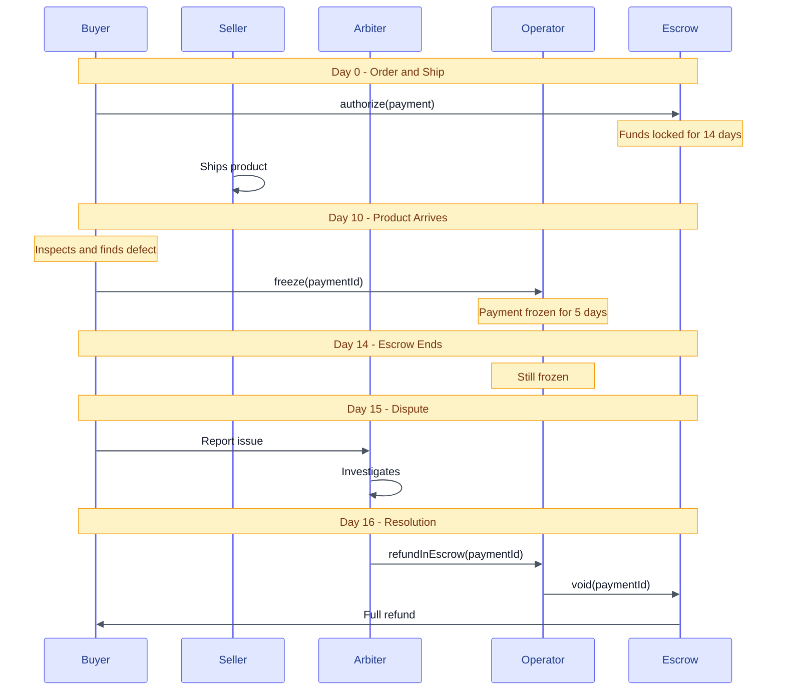
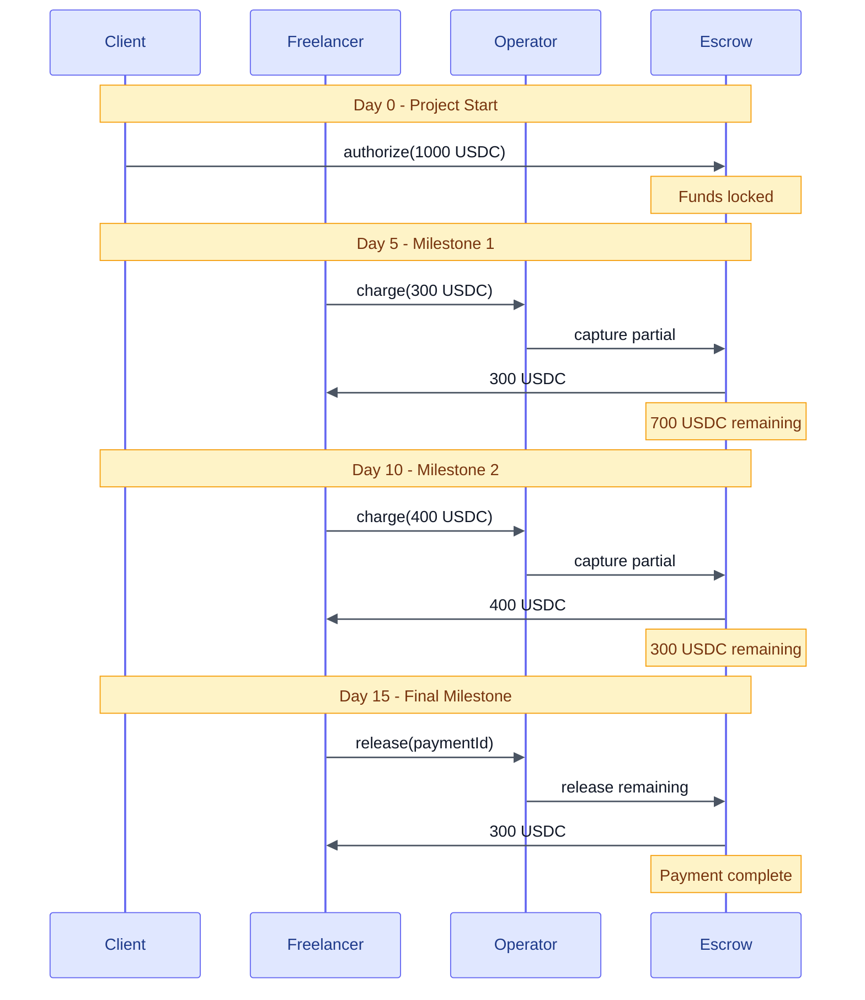
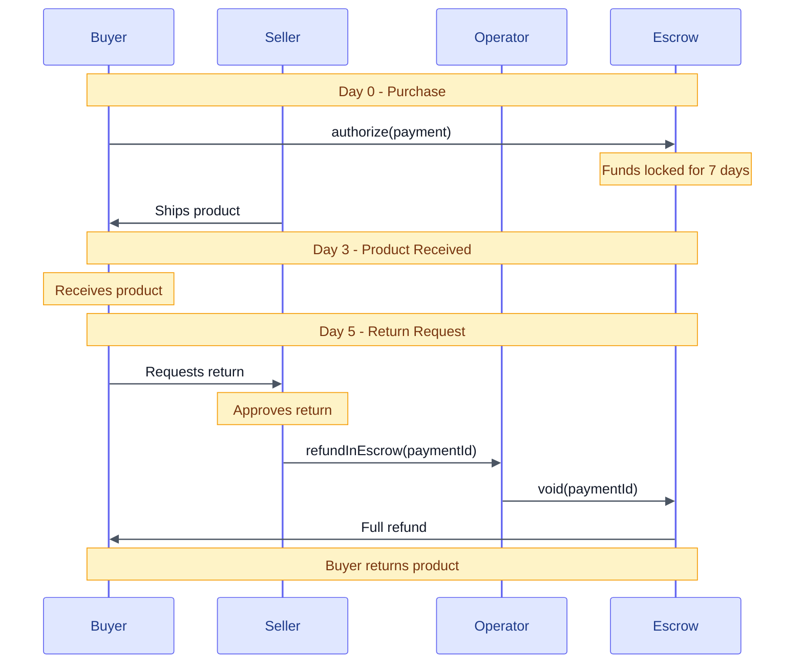
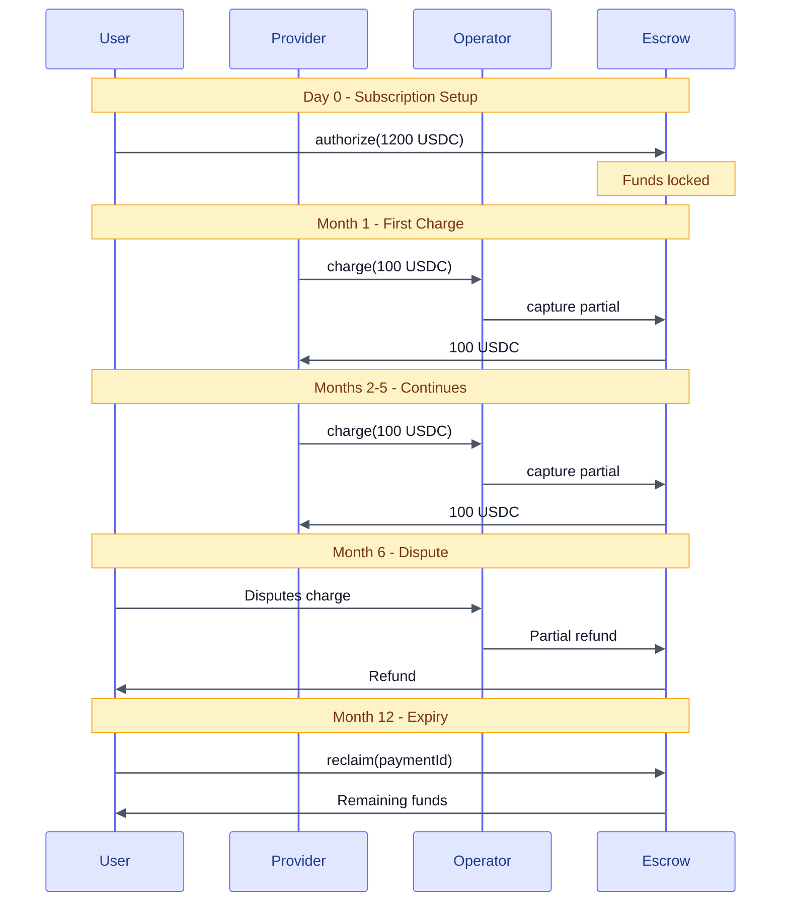
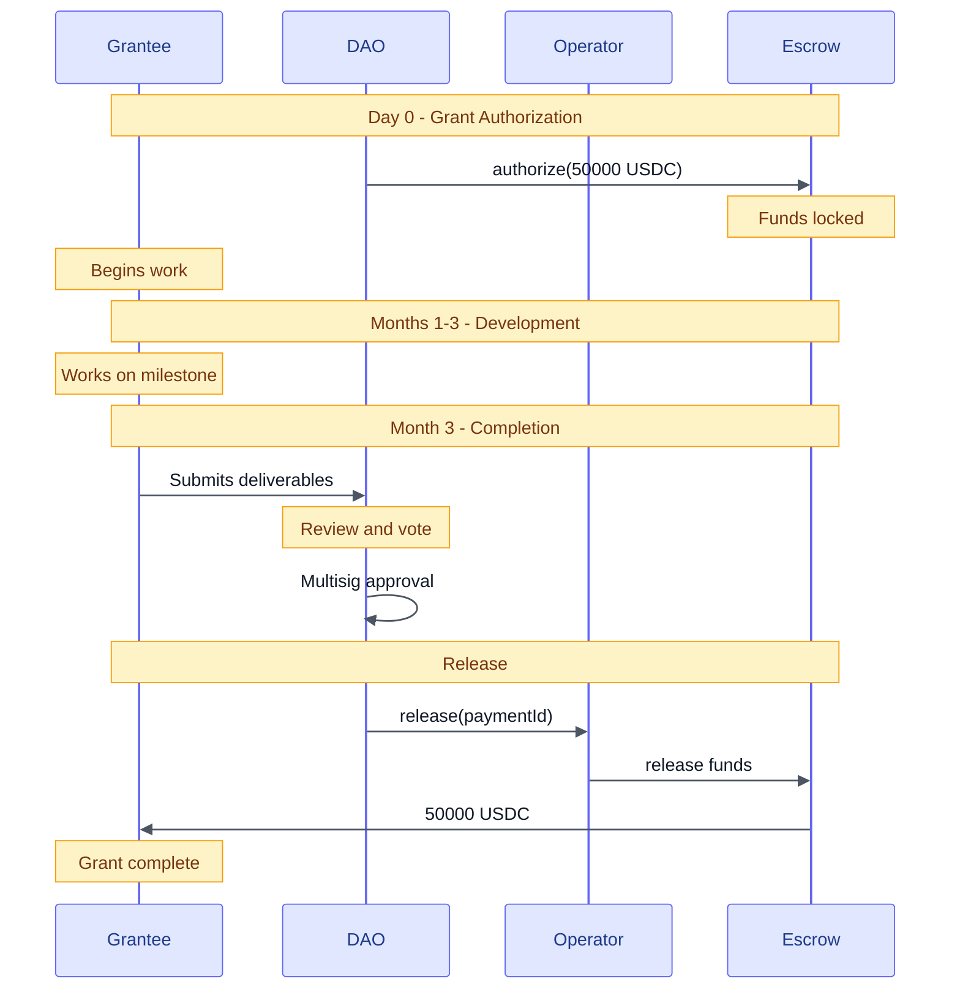
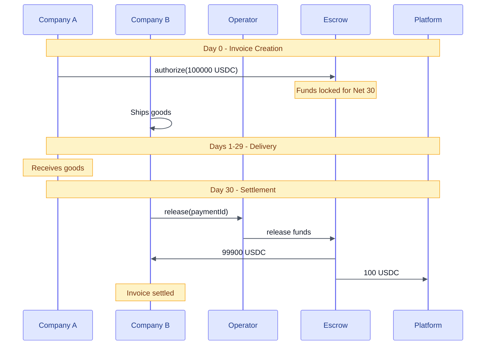

## Example 1: Standard E-Commerce with 7-Day Escrow

**Use Case:** Online marketplace with buyer protection. 7-day escrow period, payer can freeze for 3 days, receiver or arbiter can release after escrow.

### Complete Configuration

<Steps>
  <Step title="Deploy Arbiter Condition">
    ```typescript
    // Deploy designated address condition for arbiter
    const arbiterCondition = await new StaticAddressCondition(arbiterAddress);
    ```
  </Step>

  <Step title="Deploy Freeze Policy">
    ```typescript
    // Payer can freeze, arbiter can unfreeze (or wait for expiry)
    const freezePolicy = await freezePolicyFactory.deploy(
      PAYER_CONDITION,              // Only payer can freeze
      arbiterCondition.address,     // Only arbiter can unfreeze
      3 * 24 * 60 * 60              // 3 days (auto-expires)
    );
    ```
  </Step>

  <Step title="Deploy Escrow Period Condition">
    ```typescript
    // 7-day escrow with freeze support
    const [escrowCondition, escrowRecorder] =
      await escrowPeriodFactory.deploy(
        7 * 24 * 60 * 60,    // 7 days
        freezePolicy
      );
    ```
  </Step>

  <Step title="Create Release Condition">
    ```typescript
    // (Receiver OR Arbiter) AND EscrowPassed
    const receiverOrArbiter = await new OrCondition([
      RECEIVER_CONDITION,
      arbiterCondition.address
    ]);

    const releaseCondition = await new AndCondition([
      receiverOrArbiter,
      escrowCondition
    ]);
    ```
  </Step>

  <Step title="Deploy Operator">
    ```typescript
    const config = {
      feeRecipient: arbiterAddress,         // Arbiter earns fees for dispute resolution
      authorizeCondition: ALWAYS_TRUE_CONDITION,
      authorizeRecorder: escrowRecorder,
      chargeCondition: RECEIVER_CONDITION,
      chargeRecorder: '0x0000000000000000000000000000000000000000',
      releaseCondition: releaseCondition,
      releaseRecorder: escrowRecorder,
      refundInEscrowCondition: arbiterCondition.address,
      refundInEscrowRecorder: '0x0000000000000000000000000000000000000000',
      refundPostEscrowCondition: arbiterCondition.address,
      refundPostEscrowRecorder: '0x0000000000000000000000000000000000000000'
    };

    const operator = await operatorFactory.deployOperator(config);
    ```
  </Step>
</Steps>

### Payment Flow



---

## Example 2: Instant Payment (Using Charge)

**Use Case:** Digital goods or services where immediate payment to seller is expected.

### Configuration

```typescript
// Deploy arbiter condition for disputes
const arbiterCondition = await new StaticAddressCondition(arbiterAddress);

const config = {
  feeRecipient: arbiterAddress,               // Arbiter earns fees
  authorizeCondition: '0x0000000000000000000000000000000000000000',             // Not used (charge handles auth)
  authorizeRecorder: '0x0000000000000000000000000000000000000000',
  chargeCondition: RECEIVER_CONDITION,        // Only receiver can charge
  chargeRecorder: '0x0000000000000000000000000000000000000000',
  releaseCondition: RECEIVER_CONDITION,       // Fallback to release remaining
  releaseRecorder: '0x0000000000000000000000000000000000000000',
  refundInEscrowCondition: arbiterCondition.address,
  refundInEscrowRecorder: '0x0000000000000000000000000000000000000000',
  refundPostEscrowCondition: arbiterCondition.address,
  refundPostEscrowRecorder: '0x0000000000000000000000000000000000000000'
};

const operator = await operatorFactory.deployOperator(config);
```

### Payment Flow

```
Buyer approves tokens → Seller calls charge() → Funds transferred in one tx
                        (authorizes + charges atomically)
```

**Trade-offs:**
- ✅ Single transaction - no separate authorize step
- ✅ Instant delivery for digital goods
- ✅ Better UX - seller gets paid immediately
- ❌ No buyer protection escrow period
- ❌ Payment immediately moves to post-escrow state

---

## Example 3: Physical Goods with Extended Escrow

**Use Case:** International shipping with 14-day escrow and 5-day receiver freeze period.

### Configuration

```typescript
// Deploy arbiter condition
const arbiterCondition = await new StaticAddressCondition(arbiterAddress);

// Receiver can freeze for 5 days, arbiter can unfreeze
const freezePolicy = await freezePolicyFactory.deploy(
  RECEIVER_CONDITION,           // Receiver can freeze (product defect)
  arbiterCondition.address,     // Arbiter can unfreeze (dispute resolution)
  5 * 24 * 60 * 60              // 5 days (auto-expires)
);

// 14-day escrow (shipping + inspection)
const [escrowCondition, escrowRecorder] =
  await escrowPeriodFactory.deploy(
    14 * 24 * 60 * 60,   // 14 days
    freezePolicy
  );

// Receiver OR Arbiter can release (after escrow + not frozen)
const releaseCondition = await new AndCondition([
  await new OrCondition([RECEIVER_CONDITION, arbiterCondition.address]),
  escrowCondition
]);

const config = {
  feeRecipient: arbiterAddress,         // Arbiter earns fees
  authorizeCondition: ALWAYS_TRUE_CONDITION,
  authorizeRecorder: escrowRecorder,
  chargeCondition: '0x0000000000000000000000000000000000000000',
  chargeRecorder: '0x0000000000000000000000000000000000000000',
  releaseCondition: releaseCondition,
  releaseRecorder: escrowRecorder,
  refundInEscrowCondition: arbiterCondition.address,
  refundInEscrowRecorder: '0x0000000000000000000000000000000000000000',
  refundPostEscrowCondition: arbiterCondition.address,
  refundPostEscrowRecorder: '0x0000000000000000000000000000000000000000'
};

const operator = await operatorFactory.deployOperator(config);
```

### Payment Flow



---

## Example 4: Service-Based Payments (Milestone Release)

**Use Case:** Freelance work with milestone-based releases. Receiver can trigger partial releases.

### Configuration

```typescript
// Deploy arbiter condition for disputes
const arbiterCondition = await new StaticAddressCondition(arbiterAddress);

// No freeze policy (service-based)
const [escrowCondition, escrowRecorder] =
  await escrowPeriodFactory.deploy(
    3 * 24 * 60 * 60,     // 3 days per milestone
    '0x0000000000000000000000000000000000000000'            // No freeze
  );

// Receiver can release after short escrow
const releaseCondition = await new AndCondition([
  RECEIVER_CONDITION,    // Only receiver
  escrowCondition
]);

const config = {
  feeRecipient: arbiterAddress,               // Arbiter earns fees
  authorizeCondition: PAYER_CONDITION,        // Only payer authorizes
  authorizeRecorder: escrowRecorder,
  chargeCondition: RECEIVER_CONDITION,        // Receiver can charge partials
  chargeRecorder: '0x0000000000000000000000000000000000000000',
  releaseCondition: releaseCondition,
  releaseRecorder: escrowRecorder,
  refundInEscrowCondition: arbiterCondition.address,
  refundInEscrowRecorder: '0x0000000000000000000000000000000000000000',
  refundPostEscrowCondition: arbiterCondition.address,
  refundPostEscrowRecorder: '0x0000000000000000000000000000000000000000'
};

const operator = await operatorFactory.deployOperator(config);
```

### Payment Flow



---

## Example 5: Arbiter-Controlled Escrow

**Use Case:** Fully managed escrow service where arbiter controls all actions.

### Configuration

```typescript
// Deploy arbiter condition
const arbiterCondition = await new StaticAddressCondition(arbiterAddress);

const config = {
  feeRecipient: arbiterAddress,               // Arbiter earns all fees
  authorizeCondition: arbiterCondition.address,      // Arbiter creates payments
  authorizeRecorder: '0x0000000000000000000000000000000000000000',
  chargeCondition: arbiterCondition.address,         // Arbiter charges
  chargeRecorder: '0x0000000000000000000000000000000000000000',
  releaseCondition: arbiterCondition.address,        // Arbiter releases
  releaseRecorder: '0x0000000000000000000000000000000000000000',
  refundInEscrowCondition: arbiterCondition.address, // Arbiter refunds
  refundInEscrowRecorder: '0x0000000000000000000000000000000000000000',
  refundPostEscrowCondition: arbiterCondition.address,
  refundPostEscrowRecorder: '0x0000000000000000000000000000000000000000'
};

const operator = await operatorFactory.deployOperator(config);
```

<Note>
Factory-level fees still apply (MAX_TOTAL_FEE_RATE and PROTOCOL_FEE_PERCENTAGE). This example assumes protocol takes no cut at factory level.
</Note>

**Use cases:**
- Professional escrow services
- Legal settlements
- High-value transactions requiring oversight

---

## Example 6: Receiver-Initiated Refunds

**Use Case:** Receiver can voluntarily offer refunds (e.g., return policy).

### Configuration

```typescript
// Deploy arbiter condition
const arbiterCondition = await new StaticAddressCondition(arbiterAddress);

// 7-day escrow
const [escrowCondition, escrowRecorder] =
  await escrowPeriodFactory.deploy(
    7 * 24 * 60 * 60,
    '0x0000000000000000000000000000000000000000'            // No freeze
  );

// Receiver OR Arbiter can release
const releaseCondition = await new AndCondition([
  await new OrCondition([RECEIVER_CONDITION, arbiterCondition.address]),
  escrowCondition
]);

// Receiver OR Arbiter can refund
const refundCondition = await new OrCondition([
  RECEIVER_CONDITION,
  arbiterCondition.address
]);

const config = {
  feeRecipient: arbiterAddress,               // Arbiter earns fees
  authorizeCondition: ALWAYS_TRUE_CONDITION,
  authorizeRecorder: escrowRecorder,
  chargeCondition: '0x0000000000000000000000000000000000000000',
  chargeRecorder: '0x0000000000000000000000000000000000000000',
  releaseCondition: releaseCondition,
  releaseRecorder: escrowRecorder,
  refundInEscrowCondition: refundCondition,    // Receiver OR Arbiter
  refundInEscrowRecorder: '0x0000000000000000000000000000000000000000',
  refundPostEscrowCondition: RECEIVER_CONDITION, // Only receiver post-escrow
  refundPostEscrowRecorder: '0x0000000000000000000000000000000000000000'
};

const operator = await operatorFactory.deployOperator(config);
```

### Payment Flow



---

## Example 7: Subscription Payments

**Use Case:** Recurring payments with automatic charge capability.

### Configuration

```typescript
// Deploy condition for service provider (no arbiter needed for subscriptions)
const providerCondition = await new StaticAddressCondition(serviceProviderAddress);

// Receiver can charge immediately (no escrow)
const config = {
  feeRecipient: serviceProviderAddress,       // Service provider earns fees
  authorizeCondition: PAYER_CONDITION,        // Payer sets up subscription
  authorizeRecorder: '0x0000000000000000000000000000000000000000',
  chargeCondition: providerCondition.address, // Provider charges monthly
  chargeRecorder: '0x0000000000000000000000000000000000000000',
  releaseCondition: providerCondition.address,// Provider releases
  releaseRecorder: '0x0000000000000000000000000000000000000000',
  refundInEscrowCondition: '0x0000000000000000000000000000000000000000',        // No refunds (no arbiter)
  refundInEscrowRecorder: '0x0000000000000000000000000000000000000000',
  refundPostEscrowCondition: '0x0000000000000000000000000000000000000000',
  refundPostEscrowRecorder: '0x0000000000000000000000000000000000000000'
};

const operator = await operatorFactory.deployOperator(config);
```

<Note>
For subscriptions with dispute resolution, deploy an arbiter condition and use it for refund conditions. This example shows a simple subscription without arbiter.
</Note>

<Tip>
**Authorization Expiry for Subscriptions:** When authorizing, set `authorizationExpiry` to limit how long the service provider can charge. For example, a 12-month subscription would set expiry to `block.timestamp + 365 days`. After expiry, the payer can reclaim any unused funds by calling `void()`.
</Tip>

### Payment Flow



---

## Example 8: DAO Treasury Controlled

**Use Case:** DAO manages grant releases via multisig governance. No arbiter needed - DAO is the authority.

### Configuration

```typescript
// Deploy condition for DAO multisig
const daoCondition = await new StaticAddressCondition(DAO_MULTISIG_ADDRESS);

const config = {
  feeRecipient: DAO_MULTISIG_ADDRESS,         // DAO treasury earns fees
  authorizeCondition: daoCondition.address,   // DAO authorizes grants
  authorizeRecorder: '0x0000000000000000000000000000000000000000',
  chargeCondition: '0x0000000000000000000000000000000000000000',
  chargeRecorder: '0x0000000000000000000000000000000000000000',
  releaseCondition: daoCondition.address,     // DAO must approve releases
  releaseRecorder: '0x0000000000000000000000000000000000000000',
  refundInEscrowCondition: daoCondition.address,  // DAO can refund if needed
  refundInEscrowRecorder: '0x0000000000000000000000000000000000000000',
  refundPostEscrowCondition: '0x0000000000000000000000000000000000000000',      // No post-escrow refunds
  refundPostEscrowRecorder: '0x0000000000000000000000000000000000000000'
};

const operator = await operatorFactory.deployOperator(config);
```

### Payment Flow



**Benefits:**
- Governance-controlled releases
- No third-party arbiter needed
- DAO earns fees back to treasury
- On-chain transparent decision making

---

## Example 9: Platform-Controlled Streaming Payments

**Use Case:** Platform manages time-proportional streaming payments. Users can cancel anytime.

### Configuration

```typescript
// Deploy condition for platform address
const platformCondition = await new StaticAddressCondition(PLATFORM_ADDRESS);

// Time-proportional charge condition (custom)
const timeProportionalCondition = await new TimeProportionalCondition();

const config = {
  feeRecipient: PLATFORM_ADDRESS,             // Platform earns fees
  authorizeCondition: PAYER_CONDITION,        // Payer authorizes stream
  authorizeRecorder: '0x0000000000000000000000000000000000000000',
  chargeCondition: new AndCondition([
    RECEIVER_CONDITION,
    timeProportionalCondition                 // Can only charge proportional to time
  ]),
  chargeRecorder: '0x0000000000000000000000000000000000000000',
  releaseCondition: RECEIVER_CONDITION,       // Receiver releases remaining
  releaseRecorder: '0x0000000000000000000000000000000000000000',
  refundInEscrowCondition: PAYER_CONDITION,   // Payer can cancel stream
  refundInEscrowRecorder: '0x0000000000000000000000000000000000000000',
  refundPostEscrowCondition: '0x0000000000000000000000000000000000000000',      // No refunds after charged
  refundPostEscrowRecorder: '0x0000000000000000000000000000000000000000'
};

const operator = await operatorFactory.deployOperator(config);
```

### Payment Flow


**Benefits:**
- Time-based fairness (can't charge ahead of time)
- User can cancel anytime
- No arbiter needed
- Platform controls no disputes

---

## Example 10: Self-Service Invoice Payment (No Arbiter)

**Use Case:** B2B invoice payments with no disputes. Companies trust each other directly.

### Configuration

```typescript
// No arbiter - receiver controls release, platform earns fees
const platformCondition = await new StaticAddressCondition(PLATFORM_ADDRESS);

const config = {
  feeRecipient: PLATFORM_ADDRESS,             // Platform earns fees
  authorizeCondition: PAYER_CONDITION,        // Payer creates invoice payment
  authorizeRecorder: '0x0000000000000000000000000000000000000000',
  chargeCondition: RECEIVER_CONDITION,        // Receiver charges on delivery
  chargeRecorder: '0x0000000000000000000000000000000000000000',
  releaseCondition: RECEIVER_CONDITION,       // Receiver releases on payment terms
  releaseRecorder: '0x0000000000000000000000000000000000000000',
  refundInEscrowCondition: RECEIVER_CONDITION,// Receiver can refund (invoice error)
  refundInEscrowRecorder: '0x0000000000000000000000000000000000000000',
  refundPostEscrowCondition: '0x0000000000000000000000000000000000000000',      // No post-delivery refunds
  refundPostEscrowRecorder: '0x0000000000000000000000000000000000000000'
};

const operator = await operatorFactory.deployOperator(config);
```

### Payment Flow



**Benefits:**
- Trusted B2B relationship (no arbiter overhead)
- Standard payment terms enforced on-chain
- Receiver can self-correct invoice errors
- Platform monetizes via fees only

---

## Fee Configuration Comparison

| Use Case | Max Fee (bps) | Protocol % | Operator % | Fee Recipient | Total on 1000 USDC |
|----------|---------------|------------|------------|---------------|-------------------|
| E-Commerce (Arbiter) | 5 (0.05%) | 25% | 75% | Arbiter | 0.50 USDC |
| Instant Payment (Arbiter) | 10 (0.1%) | 50% | 50% | Arbiter | 1.00 USDC |
| Physical Goods (Arbiter) | 3 (0.03%) | 20% | 80% | Arbiter | 0.30 USDC |
| Service/Milestone (Arbiter) | 8 (0.08%) | 30% | 70% | Arbiter | 0.80 USDC |
| Managed Escrow (Arbiter) | 20 (0.2%) | 0% | 100% | Arbiter | 2.00 USDC |
| Receiver Refunds (Arbiter) | 5 (0.05%) | 25% | 75% | Arbiter | 0.50 USDC |
| Subscription (Provider) | 15 (0.15%) | 40% | 60% | Service Provider | 1.50 USDC |
| DAO Grants (DAO) | 5 (0.05%) | 20% | 80% | DAO Treasury | 0.50 USDC |
| Streaming (Platform) | 10 (0.1%) | 30% | 70% | Platform | 1.00 USDC |
| B2B Invoice (Platform) | 10 (0.1%) | 50% | 50% | Platform | 1.00 USDC |

---

## Configuration Checklist

Before deploying, verify:

- [ ] Freeze policy suits your use case
- [ ] Escrow period is appropriate for delivery time
- [ ] Release condition prevents premature releases
- [ ] Refund conditions allow arbiter intervention
- [ ] Fee rates are competitive and sustainable
- [ ] Protocol fee percentage is reasonable
- [ ] Tested on testnet with same configuration
- [ ] Arbiter address is controlled (preferably multisig)
- [ ] Condition contracts are verified on block explorer

---

## Testing Your Configuration

```typescript
// Deploy on Base Sepolia first
const testOperator = await testnetFactory.deploy(
  testArbiter,
  config,
  5,
  25
);

// Test payment flow
const paymentId = ethers.utils.keccak256(
  ethers.utils.toUtf8Bytes("test-payment-1")
);

// 1. Authorize
await testOperator.connect(payer).authorize(
  paymentId,
  receiver.address,
  ethers.utils.parseUnits("100", 6),  // 100 USDC
  USDC_ADDRESS
);

// 2. Try to release immediately (should fail if escrow configured)
await expect(
  testOperator.connect(receiver).release(paymentId)
).to.be.revertedWith("EscrowPeriodNotPassed");

// 3. Fast forward time
await ethers.provider.send("evm_increaseTime", [7 * 24 * 60 * 60]);
await ethers.provider.send("evm_mine", []);

// 4. Release after escrow
await testOperator.connect(receiver).release(paymentId);

// Verify funds transferred correctly
```

---

## Best Practices

<Accordion title="Start Conservative">
Use well-tested configurations for your first deployments:
- Standard 7-day escrow
- 3-day payer freeze
- Arbiter-only refunds
- Low fee rates (3-5 bps)
</Accordion>

<Accordion title="Match Industry Standards">
Research competitors' escrow periods and fees:
- E-commerce: 3-7 days typical
- Freelance: 3-14 days per milestone
- High-value: 14-30 days common
</Accordion>

<Accordion title="Test Edge Cases">
Test your configuration handles:
- Immediate release attempts
- Freeze during escrow
- Freeze expiry
- Refunds in both states
- Fee distribution
- Multiple partial charges
</Accordion>

<Accordion title="Document Your Config">
Keep records of deployed configurations:
```json
{
  "operator": "0x...",
  "arbiter": "0x...",
  "escrowPeriod": "7 days",
  "freezeDuration": "3 days",
  "freezeBy": "payer",
  "releaseBy": "receiver OR arbiter",
  "maxFeeBps": 5,
  "protocolFeePct": 25,
  "network": "base-mainnet",
  "deployedAt": "2025-01-25"
}
```
</Accordion>

## Next Steps

<CardGroup cols={2}>
  <Card title="Core Contracts" icon="file-contract" href="/contracts/core-contracts">
    Review contract methods and security features.
  </Card>
  <Card title="Conditions" icon="filter" href="/contracts/conditions">
    Learn more about custom conditions.
  </Card>
</CardGroup>
