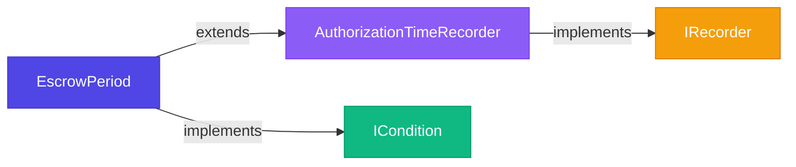

## Overview

x402r uses the factory pattern with CREATE2 for gas-efficient, deterministic contract deployments. Factories enable on-demand instance creation with predictable addresses.

## Why Factories?

<AccordionGroup>
  <Accordion title="Deterministic Addresses (CREATE2)">
    Addresses are predictable before deployment, enabling:
    - Off-chain address generation
    - Cross-chain address consistency
    - Contract-to-contract communication without registries
  </Accordion>

  <Accordion title="Shared Configuration">
    Multiple instances can share immutable configuration:
    - Lower deployment costs
    - Consistent behavior across instances
    - Centralized ownership control
  </Accordion>

  <Accordion title="Idempotent Deployments">
    Calling factory with same parameters returns existing contract:
    - Safe to call multiple times
    - No duplicate deployments
    - Automatic deduplication
  </Accordion>

  <Accordion title="Gas Optimization">
    Singleton conditions deployed once, reused everywhere:
    - PayerCondition, ReceiverCondition deployed once
    - All operators share the same condition instances
    - Minimal storage overhead
  </Accordion>
</AccordionGroup>

## Payment Operator Factory

Deploys PaymentOperator instances with deterministic addresses.

### Contract Address

**Base Sepolia:** TBD (deploy generic version)

### Configuration Structure

```solidity
struct OperatorConfig {
    address feeRecipient;             // Who receives operator fees
    address feeCalculator;            // Operator fee calculator (IFeeCalculator)
    address authorizeCondition;
    address authorizeRecorder;
    address chargeCondition;
    address chargeRecorder;
    address releaseCondition;
    address releaseRecorder;
    address refundInEscrowCondition;
    address refundInEscrowRecorder;
    address refundPostEscrowCondition;
    address refundPostEscrowRecorder;
}
```

### Deployment Method

```solidity
function deployOperator(
    OperatorConfig calldata config
) external returns (address operator)
```

**Parameters (in config):**
- `feeRecipient` - Who receives operator fees (arbiter, service provider, treasury, etc.)
- `authorizeCondition` through `refundPostEscrowRecorder` - 10-slot configuration

**Note:** `maxFeeBps` and `protocolFeePct` are set at factory level (shared across all operators)

**Returns:** Address of deployed operator (or existing if already deployed)

### Address Prediction

Predict the operator address before deployment:

```solidity
function computeAddress(
    OperatorConfig calldata config
) external view returns (address)
```

**Usage:**
```typescript
const config = {
  feeRecipient: arbiterAddress,
  authorizeCondition: ALWAYS_TRUE_CONDITION,
  // ... rest of config
};

const predictedAddress = await factory.computeAddress(config);

console.log("Operator will be deployed at:", predictedAddress);

// Deploy - will use same address
const deployedAddress = await factory.deployOperator(config);

assert(deployedAddress === predictedAddress);
```

### Example Deployment

#### Marketplace Operator

```typescript
import { createWalletClient, http, getContract, zeroAddress } from 'viem';
import { base } from 'viem/chains';
import { privateKeyToAccount } from 'viem/accounts';
import { PaymentOperatorFactory, StaticAddressCondition } from "@x402r/contracts";

const FACTORY_ADDRESS = '0x...'; // Replace with actual factory address

const account = privateKeyToAccount('0x...');
const walletClient = createWalletClient({
  account,
  chain: base,
  transport: http()
});

const factory = getContract({
  address: FACTORY_ADDRESS,
  abi: PaymentOperatorFactory.abi,
  client: walletClient
});

// Deploy condition for arbiter
const arbiterCondition = await new StaticAddressCondition(arbiterAddress);

// Define configuration
const config = {
  feeRecipient: arbiterAddress,  // Arbiter earns fees
  authorizeCondition: ALWAYS_TRUE_CONDITION,
  authorizeRecorder: escrowRecorder,
  chargeCondition: zeroAddress,  // Default allow
  chargeRecorder: zeroAddress,   // No recording
  releaseCondition: new AndCondition([
    arbiterCondition.address,
    escrowPeriodCondition
  ]),
  releaseRecorder: escrowRecorder,
  refundInEscrowCondition: arbiterCondition.address,
  refundInEscrowRecorder: zeroAddress,
  refundPostEscrowCondition: arbiterCondition.address,
  refundPostEscrowRecorder: zeroAddress
};

// Deploy operator
const hash = await factory.write.deployOperator([config]);
const receipt = await walletClient.waitForTransactionReceipt({ hash });
const operatorAddress = receipt.logs[0].address;

console.log("Deployed marketplace operator at:", operatorAddress);
```

#### Subscription Operator

```typescript
// Deploy condition for service provider
const providerCondition = await new StaticAddressCondition(serviceProviderAddress);

const config = {
  feeRecipient: serviceProviderAddress,  // Provider earns fees
  authorizeCondition: PAYER_CONDITION,
  authorizeRecorder: zeroAddress,
  chargeCondition: providerCondition.address,
  chargeRecorder: zeroAddress,
  releaseCondition: providerCondition.address,
  releaseRecorder: zeroAddress,
  refundInEscrowCondition: zeroAddress,  // No refunds
  refundInEscrowRecorder: zeroAddress,
  refundPostEscrowCondition: zeroAddress,
  refundPostEscrowRecorder: zeroAddress
};

const hash = await factory.write.deployOperator([config]);
console.log("Deployed subscription operator, tx:", hash);
```

<Tip>
If you call `deployOperator()` with the same configuration twice, the factory returns the existing operator address without deploying a new contract.
</Tip>

---

## Escrow Period Factory

Deploys `EscrowPeriod` contracts - combined recorder and condition for time-based release logic.

### Contract Address

**Base Sepolia:** TBD

### Deployment Method

```solidity
function deploy(
    uint256 escrowPeriod,
    bytes32 authorizedCodehash
) external returns (address escrowPeriodAddr)
```

**Parameters:**
- `escrowPeriod` - Duration in seconds (e.g., `7 * 24 * 60 * 60` for 7 days)
- `authorizedCodehash` - Runtime codehash of authorized caller (`bytes32(0)` = operator-only)

**Returns:** Address of deployed EscrowPeriod contract

### How It Works

The factory deploys a single **EscrowPeriod** contract that:
- Extends `AuthorizationTimeRecorder` (implements `IRecorder`)
- Implements `ICondition`
- Records authorization timestamp when used as recorder
- Checks if escrow period has passed when used as condition

**Architecture:**



<Note>
Use the SAME `EscrowPeriod` address for both `AUTHORIZE_RECORDER` and `RELEASE_CONDITION` slots on the operator. For freeze functionality, deploy a separate `Freeze` condition and compose via `AndCondition([escrowPeriod, freeze])`.
</Note>

### Example Deployment

```typescript
import { getContract, zeroHash } from 'viem';

const factory = getContract({
  address: ESCROW_PERIOD_FACTORY_ADDRESS,
  abi: EscrowPeriodFactory.abi,
  client: walletClient
});

// Deploy 7-day escrow (operator-only access)
const hash = await factory.write.deploy([
  7 * 24 * 60 * 60,    // 7 days
  zeroHash             // bytes32(0) = operator-only
]);

const receipt = await walletClient.waitForTransactionReceipt({ hash });
const escrowPeriodAddress = receipt.logs[0].address;

console.log("EscrowPeriod:", escrowPeriodAddress);

// Use SAME address for both recorder and condition
const config = {
  authorizeCondition: ALWAYS_TRUE_CONDITION,
  authorizeRecorder: escrowPeriodAddress,     // Record auth time
  // ...
  releaseCondition: escrowPeriodAddress,      // Check escrow passed
  releaseRecorder: zeroAddress,               // No additional recording needed
  // ...
};
```

### Common Escrow Periods

| Use Case | Recommended Period |
|----------|-------------------|
| Digital goods / services | 1-3 days |
| Physical goods (domestic) | 7-14 days |
| Physical goods (international) | 14-30 days |
| Large purchases / services | 30-60 days |
| No escrow (instant release) | 0 (use different condition) |

---

## Freeze Policy Factory

Deploys `FreezePolicy` instances that define who can freeze/unfreeze and for how long.

### Contract Address

**Base Sepolia:** TBD

### Deployment Method

```solidity
function deploy(
    address freezeCondition,
    address unfreezeCondition,
    uint256 freezeDuration
) external returns (address policy)
```

**Parameters:**
- `freezeCondition` - ICondition that authorizes freeze calls (e.g., PayerCondition)
- `unfreezeCondition` - ICondition that authorizes unfreeze calls (e.g., ArbiterCondition)
- `freezeDuration` - How long freeze lasts in seconds (`0` = permanent until unfrozen)

**Returns:** Address of deployed FreezePolicy

---

## Freeze Factory

Deploys `Freeze` condition contracts that block release when a payment is frozen.

### Contract Address

**Base Sepolia:** TBD

### Deployment Method

```solidity
function deploy(
    address freezePolicy,
    address escrowPeriodContract
) external returns (address freezeAddr)
```

**Parameters:**
- `freezePolicy` - Address of the FreezePolicy contract (required)
- `escrowPeriodContract` - Address of EscrowPeriod contract (`address(0)` = freeze unconstrained by time)

**Returns:** Address of deployed Freeze condition

### Full Freeze Deployment Example

```typescript
// Step 1: Deploy FreezePolicy
const freezePolicy = await freezePolicyFactory.write.deploy([
  PAYER_CONDITION,      // Only payer can freeze
  ARBITER_CONDITION,    // Only arbiter can unfreeze
  3 * 24 * 60 * 60      // 3 days (auto-expires)
]);

// Step 2: Deploy Freeze condition (linked to EscrowPeriod)
const freeze = await freezeFactory.write.deploy([
  freezePolicy,         // Use the policy we just deployed
  escrowPeriodAddress   // Link to EscrowPeriod (or zeroAddress for unconstrained)
]);

// Step 3: Compose with EscrowPeriod for release condition
const releaseCondition = await andConditionFactory.write.deploy([
  [escrowPeriodAddress, freeze]
]);

// Use in operator config
const config = {
  // ...
  releaseCondition: releaseCondition,
  // ...
};
```

### Condition Singletons

Use these pre-deployed condition contracts:

| Condition | Address (Base Sepolia) | Description |
|-----------|------------------------|-------------|
| PayerCondition | TBD | Only payer can call |
| ReceiverCondition | TBD | Only receiver can call |
| AlwaysTrueCondition | TBD | Anyone can call |

### Example Deployments

<Tabs>
  <Tab title="Payer Freeze">
    Payer can freeze, arbiter can unfreeze (or auto-expires after 3 days):

    ```typescript
    const freezePolicy = await freezePolicyFactory.deploy(
      PAYER_CONDITION,      // Only payer can freeze
      ARBITER_CONDITION,    // Only arbiter can unfreeze
      3 * 24 * 60 * 60      // 3 days (auto-expires)
    );
    ```
  </Tab>

  <Tab title="Receiver Freeze">
    Receiver can freeze, arbiter can unfreeze (or auto-expires after 5 days):

    ```typescript
    const freezePolicy = await freezePolicyFactory.deploy(
      RECEIVER_CONDITION,   // Only receiver can freeze
      ARBITER_CONDITION,    // Only arbiter can unfreeze
      5 * 24 * 60 * 60      // 5 days (auto-expires)
    );
    ```
  </Tab>

  <Tab title="Payer OR Receiver">
    Either payer or receiver can freeze, both can unfreeze:

    ```typescript
    // First deploy OrCondition
    const orCondition = await new OrCondition([
      PAYER_CONDITION,
      RECEIVER_CONDITION
    ]);

    const freezePolicy = await freezePolicyFactory.deploy(
      orCondition.address,  // Payer OR Receiver
      orCondition.address,  // Payer OR Receiver
      3 * 24 * 60 * 60      // 3 days
    );
    ```
  </Tab>

  <Tab title="Arbiter Controlled">
    Only arbiter can freeze/unfreeze:

    ```typescript
    const freezePolicy = await freezePolicyFactory.deploy(
      ARBITER_CONDITION,    // Only arbiter can freeze
      ARBITER_CONDITION,    // Only arbiter can unfreeze
      7 * 24 * 60 * 60      // 7 days
    );
    ```
  </Tab>
</Tabs>

### Freeze Duration Guidelines

| Duration | Use Case |
|----------|----------|
| 1 day | Quick investigation period |
| 3 days | Standard fraud check window |
| 5-7 days | Extended investigation |
| 14+ days | Complex dispute resolution |

<Warning>
Freeze duration should balance payer protection with receiver UX. Too long and receivers may avoid the platform. Too short and payers can't adequately investigate.
</Warning>

---

## Factory Ownership

All factories are owned by a multisig wallet for security.

### Owner Capabilities

Factory owners can:
- Update factory configuration (if mutable fields exist)
- Rescue stuck ETH (via `rescueETH()`)
- Transfer ownership (2-step process)

Factory owners **cannot:**
- Modify deployed instances
- Pause or stop operations
- Access funds in deployed operators

### Ownership Transfer

```solidity
// Current owner initiates
factory.requestOwnershipHandover(newOwner);

// New owner completes (within 48 hours)
factory.completeOwnershipHandover();
```

---

## Gas Costs

Approximate gas costs for factory deployments (Base Sepolia):

| Operation | Gas Cost | USD (at 0.1 gwei, $3000 ETH) |
|-----------|----------|------------------------------|
| Deploy ArbitrationOperator | ~2.5M gas | ~$0.75 |
| Deploy EscrowPeriod (condition + recorder) | ~1.8M gas | ~$0.54 |
| Deploy FreezePolicy | ~800K gas | ~$0.24 |
| Predict address (view call) | 0 gas | $0.00 |

<Tip>
Use `predict*Address()` functions before deploying to verify addresses off-chain and avoid unnecessary deployments.
</Tip>

---

## CREATE2 Details

### Salt Generation

Each factory uses different salt strategies:

**PaymentOperatorFactory:**
```solidity
bytes32 key = keccak256(abi.encodePacked(
    config.feeRecipient,
    config.feeCalculator,
    config.authorizeCondition,
    config.authorizeRecorder,
    config.chargeCondition,
    config.chargeRecorder,
    config.releaseCondition,
    config.releaseRecorder,
    config.refundInEscrowCondition,
    config.refundInEscrowRecorder,
    config.refundPostEscrowCondition,
    config.refundPostEscrowRecorder
));
```

**EscrowPeriodFactory:**
```solidity
bytes32 key = keccak256(abi.encodePacked(escrowPeriod, authorizedCodehash));
bytes32 salt = keccak256(abi.encodePacked("escrowPeriod", key));
```

**FreezePolicyFactory:**
```solidity
bytes32 key = keccak256(abi.encodePacked(freezeCondition, unfreezeCondition, freezeDuration));
bytes32 salt = keccak256(abi.encodePacked("freezePolicy", key));
```

**FreezeFactory:**
```solidity
bytes32 key = keccak256(abi.encodePacked(freezePolicy, escrowPeriodContract));
bytes32 salt = keccak256(abi.encodePacked("freeze", key));
```

### Cross-Chain Addresses

Same configuration on different chains = same address:

```typescript
import { createPublicClient } from 'viem';
import { baseSepolia, optimismSepolia } from 'viem/chains';

// Deploy on Base Sepolia
const baseFactory = getContract({
  address: FACTORY_ADDRESS,
  abi: PaymentOperatorFactory.abi,
  client: baseWalletClient
});

const baseHash = await baseFactory.write.deployOperator([config]);
const baseReceipt = await baseWalletClient.waitForTransactionReceipt({ hash: baseHash });
const addressBaseSepolia = baseReceipt.logs[0].address;

// Deploy on Optimism Sepolia with identical params
const opFactory = getContract({
  address: FACTORY_ADDRESS,
  abi: PaymentOperatorFactory.abi,
  client: opWalletClient
});

const opHash = await opFactory.write.deployOperator([config]);
const opReceipt = await opWalletClient.waitForTransactionReceipt({ hash: opHash });
const addressOptimismSepolia = opReceipt.logs[0].address;

// Addresses are identical!
console.assert(addressBaseSepolia === addressOptimismSepolia);
```

This enables:
- Consistent addressing across chains
- Simplified multi-chain integrations
- Predictable contract locations

---

## Best Practices

### 1. Predict Before Deploy

Always verify predicted address before deployment:

```typescript
const predicted = await factory.predictOperatorAddress(arbiter, config, 5, 25);
const deployed = await factory.deploy(arbiter, config, 5, 25);
assert(predicted === deployed);
```

### 2. Reuse Condition Singletons

Don't deploy new PayerCondition/ReceiverCondition - use existing singletons:

```typescript
// ✅ Good: Reuse singleton
const config = {
  authorizeCondition: PAYER_CONDITION,  // Pre-deployed singleton
  // ...
};

// ❌ Bad: Deploy new instance
const payerCondition = await new PayerCondition();
const config = {
  authorizeCondition: payerCondition.address,  // Wastes gas
  // ...
};
```

### 3. Test Configuration First

Deploy on testnet with same configuration before mainnet:

```typescript
// Test on Base Sepolia first
const testOperator = await testnetFactory.deploy(arbiter, config, 5, 25);
// ... test thoroughly ...

// Deploy on mainnet with identical config (same address!)
const mainnetOperator = await mainnetFactory.deploy(arbiter, config, 5, 25);
```

### 4. Document Your Config

Keep a record of your deployed configurations:

```typescript
const deployments = {
  "marketplace-arbiter": {
    arbiter: "0x...",
    operator: "0x...",
    escrowPeriod: 7 * 24 * 60 * 60,
    freezeDuration: 3 * 24 * 60 * 60,
    maxFeeBps: 5,
    protocolFeePct: 25,
    network: "base-sepolia"
  }
};
```

## Next Steps

<CardGroup cols={2}>
  <Card title="Conditions" icon="filter" href="/contracts/conditions">
    Learn about the pluggable condition system.
  </Card>
  <Card title="Examples" icon="code" href="/contracts/examples">
    See real-world configuration examples.
  </Card>
</CardGroup>
