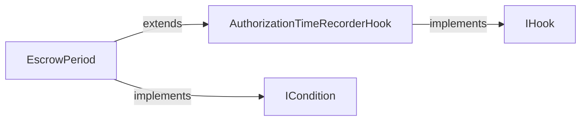

## Overview

x402r uses the factory pattern with CREATE2 for gas-efficient, deterministic contract deployments. Factories enable on-demand instance creation with predictable addresses.

## Why factories

<AccordionGroup>
  <Accordion title="Deterministic Addresses (CREATE2)">
    Addresses are predictable before deployment, enabling:
    - Off-chain address generation
    - Cross-chain address consistency
    - Contract-to-contract communication without registries
  </Accordion>

  <Accordion title="Shared Configuration">
    Many instances can share immutable configuration:
    - Lower deployment costs
    - Consistent behavior across instances
    - Centralized ownership control
  </Accordion>

  <Accordion title="Idempotent Deployments">
    Calling a factory with the same parameters returns the existing contract:
    - Safe to call again
    - No duplicate deployments
    - Built-in deduplication
  </Accordion>

  <Accordion title="Gas Optimization">
    Singleton conditions deployed once, reused everywhere:
    - PayerCondition, ReceiverCondition deployed once
    - All operators share the same condition instances
    - Minimal storage overhead
  </Accordion>
</AccordionGroup>

## Payment Operator Factory

Deploys PaymentOperator instances with deterministic addresses.

### Contract Address

All factories use universal CREATE2 addresses (same on every chain).

**PaymentOperatorFactory:** `0xa0d4734842df1690a5B33Cb21828c946e39D55a2`

### Configuration Structure

```solidity
struct OperatorConfig {
    address feeReceiver;             // Who receives operator fees
    address feeCalculator;            // Operator fee calculator (IFeeCalculator)
    address authorizePreActionCondition;
    address authorizePostActionHook;
    address chargePreActionCondition;
    address chargePostActionHook;
    address capturePreActionCondition;
    address capturePostActionHook;
    address voidPreActionCondition;
    address voidPostActionHook;
    address refundPreActionCondition;
    address refundPostActionHook;
}
```

### Deployment Method

```solidity
function deployOperator(
    OperatorConfig calldata config
) external returns (address operator)
```

**Parameters (in config):**
- `feeReceiver` - Who receives operator fees (arbiter, service provider, or treasury)
- `authorizePreActionCondition` through `refundPostActionHook` - 10-slot configuration

**Note:** the factory sets `maxFeeBps` and `protocolFeePct` (shared across all operators)

**Returns:** Address of deployed operator (or existing if already deployed)

### Address Prediction

Predict the operator address before deployment:

```solidity
function computeAddress(
    OperatorConfig calldata config
) external view returns (address)
```

**Usage:**
```typescript
const config = {
  feeReceiver: arbiterAddress,
  authorizePreActionCondition: ALWAYS_TRUE_CONDITION,
  // ... rest of config
};

const predictedAddress = await factory.computeAddress(config);

console.log("Operator will be deployed at:", predictedAddress);

// Deploy - will use same address
const deployedAddress = await factory.deployOperator(config);

assert(deployedAddress === predictedAddress);
```

### Example Deployment

#### Marketplace Operator

```typescript
import { createWalletClient, http, getContract, zeroAddress } from 'viem';
import { base } from 'viem/chains';
import { privateKeyToAccount } from 'viem/accounts';
import { paymentOperatorAbi } from '@x402r/core';

const FACTORY_ADDRESS = '0xa0d4734842df1690a5B33Cb21828c946e39D55a2';

const account = privateKeyToAccount('0x...');
const walletClient = createWalletClient({
  account,
  chain: base,
  transport: http()
});

const factory = getContract({
  address: FACTORY_ADDRESS,
  abi: paymentOperatorAbi,
  client: walletClient
});

// Deploy condition for arbiter via factory
const arbiterConditionHash = await staticAddressConditionFactory.write.deploy([arbiterAddress]);
const arbiterConditionAddress = /* get from receipt */;

// Deploy capture condition: arbiter AND escrow period passed
const capturePreActionConditionHash = await andConditionFactory.write.deploy([
  [arbiterConditionAddress, escrowPeriodAddress]
]);
const captureConditionAddress = /* get from receipt */;

// Define configuration
const config = {
  feeReceiver: arbiterAddress,  // Arbiter earns fees
  feeCalculator: feeCalculatorAddress,
  authorizePreActionCondition: ALWAYS_TRUE_CONDITION,
  authorizePostActionHook: escrowPeriodAddress,
  chargePreActionCondition: zeroAddress,  // Default allow
  chargePostActionHook: zeroAddress,   // No recording
  capturePreActionCondition: captureConditionAddress,
  capturePostActionHook: zeroAddress,
  voidPreActionCondition: arbiterConditionAddress,
  voidPostActionHook: zeroAddress,
  refundPreActionCondition: arbiterConditionAddress,
  refundPostActionHook: zeroAddress
};

// Deploy operator
const hash = await factory.write.deployOperator([config]);
const receipt = await walletClient.waitForTransactionReceipt({ hash });
const operatorAddress = receipt.logs[0].address;

console.log("Deployed marketplace operator at:", operatorAddress);
```

#### Subscription Operator

```typescript
// Deploy condition for service provider
const providerCondition = await new StaticAddressCondition(serviceProviderAddress);

const config = {
  feeReceiver: serviceProviderAddress,  // Provider earns fees
  authorizePreActionCondition: PAYER_CONDITION,
  authorizePostActionHook: zeroAddress,
  chargePreActionCondition: providerCondition.address,
  chargePostActionHook: zeroAddress,
  capturePreActionCondition: providerCondition.address,
  capturePostActionHook: zeroAddress,
  voidPreActionCondition: zeroAddress,  // No refunds
  voidPostActionHook: zeroAddress,
  refundPreActionCondition: zeroAddress,
  refundPostActionHook: zeroAddress
};

const hash = await factory.write.deployOperator([config]);
console.log("Deployed subscription operator, tx:", hash);
```

<Tip>
If you call `deployOperator()` with the same configuration twice, the factory returns the existing operator address without deploying a new contract.
</Tip>

---

## Escrow Period Factory

Deploys `EscrowPeriod` contracts - combined hook and condition for time-based capture logic.

### Contract Address

**EscrowPeriodFactory:** `0xe72D2014ebC48F1d92521e8629574918E8030548`

### Deployment Method

```solidity
function deploy(
    uint256 escrowPeriod,
    bytes32 authorizedCodehash
) external returns (address escrowPeriodAddr)
```

**Parameters:**
- `escrowPeriod` - Duration in seconds (for example, `7 * 24 * 60 * 60` for 7 days)
- `authorizedCodehash` - Runtime codehash of authorized caller (`bytes32(0)` = operator-only)

**Returns:** Address of deployed EscrowPeriod contract

### How It Works

The factory deploys a single **EscrowPeriod** contract that:
- Extends `AuthorizationTimeRecorderHook` (implements `IHook`)
- Implements `ICondition`
- Records authorization timestamp when used as hook
- Checks if escrow period has passed when used as condition

**Architecture:**



<Note>
Use the SAME `EscrowPeriod` address for both `AUTHORIZE_POST_ACTION_HOOK` and `CAPTURE_PRE_ACTION_CONDITION` slots on the operator. For freeze functionality, deploy a separate `Freeze` condition and compose via `AndCondition([escrowPeriod, freeze])`.
</Note>

### Example Deployment

```typescript
import { getContract, zeroHash } from 'viem';

const factory = getContract({
  address: ESCROW_PERIOD_FACTORY_ADDRESS,
  abi: EscrowPeriodFactory.abi,
  client: walletClient
});

// Deploy 7-day escrow (operator-only access)
const hash = await factory.write.deploy([
  7 * 24 * 60 * 60,    // 7 days
  zeroHash             // bytes32(0) = operator-only
]);

const receipt = await walletClient.waitForTransactionReceipt({ hash });
const escrowPeriodAddress = receipt.logs[0].address;

console.log("EscrowPeriod:", escrowPeriodAddress);

// Use SAME address for both hook and condition
const config = {
  authorizePreActionCondition: ALWAYS_TRUE_CONDITION,
  authorizePostActionHook: escrowPeriodAddress,     // Record auth time
  // ...
  capturePreActionCondition: escrowPeriodAddress,      // Check escrow passed
  capturePostActionHook: zeroAddress,               // No additional recording needed
  // ...
};
```

### Common Escrow Periods

| Use Case | Recommended Period |
|----------|-------------------|
| Digital goods / services | 1-3 days |
| Physical goods (domestic) | 7-14 days |
| Physical goods (international) | 14-30 days |
| Large purchases / services | 30-60 days |
| No escrow (instant release) | 0 (use different condition) |

---

## Freeze Factory

Deploys `Freeze` condition contracts that block capture when the payer freezes a payment.

### Contract Address

**FreezeFactory:** `0xeC092cf1215DB44af0Abe87c1157E304FEa5d0Eb`

### Deployment Method

```solidity
function deploy(
    address freezeCondition,
    address unfreezeCondition,
    uint256 freezeDuration,
    address escrowPeriodContract
) external returns (address freezeAddr)
```

**Parameters:**
- `freezeCondition` - ICondition that gates freeze calls (for example, PayerCondition)
- `unfreezeCondition` - ICondition that gates unfreeze calls (for example, PayerCondition or ArbiterCondition)
- `freezeDuration` - How long freeze lasts in seconds (`0` = permanent until unfrozen)
- `escrowPeriodContract` - Address of EscrowPeriod contract (`address(0)` = freeze unconstrained by time)

**Returns:** Address of deployed Freeze condition

### Full Freeze Deployment Example

```typescript
// Step 1: Deploy EscrowPeriod (7 days, operator-only recording)
const escrowPeriod = await escrowPeriodFactory.write.deploy([
  7 * 24 * 60 * 60,    // 7 days
  zeroHash             // bytes32(0) = operator-only
]);

// Step 2: Deploy Freeze condition (payer freeze/unfreeze, 3-day duration, linked to EscrowPeriod)
const freeze = await freezeFactory.write.deploy([
  PAYER_CONDITION,      // Only payer can freeze
  PAYER_CONDITION,      // Only payer can unfreeze (or use ARBITER_CONDITION)
  3 * 24 * 60 * 60,     // 3 days (auto-expires)
  escrowPeriod          // Link to EscrowPeriod (or zeroAddress for unconstrained)
]);

// Step 3: Compose with EscrowPeriod for capture condition
const capturePreActionCondition = await andConditionFactory.write.deploy([
  [escrowPeriod, freeze]
]);

// Use in operator config
const config = {
  // ...
  capturePreActionCondition: capturePreActionCondition,
  // ...
};
```

### Condition Singletons

Use these pre-deployed condition contracts:

| Condition | Address (all chains) | Description |
|-----------|---------------------|-------------|
| PayerCondition | `0x586486394C38A2a7d36B16a3FDaF366cd202d823` | Only payer can call |
| ReceiverCondition | `0x321651df4593DA57C413579c5b611D1A90168a3A` | Only receiver can call |
| AlwaysTrueCondition | `0x2ef2A6162aEF9Df1022ff51c011af94D99AB4904` | Anyone can call |

### Example Deployments

<Tabs>
  <Tab title="Payer Freeze">
    Payer can freeze, arbiter can unfreeze (or it expires after 3 days):

    ```typescript
    const freeze = await freezeFactory.deploy(
      PAYER_CONDITION,      // Only payer can freeze
      ARBITER_CONDITION,    // Only arbiter can unfreeze
      3 * 24 * 60 * 60,     // 3 days (auto-expires)
      escrowPeriodAddress   // Link to EscrowPeriod
    );
    ```
  </Tab>

  <Tab title="Receiver Freeze">
    Receiver can freeze, arbiter can unfreeze (or it expires after 5 days):

    ```typescript
    const freeze = await freezeFactory.deploy(
      RECEIVER_CONDITION,   // Only receiver can freeze
      ARBITER_CONDITION,    // Only arbiter can unfreeze
      5 * 24 * 60 * 60,     // 5 days (auto-expires)
      escrowPeriodAddress   // Link to EscrowPeriod
    );
    ```
  </Tab>

  <Tab title="Payer OR Receiver">
    Either payer or receiver can freeze, both can unfreeze:

    ```typescript
    // First deploy OrCondition
    const orCondition = await new OrCondition([
      PAYER_CONDITION,
      RECEIVER_CONDITION
    ]);

    const freeze = await freezeFactory.deploy(
      orCondition.address,  // Payer OR Receiver can freeze
      orCondition.address,  // Payer OR Receiver can unfreeze
      3 * 24 * 60 * 60,     // 3 days
      escrowPeriodAddress   // Link to EscrowPeriod
    );
    ```
  </Tab>

  <Tab title="Arbiter Controlled">
    Only arbiter can freeze/unfreeze:

    ```typescript
    const freeze = await freezeFactory.deploy(
      ARBITER_CONDITION,    // Only arbiter can freeze
      ARBITER_CONDITION,    // Only arbiter can unfreeze
      7 * 24 * 60 * 60,     // 7 days
      escrowPeriodAddress   // Link to EscrowPeriod
    );
    ```
  </Tab>
</Tabs>

### Freeze Duration Guidelines

| Duration | Use Case |
|----------|----------|
| 1 day | Quick investigation period |
| 3 days | Standard fraud check window |
| 5-7 days | Extended investigation |
| 14+ days | Complex dispute resolution |

<Warning>
Freeze duration should balance payer protection with receiver UX. Too long and receivers may avoid the platform. Too short and payers can't adequately investigate.
</Warning>

---

## Factory Ownership

A multisig wallet owns all factories for security.

### Owner Capabilities

Factory owners can:
- Update factory configuration (if mutable fields exist)
- Rescue stuck ETH (via `rescueETH()`)
- Transfer ownership (2-step process)

Factory owners **cannot:**
- Change deployed instances
- Pause or stop operations
- Access funds in deployed operators

### Ownership Transfer

```solidity
// Current owner initiates
factory.requestOwnershipHandover(newOwner);

// New owner completes (within 48 hours)
factory.completeOwnershipHandover();
```

---

## Gas Costs

Approximate gas costs for factory deployments (Base Sepolia):

| Operation | Gas Cost | USD (at 0.1 gwei, $3000 ETH) |
|-----------|----------|------------------------------|
| Deploy PaymentOperator | ~2.5M gas | ~$0.75 |
| Deploy EscrowPeriod (condition + hook) | ~1.8M gas | ~$0.54 |
| Deploy Freeze | ~1.0M gas | ~$0.30 |
| Predict address (view call) | 0 gas | $0.00 |

<Tip>
Use `predict*Address()` functions before deploying to verify addresses off-chain and avoid unnecessary deployments.
</Tip>

---

## CREATE2 Details

### Salt Generation

Each factory uses different salt strategies:

**PaymentOperatorFactory:**
```solidity
bytes32 key = keccak256(abi.encode(
    config.feeReceiver,
    config.feeCalculator,
    config.authorizePreActionCondition,
    config.authorizePostActionHook,
    config.chargePreActionCondition,
    config.chargePostActionHook,
    config.capturePreActionCondition,
    config.capturePostActionHook,
    config.voidPreActionCondition,
    config.voidPostActionHook,
    config.refundPreActionCondition,
    config.refundPostActionHook
));
```

**EscrowPeriodFactory:**
```solidity
bytes32 key = keccak256(abi.encodePacked(escrowPeriod, authorizedCodehash));
bytes32 salt = keccak256(abi.encodePacked("escrowPeriod", key));
```

**FreezeFactory:**
```solidity
bytes32 key = keccak256(abi.encodePacked(freezeCondition, unfreezeCondition, freezeDuration, escrowPeriodContract));
bytes32 salt = keccak256(abi.encodePacked("freeze", key));
```

### Cross-Chain Addresses

Because the factory uses CREATE2, the same configuration produces the same operator address on any chain where the factory itself lives at the canonical address. As supported chains expand beyond Base, an operator deployed with identical config will land at the same address on each new chain without the integrator needing per-chain bookkeeping.

This enables:
- Consistent addressing across chains
- Simplified multi-chain integrations
- Predictable contract locations

---

## Best Practices

### 1. Predict Before Deploy

Always verify predicted address before deployment:

```typescript
const predicted = await factory.read.computeAddress([config]);
const hash = await factory.write.deployOperator([config]);
const receipt = await walletClient.waitForTransactionReceipt({ hash });
// deployed address matches predicted
```

### 2. Reuse Condition Singletons

Don't deploy new PayerCondition/ReceiverCondition - use existing singletons:

```typescript
// ✅ Good: Reuse singleton
const config = {
  authorizePreActionCondition: PAYER_CONDITION,  // Pre-deployed singleton
  // ...
};

// ❌ Bad: Deploy new instance
const payerCondition = await new PayerCondition();
const config = {
  authorizePreActionCondition: payerCondition.address,  // Wastes gas
  // ...
};
```

### 3. Test Configuration First

Deploy on testnet with same configuration before mainnet:

```typescript
// Test on Base Sepolia first
const testHash = await testnetFactory.write.deployOperator([config]);
// ... test thoroughly ...

// Deploy on mainnet with identical config (same address)
const mainnetHash = await mainnetFactory.write.deployOperator([config]);
```

### 4. Document your config

Keep a record of your deployed configurations:

```typescript
const deployments = {
  "marketplace-arbiter": {
    arbiter: "0x...",
    operator: "0x...",
    escrowPeriod: 7 * 24 * 60 * 60,
    freezeDuration: 3 * 24 * 60 * 60,
    maxFeeBps: 5,
    protocolFeePct: 25,
    network: "base-sepolia"
  }
};
```

## Next Steps

<CardGroup cols={2}>
  <Card title="Conditions" icon="filter" href="/contracts/conditions/overview">
    Learn about the pluggable condition system.
  </Card>
  <Card title="Examples" icon="code" href="/contracts/examples">
    See real-world configuration examples.
  </Card>
  <Card title="Deploy an Operator" icon="rocket" href="/sdk/deploy-operator">
    Use the SDK's `deployMarketplaceOperator()` for simplified deployment.
  </Card>
  <Card title="SDK Overview" icon="download" href="/sdk/overview">
    Install the SDK packages.
  </Card>
</CardGroup>
