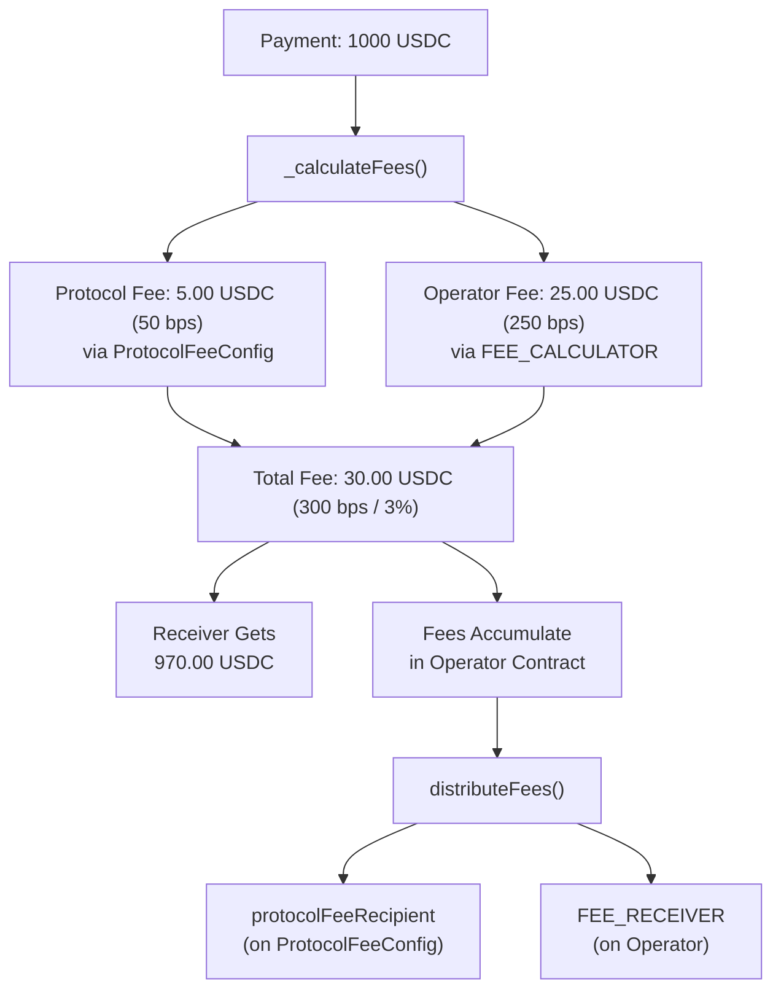

## Overview

x402r uses an **additive modular** fee system: `totalFee = protocolFee + operatorFee`. Each layer is independently configurable, and the operator splits fees between a shared protocol recipient and a per-operator fee recipient.

## Fee Architecture



### Two Fee Layers

| Layer | Configured By | Mutability | Recipient |
|-------|--------------|------------|-----------|
| **Protocol Fee** | `ProtocolFeeConfig` (shared) | Swappable calculator with 7-day timelock | `protocolFeeRecipient` on ProtocolFeeConfig |
| **Operator Fee** | `FEE_CALCULATOR` (per-operator) | Immutable: set at deploy time | `FEE_RECEIVER` on operator |

### Example Calculation

For a 1000 USDC payment with 50 bps protocol fee + 250 bps operator fee:

| Component | Rate | Amount | Goes To |
|-----------|------|--------|---------|
| Protocol Fee | 50 bps (0.5%) | 5.00 USDC | `protocolFeeRecipient` |
| Operator Fee | 250 bps (2.5%) | 25.00 USDC | `FEE_RECEIVER` |
| **Total Fee** | **300 bps (3%)** | **30.00 USDC** | |
| **Receiver Gets** | | **970.00 USDC** | Payment receiver |

## IFeeCalculator Interface

Both protocol and operator fees use the same interface:

```solidity
interface IFeeCalculator {
    /// @notice Calculate fee in basis points for a payment action
    /// @param paymentInfo The payment info struct
    /// @param amount The payment amount
    /// @param caller The address initiating the action
    /// @return feeBps The fee in basis points (e.g., 50 = 0.5%)
    function calculateFee(
        AuthCaptureEscrow.PaymentInfo calldata paymentInfo,
        uint256 amount,
        address caller
    ) external view returns (uint256 feeBps);
}
```

This enables flexible fee models, static rates, volume-based tiers, per-token pricing, or any custom logic.

## StaticFeeCalculator

The simplest implementation, returns a fixed basis points value for every payment:

```solidity
contract StaticFeeCalculator is IFeeCalculator {
    uint256 public immutable FEE_BPS;

    constructor(uint256 _feeBps) {
        if (_feeBps > 10000) revert FeeTooHigh();
        FEE_BPS = _feeBps;
    }

    function calculateFee(
        AuthCaptureEscrow.PaymentInfo calldata,
        uint256,
        address
    ) external view override returns (uint256 feeBps) {
        return FEE_BPS;
    }
}
```

Deploy via `StaticFeeCalculatorFactory` for deterministic CREATE2 addresses:

```typescript
// Deploy a 250 bps (2.5%) fee calculator
const calculatorAddress = await staticFeeCalculatorFactory.write.deploy([250]);

// Same fee rate = same address (idempotent)
const sameAddress = await staticFeeCalculatorFactory.write.deploy([250]);
```

## Fee Locking

The operator **locks fees at authorization time** so later protocol fee changes don't break already-authorized payments.

```solidity
struct AuthorizedFees {
    uint16 totalFeeBps;     // Combined protocol + operator
    uint16 protocolFeeBps;  // Stored separately for accurate distribution
}

mapping(bytes32 paymentInfoHash => AuthorizedFees) public authorizedFees;
```

**Flow:**
1. `authorize()` calculates fees and stores them in `authorizedFees[hash]`
2. `capture()` uses the stored fees, not the current calculator rates
3. Protocol fee timelocks can't break already-authorized payments

<Note>
`charge()` calculates fees inline since it authorizes and captures atomically, there's no gap where fees could change.
</Note>

## Fee Bounds Validation

Payers commit to an acceptable fee range via `minFeeBps` and `maxFeeBps` in `PaymentInfo`. The operator validates at `authorize()` and `charge()` time:

```solidity
(uint16 totalFeeBps, uint16 protocolFeeBps) = _calculateFees(paymentInfo, amount);
if (totalFeeBps < paymentInfo.minFeeBps || totalFeeBps > paymentInfo.maxFeeBps) {
    revert FeeBoundsIncompatible(totalFeeBps, paymentInfo.minFeeBps, paymentInfo.maxFeeBps);
}
```

This ensures payers always know the fee range they're agreeing to.

## Fee Distribution

Fees accumulate in the operator contract. Call `distributeFees()` to disburse them:

```solidity
// Anyone can call to distribute fees for a token
operator.distributeFees(usdcAddress);
// Protocol share → protocolFeeRecipient
// Operator share → FEE_RECEIVER
```

**How it works:**
1. Check operator's token balance
2. Protocol share = `accumulatedProtocolFees[token]` (tracked per-token)
3. Operator share = remaining balance
4. Transfer protocol share to `protocolFeeRecipient`
5. Transfer operator share to `FEE_RECEIVER`
6. Reset accumulated tracking to 0

<Tip>
`distributeFees()` is permissionless, anyone can trigger distribution. This stops fees from accumulating indefinitely in the operator.
</Tip>

## ProtocolFeeConfig

Shared protocol-level fee governance with built-in safety:

### Constants

| Parameter | Value |
|-----------|-------|
| `MAX_PROTOCOL_FEE_BPS` | 500 (5%) |
| `TIMELOCK_DELAY` | 7 days |

### Calculator Changes (7-Day Timelock)

```typescript
// Step 1: Queue new calculator
await protocolFeeConfig.queueCalculator(newCalculatorAddress);
// Emits CalculatorChangeQueued(newCalculator, executeAfter)

// Step 2: Wait 7 days

// Step 3: Execute
await protocolFeeConfig.executeCalculator();
// Emits CalculatorChangeExecuted(newCalculator)

// Or cancel:
await protocolFeeConfig.cancelCalculator();
```

### Recipient Changes (7-Day Timelock)

```typescript
// Step 1: Queue new recipient
await protocolFeeConfig.queueRecipient(newRecipientAddress);

// Step 2: Wait 7 days

// Step 3: Execute
await protocolFeeConfig.executeRecipient();
```

<Warning>
Operator fees are **immutable**: set at deploy time via `IFeeCalculator` and `FEE_RECEIVER`. Only protocol fees support updates (with 7-day timelock). Already-authorized payments use locked fee rates regardless.
</Warning>

### Disabling Protocol Fees

Set the protocol fee calculator to `address(0)` to disable protocol fees entirely. The operator will calculate 0 bps for the protocol layer.

## FEE_RECEIVER Roles

The operator's `FEE_RECEIVER` varies by use case:

| Use Case | FEE_RECEIVER | Description |
|----------|---------------|-------------|
| Marketplace | Arbiter address | Arbiter earns fees for dispute resolution |
| Subscription | Service provider | Provider earns fees for service delivery |
| DAO Grants | DAO multisig | Fees return to treasury |
| Platform | Platform treasury | Platform monetizes via fees |
| B2B Invoice | Platform address | Platform earns for facilitation |

## Fee Configuration Comparison

| Use Case | Total Fee | Protocol | Operator | Receiver on 1000 USDC |
|----------|-----------|----------|----------|----------------------|
| E-Commerce Marketplace | 300 bps (3%) | 50 bps | 250 bps | 970.00 USDC |
| Task Execution Platform | 1300 bps (13%) | 100 bps | 1200 bps | 870.00 USDC |
| Subscription / SaaS | 500 bps (5%) | 50 bps | 450 bps | 950.00 USDC |
| Managed Escrow | 800 bps (8%) | 0 bps | 800 bps | 920.00 USDC |
| B2B Invoice | 100 bps (1%) | 25 bps | 75 bps | 990.00 USDC |
| Freelance / Gig | 1000 bps (10%) | 100 bps | 900 bps | 900.00 USDC |

## Next Steps

<CardGroup cols={2}>
  <Card title="PaymentOperator" icon="file-contract" href="/contracts/payment-operator">
    See how fees integrate with PaymentOperator.
  </Card>
  <Card title="Factories" icon="industry" href="/contracts/factories">
    Deploy operators with fee configuration.
  </Card>
  <Card title="Examples" icon="code" href="/contracts/examples">
    Complete fee configurations for common use cases.
  </Card>
  <Card title="Architecture" icon="diagram-project" href="/contracts/architecture">
    Understand the full payment flow.
  </Card>
</CardGroup>
