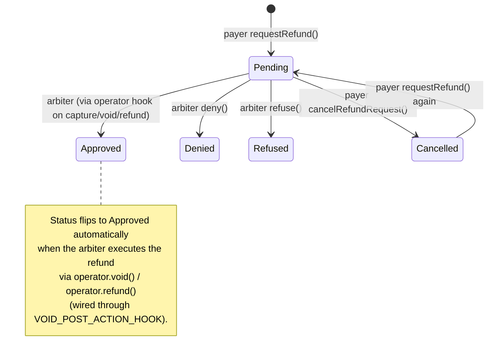

## Overview

- **Type:** Singleton (one per network)
- **Deployment:** Direct deployment (no factory)
- **Purpose:** Track refund request lifecycle

## Request Types

<Tabs>
  <Tab title="Void (before capture)">
    **Who can request:** Payer, Receiver, OR Arbiter

    **Typical flow:**
    1. Payer suspects fraud, requests a refund
    2. Arbiter investigates
    3. Arbiter approves or denies the request
    4. If approved, arbiter calls `operator.void()`

    **Use cases:**
    - Buyer remorse
    - Seller fraud
    - Payment error
  </Tab>

  <Tab title="Refund (after capture)">
    **Who can request:** Receiver only

    **Typical flow:**
    1. Receiver realizes product defect after capture
    2. Receiver requests a refund
    3. Arbiter investigates
    4. If approved, arbiter calls `operator.refund()`

    **Use cases:**
    - Product defects discovered later
    - Service not as described
    - Voluntary refund by merchant
  </Tab>
</Tabs>

## Request status states

Each payment supports one refund request, keyed by `paymentInfoHash`. The payer may only request again after cancelling the prior request.



## Key methods

### requestRefund()

Creates a refund request for this payment. Only the payer can call.

```solidity
function requestRefund(
    AuthCaptureEscrow.PaymentInfo calldata paymentInfo,
    uint120 amount
) external
```

**Parameters:**
- `paymentInfo`: PaymentInfo struct
- `amount`: refund amount the payer is asking for (uint120)

**Reverts** if a non-cancelled request already exists, if the payment is unknown to the canonical escrow, or if `amount == 0`.

### cancelRefundRequest()

Payer cancels their own pending request, freeing the slot to request again.

```solidity
function cancelRefundRequest(AuthCaptureEscrow.PaymentInfo calldata paymentInfo) external
```

**Access:** only the payer.

### deny()

Arbiter rejects the claim after reviewing evidence. Terminal state.

```solidity
function deny(AuthCaptureEscrow.PaymentInfo calldata paymentInfo) external
```

### refuse()

Arbiter refuses to consider the request (spam, out of jurisdiction, invalid). Terminal state.

```solidity
function refuse(AuthCaptureEscrow.PaymentInfo calldata paymentInfo) external
```

### Approval

The contract has no `updateStatus` or explicit `approve` entrypoint. Approval happens automatically when the arbiter executes the refund through the operator (`operator.void()` or `operator.refund()`), which fires `VOID_POST_ACTION_HOOK` / `REFUND_POST_ACTION_HOOK` and flips status to `Approved`.

### Query helpers

- `getRefundRequest(paymentInfo)`: full `RefundRequestData` for this payment
- `hasRefundRequest(paymentInfo)`: boolean
- `getRefundRequestStatus(paymentInfo)`: just the `RequestStatus`
- `getPayerRefundRequests(payer, offset, count)` / `getReceiverRefundRequests(...)` / `getOperatorRefundRequests(...)`: paginated index lookups

## Usage example

```typescript
// 1. Payer files refund request
await refundRequest.write.requestRefund([paymentInfo, requestedAmount])
// Status: Pending

// 2a. Arbiter denies (terminal):
await refundRequest.write.deny([paymentInfo])

// 2b. Arbiter approves by executing the refund via the operator.
//     The post-action hook auto-flips the request to Approved.
//     Before capture:
await operator.write.void([paymentInfo, '0x'])
//     After capture:
await operator.write.refund([paymentInfo, amount, tokenCollector, collectorData])
```

<Note>
RefundRequest is the request-tracking layer. Executing the refund is always a separate call into the operator/escrow.
</Note>
