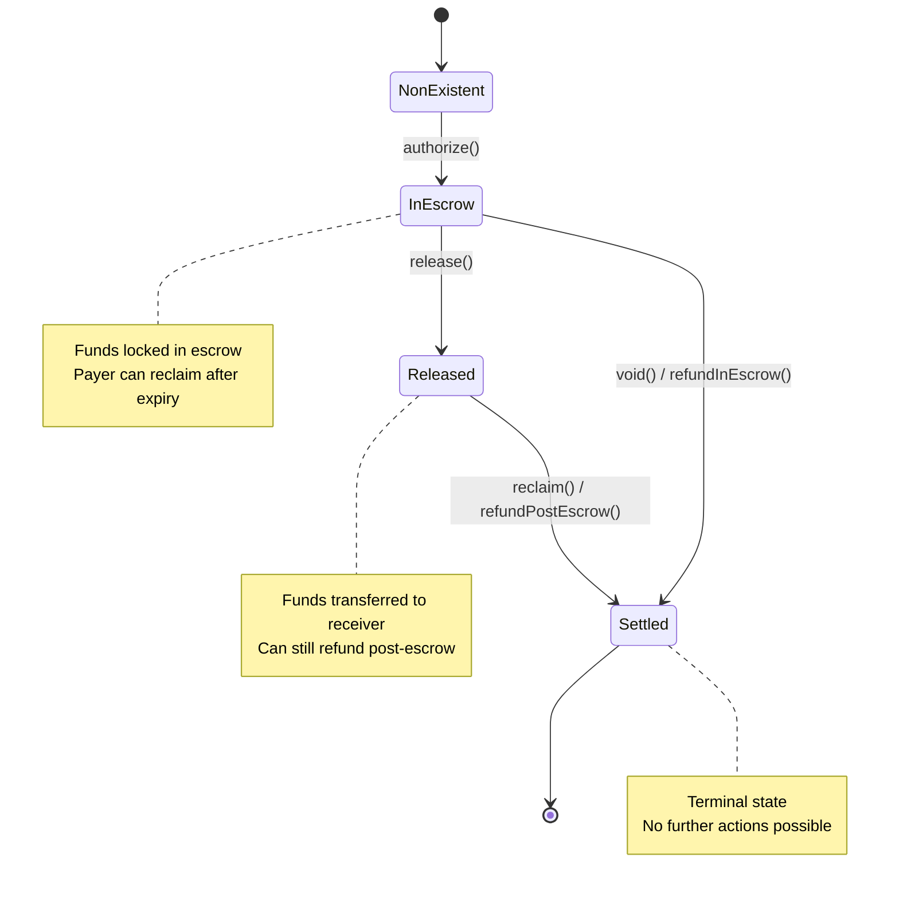

x402r builds on the canonical [Commerce Payments Protocol](https://github.com/base/commerce-payments) (no fork). Two contracts from this stack form the base layer: **AuthCaptureEscrow** (holds funds) and **ERC3009PaymentCollector** (collects funds via signed authorizations). Both are deployed at universal CREATE2 addresses.

## AuthCaptureEscrow

Core escrow contract for holding ERC-20 tokens during the payment lifecycle.

- **Type:** Singleton (one per network)
- **Access:** Operator-based (only registered operators can manage payments)
- **Address:** `0xe050bB89eD43BB02d71343063824614A7fb80B77` (all chains)

### Payment State Machine



### Key Methods

#### authorize()

Locks tokens in escrow. Called by operator.

```solidity
function authorize(
    bytes32 paymentId,
    address payer,
    address receiver,
    uint256 amount,
    address token,
    address operator
) external onlyOperator
```

**Requires:** Payer has approved escrow contract for `amount` of `token`

<Note>
The base escrow contract uses individual parameters (paymentId, payer, receiver, etc.) while the PaymentOperator wraps them in a `PaymentInfo` struct. The operator translates between the two formats internally.
</Note>

#### release()

Releases tokens to receiver. Called by operator.

```solidity
function release(
    bytes32 paymentId
) external onlyOperator returns (uint256 amount)
```

**State change:** `InEscrow` -> `Released`

#### void()

Returns tokens to payer (full refund). Called by operator.

```solidity
function void(
    bytes32 paymentId
) external onlyOperator
```

**State change:** `InEscrow` -> `Settled`

#### reclaim()

Takes tokens back from receiver to give to payer. Called by operator.

```solidity
function reclaim(
    bytes32 paymentId,
    address from,
    uint256 amount
) external onlyOperator
```

**State change:** `Released` -> `Settled`

**Requires:** Receiver has approved escrow for `amount`

### Security Features

- **Operator whitelist** - Only registered operators can manage payments
- **Reentrancy protection** - All state changes protected
- **Event logging** - Complete audit trail

---

## ERC3009PaymentCollector

Collects ERC-20 tokens into escrow using the client's off-chain ERC-3009 signature. The payer never submits a transaction.

- **Type:** Singleton (one per network)
- **Address:** `0xcE66Ab399EDA513BD12760b6427C87D6602344a7` (all chains)

### How It Works

The operator calls the token collector during `authorize()` or `charge()`, passing the client's signature as `collectorData`. The collector executes `receiveWithAuthorization` (ERC-3009) to pull tokens from the payer into escrow.

### Features

- **ERC-3009 `receiveWithAuthorization()`** - Gasless token transfers via signed messages
- **EIP-6492 support** - Handles smart wallet clients with deployment bytecode in signatures
- **Nonce-based replay protection** - Each authorization can only be used once
- **Deadline-based expiry** - `validBefore` timestamp prevents stale authorizations

### ERC-3009 Signature

The client signs an EIP-712 typed data message with primary type `ReceiveWithAuthorization`:

```typescript
const authorization = {
  from: payerAddress,         // Who is paying
  to: tokenCollectorAddress,  // ERC3009PaymentCollector
  value: amount,              // Amount in token decimals
  validAfter: 0,              // Earliest valid time (0 = immediately)
  validBefore: deadline,      // Latest valid time
  nonce: derivedNonce         // Deterministic nonce from payment params
};
```

<Note>
The escrow scheme uses `receiveWithAuthorization` (not `transferWithAuthorization`). The token collector is the `to` address, which then routes tokens to the escrow contract.
</Note>
