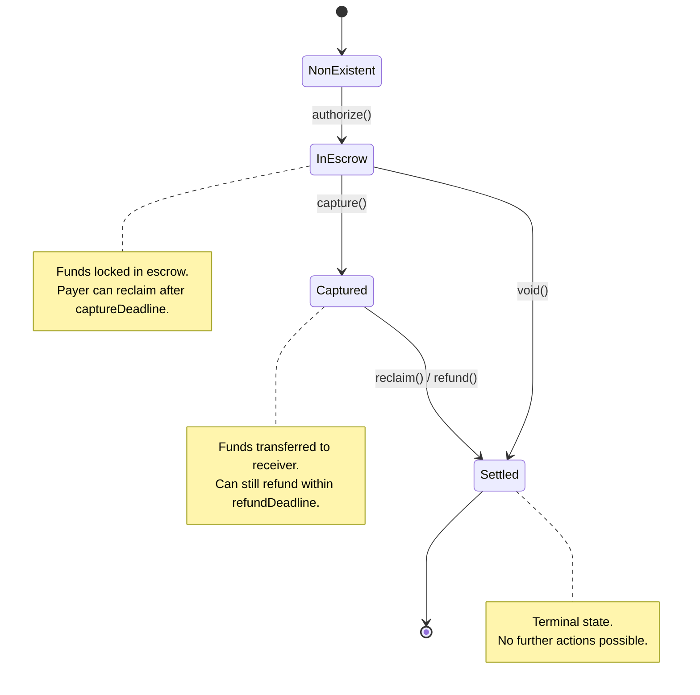

x402r builds on the canonical [Commerce Payments Protocol](https://github.com/base/commerce-payments) (no fork). Three contracts from this stack form the base layer:

- **AuthCaptureEscrow**: singleton escrow that holds funds and gates lifecycle actions on the `captureAuthorizer` (committed on-chain as `PaymentInfo.operator`).
- **ERC3009PaymentCollector**: collects funds via signed ERC-3009 `receiveWithAuthorization`.
- **Permit2PaymentCollector**: collects funds via Uniswap Permit2 `permitTransferFrom`.

All three sit at universal CREATE2 addresses (same address on every supported chain).

| Contract | Canonical address |
|---|---|
| `AuthCaptureEscrow` | `0xBdEA0D1bcC5966192B070Fdf62aB4EF5b4420cff` |
| `ERC3009PaymentCollector` | `0x0E3dF9510de65469C4518D7843919c0b8C7A7757` |
| `Permit2PaymentCollector` | `0x992476B9Ee81d52a5BdA0622C333938D0Af0aB26` |

## AuthCaptureEscrow

Core escrow contract for holding ERC-20 tokens during the payment lifecycle.

### Payment State Machine



### Key methods

#### authorize()

Pulls funds into escrow via the token collector. Only the `captureAuthorizer` (typically a facilitator EOA, or a smart contract acting as captureAuthorizer) can call it.

```solidity
function authorize(
    PaymentInfo calldata paymentInfo,
    uint256 amount,
    address tokenCollector,
    bytes calldata collectorData
) external
```

`tokenCollector` is `ERC3009PaymentCollector` or `Permit2PaymentCollector` depending on `assetTransferMethod` in the scheme `extra`. `collectorData` carries the raw ERC-3009 signature or the ABI-encoded Permit2 signature.

#### charge()

Single-shot atomic settlement: pulls funds and transfers directly to the receiver, no escrow hold.

```solidity
function charge(
    PaymentInfo calldata paymentInfo,
    uint256 amount,
    address tokenCollector,
    bytes calldata collectorData
) external
```

#### capture()

Releases escrowed funds to the receiver, minus fees.

```solidity
function capture(
    PaymentInfo calldata paymentInfo,
    uint256 amount,
    uint16 feeBps,
    address feeReceiver
) external
```

#### void()

Returns all escrowed funds to the payer. Full-only: `void()` empties the authorization in one transaction.

```solidity
function void(PaymentInfo calldata paymentInfo) external
```

#### reclaim()

Payer-only: gated by `onlySender(paymentInfo.payer)`. The payer can pull funds back out of escrow after `captureDeadline` if the captureAuthorizer never captured. No third party (including the operator or arbiter) can call `reclaim` on the payer's behalf.

```solidity
function reclaim(PaymentInfo calldata paymentInfo) external
```

#### refund()

Returns funds to the payer after capture, sourced via a token collector (typically pulled from the merchant's balance).

```solidity
function refund(
    PaymentInfo calldata paymentInfo,
    uint256 amount,
    address tokenCollector,
    bytes calldata collectorData
) external
```

### Access control

Lifecycle actions (`authorize`, `charge`, `capture`, `void`, `refund`) check `msg.sender` against `PaymentInfo.operator` (the captureAuthorizer). Anyone can call `reclaim` after `captureDeadline`.

The escrow has no global "operator whitelist." Access is per-payment, governed by the signed `PaymentInfo`.

### Security features

- **Replay prevention**: each payment has a unique nonce derived from `(chainId, escrowAddress, paymentInfoHash)`, consumed on-chain at settlement
- **Fee bounds enforcement**: the client signs `minFeeBps` / `maxFeeBps` / `feeReceiver` in `PaymentInfo`; the escrow rejects out-of-bounds captures/charges
- **Expiry ordering**: contract enforces `preApprovalExpiry <= authorizationExpiry <= refundExpiry`
- **Reentrancy protection** on all state-changing entry points

---

## ERC3009PaymentCollector

Collects ERC-20 tokens into escrow using the client's off-chain ERC-3009 signature. The payer never submits a transaction.

### How it works

The escrow calls the token collector during `authorize()` or `charge()`, passing the client's signature as `collectorData`. The collector executes `receiveWithAuthorization` (ERC-3009) to pull tokens from the payer.

### Features

- **ERC-3009 `receiveWithAuthorization()`**: gasless token transfers via signed messages
- **EIP-6492 support**: handles smart wallet clients with deployment bytecode in signatures (via `ERC6492SignatureHandler`)
- **Nonce-based replay protection**: each authorization can run only once; the nonce is the payer-agnostic `PaymentInfo` hash
- **Deadline-based expiry**: `validBefore` (typically `now + maxTimeoutSeconds`) blocks stale authorizations

### ERC-3009 signature

The client signs an EIP-712 typed data message with primary type `ReceiveWithAuthorization`:

```typescript
const authorization = {
  from: payerAddress,         // Who is paying
  to: tokenCollectorAddress,  // ERC3009PaymentCollector (canonical)
  value: amount,              // Amount in token decimals
  validAfter: 0,              // Earliest valid time (0 = immediately)
  validBefore: deadline,      // Latest valid time
  nonce: derivedNonce,        // Payer-agnostic PaymentInfo hash
}
```

<Note>
The auth-capture scheme uses `receiveWithAuthorization` (not `transferWithAuthorization`). The token collector is the `to` address, which then routes tokens into the escrow.
</Note>

---

## Permit2PaymentCollector

Collects ERC-20 tokens through Uniswap Permit2 `permitTransferFrom`. The operator selects this collector when `assetTransferMethod === "permit2"` in the scheme `extra`. Any ERC-20 the payer has approved Permit2 for becomes spendable through this collector.

The client signs a Permit2 `PermitTransferFrom`; the deterministic nonce binds the merchant address, removing the need for a separate witness struct.

See the [auth-capture Scheme Specification](/x402-integration/auth-capture-scheme) for the full Permit2 wire format.
