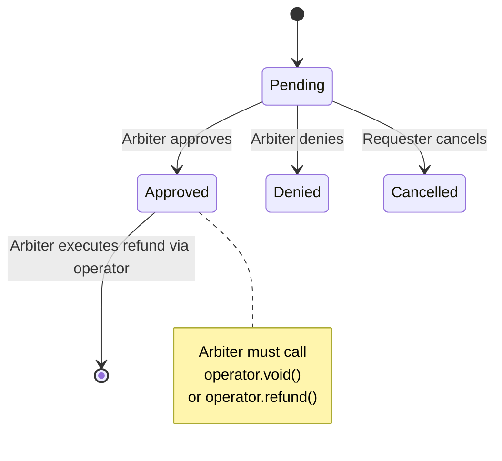

## Overview

- **Type:** Singleton (one per network)
- **Deployment:** Direct deployment (no factory)
- **Purpose:** Track refund request lifecycle

## Request Types

<Tabs>
  <Tab title="Void (before capture)">
    **Who can request:** Payer, Receiver, OR Arbiter

    **Typical flow:**
    1. Payer suspects fraud, requests a refund
    2. Arbiter investigates
    3. Arbiter approves or denies the request
    4. If approved, arbiter calls `operator.void()`

    **Use cases:**
    - Buyer remorse
    - Seller fraud
    - Payment error
  </Tab>

  <Tab title="Refund (after capture)">
    **Who can request:** Receiver only

    **Typical flow:**
    1. Receiver realizes product defect after capture
    2. Receiver requests a refund
    3. Arbiter investigates
    4. If approved, arbiter calls `operator.refund()`

    **Use cases:**
    - Product defects discovered later
    - Service not as described
    - Voluntary refund by merchant
  </Tab>
</Tabs>

## Request Status States



## Key Methods

### requestRefund()

Creates a new refund request.

```solidity
function requestRefund(
    AuthCaptureEscrow.PaymentInfo calldata paymentInfo,
    uint120 amount,
    uint256 nonce
) external
```

**Parameters:**
- `paymentInfo` - Payment info struct
- `amount` - Amount being requested for refund
- `nonce` - Record index (from PaymentIndexRecorder) identifying which charge/action

**Access Control:** Only the payer who made the authorization can request

<Note>
Each refund request is keyed by `(paymentInfoHash, nonce)` where nonce is the record index. This allows multiple refund requests per payment (one per charge/action).
</Note>

### updateStatus()

Approve or deny a refund request.

```solidity
function updateStatus(
    AuthCaptureEscrow.PaymentInfo calldata paymentInfo,
    uint256 nonce,
    RequestStatus newStatus
) external
```

**Parameters:**
- `paymentInfo` - Payment info struct
- `nonce` - Record index identifying which refund request
- `newStatus` - The new status (`Approved` or `Denied`)

**Access:** Receiver can always approve/deny. While in escrow, anyone passing the operator's `VOID_PRE_ACTION_CONDITION` can also approve/deny.

**Valid transitions:**
- `Pending` -> `Approved`
- `Pending` -> `Denied`

### cancelRefundRequest()

Payer cancels their own request.

```solidity
function cancelRefundRequest(
    AuthCaptureEscrow.PaymentInfo calldata paymentInfo,
    uint256 nonce
) external
```

**Parameters:**
- `paymentInfo` - Payment info struct
- `nonce` - Record index identifying which refund request

**Access:** Only the payer who created the request

**Valid transition:**
- `Pending` -> `Cancelled`

## Usage Example

```typescript
// 1. Payer requests refund (nonce 0 = first action on this payment)
await refundRequest.requestRefund(paymentInfo, requestedAmount, 0);
// Status: Pending

// 2. Receiver (or arbiter) reviews and approves
await refundRequest.updateStatus(
  paymentInfo,
  0,  // nonce
  RequestStatus.Approved
);
// Status: Approved

// 3. Execute refund via operator (separate transaction)
// For pre-capture: operator.void() empties the auth (full only).
// For post-capture: operator.refund(paymentInfo, amount, tokenCollector, collectorData).
await operator.void(paymentInfo);
// Funds returned to payer
```

<Note>
RefundRequest is **advisory only**. Approval does not automatically execute refunds - the authorized party must call the operator's refund function.
</Note>
