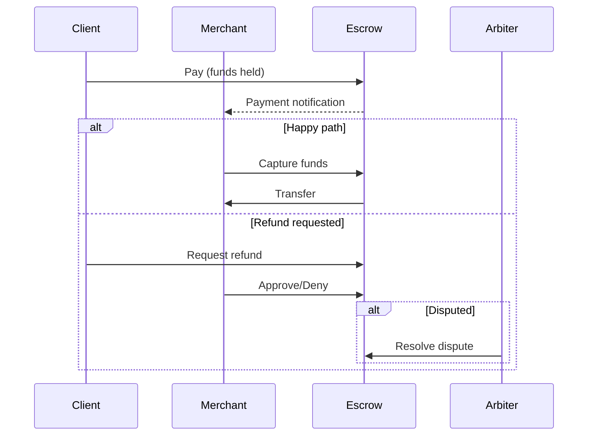

**x402r** is a refundable payments protocol extension for [x402](https://www.x402.org/). It enables secure, reversible transactions with built-in buyer protection through smart contract escrow on Base.

## Why x402r?

Standard x402 payments are immediate and irreversible. x402r adds:

- **Escrow deposits**: Funds held in smart contracts until conditions are met
- **Refund windows**: Configurable time periods for buyers to request refunds
- **Dispute resolution**: Arbiter system for handling contested transactions

## How It Works

## Who Is This For?

<CardGroup cols={3}>
  <Card title="Clients (Payers)" icon="user" href="/sdk/client/quickstart">
    Request refunds, freeze suspicious payments, and track payment state.
  </Card>
  <Card title="Merchants (Receivers)" icon="store" href="/sdk/examples">
    Capture funds, process refunds, and manage escrow periods.
  </Card>
  <Card title="Arbiters" icon="gavel" href="/sdk/arbiter/quickstart">
    Resolve disputes and approve/deny refund requests.
  </Card>
</CardGroup>

## Get Started

<CardGroup cols={2}>
  <Card title="Protocol Overview" icon="diagram-project" href="/x402-integration/overview">
    Understand how x402r extends the x402 protocol.
  </Card>
  <Card title="Smart Contracts" icon="file-contract" href="/contracts/overview">
    Explore the escrow and payment operator contracts.
  </Card>
  <Card title="SDK Quickstart" icon="code" href="/sdk/overview">
    Start building with the TypeScript SDK.
  </Card>
  <Card title="Deploy an Operator" icon="rocket" href="/sdk/deploy-operator">
    Deploy your own PaymentOperator on Base.
  </Card>
</CardGroup>

## Architecture

x402r consists of these core components:

| Component | Purpose |
|-----------|---------|
| **PaymentOperator** | Manages payment authorization, capture, charge, void, and refunds with pluggable conditions |
| **AuthCaptureEscrow** | Holds ERC-20 tokens during the payment lifecycle (from commerce-payments) |
| **Conditions & Hooks** | Pluggable authorization checks (before action) and state updates (after action) |
| **EscrowPeriod & Freeze** | Time-based capture and freeze policies for buyer protection |
| **RefundRequest** | Handles refund request lifecycle and approvals |

All protocol contracts use universal CREATE2 addresses, same address on every supported chain.

## Supported Networks

Today, the supported chains in `@x402r/core` are **Base** and **Base Sepolia**. Additional EVMs will be added as canonical `base/commerce-payments@v1.0.0` coverage extends.

| Network | Chain ID | Status |
|---|---|---|
| Base | 8453 | Supported |
| Base Sepolia | 84532 | Testnet |

## Resources

<CardGroup cols={3}>
  <Card title="GitHub" icon="github" href="https://github.com/BackTrackCo">
    Source code and examples.
  </Card>
  <Card title="SDK Reference" icon="book" href="/sdk/overview">
    SDK documentation and API reference.
  </Card>
  <Card title="Support" icon="envelope" href="mailto:hi@x402r.org">
    Get help with integration.
  </Card>
</CardGroup>
