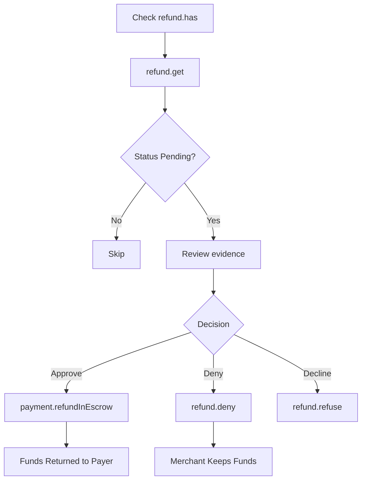

The arbiter client provides methods for reviewing refund requests, making decisions, and executing refunds through the `refund`, `payment`, and `evidence` action groups.

## Approve a refund (refundInEscrow)

To approve and execute a refund in one step, call `payment.refundInEscrow()`. This auto-approves the pending RefundRequest and transfers funds back to the payer.

```typescript
const amounts = await arbiter.payment.getAmounts(paymentInfo)
const tx = await arbiter.payment.refundInEscrow(paymentInfo, amounts.refundableAmount)
console.log('Refund approved and executed:', tx)
```

<Warning>
`payment.refundInEscrow()` auto-approves the pending RefundRequest. There is no undo.
</Warning>

## Deny a refund request

Deny a pending refund request:

```typescript
const tx = await arbiter.refund?.deny(paymentInfo)
console.log('Refund denied:', tx)
```

## Refuse to rule

Decline to rule on a dispute (e.g., conflict of interest):

```typescript
const tx = await arbiter.refund?.refuse(paymentInfo)
console.log('Declined to rule:', tx)
```

## Check if a refund request exists

```typescript
const hasRequest = await arbiter.refund?.has(paymentInfo)

if (!hasRequest) {
  console.log('No refund request found for this payment')
  return
}
```

## Get refund request data

Retrieve the full refund request data, including amount and status:

```typescript
import { RefundRequestStatus } from '@x402r/sdk'

const request = await arbiter.refund?.get(paymentInfo)

console.log('Payment hash:', request?.paymentInfoHash)
console.log('Refund amount:', request?.amount)
console.log('Approved amount:', request?.approvedAmount)
console.log('Status:', request?.status)
```

The `RefundRequestData` type contains:

```typescript
interface RefundRequestData {
  paymentInfoHash: `0x${string}`
  amount: bigint
  approvedAmount: bigint
  status: RefundRequestStatus
}
```

## Get refund request status

```typescript
import { RefundRequestStatus } from '@x402r/sdk'

const status = await arbiter.refund?.getStatus(paymentInfo)

switch (status) {
  case RefundRequestStatus.Pending:
    console.log('Awaiting decision')
    break
  case RefundRequestStatus.Approved:
    console.log('Already approved')
    break
  case RefundRequestStatus.Denied:
    console.log('Already denied')
    break
  case RefundRequestStatus.Cancelled:
    console.log('Cancelled by payer')
    break
  case RefundRequestStatus.Refused:
    console.log('Arbiter declined to rule')
    break
}
```

## List refund requests (paginated)

Retrieve paginated refund requests for an operator:

```typescript
const requests = await arbiter.refund?.getOperatorRequests(
  arbiter.config.operatorAddress,
  0n,   // offset
  50n,  // count
)

for (const request of requests ?? []) {
  console.log('Amount:', request.amount, 'Status:', request.status)
}
```

You can also query by payer or receiver:

```typescript
const payerRequests = await arbiter.refund?.getPayerRequests(payerAddress, 0n, 10n)
const receiverRequests = await arbiter.refund?.getReceiverRequests(receiverAddress, 0n, 10n)
```

## Check if a payment is frozen

```typescript
const frozen = await arbiter.freeze?.isFrozen(paymentInfo)

if (frozen) {
  console.log('Payment is frozen, dispute in progress')
}
```

## Complete decision workflow

This example shows the full arbiter workflow: fetching pending cases, reviewing evidence, making a decision, and executing the refund.

```typescript
import { createArbiterClient, RefundRequestStatus } from '@x402r/sdk'
import type { PaymentInfo } from '@x402r/sdk'

async function processCase(
  arbiter: ReturnType<typeof createArbiterClient>,
  paymentInfo: PaymentInfo,
) {
  // Step 1: Check if a refund request exists
  const hasRequest = await arbiter.refund?.has(paymentInfo)
  if (!hasRequest) return

  // Step 2: Get the request data
  const request = await arbiter.refund?.get(paymentInfo)
  if (request?.status !== RefundRequestStatus.Pending) return

  // Step 3: Review evidence
  const evidenceCount = await arbiter.evidence?.count(paymentInfo)
  if (evidenceCount && evidenceCount > 0n) {
    const batch = await arbiter.evidence?.getBatch(paymentInfo, 0n, evidenceCount)
    for (const entry of batch?.entries ?? []) {
      console.log('Evidence CID:', entry.cid, 'from:', entry.submitter)
    }
  }

  // Step 4: Make a decision
  const shouldApprove = await evaluateCase(request)

  if (shouldApprove) {
    const tx = await arbiter.payment.refundInEscrow(paymentInfo, request!.amount)
    console.log('Refund executed:', tx)
  } else {
    const tx = await arbiter.refund?.deny(paymentInfo)
    console.log('Denied:', tx)
  }
}
```

## Decision flow diagram



## Next steps

<CardGroup cols={2}>
  <Card title="Batch Operations" icon="layer-group" href="/sdk/arbiter/batch-operations">
    Process multiple cases at once.
  </Card>
  <Card title="AI Integration" icon="robot" href="/sdk/arbiter/ai-integration">
    Automate decisions with AI evaluation hooks.
  </Card>
  <Card title="Registry" icon="clipboard-list" href="/sdk/arbiter/registry">
    Register as an arbiter for on-chain discovery.
  </Card>
  <Card title="RefundRequest" icon="file-contract" href="/contracts/periphery/refund-request">
    RefundRequest contract and state machine details.
  </Card>
</CardGroup>
