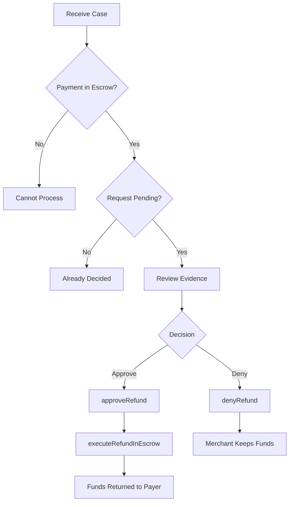

The Arbiter SDK provides methods for making and executing decisions on disputed refund requests.

## Approve a Refund

Approve a refund request:

```typescript
const { txHash } = await arbiter.approveRefund(paymentInfo);
console.log('Refund approved:', txHash);
```

<Note>
Approving updates the request status but doesn't transfer funds. Use `executeRefundInEscrow()` to actually refund.
</Note>

## Deny a Refund

Deny a refund request:

```typescript
const { txHash } = await arbiter.denyRefund(paymentInfo);
console.log('Refund denied:', txHash);
```

## Execute Refund in Escrow

After approving, execute the actual fund transfer:

```typescript
// Full refund
const { txHash } = await arbiter.executeRefundInEscrow(paymentInfo);
console.log('Full refund executed:', txHash);

// Partial refund
const partialAmount = BigInt('500000'); // 0.5 USDC
const { txHash } = await arbiter.executeRefundInEscrow(paymentInfo, partialAmount);
console.log('Partial refund executed:', txHash);
```

## Check Payment State

Verify the payment state before making decisions:

```typescript
import { PaymentState } from '@x402r/core';

const state = await arbiter.getPaymentState(paymentInfo);

if (state !== PaymentState.InEscrow) {
  console.log('Payment not in escrow, cannot process refund');
  return;
}
```

## Check Refund Request Status

Query the current status of a refund request:

```typescript
import { RequestStatus } from '@x402r/core';

const status = await arbiter.getRefundStatus(paymentInfo);

switch (status) {
  case RequestStatus.Pending:
    console.log('Awaiting decision');
    break;
  case RequestStatus.Approved:
    console.log('Already approved');
    break;
  case RequestStatus.Denied:
    console.log('Already denied');
    break;
}
```

## Check If Request Exists

Verify a refund request exists before processing:

```typescript
const hasRequest = await arbiter.hasRefundRequest(paymentInfo);

if (!hasRequest) {
  console.log('No refund request found');
  return;
}
```

## Complete Decision Flow

```typescript
import { X402rArbiter } from '@x402r/arbiter';
import { PaymentState, RequestStatus } from '@x402r/core';

async function processCase(
  arbiter: X402rArbiter,
  paymentInfo: PaymentInfo,
  approve: boolean
) {
  // Verify payment is in escrow
  const state = await arbiter.getPaymentState(paymentInfo);
  if (state !== PaymentState.InEscrow) {
    throw new Error('Payment not in escrow');
  }

  // Verify request is pending
  const status = await arbiter.getRefundStatus(paymentInfo);
  if (status !== RequestStatus.Pending) {
    throw new Error('Request not pending');
  }

  if (approve) {
    // Approve and execute
    const { txHash: approveTx } = await arbiter.approveRefund(paymentInfo);
    console.log('Approved:', approveTx);

    const { txHash: executeTx } = await arbiter.executeRefundInEscrow(paymentInfo);
    console.log('Executed:', executeTx);

    return { decision: 'approved', approveTx, executeTx };
  } else {
    // Deny
    const { txHash } = await arbiter.denyRefund(paymentInfo);
    console.log('Denied:', txHash);

    return { decision: 'denied', denyTx: txHash };
  }
}
```

## Decision Flow Diagram



## Error Handling

```typescript
async function safeProcessCase(
  arbiter: X402rArbiter,
  paymentInfo: PaymentInfo
) {
  try {
    // Check prerequisites
    const state = await arbiter.getPaymentState(paymentInfo);
    if (state !== PaymentState.InEscrow) {
      return { error: 'Payment not in escrow' };
    }

    const hasRequest = await arbiter.hasRefundRequest(paymentInfo);
    if (!hasRequest) {
      return { error: 'No refund request' };
    }

    const status = await arbiter.getRefundStatus(paymentInfo);
    if (status !== RequestStatus.Pending) {
      return { error: `Request already ${RequestStatus[status]}` };
    }

    // Make decision
    const { txHash } = await arbiter.approveRefund(paymentInfo);
    return { success: true, txHash };

  } catch (error) {
    console.error('Failed to process case:', error);
    return { error: error.message };
  }
}
```

## Next Steps

<CardGroup cols={2}>
  <Card title="Batch Operations" icon="layer-group" href="/sdk/arbiter/batch-operations">
    Process multiple cases at once.
  </Card>
  <Card title="AI Integration" icon="robot" href="/sdk/arbiter/ai-integration">
    Automate decisions with AI.
  </Card>
</CardGroup>
