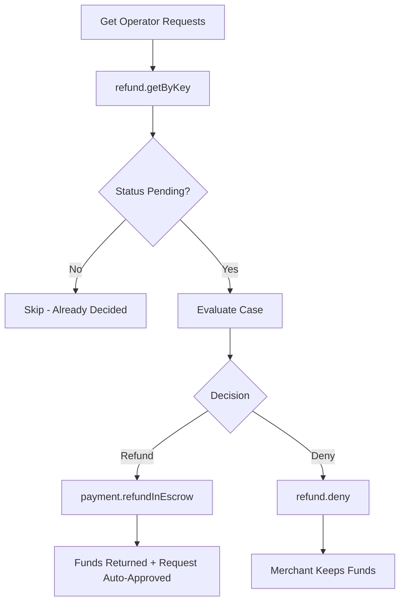

The arbiter client provides methods for reviewing refund requests, making decisions, and executing refunds for disputed payments. In v3, there is no separate approve step — calling `payment.refundInEscrow()` both executes the refund and auto-approves the pending request.

## Execute refund in escrow

Execute a refund to transfer funds back to the payer. This also auto-approves any pending refund request via the IRecorder plugin.

```typescript
// Full refund
const txHash = await arbiter.payment.refundInEscrow(
  paymentInfo,
  paymentInfo.maxAmount
);
console.log('Full refund executed:', txHash);

// Partial refund
const partialAmount = BigInt('500000'); // 0.5 USDC
const partialTx = await arbiter.payment.refundInEscrow(paymentInfo, partialAmount);
console.log('Partial refund executed:', partialTx);
```

## Deny a refund request

Deny a pending refund request:

```typescript
const txHash = await arbiter.refund.deny(paymentInfo);
console.log('Refund denied:', txHash);
```

## Refuse a refund request

Refuse a pending refund request (similar to deny, but signals a different intent):

```typescript
const txHash = await arbiter.refund.refuse(paymentInfo);
console.log('Refund refused:', txHash);
```

## Check if a refund request exists

Verify whether a refund request has been submitted for a given payment:

```typescript
const hasRequest = await arbiter.refund.has(paymentInfo);

if (!hasRequest) {
  console.log('No refund request found for this payment');
  return;
}
```

## Get refund request data

Retrieve the full refund request data, including amount and status:

```typescript
import { RequestStatus } from '@x402r/core';

const request = await arbiter.refund.get(paymentInfo);

console.log('Payment hash:', request.paymentInfoHash);
console.log('Refund amount:', request.amount);
console.log('Status:', RequestStatus[request.status]);
```

## Get refund request status

Query the current status of a specific refund request:

```typescript
import { RequestStatus } from '@x402r/core';

const status = await arbiter.refund.getStatus(paymentInfo);

switch (status) {
  case RequestStatus.Pending:
    console.log('Awaiting decision');
    break;
  case RequestStatus.Approved:
    console.log('Already approved (via refundInEscrow)');
    break;
  case RequestStatus.Denied:
    console.log('Already denied');
    break;
  case RequestStatus.Cancelled:
    console.log('Cancelled by payer');
    break;
}
```

## Get refund requests by operator (paginated)

Retrieve a paginated list of refund request keys for an operator:

```typescript
const { keys, total } = await arbiter.refund.getOperatorRequests(
  operatorAddress,
  0n,    // offset
  10n    // count
);

console.log(`${total} total cases, showing first ${keys.length}`);

for (const key of keys) {
  const request = await arbiter.refund.getByKey(key);
  console.log(`Amount: ${request.amount}, Status: ${RequestStatus[request.status]}`);
}
```

## Get refund request by key

Look up a specific refund request using its `paymentInfoHash`:

```typescript
const request = await arbiter.refund.getByKey(paymentInfoHash);

console.log('Payment hash:', request.paymentInfoHash);
console.log('Amount:', request.amount);
console.log('Status:', RequestStatus[request.status]);
```

## Check if a payment is frozen

```typescript
const frozen = await arbiter.freeze.isFrozen(paymentInfo);

if (frozen) {
  console.log('Payment is frozen - dispute in progress');
} else {
  console.log('Payment is not frozen');
}
```

## Complete decision workflow

This example shows the full arbiter workflow: fetching pending cases, reviewing them, making a decision, and executing the refund.

```typescript
import { createArbiterClient } from '@x402r/sdk';
import { RequestStatus } from '@x402r/core';
import type { PaymentInfo } from '@x402r/core';

async function processAllPendingCases(
  arbiter: ReturnType<typeof createArbiterClient>,
  operatorAddress: `0x${string}`
) {
  // Step 1: Get all refund requests for this operator
  const { keys, total } = await arbiter.refund.getOperatorRequests(
    operatorAddress, 0n, 50n
  );
  console.log(`Found ${total} cases`);

  for (const key of keys) {
    // Step 2: Retrieve request details
    const request = await arbiter.refund.getByKey(key);

    // Step 3: Skip if already decided
    if (request.status !== RequestStatus.Pending) {
      console.log(`Skipping ${request.paymentInfoHash} - already ${RequestStatus[request.status]}`);
      continue;
    }

    // Step 4: Retrieve the stored PaymentInfo
    const paymentInfo = await arbiter.refund.getStoredPaymentInfo(request.paymentInfoHash);

    // Step 5: Apply your decision logic
    const shouldRefund = await evaluateCase(request);

    if (shouldRefund) {
      // Execute refund (auto-approves the request)
      const txHash = await arbiter.payment.refundInEscrow(paymentInfo, request.amount);
      console.log(`Refund executed: ${txHash}`);
    } else {
      // Deny the refund
      const txHash = await arbiter.refund.deny(paymentInfo);
      console.log(`Denied: ${txHash}`);
    }
  }
}
```

## Decision flow diagram



## Next steps

<CardGroup cols={2}>
  <Card title="Batch Operations" icon="layer-group" href="/sdk/arbiter/batch-operations">
    Process multiple cases at once.
  </Card>
  <Card title="AI Integration" icon="robot" href="/sdk/arbiter/ai-integration">
    Automate decisions with AI evaluation hooks.
  </Card>
  <Card title="Registry" icon="clipboard-list" href="/sdk/arbiter/registry">
    Register as an arbiter for on-chain discovery.
  </Card>
  <Card title="RefundRequest" icon="file-contract" href="/contracts/periphery/refund-request">
    RefundRequest contract and state machine details.
  </Card>
</CardGroup>
