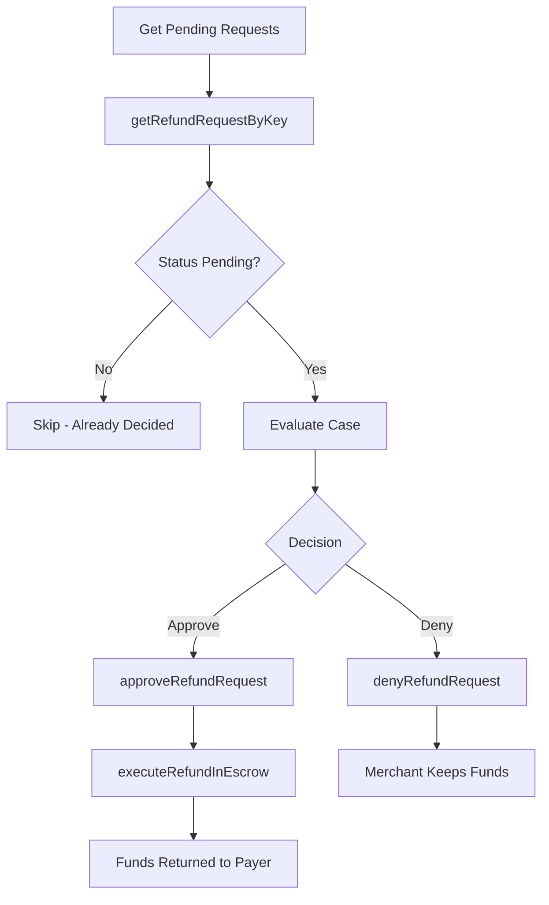

The Arbiter SDK provides methods for reviewing refund requests, making decisions, and executing refunds for disputed payments.

## Approve a Refund Request

Approve a pending refund request. This updates the on-chain status but does not transfer funds.

```typescript
const { txHash } = await arbiter.approveRefundRequest(paymentInfo, 0n);
console.log('Refund approved:', txHash);
```

<Note>
Approving a refund request updates the request status to `Approved` but does not transfer funds. You must call `executeRefundInEscrow()` separately to move funds back to the payer.
</Note>

## Deny a Refund Request

Deny a pending refund request:

```typescript
const { txHash } = await arbiter.denyRefundRequest(paymentInfo, 0n);
console.log('Refund denied:', txHash);
```

## Execute Refund in Escrow

After approving a refund request, execute the actual fund transfer back to the payer:

```typescript
// Full refund (defaults to paymentInfo.maxAmount)
const { txHash } = await arbiter.executeRefundInEscrow(paymentInfo);
console.log('Full refund executed:', txHash);

// Partial refund
const partialAmount = BigInt('500000'); // 0.5 USDC
const { txHash: partialTx } = await arbiter.executeRefundInEscrow(paymentInfo, partialAmount);
console.log('Partial refund executed:', partialTx);
```

<Tip>
When no `amount` is provided, `executeRefundInEscrow` defaults to `paymentInfo.maxAmount`, issuing a full refund.
</Tip>

## Check If a Refund Request Exists

Verify whether a refund request has been submitted for a given payment and nonce:

```typescript
const hasRequest = await arbiter.hasRefundRequest(paymentInfo, 0n);

if (!hasRequest) {
  console.log('No refund request found for this payment');
  return;
}
```

## Get Refund Request Data

Retrieve the full refund request data, including amount and status:

```typescript
import { RequestStatus } from '@x402r/core';

const request = await arbiter.getRefundRequest(paymentInfo, 0n);

console.log('Payment hash:', request.paymentInfoHash);
console.log('Nonce:', request.nonce);
console.log('Refund amount:', request.amount);
console.log('Status:', RequestStatus[request.status]);
```

The `RefundRequestData` type contains:

```typescript
interface RefundRequestData {
  paymentInfoHash: `0x${string}`;
  nonce: bigint;
  amount: bigint;
  status: RequestStatus;
}
```

## Get Refund Request Status

Query the current status of a specific refund request:

```typescript
import { RequestStatus } from '@x402r/core';

const status = await arbiter.getRefundStatus(paymentInfo, 0n);

switch (status) {
  case RequestStatus.Pending:
    console.log('Awaiting decision');
    break;
  case RequestStatus.Approved:
    console.log('Already approved');
    break;
  case RequestStatus.Denied:
    console.log('Already denied');
    break;
  case RequestStatus.Cancelled:
    console.log('Cancelled by payer');
    break;
}
```

## Get Pending Refund Requests (Paginated)

Retrieve a paginated list of refund request keys for a receiver. You can optionally filter by receiver address:

```typescript
// Get the first 10 pending requests for a specific receiver
const { keys, total } = await arbiter.getPendingRefundRequests(
  0n,    // offset
  10n,   // count
  '0xReceiverAddress...' // optional: defaults to the arbiter's wallet address
);

console.log(`${total} total cases, showing first ${keys.length}`);

// Look up each request by its composite key
for (const key of keys) {
  const request = await arbiter.getRefundRequestByKey(key);
  console.log(`Amount: ${request.amount}, Status: ${RequestStatus[request.status]}`);
}
```

## Get Refund Request Count

Get the total number of refund requests for a receiver:

```typescript
const count = await arbiter.getRefundRequestCount('0xReceiverAddress...');
console.log(`Total refund requests: ${count}`);

// Defaults to the arbiter's wallet address if not specified
const myCount = await arbiter.getRefundRequestCount();
console.log(`My refund requests: ${myCount}`);
```

## Get Refund Request by Composite Key

Look up a specific refund request using its `keccak256(paymentInfoHash, nonce)` composite key:

```typescript
const request = await arbiter.getRefundRequestByKey(compositeKey);

console.log('Payment hash:', request.paymentInfoHash);
console.log('Amount:', request.amount);
console.log('Status:', RequestStatus[request.status]);
```

## Check If a Payment Is Frozen

Verify whether a payment is currently frozen by a Freeze condition contract:

```typescript
const frozen = await arbiter.isFrozen(paymentInfo, freezeAddress);

if (frozen) {
  console.log('Payment is frozen - dispute in progress');
} else {
  console.log('Payment is not frozen');
}
```

## Complete Decision Workflow

This example shows the full arbiter workflow: fetching pending cases, reviewing them, making a decision, and executing the refund.

```typescript
import { X402rArbiter } from '@x402r/arbiter';
import { RequestStatus } from '@x402r/core';
import type { PaymentInfo } from '@x402r/core';

async function processAllPendingCases(arbiter: X402rArbiter, receiverAddress: `0x${string}`) {
  // Step 1: Get all pending refund requests
  const { keys, total } = await arbiter.getPendingRefundRequests(0n, 50n, receiverAddress);
  console.log(`Found ${total} pending cases`);

  for (const key of keys) {
    // Step 2: Retrieve request details
    const request = await arbiter.getRefundRequestByKey(key);

    // Step 3: Skip if already decided
    if (request.status !== RequestStatus.Pending) {
      console.log(`Skipping ${request.paymentInfoHash} - already ${RequestStatus[request.status]}`);
      continue;
    }

    // Step 4: Apply your decision logic
    const shouldApprove = await evaluateCase(request);

    if (shouldApprove) {
      // Step 5a: Approve and execute the refund
      // NOTE: You need the full PaymentInfo struct to call these methods.
      // Retrieve it from your application's database or event logs.
      const paymentInfo = await lookupPaymentInfo(request.paymentInfoHash);

      const { txHash: approveTx } = await arbiter.approveRefundRequest(paymentInfo, request.nonce);
      console.log(`Approved: ${approveTx}`);

      const { txHash: executeTx } = await arbiter.executeRefundInEscrow(paymentInfo);
      console.log(`Refund executed: ${executeTx}`);
    } else {
      // Step 5b: Deny the refund
      const paymentInfo = await lookupPaymentInfo(request.paymentInfoHash);

      const { txHash } = await arbiter.denyRefundRequest(paymentInfo, request.nonce);
      console.log(`Denied: ${txHash}`);
    }
  }
}
```

## Decision Flow Diagram



## Next Steps

<CardGroup cols={2}>
  <Card title="Batch Operations" icon="layer-group" href="/sdk/arbiter/batch-operations">
    Process multiple cases at once.
  </Card>
  <Card title="AI Integration" icon="robot" href="/sdk/arbiter/ai-integration">
    Automate decisions with AI evaluation hooks.
  </Card>
  <Card title="Registry" icon="clipboard-list" href="/sdk/arbiter/registry">
    Register as an arbiter for on-chain discovery.
  </Card>
  <Card title="RefundRequest" icon="file-contract" href="/contracts/periphery/refund-request">
    RefundRequest contract and state machine details.
  </Card>
</CardGroup>
