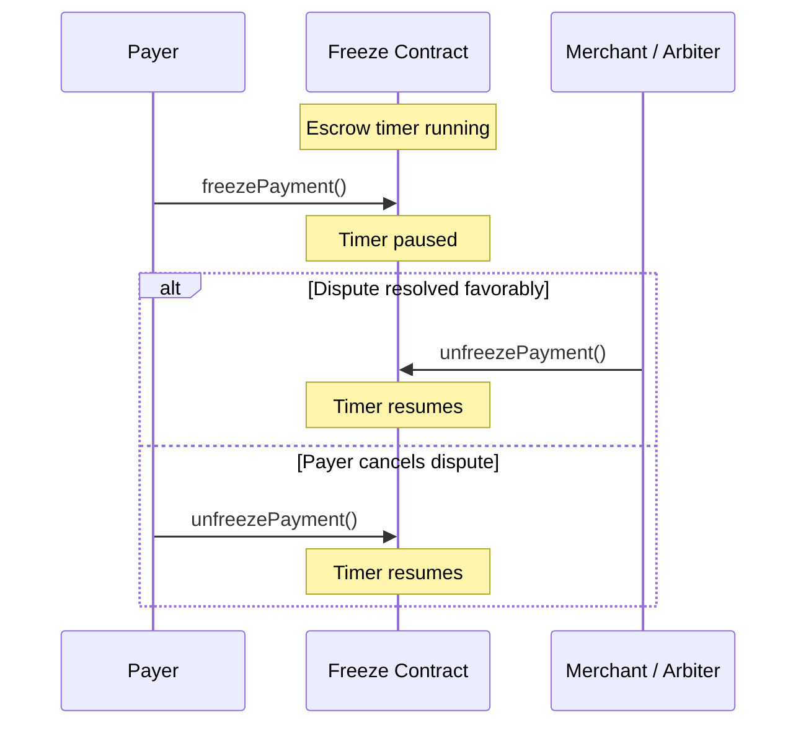

The Client SDK provides methods to interact with the escrow system, including freezing payments during disputes and querying escrow period timing. All methods documented on this page are **fully functional**.

## Freeze Operations

Freezing a payment pauses the escrow timer, preventing the merchant from releasing funds while a dispute is being resolved. Freeze operations interact with the `Freeze` contract.

### freezePayment

Freeze a payment to pause the escrow timer. Only the payer can freeze a payment.

```typescript
const freezeAddress = '0x...'; // Freeze contract address

const { txHash } = await client.freezePayment(paymentInfo, freezeAddress);
console.log(`Payment frozen: ${txHash}`);
```

#### Signature

```typescript
freezePayment(
  paymentInfo: PaymentInfo,
  freezeAddress: `0x${string}`
): Promise<{ txHash: `0x${string}` }>
```

<Note>
Freezing is useful when:
- You need more time to resolve a dispute with the merchant
- You are waiting for additional information before deciding on a refund
- The merchant is unresponsive to your refund request
</Note>

### unfreezePayment

Unfreeze a previously frozen payment. The receiver (merchant) or arbiter can unfreeze a payment once the dispute is resolved.

```typescript
const { txHash } = await client.unfreezePayment(paymentInfo, freezeAddress);
console.log(`Payment unfrozen: ${txHash}`);
```

#### Signature

```typescript
unfreezePayment(
  paymentInfo: PaymentInfo,
  freezeAddress: `0x${string}`
): Promise<{ txHash: `0x${string}` }>
```

### isFrozen

Check whether a payment is currently frozen.

```typescript
const frozen = await client.isFrozen(paymentInfo, freezeAddress);

if (frozen) {
  console.log('Payment is frozen - escrow timer paused');
} else {
  console.log('Payment is not frozen - escrow timer running');
}
```

#### Signature

```typescript
isFrozen(
  paymentInfo: PaymentInfo,
  freezeAddress: `0x${string}`
): Promise<boolean>
```

## Escrow Period Operations

These methods interact with the `EscrowPeriod` contract to query timing information about a payment's escrow window.

### getAuthorizationTime

Get the timestamp (in seconds) when a payment was authorized on-chain. This is the starting point of the escrow period.

```typescript
const escrowPeriodAddress = '0x...'; // EscrowPeriod contract address

const authTime = await client.getAuthorizationTime(paymentInfo, escrowPeriodAddress);
const authDate = new Date(Number(authTime) * 1000);

console.log(`Payment authorized at: ${authDate.toISOString()}`);
```

#### Signature

```typescript
getAuthorizationTime(
  paymentInfo: PaymentInfo,
  escrowPeriodAddress: `0x${string}`
): Promise<bigint>
```

### isDuringEscrowPeriod

Check whether a payment is still within its escrow period. Returns `true` if the escrow period has not yet passed, meaning the payment can still be refunded.

```typescript
const duringEscrow = await client.isDuringEscrowPeriod(
  paymentInfo,
  escrowPeriodAddress
);

if (duringEscrow) {
  console.log('Still in escrow period - refund is possible');
} else {
  console.log('Escrow period has passed - funds can be fully released');
}
```

#### Signature

```typescript
isDuringEscrowPeriod(
  paymentInfo: PaymentInfo,
  escrowPeriodAddress: `0x${string}`
): Promise<boolean>
```

<Warning>
The method name is `isDuringEscrowPeriod`, **not** `isEscrowPeriodPassed`. It returns `true` when the escrow period is still **active** (refund window is open), and `false` when it has passed.
</Warning>

## Understanding Escrow Timing

| Condition | Escrow Timer | Can Request Refund | Can Release |
|-----------|--------------|-------------------|-------------|
| Normal (unfrozen, period active) | Running | Yes | Partial only |
| Frozen | Paused | Yes | No |
| Escrow period passed (unfrozen) | Stopped | No | Full amount |

<Tip>
The escrow period length is configured at the contract level when the `EscrowPeriod` condition is deployed. Common values are 7 days, 14 days, or 30 days. You can calculate the remaining time from `getAuthorizationTime` and the configured period.
</Tip>

## Example: Freeze and Request Refund

A common pattern is to freeze a payment before submitting a refund request, ensuring the merchant cannot release funds while the request is pending.

```typescript
import { createPayerClient } from '@x402r/sdk';
import type { PaymentInfo } from '@x402r/core';

async function freezeAndRequestRefund(
  client: ReturnType<typeof createPayerClient>,
  paymentInfo: PaymentInfo,
  freezeAddress: `0x${string}`,
  refundAmount: bigint
) {
  // Step 1: Check if already frozen
  const alreadyFrozen = await client.isFrozen(paymentInfo, freezeAddress);

  if (!alreadyFrozen) {
    // Freeze the payment first
    const { txHash: freezeTx } = await client.freezePayment(
      paymentInfo,
      freezeAddress
    );
    console.log(`Payment frozen: ${freezeTx}`);
  }

  // Step 2: Check if refund request already exists
  const nonce = 0n;
  const hasRequest = await client.hasRefundRequest(paymentInfo, nonce);

  if (!hasRequest) {
    // Submit the refund request
    const { txHash: refundTx } = await client.requestRefund(
      paymentInfo,
      refundAmount,
      nonce
    );
    console.log(`Refund requested: ${refundTx}`);
  }

  // Step 3: Watch for resolution
  const { unsubscribe } = client.watchFreezeEvents(
    freezeAddress,
    (event) => {
      if (event.eventName === 'PaymentUnfrozen') {
        console.log('Payment was unfrozen - dispute may be resolved');
        unsubscribe();
      }
    }
  );
}
```

## Freeze / Unfreeze Flow



## Next Steps

<CardGroup cols={2}>
  <Card title="Event Subscriptions" icon="bell" href="/sdk/client/subscriptions">
    Watch for freeze and unfreeze events in real-time.
  </Card>
  <Card title="Refund Operations" icon="rotate-left" href="/sdk/client/refund-operations">
    Request refunds while payment is in escrow.
  </Card>
  <Card title="Payment Queries" icon="magnifying-glass" href="/sdk/client/payment-queries">
    Planned query methods and current workarounds.
  </Card>
  <Card title="Client Quickstart" icon="rocket" href="/sdk/client/quickstart">
    Full setup guide for the Client SDK.
  </Card>
</CardGroup>
