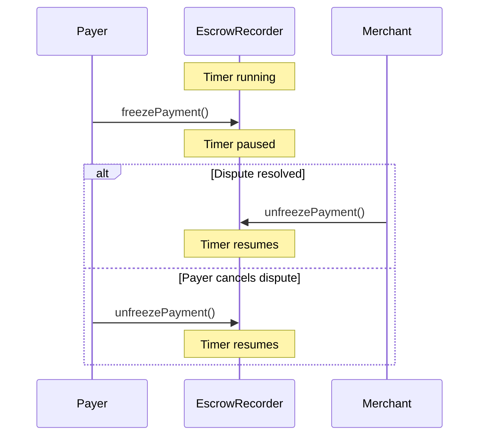

The Client SDK provides methods to interact with the escrow system, including freezing payments and checking escrow timing.

## Freeze a Payment

Freeze a payment to pause the escrow timer during a dispute:

```typescript
const { txHash } = await client.freezePayment(paymentInfo, recorderAddress);
console.log('Payment frozen:', txHash);
```

<Note>
Freezing pauses the escrow timer. This is useful when:
- You need more time to resolve a dispute
- You're waiting for additional information
- The merchant is unresponsive
</Note>

## Unfreeze a Payment

Unfreeze a previously frozen payment:

```typescript
const { txHash } = await client.unfreezePayment(paymentInfo, recorderAddress);
console.log('Payment unfrozen:', txHash);
```

## Check If Payment Is Frozen

Query the frozen status of a payment:

```typescript
const isFrozen = await client.isFrozen(paymentInfo, recorderAddress);

if (isFrozen) {
  console.log('Payment is frozen - escrow timer paused');
} else {
  console.log('Payment is not frozen - escrow timer running');
}
```

## Get Authorization Time

Get the timestamp when the payment was authorized:

```typescript
const authTime = await client.getAuthorizationTime(paymentInfo, recorderAddress);
const authDate = new Date(Number(authTime) * 1000);

console.log('Payment authorized at:', authDate.toISOString());
```

## Check If Escrow Period Passed

Determine if the escrow period has expired:

```typescript
const isPassed = await client.isEscrowPeriodPassed(paymentInfo, recorderAddress);

if (isPassed) {
  console.log('Escrow period has passed - payment can be fully released');
} else {
  console.log('Escrow period still active - payment can be refunded');
}
```

## Example: Escrow Status Dashboard

```typescript
import { X402rClient } from '@x402r/client';
import { PaymentState } from '@x402r/core';

async function showEscrowStatus(
  client: X402rClient,
  paymentInfo: PaymentInfo,
  recorderAddress: `0x${string}`
) {
  // Check payment state
  const state = await client.getPaymentState(paymentInfo);
  if (state !== PaymentState.InEscrow) {
    console.log('Payment not in escrow');
    return;
  }

  // Get escrow details
  const authTime = await client.getAuthorizationTime(paymentInfo, recorderAddress);
  const isFrozen = await client.isFrozen(paymentInfo, recorderAddress);
  const isPassed = await client.isEscrowPeriodPassed(paymentInfo, recorderAddress);

  const authDate = new Date(Number(authTime) * 1000);

  console.log('Escrow Status:');
  console.log(`  Authorized: ${authDate.toISOString()}`);
  console.log(`  Frozen: ${isFrozen ? 'Yes' : 'No'}`);
  console.log(`  Escrow Passed: ${isPassed ? 'Yes' : 'No'}`);

  if (isFrozen) {
    console.log('  Note: Timer paused due to freeze');
  } else if (!isPassed) {
    console.log('  Note: Refund still possible');
  } else {
    console.log('  Note: Merchant can fully release');
  }
}
```

## Freeze/Unfreeze Flow



## Understanding Escrow Timing

| Condition | Escrow Timer | Can Refund | Can Release |
|-----------|--------------|------------|-------------|
| Normal (unfrozen, not passed) | Running | Yes | Partial |
| Frozen | Paused | Yes | No |
| Escrow passed | Stopped | No | Full |

## Next Steps

<CardGroup cols={2}>
  <Card title="Event Subscriptions" icon="bell" href="/sdk/client/subscriptions">
    Watch for freeze events in real-time.
  </Card>
  <Card title="Refund Operations" icon="rotate-left" href="/sdk/client/refund-operations">
    Request refunds while in escrow.
  </Card>
</CardGroup>
