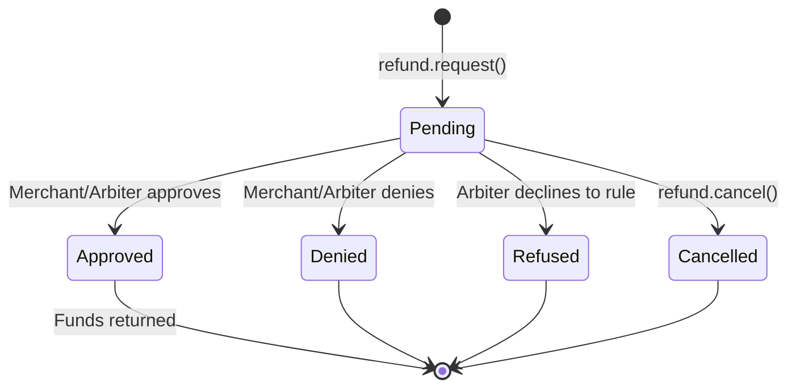

The payer client provides complete refund management through the `refund` action group. All methods interact directly with the `RefundRequest` contract on-chain.

<Note>
The `refund` group requires `refundRequestAddress` in the client config. Without it, `client.refund` is `undefined`.
</Note>

## refund.request

Submit a refund request for a payment that is in escrow. The request goes on-chain and is visible to the merchant and any assigned arbiter.

```typescript
const tx = await client.refund?.request(paymentInfo, 1_000_000n) // 1 USDC
console.log('Refund requested:', tx)
```

## refund.cancel

Cancel a pending refund request that you submitted. Only the original requester (payer) can cancel, and only while the request status is `Pending`.

```typescript
const tx = await client.refund?.cancel(paymentInfo)
console.log('Refund request cancelled:', tx)
```

## Query refund state

These methods read on-chain state for refund requests.

### Check existence and status

```typescript
// Check if a refund request exists
const hasRequest = await client.refund?.has(paymentInfo)

// Get just the status
const status = await client.refund?.getStatus(paymentInfo)
// Returns: 0 = Pending, 1 = Approved, 2 = Denied, 3 = Cancelled, 4 = Refused
```

### Get full refund request data

```typescript
// By paymentInfo
const request = await client.refund?.get(paymentInfo)
console.log(request?.amount, request?.status)

// By hash (from list methods)
const request2 = await client.refund?.getByKey(paymentInfoHash)
```

### List refund requests

```typescript
// Get payer's refund requests (paginated)
const payerRequests = await client.refund?.getPayerRequests(
  payerAddress,
  0n,   // offset
  10n,  // count
)

// Get receiver's refund requests
const receiverRequests = await client.refund?.getReceiverRequests(
  receiverAddress,
  0n,
  10n,
)

// Get all requests for an operator
const operatorRequests = await client.refund?.getOperatorRequests(
  operatorAddress,
  0n,
  10n,
)
```

### Track cancellations

```typescript
const cancelCount = await client.refund?.getCancelCount(paymentInfo)
const cancelledAmount = await client.refund?.getCancelledAmount(paymentInfo, 0n)
```

## Refund request lifecycle



## Method reference

| Method | Parameters | Returns |
|--------|-----------|---------|
| `refund.request` | `paymentInfo, amount` | `Hash` |
| `refund.cancel` | `paymentInfo` | `Hash` |
| `refund.deny` | `paymentInfo` | `Hash` |
| `refund.refuse` | `paymentInfo` | `Hash` |
| `refund.has` | `paymentInfo` | `boolean` |
| `refund.getStatus` | `paymentInfo` | `RefundRequestStatus` |
| `refund.get` | `paymentInfo` | `RefundRequestData` |
| `refund.getByKey` | `paymentInfoHash` | `RefundRequestData` |
| `refund.getStoredPaymentInfo` | `paymentInfoHash` | `PaymentInfo` |
| `refund.getPayerRequests` | `payer, offset, count` | `RefundRequestData[]` |
| `refund.getReceiverRequests` | `receiver, offset, count` | `RefundRequestData[]` |
| `refund.getOperatorRequests` | `operator, offset, count` | `RefundRequestData[]` |
| `refund.getCancelCount` | `paymentInfo` | `bigint` |
| `refund.getCancelledAmount` | `paymentInfo, cancelIndex` | `bigint` |

## Next steps

<CardGroup cols={2}>
  <Card title="Escrow Management" icon="lock" href="/sdk/client/escrow-management">
    Freeze payments and check escrow period timing.
  </Card>
  <Card title="Event Subscriptions" icon="bell" href="/sdk/client/subscriptions">
    Watch for refund status updates in real-time.
  </Card>
  <Card title="Payment Queries" icon="magnifying-glass" href="/sdk/client/payment-queries">
    Query payment state and details.
  </Card>
  <Card title="Client Quickstart" icon="rocket" href="/sdk/client/quickstart">
    Full setup guide for the payer client.
  </Card>
</CardGroup>
