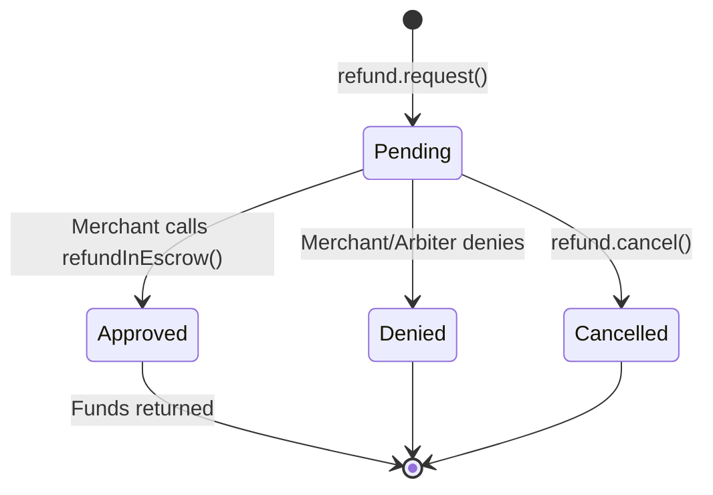

The payer client provides complete refund management capabilities. All refund methods interact with the `RefundRequest` contract on-chain. Each payment supports one refund request, keyed by its `paymentInfoHash`.

<Note>
In v3, RefundRequest is wired as an IRecorder plugin. Refund approval happens automatically when the merchant calls `refundInEscrow()` — there is no separate approve step.
</Note>

## request

Submit a refund request for a payment that is in escrow. The request goes on-chain and is visible to the merchant and any assigned arbiter.

```typescript
const txHash = await client.refund.request(
  paymentInfo,
  BigInt('1000000') // amount to refund (e.g., 1 USDC with 6 decimals)
);

console.log(`Refund requested: ${txHash}`);
```

## cancel

Cancel a pending refund request that you submitted. Only the original requester (payer) can cancel, and only while the request status is `Pending`.

```typescript
const txHash = await client.refund.cancel(paymentInfo);
console.log(`Refund request cancelled: ${txHash}`);
```

## Query refund state

These methods read on-chain state for refund requests.

### Check existence and status

```typescript
// Check if a refund request exists
const hasRequest = await client.refund.has(paymentInfo);

// Get just the status
const status = await client.refund.getStatus(paymentInfo);
// Returns: RequestStatus.Pending | Approved | Denied | Cancelled
```

### Get full refund request data

```typescript
// By paymentInfo
const request = await client.refund.get(paymentInfo);
console.log(request.amount, request.status);

// By paymentInfoHash
const request2 = await client.refund.getByKey(paymentInfoHash);
```

### List your refund requests

```typescript
// Get paginated refund request keys for a payer address
const { keys, total } = await client.refund.getPayerRequests(
  payerAddress,
  0n,   // offset
  10n   // count
);

for (const key of keys) {
  const request = await client.refund.getByKey(key);
  console.log(`Amount: ${request.amount}, Status: ${request.status}`);
}
```

### Retrieve stored payment info

```typescript
// Get PaymentInfo stored by RefundRequest for a given hash
const storedInfo = await client.refund.getStoredPaymentInfo(paymentInfoHash);
```

## Refund request lifecycle



## Method reference

| Method | Parameters | Returns |
|--------|-----------|---------|
| `refund.request` | `paymentInfo, amount` | `Hash` |
| `refund.cancel` | `paymentInfo` | `Hash` |
| `refund.has` | `paymentInfo` | `boolean` |
| `refund.getStatus` | `paymentInfo` | `RefundRequestStatus` |
| `refund.get` | `paymentInfo` | `RefundRequestData` |
| `refund.getByKey` | `paymentInfoHash` | `RefundRequestData` |
| `refund.getStoredPaymentInfo` | `paymentInfoHash` | `PaymentInfo` |
| `refund.getPayerRequests` | `payer, offset, count` | `{ keys, total }` |
| `refund.getCancelCount` | `paymentInfo` | `bigint` |
| `refund.getCancelledAmount` | `paymentInfo, cancelIndex` | `bigint` |

## Next steps

<CardGroup cols={2}>
  <Card title="Escrow Management" icon="lock" href="/sdk/client/escrow-management">
    Freeze payments and check escrow period timing.
  </Card>
  <Card title="Event Subscriptions" icon="bell" href="/sdk/client/subscriptions">
    Watch for refund status updates in real-time.
  </Card>
  <Card title="Payment Queries" icon="magnifying-glass" href="/sdk/client/payment-queries">
    Query payment state and details.
  </Card>
  <Card title="Client Quickstart" icon="rocket" href="/sdk/client/quickstart">
    Full setup guide for the Client SDK.
  </Card>
</CardGroup>
