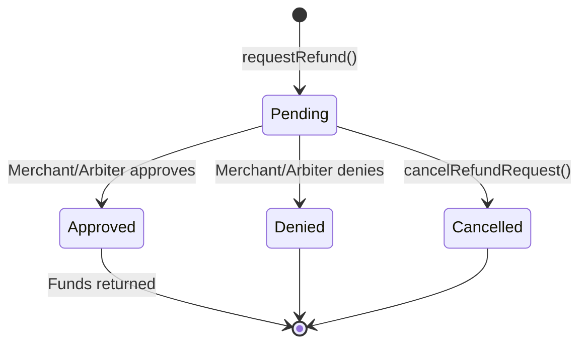

The Client SDK provides complete refund management capabilities for payers. All refund methods interact directly with the `RefundRequest` contract on-chain.

<Note>
**About the `nonce` parameter:** Every refund method requires a `nonce: bigint` parameter. This is the record index from the `PaymentIndexRecorder` and identifies which charge within a payment you are requesting a refund for. For the first (and most common) charge, use `0n`.
</Note>

## requestRefund

Submit a refund request for a payment that is in escrow. The request goes on-chain and is visible to the merchant and any assigned arbiter.

```typescript
const { txHash } = await client.requestRefund(
  paymentInfo,
  BigInt('1000000'), // amount to refund (e.g., 1 USDC with 6 decimals)
  0n                 // nonce: first charge
);

console.log(`Refund requested: ${txHash}`);
```

## cancelRefundRequest

Cancel a pending refund request that you submitted. Only the original requester (payer) can cancel, and only while the request status is `Pending`.

```typescript
const { txHash } = await client.cancelRefundRequest(paymentInfo, 0n);
console.log(`Refund request cancelled: ${txHash}`);
```

## Query Refund State

These methods read on-chain state for refund requests. None require a wallet client.

### Check existence and status

```typescript
// Check if a refund request exists
const hasRequest = await client.hasRefundRequest(paymentInfo, 0n);

// Get just the status
const status = await client.getRefundStatus(paymentInfo, 0n);
// Returns: RequestStatus.Pending | Approved | Denied | Cancelled
```

### Get full refund request data

```typescript
// By paymentInfo + nonce
const request = await client.getRefundRequest(paymentInfo, 0n);
console.log(request.amount, request.status);

// By composite key (from getMyRefundRequests)
const request2 = await client.getRefundRequestByKey(compositeKey);
```

### List your refund requests

```typescript
// Get total count
const count = await client.getMyRefundRequestCount();

// Get paginated keys, then fetch details
const { keys, total } = await client.getMyRefundRequests(0n, 10n);

for (const key of keys) {
  const request = await client.getRefundRequestByKey(key);
  console.log(`Amount: ${request.amount}, Status: ${request.status}`);
}
```

## Refund Request Lifecycle



## Method Reference

| Method | Parameters | Returns |
|--------|-----------|---------|
| `requestRefund` | `paymentInfo, amount, nonce` | `{ txHash }` |
| `cancelRefundRequest` | `paymentInfo, nonce` | `{ txHash }` |
| `hasRefundRequest` | `paymentInfo, nonce` | `boolean` |
| `getRefundStatus` | `paymentInfo, nonce` | `RequestStatus` |
| `getRefundRequest` | `paymentInfo, nonce` | `RefundRequestData` |
| `getRefundRequestByKey` | `compositeKey` | `RefundRequestData` |
| `getMyRefundRequests` | `offset, count` | `{ keys, total }` |
| `getMyRefundRequestCount` | none | `bigint` |

## Next Steps

<CardGroup cols={2}>
  <Card title="Escrow Management" icon="lock" href="/sdk/client/escrow-management">
    Freeze payments and check escrow period timing.
  </Card>
  <Card title="Event Subscriptions" icon="bell" href="/sdk/client/subscriptions">
    Watch for refund status updates in real-time.
  </Card>
  <Card title="Payment Queries" icon="magnifying-glass" href="/sdk/client/payment-queries">
    Query payment state and details.
  </Card>
  <Card title="Client Quickstart" icon="rocket" href="/sdk/client/quickstart">
    Full setup guide for the Client SDK.
  </Card>
</CardGroup>
