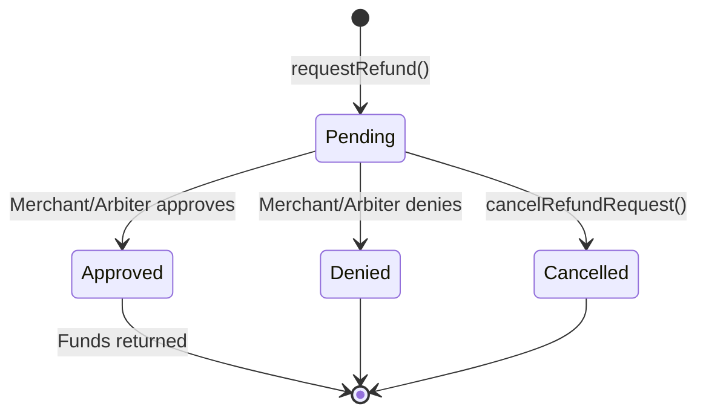

The Client SDK provides complete refund management capabilities for payers.

## Request a Refund

Create a refund request for a payment in escrow:

```typescript
const { txHash, paymentInfoHash } = await client.requestRefund(paymentInfo);

console.log('Refund requested!');
console.log('Transaction:', txHash);
console.log('Payment hash:', paymentInfoHash);
```

<Warning>
You can only request a refund if:
- The payment is in escrow (`PaymentState.InEscrow`)
- No existing refund request exists for this payment
</Warning>

## Check Refund Request Status

Query the status of a refund request:

```typescript
import { RequestStatus } from '@x402r/core';

const status = await client.getRefundStatus(paymentInfo);

switch (status) {
  case RequestStatus.Pending:
    console.log('Waiting for merchant/arbiter decision');
    break;
  case RequestStatus.Approved:
    console.log('Refund approved!');
    break;
  case RequestStatus.Denied:
    console.log('Refund denied');
    break;
  case RequestStatus.Cancelled:
    console.log('Refund was cancelled');
    break;
}
```

## Check If Refund Request Exists

Verify if a refund request has been made:

```typescript
const hasRequest = await client.hasRefundRequest(paymentInfo);

if (hasRequest) {
  console.log('Refund request exists');
} else {
  console.log('No refund request yet');
}
```

## Cancel a Refund Request

Cancel a pending refund request you created:

```typescript
const { txHash } = await client.cancelRefundRequest(paymentInfo);
console.log('Refund request cancelled:', txHash);
```

<Note>
You can only cancel a refund request if:
- You are the original requester (payer)
- The request is still pending
</Note>

## Get My Refund Requests

List all refund requests you've made:

```typescript
const hashes = await client.getMyRefundRequests();

console.log(`You have ${hashes.length} refund requests`);

for (const hash of hashes) {
  const status = await client.getRefundStatus(
    await client.getPaymentDetails(hash)
  );
  console.log(`${hash}: ${RequestStatus[status]}`);
}
```

## Get Refund Request by Hash

Retrieve refund request details:

```typescript
const request = await client.getRefundRequestByHash(paymentInfoHash);

console.log('Status:', RequestStatus[request.status]);
console.log('Payment hash:', request.paymentInfoHash);
```

## Example: Refund Request Flow

```typescript
import { X402rClient } from '@x402r/client';
import { PaymentState, RequestStatus } from '@x402r/core';

async function requestRefundIfEligible(
  client: X402rClient,
  paymentInfo: PaymentInfo
) {
  // Check payment is in escrow
  const state = await client.getPaymentState(paymentInfo);
  if (state !== PaymentState.InEscrow) {
    console.log('Payment not in escrow, cannot refund');
    return null;
  }

  // Check no existing request
  const hasRequest = await client.hasRefundRequest(paymentInfo);
  if (hasRequest) {
    const status = await client.getRefundStatus(paymentInfo);
    console.log('Existing request with status:', RequestStatus[status]);
    return null;
  }

  // Request refund
  const { txHash, paymentInfoHash } = await client.requestRefund(paymentInfo);
  console.log('Refund requested:', txHash);

  // Watch for status updates
  const { unsubscribe } = client.watchRefundRequests((event) => {
    if (event.paymentInfoHash === paymentInfoHash) {
      console.log('Refund status updated:', event.newStatus);
      unsubscribe();
    }
  });

  return txHash;
}
```

## Refund Request Lifecycle



## Next Steps

<CardGroup cols={2}>
  <Card title="Escrow Management" icon="lock" href="/sdk/client/escrow-management">
    Freeze payments and manage escrow timing.
  </Card>
  <Card title="Event Subscriptions" icon="bell" href="/sdk/client/subscriptions">
    Watch for refund status updates in real-time.
  </Card>
</CardGroup>
