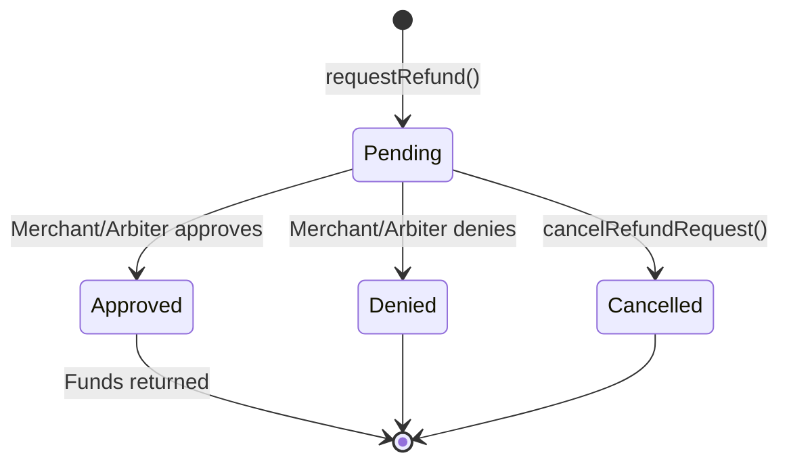

The Client SDK provides complete refund management capabilities for payers. All refund methods documented on this page are **fully functional** and interact directly with the `RefundRequest` contract on-chain.

<Note>
**About the `nonce` parameter:** Every refund method requires a `nonce: bigint` parameter. This is the record index from the `PaymentIndexRecorder` and identifies which charge within a payment you are requesting a refund for. For the first (and most common) charge, use `0n`.
</Note>

## requestRefund

Submit a refund request for a payment that is in escrow. The request goes on-chain and is visible to the merchant and any assigned arbiter.

```typescript
const { txHash } = await client.requestRefund(
  paymentInfo,
  BigInt('1000000'), // amount to refund (e.g., 1 USDC with 6 decimals)
  0n                 // nonce: first charge
);

console.log(`Refund requested: ${txHash}`);
```

### Signature

```typescript
requestRefund(
  paymentInfo: PaymentInfo,
  amount: bigint,
  nonce: bigint
): Promise<{ txHash: `0x${string}` }>
```

<Warning>
You can only request a refund if:
- The payment is in escrow (has capturable funds)
- No existing refund request exists for this payment and nonce combination
- You are the payer for this payment
- A `walletClient` and `refundRequestAddress` are configured on the client
</Warning>

## cancelRefundRequest

Cancel a pending refund request that you submitted. Only the original requester (payer) can cancel, and only while the request status is `Pending`.

```typescript
const { txHash } = await client.cancelRefundRequest(paymentInfo, 0n);
console.log(`Refund request cancelled: ${txHash}`);
```

### Signature

```typescript
cancelRefundRequest(
  paymentInfo: PaymentInfo,
  nonce: bigint
): Promise<{ txHash: `0x${string}` }>
```

<Note>
You can only cancel a refund request if:
- You are the original requester (payer)
- The request status is still `Pending`
</Note>

## hasRefundRequest

Check whether a refund request exists for a given payment and nonce.

```typescript
const hasRequest = await client.hasRefundRequest(paymentInfo, 0n);

if (hasRequest) {
  console.log('Refund request already exists');
} else {
  console.log('No refund request yet - can submit one');
}
```

### Signature

```typescript
hasRefundRequest(
  paymentInfo: PaymentInfo,
  nonce: bigint
): Promise<boolean>
```

## getRefundStatus

Get the current status of a refund request. Returns a `RequestStatus` enum value.

```typescript
import { RequestStatus } from '@x402r/core';

const status = await client.getRefundStatus(paymentInfo, 0n);

switch (status) {
  case RequestStatus.Pending:   // 0
    console.log('Waiting for merchant/arbiter decision');
    break;
  case RequestStatus.Approved:  // 1
    console.log('Refund approved');
    break;
  case RequestStatus.Denied:    // 2
    console.log('Refund denied');
    break;
  case RequestStatus.Cancelled: // 3
    console.log('Refund was cancelled by payer');
    break;
}
```

### Signature

```typescript
getRefundStatus(
  paymentInfo: PaymentInfo,
  nonce: bigint
): Promise<RequestStatus>
```

## getRefundRequest

Get the full refund request data including amount, status, payment hash, and nonce.

```typescript
const request = await client.getRefundRequest(paymentInfo, 0n);

console.log('Payment hash:', request.paymentInfoHash);
console.log('Nonce:', request.nonce);
console.log('Amount:', request.amount);
console.log('Status:', request.status);
```

### Signature

```typescript
getRefundRequest(
  paymentInfo: PaymentInfo,
  nonce: bigint
): Promise<RefundRequestData>
```

The `RefundRequestData` type contains:

```typescript
interface RefundRequestData {
  paymentInfoHash: `0x${string}`;
  nonce: bigint;
  amount: bigint;
  status: RequestStatus;
}
```

## getMyRefundRequests

Get a paginated list of composite keys for all refund requests submitted by the connected wallet. Use these keys with `getRefundRequestByKey` to fetch full details.

```typescript
const { keys, total } = await client.getMyRefundRequests(0n, 10n);

console.log(`Showing ${keys.length} of ${total} total refund requests`);

for (const key of keys) {
  const request = await client.getRefundRequestByKey(key);
  console.log(`Amount: ${request.amount}, Status: ${request.status}`);
}
```

### Signature

```typescript
getMyRefundRequests(
  offset: bigint,
  count: bigint
): Promise<{ keys: readonly `0x${string}`[]; total: bigint }>
```

<Tip>
Use `offset` and `count` for pagination. For example, to fetch page 2 with 10 items per page, use `getMyRefundRequests(10n, 10n)`.
</Tip>

## getMyRefundRequestCount

Get the total number of refund requests submitted by the connected wallet.

```typescript
const count = await client.getMyRefundRequestCount();
console.log(`Total refund requests: ${count}`);
```

### Signature

```typescript
getMyRefundRequestCount(): Promise<bigint>
```

## getRefundRequestByKey

Look up a refund request by its composite key. The composite key is `keccak256(paymentInfoHash, nonce)` and is returned by `getMyRefundRequests`.

```typescript
const request = await client.getRefundRequestByKey(compositeKey);

console.log('Payment hash:', request.paymentInfoHash);
console.log('Nonce:', request.nonce);
console.log('Amount:', request.amount);
console.log('Status:', request.status);
```

### Signature

```typescript
getRefundRequestByKey(
  compositeKey: `0x${string}`
): Promise<RefundRequestData>
```

## Complete Example: Refund Request Flow

This example shows the full lifecycle: check if a request exists, submit a refund, then poll for status updates.

```typescript
import { X402rClient } from '@x402r/client';
import { RequestStatus } from '@x402r/core';
import type { PaymentInfo } from '@x402r/core';

async function requestRefundWithTracking(
  client: X402rClient,
  paymentInfo: PaymentInfo,
  refundAmount: bigint
) {
  const nonce = 0n; // First charge

  // Step 1: Check if a refund request already exists
  const hasRequest = await client.hasRefundRequest(paymentInfo, nonce);

  if (hasRequest) {
    const existingStatus = await client.getRefundStatus(paymentInfo, nonce);
    console.log(`Refund request already exists with status: ${existingStatus}`);

    if (existingStatus === RequestStatus.Pending) {
      console.log('Request is still pending - waiting for decision');
      return;
    }

    if (existingStatus === RequestStatus.Denied) {
      console.log('Previous request was denied');
      return;
    }
  }

  // Step 2: Submit the refund request
  const { txHash } = await client.requestRefund(
    paymentInfo,
    refundAmount,
    nonce
  );
  console.log(`Refund requested: ${txHash}`);

  // Step 3: Watch for status updates
  const { unsubscribe } = client.watchRefundRequests((event) => {
    console.log(`Refund event: ${event.eventName}`);

    if (event.eventName === 'RefundRequestStatusUpdated') {
      const newStatus = event.args.status;
      if (newStatus === RequestStatus.Approved) {
        console.log('Refund approved - funds will be returned');
        unsubscribe();
      } else if (newStatus === RequestStatus.Denied) {
        console.log('Refund denied by merchant or arbiter');
        unsubscribe();
      }
    }
  });

  // Step 4: Alternatively, poll for status
  const pollInterval = setInterval(async () => {
    const status = await client.getRefundStatus(paymentInfo, nonce);

    if (status !== RequestStatus.Pending) {
      console.log(`Refund resolved with status: ${status}`);
      clearInterval(pollInterval);
      unsubscribe();
    }
  }, 10_000); // Poll every 10 seconds
}
```

## Refund Request Lifecycle



## Listing All Refund Requests

```typescript
async function listAllRefundRequests(client: X402rClient) {
  const total = await client.getMyRefundRequestCount();
  console.log(`Total refund requests: ${total}`);

  // Fetch in pages of 10
  const pageSize = 10n;
  let offset = 0n;

  while (offset < total) {
    const { keys } = await client.getMyRefundRequests(offset, pageSize);

    for (const key of keys) {
      const request = await client.getRefundRequestByKey(key);
      console.log(
        `  Hash: ${request.paymentInfoHash}, ` +
        `Amount: ${request.amount}, ` +
        `Status: ${request.status}`
      );
    }

    offset += pageSize;
  }
}
```

## Next Steps

<CardGroup cols={2}>
  <Card title="Escrow Management" icon="lock" href="/sdk/client/escrow-management">
    Freeze payments and check escrow period timing.
  </Card>
  <Card title="Event Subscriptions" icon="bell" href="/sdk/client/subscriptions">
    Watch for refund status updates in real-time.
  </Card>
  <Card title="Payment Queries" icon="magnifying-glass" href="/sdk/client/payment-queries">
    Planned query methods and current workarounds.
  </Card>
  <Card title="Client Quickstart" icon="rocket" href="/sdk/client/quickstart">
    Full setup guide for the Client SDK.
  </Card>
</CardGroup>
