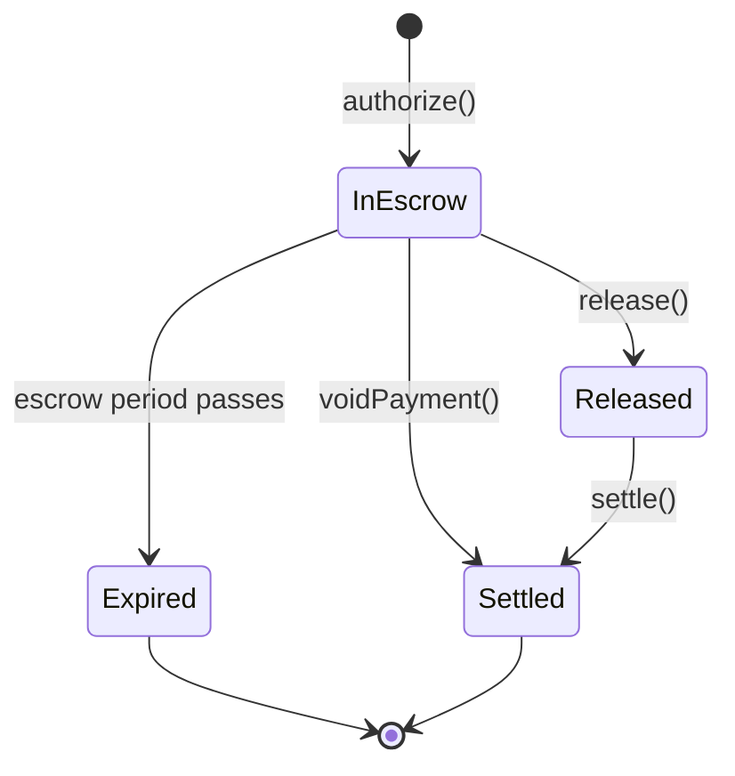
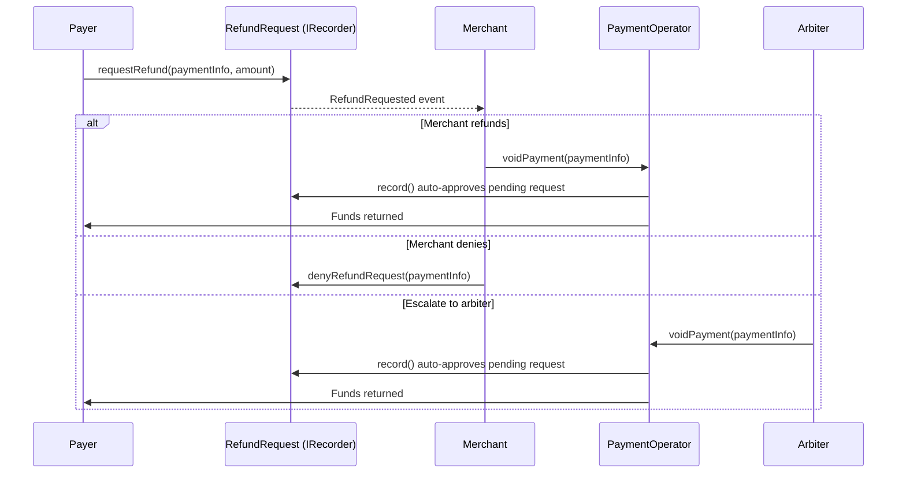
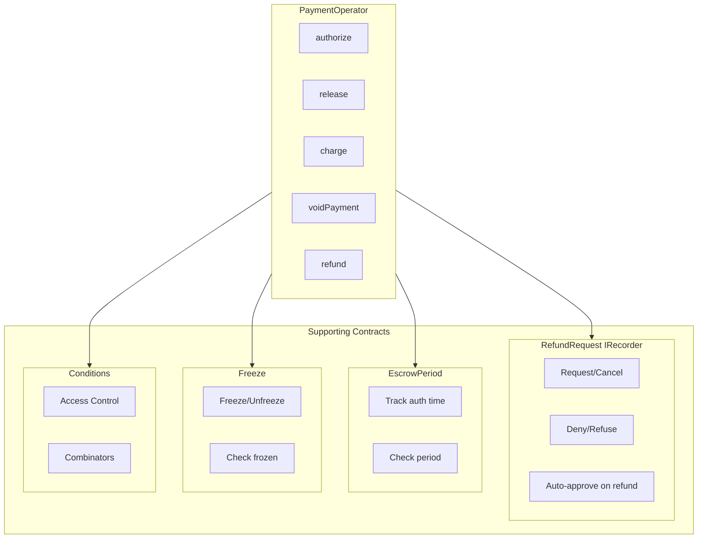

## Payment States

Every payment in X402r goes through a defined lifecycle represented by the `PaymentState` enum:

```typescript
import { PaymentState } from '@x402r/core';

// PaymentState values:
PaymentState.NonExistent  // 0 - Payment doesn't exist
PaymentState.InEscrow     // 1 - Funds held in escrow
PaymentState.Released     // 2 - Funds released to merchant
PaymentState.Settled      // 3 - Payment fully settled
PaymentState.Expired      // 4 - Payment expired
```



## Payment Info

The `PaymentInfo` struct uniquely identifies a payment and contains all its parameters:

```typescript
interface PaymentInfo {
  operator: `0x${string}`;          // PaymentOperator contract address
  payer: `0x${string}`;             // Payer's address
  receiver: `0x${string}`;          // Merchant's address
  token: `0x${string}`;             // Payment token (e.g., USDC)
  maxAmount: bigint;                // Maximum payment amount
  preApprovalExpiry: bigint;        // Pre-approval expiry timestamp (0n if not used)
  authorizationExpiry: bigint;      // When payer can reclaim funds
  refundExpiry: bigint;             // Deadline for refund requests
  minFeeBps: number;                // Minimum fee in basis points
  maxFeeBps: number;                // Maximum fee in basis points
  feeReceiver: `0x${string}`;      // Address that receives fees
  salt: bigint;                     // Unique salt for this payment
}
```

<Tip>
Use `computePaymentInfoHash()` from `@x402r/sdk` to compute the unique hash of a payment.
</Tip>

## Escrow Period

The **EscrowPeriod** contract tracks when a payment was authorized and enforces a configurable waiting period before funds can be released. During the escrow period:

- **Payers** can request refunds or freeze the payment
- **Merchants** can refund but cannot release
- **After the period**: merchants can release funds to themselves

```typescript
import { createPayerClient } from '@x402r/sdk'

const client = createPayerClient({
  publicClient,
  walletClient,
  operatorAddress: '0x...',
  escrowPeriodAddress: '0x...',
})

// Check when payment was authorized
const authTime = await client.escrow?.getAuthorizationTime(paymentInfo)

// Check if still within escrow period
const inEscrow = await client.escrow?.isDuringEscrow(paymentInfo)
if (!inEscrow) {
  console.log('Escrow period has passed, funds can be released')
}
```

## Refund requests

When a payer wants a refund, they create a refund request. Each payment supports one refund request, keyed by its `paymentInfoHash`.

```typescript
import { RefundRequestStatus } from '@x402r/sdk'

// RefundRequestStatus values:
RefundRequestStatus.Pending    // 0 - Awaiting decision
RefundRequestStatus.Approved   // 1 - Approved by merchant/arbiter
RefundRequestStatus.Denied     // 2 - Denied by merchant/arbiter
RefundRequestStatus.Cancelled  // 3 - Cancelled by payer
RefundRequestStatus.Refused    // 4 - Arbiter declined to rule
```

### Refund flow

In v3, RefundRequest is wired as an IRecorder plugin. Refund approval happens automatically when the merchant or arbiter calls `voidPayment()` on the operator, no separate approve step is needed.



```typescript
// Request a refund (one per payment)
await client.refund.request(paymentInfo, amount);

// Check status
const status = await client.refund.getStatus(paymentInfo);
```

## Freeze / Unfreeze

The **Freeze** contract allows payers to freeze a payment during the escrow period, preventing release until the freeze expires or is lifted:

```typescript
// Payer freezes payment (requires payer authorization)
await client.freeze?.freeze(paymentInfo)

// Merchant unfreezes payment (requires receiver authorization)
await merchant.freeze?.unfreeze(paymentInfo)

// Check frozen status
const frozen = await client.freeze?.isFrozen(paymentInfo)
```

<Warning>
Freezing a payment does not automatically escalate to an arbiter. It pauses the release condition to allow time for dispute resolution.
</Warning>

## Roles and Permissions

| Role | Can Do |
|------|--------|
| **Payer** | Request refunds, freeze payments, cancel requests, query escrow state |
| **Merchant** | Release payments, charge, void (auto-approves requests), deny refunds |
| **Arbiter** | Deny/refuse disputed refunds, void, review evidence |

## Contract Architecture



## Next Steps

<CardGroup cols={2}>
  <Card title="Deploy Operator" icon="rocket" href="/sdk/deploy-operator">
    Deploy your own PaymentOperator with all supporting contracts.
  </Card>
  <Card title="Examples" icon="code" href="/sdk/examples">
    Working examples for merchants, clients, and arbiters.
  </Card>
  <Card title="Smart Contracts" icon="file-contract" href="/contracts/overview">
    Understand the underlying contract architecture.
  </Card>
</CardGroup>
