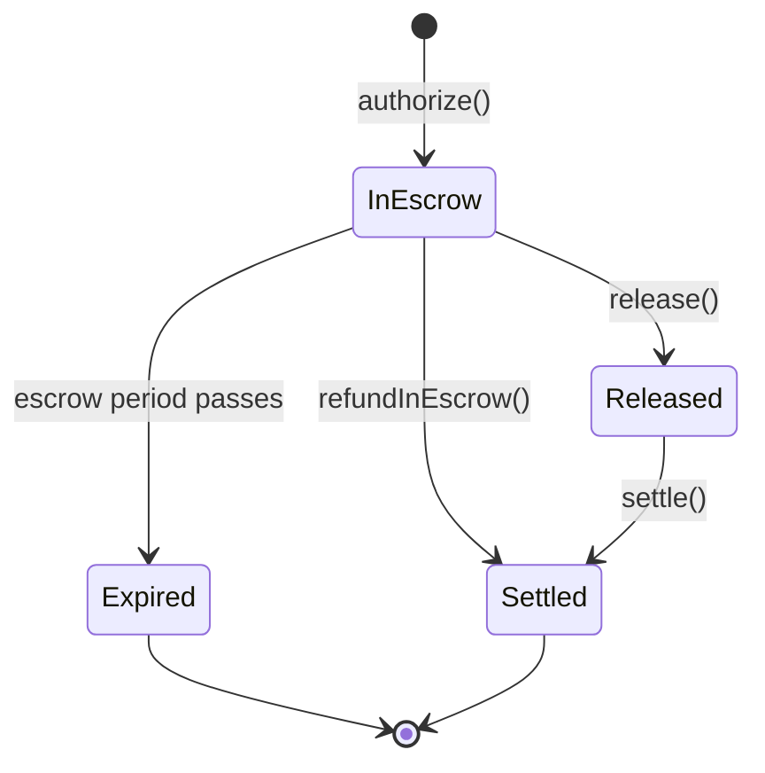
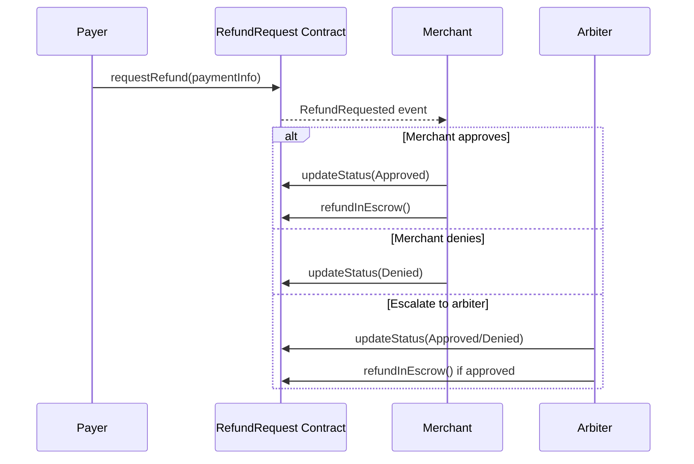
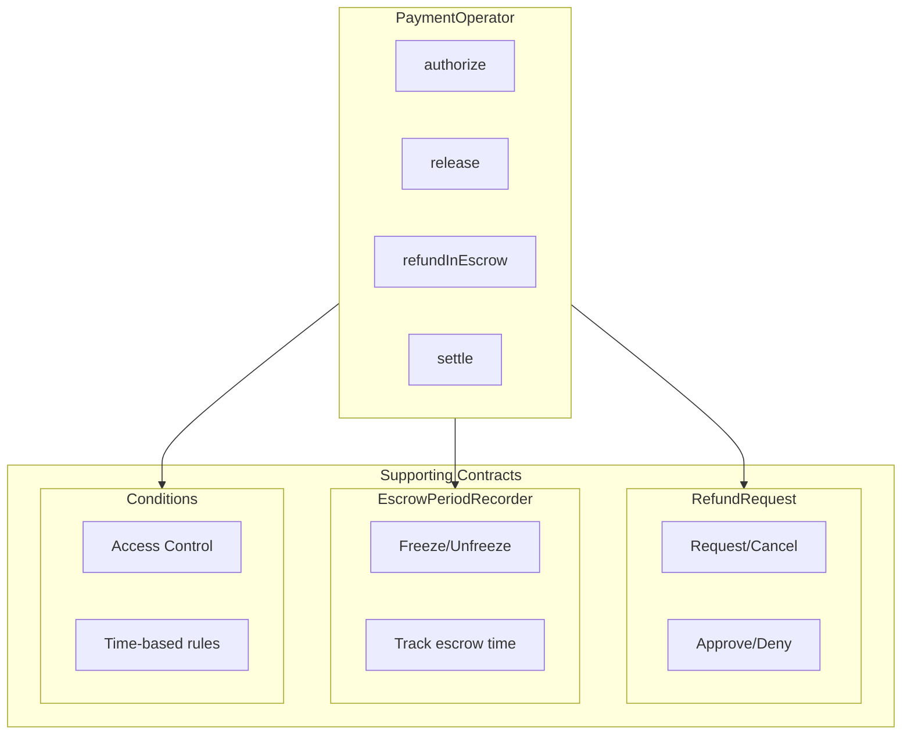

## Payment States

Every payment in X402r goes through a defined lifecycle represented by the `PaymentState` enum:

```typescript
import { PaymentState } from '@x402r/core';

// PaymentState values:
PaymentState.NonExistent  // 0 - Payment doesn't exist
PaymentState.InEscrow     // 1 - Funds held in escrow
PaymentState.Released     // 2 - Funds released to merchant
PaymentState.Settled      // 3 - Payment fully settled
PaymentState.Expired      // 4 - Payment expired
```



## Payment Info

The `PaymentInfo` struct uniquely identifies a payment and contains all its parameters:

```typescript
interface PaymentInfo {
  operator: `0x${string}`;          // PaymentOperator contract address
  payer: `0x${string}`;             // Payer's address
  receiver: `0x${string}`;          // Merchant's address
  token: `0x${string}`;             // Payment token (e.g., USDC)
  maxAmount: bigint;                // Maximum payment amount
  preApprovalExpiry: bigint;        // Pre-approval expiry timestamp (0n if not used)
  authorizationExpiry: bigint;      // When authorization expires
  refundExpiry: bigint;             // Deadline for refund requests
  minFeeBps: number;                // Minimum fee in basis points
  maxFeeBps: number;                // Maximum fee in basis points
  feeReceiver: `0x${string}`;       // Address that receives fees
  salt: bigint;                     // Unique salt for this payment
}
```

<Tip>
Use `computePaymentInfoHash()` from `@x402r/core` to compute the unique hash of a payment.
</Tip>

## Escrow Period

Payments are held in escrow for a configurable period before they can be fully released. During this time:

- **Payers** can request refunds
- **Merchants** can release or refund payments
- **Either party** can freeze the payment to pause the escrow timer

```typescript
import { X402rClient } from '@x402r/client';

// Check escrow status
const authTime = await client.getAuthorizationTime(paymentInfo, recorderAddress);
const isPassed = await client.isEscrowPeriodPassed(paymentInfo, recorderAddress);
const isFrozen = await client.isFrozen(paymentInfo, recorderAddress);
```

## Refund Requests

When a payer wants a refund, they create a refund request that goes through approval:

```typescript
import { RequestStatus } from '@x402r/core';

// RequestStatus values:
RequestStatus.Pending    // 0 - Awaiting decision
RequestStatus.Approved   // 1 - Approved by merchant/arbiter
RequestStatus.Denied     // 2 - Denied by merchant/arbiter
RequestStatus.Cancelled  // 3 - Cancelled by payer
```

### Refund Flow



## Freeze/Unfreeze

Either party can freeze a payment to pause the escrow timer during a dispute:

```typescript
// Payer freezes payment
await client.freezePayment(paymentInfo, recorderAddress);

// Merchant unfreezes payment
await merchant.unfreezePayment(paymentInfo, recorderAddress);

// Check frozen status
const frozen = await client.isFrozen(paymentInfo, recorderAddress);
```

<Warning>
Freezing a payment does not automatically escalate to an arbiter. It simply pauses the escrow timer to allow time for dispute resolution.
</Warning>

## Roles and Permissions

| Role | Can Do |
|------|--------|
| **Payer** | Query payments, request refunds, freeze payments, cancel requests |
| **Merchant** | Release payments, approve/deny refunds, unfreeze payments |
| **Arbiter** | Approve/deny disputed refunds, execute refunds, batch operations |

## Contract Architecture



## Next Steps

<CardGroup cols={2}>
  <Card title="Client SDK" icon="user" href="/sdk/client/quickstart">
    Build payer-side integrations.
  </Card>
  <Card title="Merchant SDK" icon="store" href="/sdk/merchant/quickstart">
    Add refund support to your server.
  </Card>
</CardGroup>
