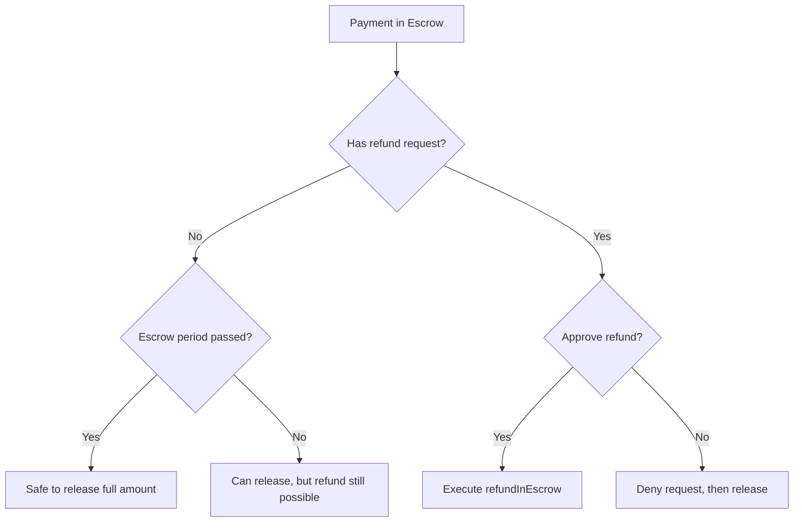

The Merchant SDK provides methods for managing payment releases and refunds.

## Release a Payment

Release funds from escrow to your merchant wallet:

```typescript
// Release full amount
const { txHash } = await merchant.release(paymentInfo);
console.log('Full release:', txHash);
```

### Partial Release

Release a specific amount:

```typescript
// Release 5 USDC (with 6 decimals)
const amount = BigInt('5000000');
const { txHash } = await merchant.release(paymentInfo, amount);
console.log('Partial release:', txHash);
```

<Note>
The remaining funds stay in escrow and can still be refunded or released later.
</Note>

## Refund in Escrow

Return funds to the payer while payment is still in escrow:

```typescript
// Refund full amount
const { txHash } = await merchant.refundInEscrow(paymentInfo);
console.log('Full refund:', txHash);

// Refund partial amount
const { txHash } = await merchant.refundInEscrow(paymentInfo, BigInt('500000'));
console.log('Partial refund:', txHash);
```

## Get Payment State

Check the current state of a payment:

```typescript
import { PaymentState } from '@x402r/core';

const state = await merchant.getPaymentState(paymentInfo);

if (state === PaymentState.InEscrow) {
  console.log('Payment is in escrow - can release or refund');
} else if (state === PaymentState.Released) {
  console.log('Payment already released');
}
```

## Get Received Payments

List all payments received by your merchant address:

```typescript
const { hashes } = await merchant.getReceiverPayments();

console.log(`Received ${hashes.length} payments`);

for (const hash of hashes) {
  const details = await merchant.getPaymentDetails(hash);
  console.log(`Payment: ${hash}`);
  console.log(`  Payer: ${details.payer}`);
  console.log(`  Amount: ${details.maxAmount}`);
}
```

## Get Payment Amounts

Query the available amounts for a payment:

```typescript
const amounts = await merchant.getPaymentAmounts(paymentInfo);

console.log('Capturable:', amounts.capturable);  // Can be released
console.log('Refundable:', amounts.refundable);  // Can be refunded
```

## Example: Batch Release

Release all eligible payments:

```typescript
import { X402rMerchant } from '@x402r/merchant';
import { PaymentState } from '@x402r/core';

async function releaseAllEligible(
  merchant: X402rMerchant,
  recorderAddress: `0x${string}`
) {
  const { hashes } = await merchant.getReceiverPayments();
  const released: string[] = [];

  for (const hash of hashes) {
    const details = await merchant.getPaymentDetails(hash);
    const state = await merchant.getPaymentState(details);

    // Only release payments in escrow
    if (state === PaymentState.InEscrow) {
      // Check if escrow period passed (no refund risk)
      const isPassed = await merchant.isEscrowPeriodPassed(
        details,
        recorderAddress
      );

      if (isPassed) {
        const { txHash } = await merchant.release(details);
        released.push(txHash);
        console.log(`Released: ${hash}`);
      }
    }
  }

  console.log(`Released ${released.length} payments`);
  return released;
}
```

## Release vs Refund Decision Flow



## Best Practices

<AccordionGroup>
  <Accordion title="Wait for escrow period" icon="clock">
    If possible, wait for the escrow period to pass before releasing. This eliminates refund risk.

    ```typescript
    const isPassed = await merchant.isEscrowPeriodPassed(paymentInfo, recorder);
    if (isPassed) {
      await merchant.release(paymentInfo);
    }
    ```
  </Accordion>

  <Accordion title="Handle partial releases carefully" icon="chart-pie">
    Track partial releases to avoid over-releasing:

    ```typescript
    const amounts = await merchant.getPaymentAmounts(paymentInfo);
    const toRelease = amounts.capturable;

    if (toRelease > 0n) {
      await merchant.release(paymentInfo, toRelease);
    }
    ```
  </Accordion>

  <Accordion title="Process refunds promptly" icon="bolt">
    Quick refund processing improves customer satisfaction and reduces dispute escalation.
  </Accordion>
</AccordionGroup>

## Next Steps

<CardGroup cols={2}>
  <Card title="Refund Handling" icon="rotate-left" href="/sdk/merchant/refund-handling">
    Process incoming refund requests.
  </Card>
  <Card title="Server Helpers" icon="server" href="/sdk/merchant/server-helpers">
    Integrate with x402 servers.
  </Card>
</CardGroup>
