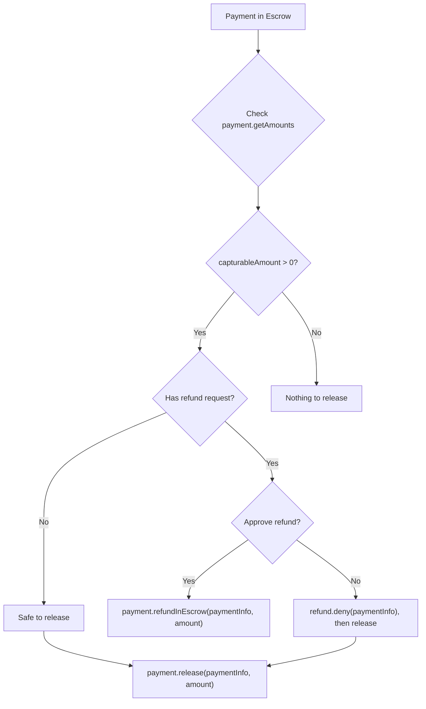

The merchant client provides methods for managing the full payment lifecycle: releasing escrowed funds, charging directly for subscriptions, processing refunds, and querying operator configuration.

## Payment operations

### Release funds from escrow

Use `payment.release()` to transfer escrowed funds to the receiver (merchant). The `amount` parameter is **required**.

```typescript
// Release 10 USDC (6 decimals) from escrow
const txHash = await merchant.payment.release(paymentInfo, BigInt('10000000'));
console.log('Released:', txHash);
```

For partial releases, specify a smaller amount. The remaining funds stay in escrow.

```typescript
// Release 3 USDC of a 10 USDC escrow
const txHash = await merchant.payment.release(paymentInfo, BigInt('3000000'));
console.log('Partial release:', txHash);

// Check what remains
const amounts = await merchant.payment.getAmounts(paymentInfo);
console.log('Remaining in escrow:', amounts.capturableAmount); // 7000000n
```

<Note>
The `amount` parameter is always required. There is no default "release all" behavior. Always query `payment.getAmounts()` first to determine the available capturable amount.
</Note>

### Refund while in escrow

Use `payment.refundInEscrow()` to return escrowed funds to the payer. This also auto-approves any pending RefundRequest.

```typescript
// Full refund of 10 USDC
const txHash = await merchant.payment.refundInEscrow(paymentInfo, BigInt('10000000'));
console.log('Refunded from escrow:', txHash);
```

```typescript
// Partial refund: return 2 USDC, keep 8 USDC in escrow
const txHash = await merchant.payment.refundInEscrow(paymentInfo, BigInt('2000000'));
console.log('Partial refund:', txHash);
```

### Charge directly

Use `payment.charge()` for non-escrow flows such as subscriptions or session-based payments.

```typescript
const tokenCollectorAddress: `0x${string}` = '0xTokenCollector...';
const collectorData: `0x${string}` = '0xSignatureOrCalldata...';

const txHash = await merchant.payment.charge(
  paymentInfo,
  BigInt('5000000'),       // 5 USDC
  tokenCollectorAddress,   // token collector contract
  collectorData            // authorization data (e.g., ERC-3009 signature)
);
console.log('Charged:', txHash);
```

<Tip>
The `charge()` method is designed for recurring payments and session-based billing where funds are not pre-escrowed. The token collector contract handles the actual token transfer.
</Tip>

### Refund after release (post-escrow)

Use `payment.refundPostEscrow()` to refund funds that have already been released to the receiver.

```typescript
const tokenCollectorAddress: `0x${string}` = '0xTokenCollector...';
const collectorData: `0x${string}` = '0xSignatureOrCalldata...';

const txHash = await merchant.payment.refundPostEscrow(
  paymentInfo,
  BigInt('5000000'),       // 5 USDC to refund
  tokenCollectorAddress,   // token collector that sources the refund
  collectorData            // authorization data
);
console.log('Post-escrow refund:', txHash);
```

<Warning>
Post-escrow refunds require the merchant to have sufficient token balance. The token collector pulls funds from the merchant to return to the payer.
</Warning>

## Query methods

### Get payment amounts

```typescript
const amounts = await merchant.payment.getAmounts(paymentInfo);

console.log('Capturable:', amounts.capturableAmount);  // Funds available to release
console.log('Refundable:', amounts.refundableAmount);  // Funds available to refund

if (amounts.capturableAmount > 0n) {
  const txHash = await merchant.payment.release(paymentInfo, amounts.capturableAmount);
  console.log('Released all capturable funds:', txHash);
}
```

### Get operator configuration

Use `operator.getConfig()` to retrieve all immutable slot addresses from the PaymentOperator contract, including conditions and recorders.

```typescript
const config = await merchant.operator.getConfig();

// Core state
console.log('Fee recipient:', config.feeRecipient);
console.log('Fee calculator:', config.feeCalculator);

// Condition slots (address(0) = always allow)
console.log('Release condition:', config.releaseCondition);
console.log('Refund in-escrow condition:', config.refundInEscrowCondition);

// Recorder slots (address(0) = no-op)
console.log('Refund in-escrow recorder:', config.refundInEscrowRecorder);
```

### Get fee addresses

Use `operator.getFeeAddresses()` for the fee-related addresses. This is a lighter alternative to `operator.getConfig()`.

```typescript
const fees = await merchant.operator.getFeeAddresses();

console.log('Fee calculator:', fees.feeCalculator);
console.log('Protocol fee config:', fees.protocolFeeConfig);
console.log('Fee recipient:', fees.feeRecipient);
```

### Get payment state

```typescript
const [hasCollected, capturableAmount, refundableAmount] = await merchant.payment.getState(paymentInfo);
```

## Release vs refund decision flow



## Next steps

<CardGroup cols={2}>
  <Card title="Refund Handling" icon="rotate-left" href="/sdk/merchant/refund-handling">
    Process incoming refund requests with deny workflows.
  </Card>
  <Card title="Event Subscriptions" icon="bell" href="/sdk/merchant/subscriptions">
    Watch for real-time payment and refund events.
  </Card>
  <Card title="PaymentOperator" icon="file-contract" href="/contracts/payment-operator">
    Understand the underlying PaymentOperator contract methods.
  </Card>
  <Card title="forwardToArbiter()" icon="wrench" href="/sdk/helpers/forward-to-arbiter">
    Forward escrow settlements to an arbiter service.
  </Card>
</CardGroup>
