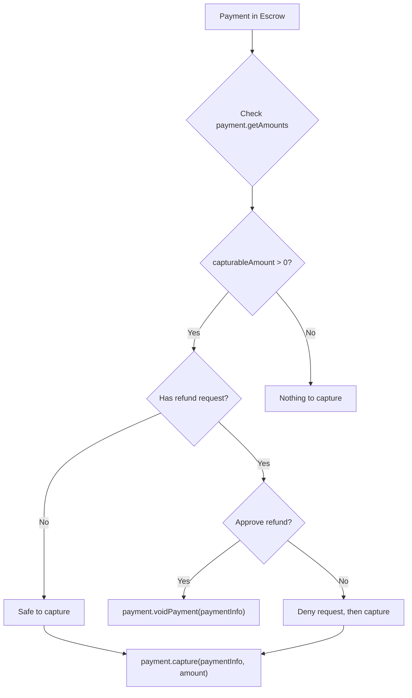

Use `createMerchantClient` to capture escrowed funds, charge directly, void or refund, and query operator state. The methods below sit on the `payment` and `operator` action groups.

## Payment operations

### payment.capture

Transfer escrowed funds to the receiver (merchant). The `amount` parameter is required.

```typescript
// Capture 10 USDC (6 decimals) from escrow
const tx = await merchant.payment.capture(paymentInfo, 10_000_000n)
console.log('Captured:', tx)
```

For partial captures, specify a smaller amount. The remaining funds stay in escrow.

```typescript
// Capture 3 USDC of a 10 USDC escrow
const tx = await merchant.payment.capture(paymentInfo, 3_000_000n)

// Check what remains
const amounts = await merchant.payment.getAmounts(paymentInfo)
console.log('Remaining in escrow:', amounts.capturableAmount) // 7000000n
```

<Note>
Always query `payment.getAmounts()` first to determine the available capturable amount.
</Note>

### payment.voidPayment

Return all escrowed funds to the payer before capture. Void is full-only: it empties the authorization in one transaction. For a partial return, call `payment.capture()` for the part to keep, then void or let the remainder expire.

```typescript
const tx = await merchant.payment.voidPayment(paymentInfo)
console.log('Voided:', tx)
```

### payment.charge

For non-escrow flows such as subscriptions or session-based payments. Pulls funds directly from the payer via a token collector (e.g., ERC-3009 `transferWithAuthorization`).

```typescript
const tx = await merchant.payment.charge(
  paymentInfo,
  5_000_000n,                               // 5 USDC
  '0xTokenCollector...' as `0x${string}`,   // token collector contract
  '0xSignatureData...' as `0x${string}`,    // authorization data
)
console.log('Charged:', tx)
```

<Tip>
The `charge()` method is designed for recurring payments and session-based billing where funds are not pre-escrowed.
</Tip>

### payment.refund

Refund funds that have already been released. Requires a token collector to source the refund from the merchant's balance.

```typescript
const tx = await merchant.payment.refund(
  paymentInfo,
  5_000_000n,                               // 5 USDC to refund
  '0xTokenCollector...' as `0x${string}`,   // sources the refund
  '0xSignatureData...' as `0x${string}`,    // authorization data
)
console.log('Refund (after capture):', tx)
```

<Warning>
Refunds (after capture) require the merchant to have sufficient token balance. The token collector pulls funds from the merchant to return to the payer.
</Warning>

### payment.approveRefundAllowance

Approve a refund allowance. This sets how much the refund collector can pull from the merchant for a given token.

```typescript
const tx = await merchant.payment.approveRefundAllowance(
  '0xTokenAddress...' as `0x${string}`, // ERC-20 token
  5_000_000n,                            // 5 USDC
)
console.log('Allowance approved:', tx)
```

### payment.getRefundAllowance

Check the current refund allowance for a token/owner pair.

```typescript
const allowance = await merchant.payment.getRefundAllowance(
  '0xTokenAddress...' as `0x${string}`,
  '0xMerchantAddress...' as `0x${string}`,
)
console.log('Allowance:', allowance)
```

## Query methods

### payment.getAmounts

Query the current capturable and refundable amounts for a payment.

```typescript
const amounts = await merchant.payment.getAmounts(paymentInfo)

console.log('Has collected:', amounts.hasCollectedPayment)
console.log('Capturable:', amounts.capturableAmount)
console.log('Refundable:', amounts.refundableAmount)
```

### payment.getState

Returns a tuple of the payment's lifecycle position.

```typescript
const [hasCollectedPayment, capturableAmount, refundableAmount] =
  await merchant.payment.getState(paymentInfo)
```

### operator.getConfig

Retrieve all slot addresses from the PaymentOperator contract.

```typescript
const config = await merchant.operator.getConfig()

console.log('Fee receiver:',      config.feeReceiver)
console.log('Fee calculator:',    config.feeCalculator)
console.log('Capture condition:', config.captureCondition)
```

### operator.getFeeAddresses

Get the fee-related addresses.

```typescript
const fees = await merchant.operator.getFeeAddresses()

console.log('Operator fee calculator:', fees.operatorFeeCalculator)
console.log('Protocol fee config:',     fees.protocolFeeConfig)
console.log('Protocol fee calculator:', fees.protocolFeeCalculator)
console.log('Operator fee recipient:',  fees.operatorFeeRecipient)
console.log('Protocol fee recipient:',  fees.protocolFeeRecipient)
```

### operator.calculateFees

Calculate the full fee breakdown for a payment amount.

```typescript
const fees = await merchant.operator.calculateFees(paymentInfo, 1_000_000n)

console.log('Operator fee bps:', fees.operatorFeeBps)
console.log('Protocol fee bps:', fees.protocolFeeBps)
console.log('Total fee bps:',    fees.totalFeeBps)
console.log('Operator fee:',     fees.operatorFeeAmount)
console.log('Protocol fee:',     fees.protocolFeeAmount)
console.log('Total fee:',        fees.totalFeeAmount)
console.log('Net amount:',       fees.netAmount)
```

## Capture vs refund decision flow



## Next steps

<CardGroup cols={2}>
  <Card title="Refund Handling" icon="rotate-left" href="/sdk/merchant/refund-handling">
    Process incoming refund requests with deny workflows.
  </Card>
  <Card title="Event Subscriptions" icon="bell" href="/sdk/merchant/subscriptions">
    Watch for real-time payment and refund events.
  </Card>
  <Card title="PaymentOperator" icon="file-contract" href="/contracts/payment-operator">
    Understand the underlying PaymentOperator contract methods.
  </Card>
  <Card title="forwardToArbiter()" icon="wrench" href="/sdk/helpers/forward-to-arbiter">
    Forward escrow settlements to an arbiter service.
  </Card>
</CardGroup>
