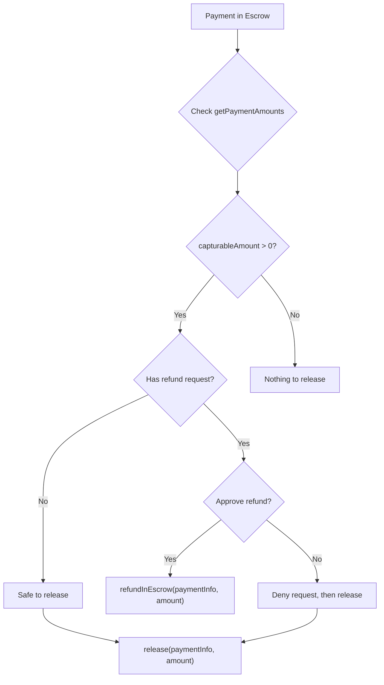

The `@x402r/merchant` package provides everything merchants need for the post-payment lifecycle: releasing escrowed funds, charging directly, processing refunds, and querying operator state.

<Info>
**Looking for server setup?** The [Merchant Server Quickstart](/sdk/merchant/getting-started) shows how to accept escrow payments via Express middleware. This page covers the `X402rMerchant` class for managing payments after they arrive.
</Info>

## Installation

```bash
npm install @x402r/merchant @x402r/core viem
```

## Setup

Create viem clients as described in [Installation](/sdk/installation), then:

```typescript
import { X402rMerchant } from '@x402r/merchant';
import { getNetworkConfig } from '@x402r/core';

const config = getNetworkConfig('eip155:84532')!;

const merchant = new X402rMerchant({
  publicClient,
  walletClient,
  operatorAddress: '0x...', // Your PaymentOperator address
  escrowAddress: config.authCaptureEscrow,
  refundRequestAddress: config.refundRequest,
});
```

## Release Funds from Escrow

Use `release()` to transfer escrowed funds to the receiver (merchant). The `amount` parameter is **required** and specifies the exact amount to release in token units.

```typescript
// Release 10 USDC (6 decimals) from escrow
const { txHash } = await merchant.release(paymentInfo, BigInt('10000000'));
console.log('Released:', txHash);
```

For partial releases, specify a smaller amount. The remaining funds stay in escrow and can be released or refunded later.

```typescript
// Release 3 USDC of a 10 USDC escrow
const { txHash } = await merchant.release(paymentInfo, BigInt('3000000'));
console.log('Partial release:', txHash);

// Check what remains
const { capturableAmount } = await merchant.getPaymentAmounts(paymentInfo);
console.log('Remaining in escrow:', capturableAmount); // 7000000n
```

<Note>
The `amount` parameter is always required. There is no default "release all" behavior. Always query `getPaymentAmounts()` first to determine the available capturable amount.
</Note>

## Refund While in Escrow

Use `refundInEscrow()` to return escrowed funds to the payer before release. The `amount` parameter is **required**.

```typescript
// Full refund of 10 USDC
const { txHash } = await merchant.refundInEscrow(paymentInfo, BigInt('10000000'));
console.log('Refunded from escrow:', txHash);
```

```typescript
// Partial refund: return 2 USDC, keep 8 USDC in escrow
const { txHash } = await merchant.refundInEscrow(paymentInfo, BigInt('2000000'));
console.log('Partial refund:', txHash);
```

## Charge Directly

Use `charge()` for non-escrow flows such as subscriptions or session-based payments. This pulls funds directly from the payer via a token collector (e.g., ERC-3009 `transferWithAuthorization`).

```typescript
const tokenCollectorAddress: `0x${string}` = '0xTokenCollector...';
const collectorData: `0x${string}` = '0xSignatureOrCalldata...';

const { txHash } = await merchant.charge(
  paymentInfo,
  BigInt('5000000'),       // 5 USDC
  tokenCollectorAddress,   // token collector contract
  collectorData            // authorization data (e.g., ERC-3009 signature)
);
console.log('Charged:', txHash);
```

<Tip>
The `charge()` method is designed for recurring payments and session-based billing where funds are not pre-escrowed. The token collector contract handles the actual token transfer.
</Tip>

## Refund After Release (Post-Escrow)

Use `refundPostEscrow()` to refund funds that have already been released to the receiver. This requires a token collector to source the refund from the merchant's balance.

```typescript
const tokenCollectorAddress: `0x${string}` = '0xTokenCollector...';
const collectorData: `0x${string}` = '0xSignatureOrCalldata...';

const { txHash } = await merchant.refundPostEscrow(
  paymentInfo,
  BigInt('5000000'),       // 5 USDC to refund
  tokenCollectorAddress,   // token collector that sources the refund
  collectorData            // authorization data
);
console.log('Post-escrow refund:', txHash);
```

<Warning>
Post-escrow refunds require the merchant to have sufficient token balance. The token collector pulls funds from the merchant to return to the payer.
</Warning>

## Query Methods

### Get Payment Amounts

Use `getPaymentAmounts()` to query the current capturable and refundable amounts for a payment.

```typescript
const { capturableAmount, refundableAmount } = await merchant.getPaymentAmounts(paymentInfo);

console.log('Capturable:', capturableAmount);  // Funds available to release
console.log('Refundable:', refundableAmount);  // Funds available to refund

if (capturableAmount > 0n) {
  const { txHash } = await merchant.release(paymentInfo, capturableAmount);
  console.log('Released all capturable funds:', txHash);
}
```

<Info>
`getPaymentAmounts()` requires the `escrowAddress` to be configured when creating the `X402rMerchant` instance.
</Info>

### Get Payment State

Use `getPaymentState()` to derive the lifecycle state of a payment from the escrow contract.

```typescript
import { PaymentState } from '@x402r/core';

const state = await merchant.getPaymentState(paymentInfo);
// PaymentState: NonExistent, InEscrow, Released, Settled, or Expired
```

### Get Receiver Payments

Use `getReceiverPayments()` to list all payments where the connected wallet is the receiver.

```typescript
const payments = await merchant.getReceiverPayments();

for (const { hash, paymentInfo } of payments) {
  console.log(`Payment ${hash}: ${paymentInfo.maxAmount}`);
}
```

<Note>
This method scans event logs. Pass `fromBlock` to limit the scan range if your RPC limits `eth_getLogs` responses (Base Sepolia typically caps at 10,000 blocks).
</Note>

### Get Payment Details

Use `getPaymentDetails()` to retrieve the full `PaymentInfo` struct by scanning `AuthorizationCreated` events for a given hash.

```typescript
const details = await merchant.getPaymentDetails(paymentInfoHash);
console.log('Payer:', details.payer);
console.log('Amount:', details.maxAmount);
```

### Get Operator Configuration

Use `getOperatorConfig()` to retrieve all 14 immutable slot addresses from the PaymentOperator contract.

```typescript
const config = await merchant.getOperatorConfig();

console.log('Escrow:', config.escrow);
console.log('Fee recipient:', config.feeRecipient);
console.log('Fee calculator:', config.feeCalculator);
console.log('Release condition:', config.releaseCondition);
```

### Get Fee Structure

Use `getFeeStructure()` for just the fee-related addresses — a lighter alternative to `getOperatorConfig()`.

```typescript
const fees = await merchant.getFeeStructure();

console.log('Fee calculator:', fees.feeCalculator);
console.log('Protocol fee config:', fees.protocolFeeConfig);
console.log('Fee recipient:', fees.feeRecipient);
```

### Get Release Conditions

```typescript
const releaseCondition = await merchant.getReleaseConditions();
// address(0) means releases are always allowed
```

## Release vs Refund Decision Flow



## Next Steps

<CardGroup cols={2}>
  <Card title="Refund Handling" icon="rotate-left" href="/sdk/merchant/refund-handling">
    Process incoming refund requests with approve/deny workflows.
  </Card>
  <Card title="forwardToArbiter()" icon="wrench" href="/sdk/helpers/forward-to-arbiter">
    Forward escrow settlements to an arbiter service.
  </Card>
  <Card title="PaymentOperator" icon="file-contract" href="/contracts/payment-operator">
    Understand the underlying PaymentOperator contract methods.
  </Card>
</CardGroup>
