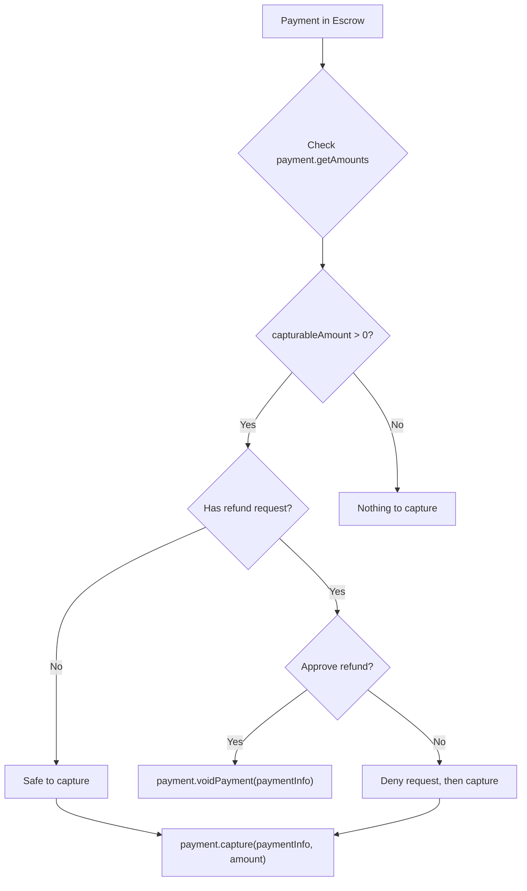

The `@x402r/sdk` package covers the merchant's post-payment lifecycle: capturing escrowed funds, charging directly, processing refunds, and querying operator state.

<Info>
**Looking for server setup?** The [Merchant Server Quickstart](/sdk/merchant/getting-started) shows how to accept escrow payments via Express middleware. This page covers the `createMerchantClient` factory for managing payments after they arrive.
</Info>

## Installation

<CodeGroup>
```bash npm
npm install @x402r/sdk viem
```
```bash pnpm
pnpm add @x402r/sdk viem
```
```bash bun
bun add @x402r/sdk viem
```
</CodeGroup>

## Setup

```typescript
import { createMerchantClient } from '@x402r/sdk'
import { createPublicClient, createWalletClient, http } from 'viem'
import { baseSepolia } from 'viem/chains'
import { privateKeyToAccount } from 'viem/accounts'

const account = privateKeyToAccount(process.env.PRIVATE_KEY as `0x${string}`)

const merchant = createMerchantClient({
  publicClient: createPublicClient({ chain: baseSepolia, transport: http() }),
  walletClient: createWalletClient({
    account,
    chain: baseSepolia,
    transport: http(),
  }),
  operatorAddress: '0x...',
  escrowPeriodAddress: '0x...',
  refundRequestAddress: '0x...',
  refundRequestEvidenceAddress: '0x...',
  freezeAddress: '0x...',
})
```

## Capture funds from escrow

Use `payment.capture()` to transfer escrowed funds to the receiver (merchant). The `amount` parameter is required.

```typescript
// Capture 10 USDC (6 decimals) from escrow
const tx = await merchant.payment.capture(paymentInfo, 10_000_000n)
console.log('Captured:', tx)
```

For partial captures, specify a smaller amount. The remaining funds stay in escrow.

```typescript
// Capture 3 USDC of a 10 USDC escrow
const tx = await merchant.payment.capture(paymentInfo, 3_000_000n)
console.log('Partial capture:', tx)

// Check what remains
const amounts = await merchant.payment.getAmounts(paymentInfo)
console.log('Remaining in escrow:', amounts.capturableAmount) // 7000000n
```

<Note>
Always query `payment.getAmounts()` first to determine the available capturable amount.
</Note>

## Void while in escrow

Use `payment.voidPayment()` to return all escrowed funds to the payer before capture. Void is full-only: it empties the authorization in one transaction.

```typescript
const tx = await merchant.payment.voidPayment(paymentInfo)
console.log('Voided:', tx)
```

<Note>
For a partial return (capture some, return the rest), call `payment.capture(paymentInfo, amount)` for the part you want to keep. The unused authorization can then be voided, or it will expire at `captureDeadline` and become reclaimable by the payer.
</Note>

## Charge directly

Use `payment.charge()` for non-escrow flows such as subscriptions or session-based payments. This pulls funds directly from the payer via a token collector (e.g., ERC-3009 `transferWithAuthorization`).

```typescript
const tx = await merchant.payment.charge(
  paymentInfo,
  5_000_000n,                               // 5 USDC
  '0xTokenCollector...' as `0x${string}`,   // token collector contract
  '0xSignatureData...' as `0x${string}`,    // authorization data
)
console.log('Charged:', tx)
```

<Tip>
The `charge()` method is designed for recurring payments and session-based billing where funds are not pre-escrowed. The token collector contract handles the actual token transfer.
</Tip>

## Refund after capture (after capture)

Use `payment.refund()` to refund funds that have already been released. This requires a token collector to source the refund from the merchant's balance.

```typescript
const tx = await merchant.payment.refund(
  paymentInfo,
  5_000_000n,                               // 5 USDC to refund
  '0xTokenCollector...' as `0x${string}`,   // sources the refund
  '0xSignatureData...' as `0x${string}`,    // authorization data
)
console.log('Refund (after capture):', tx)
```

<Warning>
Refunds (after capture) require the merchant to have sufficient token balance. The token collector pulls funds from the merchant to return to the payer.
</Warning>

## Query methods

### payment.getAmounts

Query the current capturable and refundable amounts for a payment.

```typescript
const amounts = await merchant.payment.getAmounts(paymentInfo)

console.log('Capturable:', amounts.capturableAmount)
console.log('Refundable:', amounts.refundableAmount)

if (amounts.capturableAmount > 0n) {
  await merchant.payment.capture(paymentInfo, amounts.capturableAmount)
}
```

### payment.getState

Returns a tuple of the payment's lifecycle position.

```typescript
const [hasCollectedPayment, capturableAmount, refundableAmount] =
  await merchant.payment.getState(paymentInfo)
```

### operator.getConfig

Retrieve all slot addresses from the PaymentOperator contract.

```typescript
const config = await merchant.operator.getConfig()

console.log('Fee receiver:',      config.feeReceiver)
console.log('Fee calculator:',    config.feeCalculator)
console.log('Capture condition:', config.captureCondition)
```

### operator.getFeeAddresses

Get the fee-related addresses.

```typescript
const fees = await merchant.operator.getFeeAddresses()

console.log('Operator fee calculator:', fees.operatorFeeCalculator)
console.log('Protocol fee config:',     fees.protocolFeeConfig)
console.log('Protocol fee calculator:', fees.protocolFeeCalculator)
console.log('Operator fee recipient:',  fees.operatorFeeRecipient)
console.log('Protocol fee recipient:',  fees.protocolFeeRecipient)
```

### operator.calculateFees

Calculate the full fee breakdown for a payment amount.

```typescript
const fees = await merchant.operator.calculateFees(paymentInfo, 1_000_000n)

console.log('Operator fee bps:', fees.operatorFeeBps)
console.log('Protocol fee bps:', fees.protocolFeeBps)
console.log('Total fee bps:',    fees.totalFeeBps)
console.log('Operator fee:',     fees.operatorFeeAmount)
console.log('Protocol fee:',     fees.protocolFeeAmount)
console.log('Total fee:',        fees.totalFeeAmount)
console.log('Net amount:',       fees.netAmount)
```

## Capture vs refund decision flow



## Next steps

<CardGroup cols={2}>
  <Card title="Refund Handling" icon="rotate-left" href="/sdk/merchant/refund-handling">
    Process incoming refund requests with deny workflows.
  </Card>
  <Card title="forwardToArbiter()" icon="wrench" href="/sdk/helpers/forward-to-arbiter">
    Forward escrow settlements to an arbiter service.
  </Card>
  <Card title="PaymentOperator" icon="file-contract" href="/contracts/payment-operator">
    Understand the underlying PaymentOperator contract methods.
  </Card>
</CardGroup>
