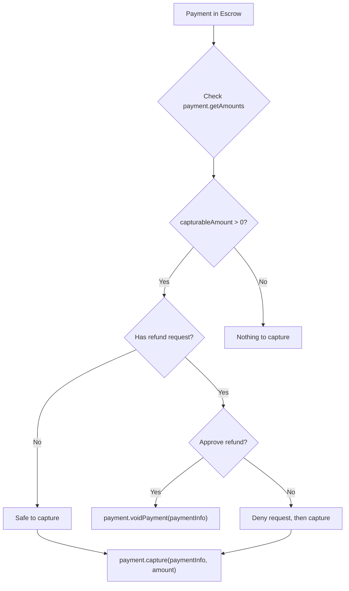

The `@x402r/sdk` package covers the merchant's post-payment lifecycle: capturing escrowed funds, charging directly, processing refunds, and querying operator state.

<Info>
**Looking for server setup?** The [Merchant Server Quickstart](/sdk/merchant/getting-started) shows how to accept escrow payments via Express middleware. This page covers the `createMerchantClient` factory for managing payments after they arrive.
</Info>

## Installation

<CodeGroup>
```bash npm
npm install @x402r/sdk viem
```
```bash pnpm
pnpm add @x402r/sdk viem
```
```bash bun
bun add @x402r/sdk viem
```
</CodeGroup>

## Setup

```typescript
import { createMerchantClient } from '@x402r/sdk'
import { createPublicClient, createWalletClient, http } from 'viem'
import { baseSepolia } from 'viem/chains'
import { privateKeyToAccount } from 'viem/accounts'

const account = privateKeyToAccount(process.env.PRIVATE_KEY as `0x${string}`)

const merchant = createMerchantClient({
  publicClient: createPublicClient({ chain: baseSepolia, transport: http() }),
  walletClient: createWalletClient({
    account,
    chain: baseSepolia,
    transport: http(),
  }),
  operatorAddress: '0x...',
  escrowPeriodAddress: '0x...',
  refundRequestAddress: '0x...',
  refundRequestEvidenceAddress: '0x...',
  freezeAddress: '0x...',
})
```

## payment.capture

Transfer escrowed funds to the receiver. Specify a smaller amount than `paymentInfo.maxAmount` for a partial capture; the remainder stays in escrow.

```typescript
const tx = await merchant.payment.capture(paymentInfo, 10_000_000n)
```

**Parameters**

| Name | Type | Description |
|---|---|---|
| `paymentInfo` | `PaymentInfo` | Full struct identifying the payment |
| `amount` | `bigint` | Atomic units to capture (must be ≤ `paymentInfo.maxAmount`) |
| `data` | `Hex` _(optional)_ | Pass-through data for the operator's pre/post action plugins |

**Returns** `Promise<Hash>`, the settlement transaction hash.

<Note>
Always query `payment.getAmounts()` first to determine the available capturable amount.
</Note>

## payment.voidPayment

Return all escrowed funds to the payer before capture. Full-only: `void()` empties the authorization in one transaction. For a partial return, capture the portion you want to keep first, then void the remainder (or let it expire at `captureDeadline`).

```typescript
const tx = await merchant.payment.voidPayment(paymentInfo)
```

**Parameters**

| Name | Type | Description |
|---|---|---|
| `paymentInfo` | `PaymentInfo` | Full struct identifying the payment |
| `data` | `Hex` _(optional)_ | Pass-through data for the operator's pre/post action plugins |

**Returns** `Promise<Hash>`, the void transaction hash.

## payment.charge

Non-escrow settlement for subscriptions or session-based payments. Pulls funds directly from the payer via a token collector (no escrow hold).

```typescript
const tx = await merchant.payment.charge(
  paymentInfo,
  5_000_000n,
  '0xTokenCollector...' as `0x${string}`,
  '0xSignatureData...' as `0x${string}`,
)
```

**Parameters**

| Name | Type | Description |
|---|---|---|
| `paymentInfo` | `PaymentInfo` | Full struct identifying the payment |
| `amount` | `bigint` | Atomic units to charge |
| `tokenCollector` | `Address` | Canonical token collector for the chosen `assetTransferMethod` |
| `collectorData` | `Hex` | Raw ERC-3009 signature or ABI-encoded Permit2 signature |

**Returns** `Promise<Hash>`, the charge transaction hash.

## payment.refund

Refund funds that have already been captured. Requires a token collector to pull funds from the merchant's balance.

```typescript
const tx = await merchant.payment.refund(
  paymentInfo,
  5_000_000n,
  '0xTokenCollector...' as `0x${string}`,
  '0xSignatureData...' as `0x${string}`,
)
```

**Parameters**

| Name | Type | Description |
|---|---|---|
| `paymentInfo` | `PaymentInfo` | Full struct identifying the payment |
| `amount` | `bigint` | Atomic units to refund to the payer |
| `tokenCollector` | `Address` | Token collector that sources the refund (typically `ReceiverRefundCollector`) |
| `collectorData` | `Hex` | Data passed to the collector (e.g., receiver signature) |

**Returns** `Promise<Hash>`, the refund transaction hash.

<Warning>
Refunds after capture require the merchant to have sufficient token balance and an approved allowance on the refund collector.
</Warning>

## payment.getAmounts

Query the current capturable and refundable amounts for a payment.

```typescript
const amounts = await merchant.payment.getAmounts(paymentInfo)
```

**Parameters**

| Name | Type | Description |
|---|---|---|
| `paymentInfo` | `PaymentInfo` | Full struct identifying the payment |

**Returns** `Promise<PaymentAmounts>`:

| Field | Type | Description |
|---|---|---|
| `hasCollectedPayment` | `boolean` | Whether the payment is collected on-chain |
| `capturableAmount` | `bigint` | Atomic units still capturable from escrow |
| `refundableAmount` | `bigint` | Atomic units still refundable |

## payment.getState

Returns the payment's lifecycle position as a tuple. There is no `PaymentState` enum.

```typescript
const [hasCollectedPayment, capturableAmount, refundableAmount] =
  await merchant.payment.getState(paymentInfo)
```

**Parameters**

| Name | Type | Description |
|---|---|---|
| `paymentInfo` | `PaymentInfo` | Full struct identifying the payment |

**Returns** `Promise<readonly [boolean, bigint, bigint]>`, `[hasCollectedPayment, capturableAmount, refundableAmount]`.

## operator.getConfig

Retrieve all slot addresses from the PaymentOperator contract.

```typescript
const config = await merchant.operator.getConfig()
```

**Returns** `Promise<OperatorSlots>`, see `packages/core/src/actions/operator/types.ts`. Key fields:

| Field | Type | Description |
|---|---|---|
| `escrow` | `Address` | Canonical AuthCaptureEscrow |
| `authorizeCondition` / `authorizeHook` | `Address` | Pre/post slots for `authorize` |
| `chargeCondition` / `chargeHook` | `Address` | Pre/post slots for `charge` |
| `captureCondition` / `captureHook` | `Address` | Pre/post slots for `capture` |
| `voidCondition` / `voidHook` | `Address` | Pre/post slots for `void` |
| `refundCondition` / `refundHook` | `Address` | Pre/post slots for `refund` |
| `feeCalculator` | `Address` | Per-operator fee calculator |
| `feeReceiver` | `Address` | Operator fee recipient |
| `protocolFeeConfig` | `Address` | Protocol fee config contract |

## operator.getFeeAddresses

Fetch the fee-related addresses (subset of `getConfig` with both operator and protocol resolved).

```typescript
const fees = await merchant.operator.getFeeAddresses()
```

**Returns** `Promise<FeeAddresses>`:

| Field | Type | Description |
|---|---|---|
| `operatorFeeCalculator` | `Address` | Per-operator calculator |
| `protocolFeeConfig` | `Address` | Protocol fee config contract |
| `protocolFeeCalculator` | `Address` | Protocol-level calculator |
| `operatorFeeRecipient` | `Address` | Where operator fees flow |
| `protocolFeeRecipient` | `Address` | Where protocol fees flow |

## operator.calculateFees

Calculate the full fee breakdown for a payment amount.

```typescript
const fees = await merchant.operator.calculateFees(paymentInfo, 1_000_000n)
```

**Parameters**

| Name | Type | Description |
|---|---|---|
| `paymentInfo` | `PaymentInfo` | Full struct identifying the payment |
| `amount` | `bigint` | Atomic units to compute fees for |

**Returns** `Promise<FeeCalculationResult>`:

| Field | Type | Description |
|---|---|---|
| `protocolFeeBps` | `bigint` | Protocol fee in basis points |
| `operatorFeeBps` | `bigint` | Operator fee in basis points |
| `totalFeeBps` | `bigint` | Sum of the two |
| `protocolFeeAmount` | `bigint` | Atomic units of protocol fee |
| `operatorFeeAmount` | `bigint` | Atomic units of operator fee |
| `totalFeeAmount` | `bigint` | Atomic units of total fee |
| `netAmount` | `bigint` | Amount remaining after fees |

## Capture vs refund decision flow



## Next steps

<CardGroup cols={2}>
  <Card title="Refund Handling" icon="rotate-left" href="/sdk/merchant/refund-handling">
    Process incoming refund requests with deny workflows.
  </Card>
  <Card title="forwardToArbiter()" icon="wrench" href="/sdk/helpers/forward-to-arbiter">
    Forward escrow settlements to an arbiter service.
  </Card>
  <Card title="PaymentOperator" icon="file-contract" href="/contracts/payment-operator">
    Understand the underlying PaymentOperator contract methods.
  </Card>
</CardGroup>
