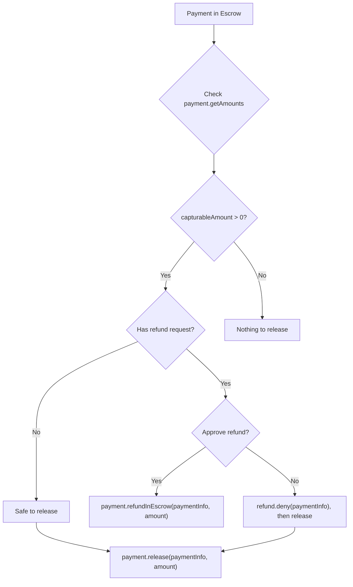

The `@x402r/sdk` package provides everything merchants need for the post-payment lifecycle: releasing escrowed funds, charging directly, processing refunds, and querying operator state.

<Info>
**Looking for server setup?** The [Merchant Server Quickstart](/sdk/merchant/getting-started) shows how to accept escrow payments via Express middleware. This page covers the merchant client for managing payments after they arrive.
</Info>

## Installation

```bash
npm install @x402r/sdk @x402r/helpers @x402r/core viem
```

## Setup

Create viem clients as described in [Installation](/sdk/overview), then:

```typescript
import { createMerchantClient } from '@x402r/sdk';

const merchant = createMerchantClient({
  publicClient,
  walletClient,
  operatorAddress: '0x...', // Your PaymentOperator address
  // Optional: enable escrow and freeze features
  escrowPeriodAddress: '0x...',
  freezeAddress: '0x...',
});
```

Refund request and evidence addresses are auto-resolved from the chain config.

## Release funds from escrow

Use `payment.release()` to transfer escrowed funds to the receiver (merchant). The `amount` parameter is **required** and specifies the exact amount to release in token units.

```typescript
// Release 10 USDC (6 decimals) from escrow
const txHash = await merchant.payment.release(paymentInfo, BigInt('10000000'));
console.log('Released:', txHash);
```

For partial releases, specify a smaller amount. The remaining funds stay in escrow and can be released or refunded later.

```typescript
// Release 3 USDC of a 10 USDC escrow
const txHash = await merchant.payment.release(paymentInfo, BigInt('3000000'));
console.log('Partial release:', txHash);

// Check what remains
const amounts = await merchant.payment.getAmounts(paymentInfo);
console.log('Remaining in escrow:', amounts.capturableAmount); // 7000000n
```

<Note>
The `amount` parameter is always required. There is no default "release all" behavior. Always query `payment.getAmounts()` first to determine the available capturable amount.
</Note>

## Refund while in escrow

Use `payment.refundInEscrow()` to return escrowed funds to the payer before release. This also auto-approves any pending RefundRequest for this payment.

```typescript
// Full refund of 10 USDC
const txHash = await merchant.payment.refundInEscrow(paymentInfo, BigInt('10000000'));
console.log('Refunded from escrow:', txHash);
```

```typescript
// Partial refund: return 2 USDC, keep 8 USDC in escrow
const txHash = await merchant.payment.refundInEscrow(paymentInfo, BigInt('2000000'));
console.log('Partial refund:', txHash);
```

<Tip>
In v3, calling `refundInEscrow()` automatically approves any pending RefundRequest for this payment via the IRecorder plugin. You do not need a separate approve step.
</Tip>

## Charge directly

Use `payment.charge()` for non-escrow flows such as subscriptions or session-based payments. This pulls funds directly from the payer via a token collector (e.g., ERC-3009 `transferWithAuthorization`).

```typescript
const tokenCollectorAddress: `0x${string}` = '0xTokenCollector...';
const collectorData: `0x${string}` = '0xSignatureOrCalldata...';

const txHash = await merchant.payment.charge(
  paymentInfo,
  BigInt('5000000'),       // 5 USDC
  tokenCollectorAddress,   // token collector contract
  collectorData            // authorization data (e.g., ERC-3009 signature)
);
console.log('Charged:', txHash);
```

<Tip>
The `charge()` method is designed for recurring payments and session-based billing where funds are not pre-escrowed. The token collector contract handles the actual token transfer.
</Tip>

## Refund after release (post-escrow)

Use `payment.refundPostEscrow()` to refund funds that have already been released to the receiver. This requires a token collector to source the refund from the merchant's balance.

```typescript
const tokenCollectorAddress: `0x${string}` = '0xTokenCollector...';
const collectorData: `0x${string}` = '0xSignatureOrCalldata...';

const txHash = await merchant.payment.refundPostEscrow(
  paymentInfo,
  BigInt('5000000'),       // 5 USDC to refund
  tokenCollectorAddress,   // token collector that sources the refund
  collectorData            // authorization data
);
console.log('Post-escrow refund:', txHash);
```

<Warning>
Post-escrow refunds require the merchant to have sufficient token balance. The token collector pulls funds from the merchant to return to the payer.
</Warning>

## Query methods

### Get payment amounts

```typescript
const amounts = await merchant.payment.getAmounts(paymentInfo);

console.log('Capturable:', amounts.capturableAmount);  // Funds available to release
console.log('Refundable:', amounts.refundableAmount);  // Funds available to refund

if (amounts.capturableAmount > 0n) {
  const txHash = await merchant.payment.release(paymentInfo, amounts.capturableAmount);
  console.log('Released all capturable funds:', txHash);
}
```

### Get payment state

```typescript
const [hasCollected, capturableAmount, refundableAmount] = await merchant.payment.getState(paymentInfo);
```

### Get operator configuration

Use `operator.getConfig()` to retrieve all immutable slot addresses from the PaymentOperator contract.

```typescript
const config = await merchant.operator.getConfig();

console.log('Fee recipient:', config.feeRecipient);
console.log('Fee calculator:', config.feeCalculator);
console.log('Release condition:', config.releaseCondition);
```

### Get fee structure

Use `operator.getFeeAddresses()` for just the fee-related addresses.

```typescript
const fees = await merchant.operator.getFeeAddresses();

console.log('Fee calculator:', fees.feeCalculator);
console.log('Protocol fee config:', fees.protocolFeeConfig);
console.log('Fee recipient:', fees.feeRecipient);
```

## Release vs refund decision flow



## Next steps

<CardGroup cols={2}>
  <Card title="Refund Handling" icon="rotate-left" href="/sdk/merchant/refund-handling">
    Process incoming refund requests with deny workflows.
  </Card>
  <Card title="Helpers" icon="wrench" href="/sdk/helpers/refundable">
    Mark payment options as refundable with your operator.
  </Card>
  <Card title="PaymentOperator" icon="file-contract" href="/contracts/payment-operator">
    Understand the underlying PaymentOperator contract methods.
  </Card>
</CardGroup>
