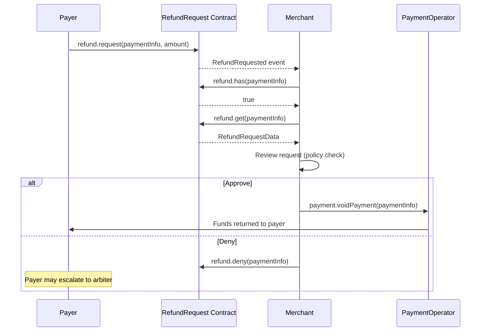

The merchant client provides refund management through the `refund` and `freeze` action groups. The `refund` group requires `refundRequestAddress` in the client config.

## Refund request queries

### refund.has

Check whether a refund request exists for a payment.

```typescript
const hasRequest = await merchant.refund?.has(paymentInfo)
```

**Parameters**

| Name | Type | Description |
|---|---|---|
| `paymentInfo` | `PaymentInfo` | Full struct identifying the payment |

**Returns** `Promise<boolean>`.

### refund.getStatus

Retrieve the current status of a refund request.

```typescript
import { RefundRequestStatus } from '@x402r/sdk'

const status = await merchant.refund?.getStatus(paymentInfo)
```

**Parameters**

| Name | Type | Description |
|---|---|---|
| `paymentInfo` | `PaymentInfo` | Full struct identifying the payment |

**Returns** `Promise<RefundRequestStatus>`, `Pending` \| `Approved` \| `Denied` \| `Cancelled` \| `Refused`.

### refund.get

Retrieve the complete refund request data.

```typescript
const request = await merchant.refund?.get(paymentInfo)
```

**Parameters**

| Name | Type | Description |
|---|---|---|
| `paymentInfo` | `PaymentInfo` | Full struct identifying the payment |

**Returns** `Promise<RefundRequestData>`:

| Field | Type | Description |
|---|---|---|
| `paymentInfoHash` | `Hex` | keccak256 of the payment info struct |
| `amount` | `bigint` | Amount the payer requested |
| `approvedAmount` | `bigint` | Amount actually executed (0 until approved) |
| `status` | `RefundRequestStatus` | Lifecycle state |

### refund.getByKey

Look up a refund request directly by its payment info hash.

```typescript
const request = await merchant.refund?.getByKey(paymentInfoHash)
```

**Parameters**

| Name | Type | Description |
|---|---|---|
| `paymentInfoHash` | `Hex` | keccak256 of the payment info struct |

**Returns** `Promise<RefundRequestData>`.

## Paginated refund request listing

### refund.getReceiverRequests

Retrieve paginated refund requests for a receiver address.

```typescript
const requests = await merchant.refund?.getReceiverRequests(receiverAddress, 0n, 10n)
```

**Parameters**

| Name | Type | Description |
|---|---|---|
| `receiver` | `Address` | Receiver address to query |
| `offset` | `bigint` | Index offset |
| `count` | `bigint` | Max entries to return |

**Returns** `Promise<RefundRequestData[]>`.

### refund.getOperatorRequests

Retrieve paginated refund requests across all payments on an operator.

```typescript
const requests = await merchant.refund?.getOperatorRequests(operatorAddress, 0n, 10n)
```

**Parameters**

| Name | Type | Description |
|---|---|---|
| `operator` | `Address` | Operator address to query |
| `offset` | `bigint` | Index offset |
| `count` | `bigint` | Max entries to return |

**Returns** `Promise<RefundRequestData[]>`.

## Refund request actions

### refund.deny

Deny a pending refund request. Status becomes `Denied`.

```typescript
const tx = await merchant.refund?.deny(paymentInfo)
```

**Parameters**

| Name | Type | Description |
|---|---|---|
| `paymentInfo` | `PaymentInfo` | Full struct identifying the payment |

**Returns** `Promise<Hash>`.

<Info>
If you deny a request, the payer may escalate to an arbiter. Provide a reason off-chain to reduce escalation risk.
</Info>

### payment.voidPayment

To approve and execute a refund, call `payment.voidPayment()`. The operator's `VOID_POST_ACTION_HOOK` (RefundRequest) auto-flips the request status to `Approved`.

```typescript
const tx = await merchant.payment.voidPayment(paymentInfo)
```

**Parameters**

| Name | Type | Description |
|---|---|---|
| `paymentInfo` | `PaymentInfo` | Full struct identifying the payment |
| `data` | `Hex` _(optional)_ | Pass-through data for pre/post action plugins |

**Returns** `Promise<Hash>`.

<Warning>
`voidPayment()` auto-approves the pending RefundRequest. There is no undo.
</Warning>

## Freeze management

### freeze.isFrozen

Check whether a payment is frozen. Frozen payments cannot be captured until unfrozen.

```typescript
const frozen = await merchant.freeze?.isFrozen(paymentInfo)
```

**Parameters**

| Name | Type | Description |
|---|---|---|
| `paymentInfo` | `PaymentInfo` | Full struct identifying the payment |

**Returns** `Promise<boolean>`.

### freeze.unfreeze

Remove a freeze on a payment. Only the receiver (merchant) or an authorized party can unfreeze.

```typescript
const tx = await merchant.freeze?.unfreeze(paymentInfo)
```

**Parameters**

| Name | Type | Description |
|---|---|---|
| `paymentInfo` | `PaymentInfo` | Full struct identifying the payment |

**Returns** `Promise<Hash>`.

## Complete refund workflow

Here is a full workflow showing how to detect a refund request, review it, make a decision, and execute the refund if approved.

```typescript
import { createMerchantClient, RefundRequestStatus } from '@x402r/sdk'
import type { PaymentInfo } from '@x402r/sdk'

async function handleRefundWorkflow(
  merchant: ReturnType<typeof createMerchantClient>,
  paymentInfo: PaymentInfo,
) {
  // Step 1: Check if a refund request exists
  const hasRequest = await merchant.refund?.has(paymentInfo)
  if (!hasRequest) {
    console.log('No refund request for this payment')
    return
  }

  // Step 2: Get the full request data
  const request = await merchant.refund?.get(paymentInfo)
  console.log('Refund request:', request?.amount, 'status:', request?.status)

  // Step 3: Only process pending requests
  if (request?.status !== RefundRequestStatus.Pending) {
    console.log('Request already processed')
    return
  }

  // Step 4: Check if the payment is frozen
  const frozen = await merchant.freeze?.isFrozen(paymentInfo)
  if (frozen) {
    console.log('Payment is frozen, resolve dispute first')
    return
  }

  // Step 5: Check available amounts
  const amounts = await merchant.payment.getAmounts(paymentInfo)
  console.log('Available to refund:', amounts.refundableAmount)

  // Step 6: Make a decision
  const shouldApprove = request.amount <= amounts.refundableAmount

  if (shouldApprove) {
    // Execute the refund (auto-approves the request)
    const tx = await merchant.payment.voidPayment(paymentInfo)
    console.log('Refund executed:', tx)
  } else {
    // Deny the request
    const tx = await merchant.refund?.deny(paymentInfo)
    console.log('Denied:', tx)
  }
}
```

## Refund request lifecycle



## Method reference

| Method | Parameters | Returns |
|--------|-----------|---------|
| `refund.has` | `paymentInfo` | `boolean` |
| `refund.getStatus` | `paymentInfo` | `RefundRequestStatus` |
| `refund.get` | `paymentInfo` | `RefundRequestData` |
| `refund.getByKey` | `paymentInfoHash` | `RefundRequestData` |
| `refund.deny` | `paymentInfo` | `Hash` |
| `refund.refuse` | `paymentInfo` | `Hash` |
| `refund.getReceiverRequests` | `receiver, offset, count` | `RefundRequestData[]` |
| `refund.getOperatorRequests` | `operator, offset, count` | `RefundRequestData[]` |
| `freeze.isFrozen` | `paymentInfo` | `boolean` |
| `freeze.unfreeze` | `paymentInfo` | `Hash` |

## Next steps

<CardGroup cols={2}>
  <Card title="Merchant SDK" icon="coins" href="/sdk/merchant/quickstart">
    Capture funds, charge, and query escrow state.
  </Card>
  <Card title="RefundRequest" icon="file-contract" href="/contracts/hooks/refund-request">
    RefundRequest contract details and state machine.
  </Card>
</CardGroup>
