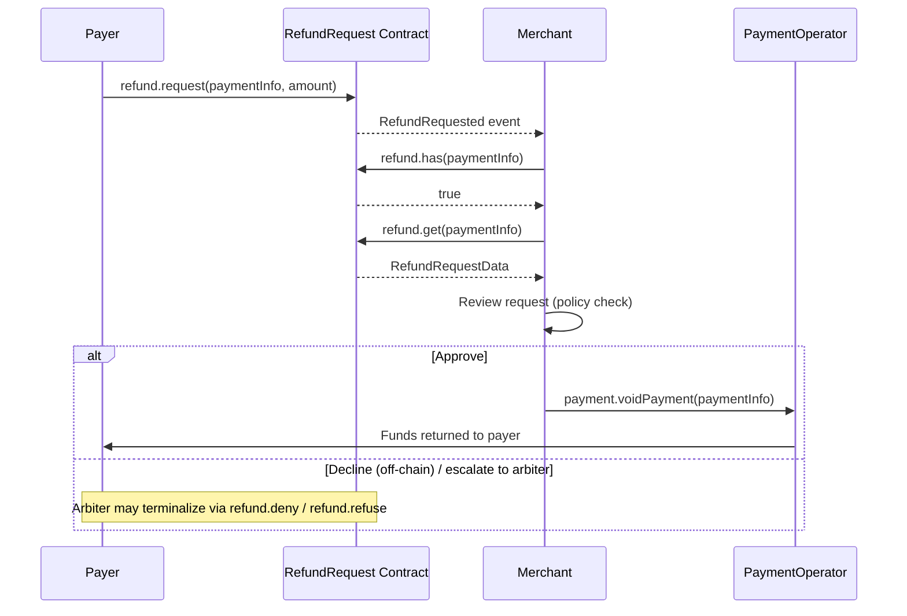

The merchant client exposes a read-mostly slice of refund actions plus `freeze.isFrozen`. Writes that change refund-request status (`deny`, `refuse`) and writes that lift a freeze (`unfreeze`) live on `createArbiterClient` or on the full `createX402r()` client.

Use `createMerchantClient` for queries below; for executing a refund, see [Capture vs refund decision flow](/sdk/merchant/quickstart#capture-vs-refund-decision-flow). The merchant client's `payment.voidPayment()` auto-flips the request to `Approved` through the `VOID_POST_ACTION_HOOK`.

## Refund request queries

### refund.has

Check whether a refund request exists for a payment.

```typescript
const hasRequest = await merchant.refund?.has(paymentInfo)
```

**Parameters**

| Name | Type | Description |
|---|---|---|
| `paymentInfo` | `PaymentInfo` | Full struct identifying the payment |

**Returns** `Promise<boolean>`.

### refund.getStatus

Retrieve the current status of a refund request.

```typescript
import { RefundRequestStatus } from '@x402r/sdk'

const status = await merchant.refund?.getStatus(paymentInfo)
```

**Parameters**

| Name | Type | Description |
|---|---|---|
| `paymentInfo` | `PaymentInfo` | Full struct identifying the payment |

**Returns** `Promise<RefundRequestStatus>`, `Pending` \| `Approved` \| `Denied` \| `Cancelled` \| `Refused`.

### refund.get

Retrieve the complete refund request data.

```typescript
const request = await merchant.refund?.get(paymentInfo)
```

**Parameters**

| Name | Type | Description |
|---|---|---|
| `paymentInfo` | `PaymentInfo` | Full struct identifying the payment |

**Returns** `Promise<RefundRequestData>`:

| Field | Type | Description |
|---|---|---|
| `paymentInfoHash` | `Hex` | keccak256 of the payment info struct |
| `amount` | `bigint` | Amount the payer requested |
| `approvedAmount` | `bigint` | Amount actually executed (0 until approved) |
| `status` | `RefundRequestStatus` | Lifecycle state |

### refund.getByKey

Look up a refund request directly by its payment info hash.

```typescript
const request = await merchant.refund?.getByKey(paymentInfoHash)
```

**Parameters**

| Name | Type | Description |
|---|---|---|
| `paymentInfoHash` | `Hex` | keccak256 of the payment info struct |

**Returns** `Promise<RefundRequestData>`.

## Paginated refund request listing

### refund.getReceiverRequests

Retrieve paginated refund request keys for this merchant (the receiver).

```typescript
const { keys, total } = await merchant.refund?.getReceiverRequests(
  receiverAddress,
  0n,
  10n,
) ?? { keys: [], total: 0n }

for (const hash of keys) {
  const request = await merchant.refund?.getByKey(hash)
  // ... inspect request.amount, request.status
}
```

**Parameters**

| Name | Type | Description |
|---|---|---|
| `receiver` | `Address` | Receiver address to query (typically the merchant) |
| `offset` | `bigint` | Index offset |
| `count` | `bigint` | Max entries to return |

**Returns** `Promise<{ keys: readonly Hex[]; total: bigint }>`. To hydrate each entry, call `refund.getByKey(hash)` per key.

<Note>
`getOperatorRequests` (paginated across all payments under an operator) lives on `createArbiterClient`, not on the merchant client.
</Note>

## Refund request actions

Approving or denying a request through the operator hook is what the merchant does. Terminal `deny` / `refuse` calls on the RefundRequest contract are scoped to the arbiter role; from a merchant, execute the refund through `payment.voidPayment()` (auto-approves) or signal a refusal off-chain and let the arbiter terminalize.

### payment.voidPayment

To approve and execute a refund, call `payment.voidPayment()`. The operator's `VOID_POST_ACTION_HOOK` (RefundRequest) auto-flips the request status to `Approved`.

```typescript
const tx = await merchant.payment.voidPayment(paymentInfo)
```

**Parameters**

| Name | Type | Description |
|---|---|---|
| `paymentInfo` | `PaymentInfo` | Full struct identifying the payment |
| `data` | `Hex` _(optional)_ | Pass-through data for pre/post action plugins |

**Returns** `Promise<Hash>`.

<Warning>
`voidPayment()` auto-approves the pending RefundRequest. There is no undo.
</Warning>

## Freeze management

### freeze.isFrozen

Check whether a payment is frozen. Frozen payments cannot be captured until unfrozen.

```typescript
const frozen = await merchant.freeze?.isFrozen(paymentInfo)
```

**Parameters**

| Name | Type | Description |
|---|---|---|
| `paymentInfo` | `PaymentInfo` | Full struct identifying the payment |

**Returns** `Promise<boolean>`.

<Note>
The merchant client exposes `freeze.isFrozen` only. Lifting a freeze (`unfreeze`) is an arbiter-role action; use `createArbiterClient` or `createX402r()`.
</Note>

## Complete refund workflow

Here is a full workflow showing how to detect a refund request, review it, make a decision, and execute the refund if approved.

```typescript
import { createMerchantClient, RefundRequestStatus } from '@x402r/sdk'
import type { PaymentInfo } from '@x402r/sdk'

async function handleRefundWorkflow(
  merchant: ReturnType<typeof createMerchantClient>,
  paymentInfo: PaymentInfo,
) {
  // Step 1: Check if a refund request exists
  const hasRequest = await merchant.refund?.has(paymentInfo)
  if (!hasRequest) {
    console.log('No refund request for this payment')
    return
  }

  // Step 2: Get the full request data
  const request = await merchant.refund?.get(paymentInfo)
  console.log('Refund request:', request?.amount, 'status:', request?.status)

  // Step 3: Only process pending requests
  if (request?.status !== RefundRequestStatus.Pending) {
    console.log('Request already processed')
    return
  }

  // Step 4: Check if the payment is frozen
  const frozen = await merchant.freeze?.isFrozen(paymentInfo)
  if (frozen) {
    console.log('Payment is frozen, resolve dispute first')
    return
  }

  // Step 5: Check available amounts
  const amounts = await merchant.payment.getAmounts(paymentInfo)
  console.log('Available to refund:', amounts.refundableAmount)

  // Step 6: Make a decision
  const shouldApprove = request.amount <= amounts.refundableAmount

  if (shouldApprove) {
    // Execute the refund (auto-approves the request via VOID_POST_ACTION_HOOK)
    const tx = await merchant.payment.voidPayment(paymentInfo)
    console.log('Refund executed:', tx)
  } else {
    // The arbiter can terminalize the request via refund.deny / refund.refuse.
    // The merchant can simply leave the request Pending and capture as usual,
    // or escalate off-chain to the arbiter.
    console.log('Declining; arbiter may deny if escalated')
  }
}
```

## Refund request lifecycle



## Method reference

| Method | Parameters | Returns |
|---|---|---|
| `refund.has` | `paymentInfo` | `boolean` |
| `refund.getStatus` | `paymentInfo` | `RefundRequestStatus` |
| `refund.get` | `paymentInfo` | `RefundRequestData` |
| `refund.getByKey` | `paymentInfoHash` | `RefundRequestData` |
| `refund.getStoredPaymentInfo` | `paymentInfoHash` | `PaymentInfo` |
| `refund.getReceiverRequests` | `receiver, offset, count` | `{ keys: readonly Hex[]; total: bigint }` |
| `refund.getCancelCount` | `paymentInfo` | `bigint` (number of cancellations on this RefundRequest) |
| `refund.getCancelledAmount` | `paymentInfo, cancelIndex` | `bigint` (amount cancelled at the given index) |
| `freeze.isFrozen` | `paymentInfo` | `boolean` |
| `payment.voidPayment` | `paymentInfo, data?` | `Hash` (auto-approves the pending RefundRequest) |

## Next steps

<CardGroup cols={2}>
  <Card title="Merchant SDK" icon="coins" href="/sdk/merchant/quickstart">
    Capture funds, charge, and query escrow state.
  </Card>
  <Card title="RefundRequest" icon="file-contract" href="/contracts/hooks/refund-request">
    RefundRequest contract details and state machine.
  </Card>
</CardGroup>
