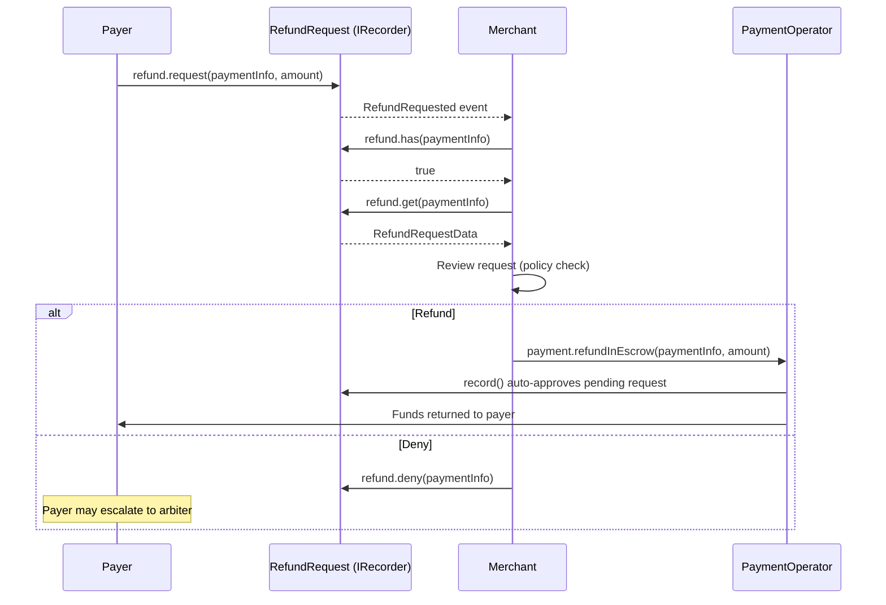

The merchant client provides methods for handling refund requests from payers. In v3, refund approval happens automatically when you call `payment.refundInEscrow()` — the RefundRequest IRecorder plugin auto-approves any pending request during execution.

<Note>
Each payment supports one refund request, keyed by `paymentInfoHash`. There is no nonce parameter — one request per payment.
</Note>

## Refund request queries

### Check if a refund request exists

```typescript
const hasRequest = await merchant.refund.has(paymentInfo);

if (hasRequest) {
  console.log('Refund request exists for this payment');
} else {
  console.log('No refund request submitted');
}
```

### Get refund request status

```typescript
import { RequestStatus } from '@x402r/core';

const status = await merchant.refund.getStatus(paymentInfo);

switch (status) {
  case RequestStatus.Pending:
    console.log('Awaiting your decision');
    break;
  case RequestStatus.Approved:
    console.log('Auto-approved via refundInEscrow');
    break;
  case RequestStatus.Denied:
    console.log('You denied this refund');
    break;
  case RequestStatus.Cancelled:
    console.log('Payer cancelled the request');
    break;
}
```

### Get full refund request data

```typescript
const request = await merchant.refund.get(paymentInfo);

console.log('Payment hash:', request.paymentInfoHash);
console.log('Requested amount:', request.amount);
console.log('Status:', request.status);
```

### Get refund request by key

Use `getByKey()` to look up a refund request directly by its `paymentInfoHash` (returned from paginated queries).

```typescript
const request = await merchant.refund.getByKey(paymentInfoHash);

console.log('Amount:', request.amount);
console.log('Status:', request.status);
```

## Paginated refund request listing

### Get refund requests for a receiver

Use `getReceiverRequests()` to retrieve paginated refund request keys for a receiver address.

```typescript
const receiverAddress = walletClient.account.address;

// Get the first 10 refund request keys
const { keys, total } = await merchant.refund.getReceiverRequests(
  receiverAddress,
  0n,   // offset
  10n   // count
);

console.log(`Showing ${keys.length} of ${total} total refund requests`);

for (const key of keys) {
  const request = await merchant.refund.getByKey(key);
  console.log(`Key: ${key}, Amount: ${request.amount}, Status: ${request.status}`);
}
```

## Refund request actions

### Deny a refund request

Use `refund.deny()` to deny a pending refund request. This changes the request status to `Denied`.

```typescript
const txHash = await merchant.refund.deny(paymentInfo);
console.log('Refund denied:', txHash);
```

<Info>
If you deny a request, the payer may escalate to an arbiter for dispute resolution. Consider providing a reason off-chain to reduce escalation risk.
</Info>

### Refund in escrow (auto-approves)

Instead of a separate approve step, you call `payment.refundInEscrow()` directly. The RefundRequest recorder plugin auto-approves any pending request during execution.

```typescript
const txHash = await merchant.payment.refundInEscrow(paymentInfo, request.amount);
console.log('Refund executed (request auto-approved):', txHash);
```

## Complete refund workflow

Here is a full workflow showing how to detect a refund request, review it, make a decision, and execute the refund if approved.

```typescript
import { createMerchantClient } from '@x402r/sdk';
import { RequestStatus } from '@x402r/core';
import type { PaymentInfo } from '@x402r/core';

async function handleRefundWorkflow(
  merchant: ReturnType<typeof createMerchantClient>,
  paymentInfo: PaymentInfo
) {
  // Step 1: Check if a refund request exists
  const hasRequest = await merchant.refund.has(paymentInfo);
  if (!hasRequest) {
    console.log('No refund request for this payment');
    return;
  }

  // Step 2: Get the full request data
  const request = await merchant.refund.get(paymentInfo);
  console.log(`Refund request: ${request.amount} tokens, status: ${request.status}`);

  // Step 3: Only process pending requests
  if (request.status !== RequestStatus.Pending) {
    console.log('Request already processed');
    return;
  }

  // Step 4: Check available amounts
  const amounts = await merchant.payment.getAmounts(paymentInfo);
  console.log(`Available to refund: ${amounts.refundableAmount}`);

  // Step 5: Make a decision
  const shouldRefund = request.amount <= amounts.refundableAmount;

  if (shouldRefund) {
    // Execute the refund (auto-approves the request)
    const txHash = await merchant.payment.refundInEscrow(paymentInfo, request.amount);
    console.log('Refund executed:', txHash);
  } else {
    // Deny the request
    const txHash = await merchant.refund.deny(paymentInfo);
    console.log('Denied:', txHash);
  }
}
```

## Refund request lifecycle



## Method reference

| Method | Parameters | Returns | Description |
|--------|-----------|---------|-------------|
| `refund.has` | `paymentInfo` | `Promise<boolean>` | Check if refund request exists |
| `refund.getStatus` | `paymentInfo` | `Promise<RefundRequestStatus>` | Get request status |
| `refund.get` | `paymentInfo` | `Promise<RefundRequestData>` | Get full request data |
| `refund.deny` | `paymentInfo` | `Promise<Hash>` | Deny a pending request |
| `refund.getReceiverRequests` | `receiver, offset, count` | `Promise<{ keys, total }>` | Paginated request keys |
| `refund.getByKey` | `paymentInfoHash` | `Promise<RefundRequestData>` | Look up by key |
| `payment.refundInEscrow` | `paymentInfo, amount, data?` | `Promise<Hash>` | Refund and auto-approve |
| `freeze.isFrozen` | `paymentInfo` | `Promise<boolean>` | Check if payment is frozen |

## Next steps

<CardGroup cols={2}>
  <Card title="Event Subscriptions" icon="bell" href="/sdk/merchant/subscriptions">
    Watch for refund requests in real-time instead of polling.
  </Card>
  <Card title="Merchant SDK" icon="coins" href="/sdk/merchant/quickstart">
    Release funds, charge, and query escrow state.
  </Card>
  <Card title="RefundRequest" icon="file-contract" href="/contracts/periphery/refund-request">
    RefundRequest contract details and state machine.
  </Card>
  <Card title="Arbiter Decision Submission" icon="gavel" href="/sdk/arbiter/decision-submission">
    How arbiters process refund requests from the other side.
  </Card>
</CardGroup>
