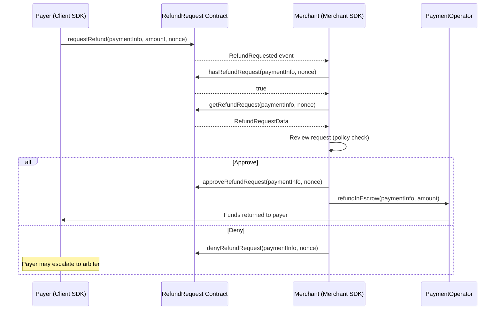

The `X402rMerchant` class provides a complete set of methods for handling refund requests from payers. Every refund-related method requires a `nonce: bigint` parameter that identifies which specific charge the refund targets.

<Note>
The `nonce` parameter corresponds to the record index from the `PaymentIndexRecorder`. For the first charge against a payment, the nonce is `0n`. Each subsequent charge increments the nonce.
</Note>

## Refund Request Queries

### Check If a Refund Request Exists

Use `hasRefundRequest()` to check whether a payer has submitted a refund request for a specific payment and nonce.

```typescript
const hasRequest = await merchant.hasRefundRequest(paymentInfo, 0n);

if (hasRequest) {
  console.log('Refund request exists for this payment');
} else {
  console.log('No refund request submitted');
}
```

### Get Refund Request Status

Use `getRefundStatus()` to retrieve the current status of a refund request. Returns a `RequestStatus` enum value.

```typescript
import { RequestStatus } from '@x402r/core';

const status = await merchant.getRefundStatus(paymentInfo, 0n);

switch (status) {
  case RequestStatus.Pending:
    console.log('Awaiting your decision');
    break;
  case RequestStatus.Approved:
    console.log('You approved this refund');
    break;
  case RequestStatus.Denied:
    console.log('You denied this refund');
    break;
  case RequestStatus.Cancelled:
    console.log('Payer cancelled the request');
    break;
}
```

### Get Full Refund Request Data

Use `getRefundRequest()` to retrieve the complete refund request data, including the amount and status.

```typescript
import type { RefundRequestData } from '@x402r/core';

const request: RefundRequestData = await merchant.getRefundRequest(paymentInfo, 0n);

console.log('Payment hash:', request.paymentInfoHash);
console.log('Nonce:', request.nonce);
console.log('Requested amount:', request.amount);
console.log('Status:', request.status);
```

The `RefundRequestData` type contains:

| Field | Type | Description |
|-------|------|-------------|
| `paymentInfoHash` | `0x${string}` | Hash of the PaymentInfo struct |
| `nonce` | `bigint` | Record index this refund targets |
| `amount` | `bigint` | Amount requested for refund (uint120) |
| `status` | `RequestStatus` | Current status (Pending, Approved, Denied, Cancelled) |

### Get Refund Request by Composite Key

Use `getRefundRequestByKey()` to look up a refund request directly by its composite key (the `keccak256(paymentInfoHash, nonce)` value returned from paginated queries).

```typescript
const request = await merchant.getRefundRequestByKey(compositeKey);

console.log('Amount:', request.amount);
console.log('Status:', request.status);
```

## Paginated Refund Request Listing

### Get Pending Refund Requests

Use `getPendingRefundRequests()` to retrieve paginated refund request keys for the current receiver address. This method uses the wallet address associated with your `X402rMerchant` instance.

```typescript
// Get the first 10 refund request keys
const { keys, total } = await merchant.getPendingRefundRequests(0n, 10n);

console.log(`Showing ${keys.length} of ${total} total refund requests`);

// Look up each request by its composite key
for (const key of keys) {
  const request = await merchant.getRefundRequestByKey(key);
  console.log(`Key: ${key}`);
  console.log(`  Amount: ${request.amount}`);
  console.log(`  Status: ${request.status}`);
}
```

For pagination, adjust the `offset` and `count` parameters:

```typescript
// Page through all refund requests, 20 at a time
const pageSize = 20n;
let offset = 0n;
let hasMore = true;

while (hasMore) {
  const { keys, total } = await merchant.getPendingRefundRequests(offset, pageSize);

  for (const key of keys) {
    const request = await merchant.getRefundRequestByKey(key);
    // Process each request...
  }

  offset += pageSize;
  hasMore = offset < total;
}
```

### Get Refund Request Count

Use `getRefundRequestCount()` to get the total number of refund requests targeting the current receiver.

```typescript
const count = await merchant.getRefundRequestCount();
console.log(`Total refund requests: ${count}`);

if (count > 0n) {
  const { keys } = await merchant.getPendingRefundRequests(0n, count);
  console.log(`Retrieved all ${keys.length} request keys`);
}
```

## Refund Request Actions

### Approve a Refund Request

Use `approveRefundRequest()` to approve a pending refund request. This changes the request status to `Approved`.

```typescript
const { txHash } = await merchant.approveRefundRequest(paymentInfo, 0n);
console.log('Refund approved:', txHash);
```

<Warning>
Approving a refund request changes its status but does **not** transfer funds. You must also call `refundInEscrow()` or `refundPostEscrow()` to execute the actual token transfer.
</Warning>

### Deny a Refund Request

Use `denyRefundRequest()` to deny a pending refund request. This changes the request status to `Denied`.

```typescript
const { txHash } = await merchant.denyRefundRequest(paymentInfo, 0n);
console.log('Refund denied:', txHash);
```

<Info>
If you deny a request, the payer may escalate to an arbiter for dispute resolution. Consider providing a reason off-chain to reduce escalation risk.
</Info>

## Freeze Management

### Check If a Payment Is Frozen

Use `isFrozen()` to check whether a payment has been frozen by the payer or an arbiter. Frozen payments cannot be released until unfrozen.

```typescript
const freezeAddress: `0x${string}` = '0xFreezeContract...';

const frozen = await merchant.isFrozen(paymentInfo, freezeAddress);

if (frozen) {
  console.log('Payment is frozen - cannot release until unfrozen');
} else {
  console.log('Payment is not frozen');
}
```

### Unfreeze a Payment

Use `unfreezePayment()` to remove a freeze on a payment. Only the receiver (merchant) or an authorized party can unfreeze.

```typescript
const freezeAddress: `0x${string}` = '0xFreezeContract...';

const { txHash } = await merchant.unfreezePayment(paymentInfo, freezeAddress);
console.log('Payment unfrozen:', txHash);
```

## Complete Refund Workflow

Here is a full workflow showing how to detect a refund request, review it, make a decision, and execute the refund if approved.

```typescript
import { createPublicClient, createWalletClient, http } from 'viem';
import { baseSepolia } from 'viem/chains';
import { privateKeyToAccount } from 'viem/accounts';
import { X402rMerchant } from '@x402r/merchant';
import { getNetworkConfig, RequestStatus } from '@x402r/core';

async function handleRefundWorkflow(
  merchant: X402rMerchant,
  paymentInfo: PaymentInfo,
  nonce: bigint
) {
  // Step 1: Check if a refund request exists
  const hasRequest = await merchant.hasRefundRequest(paymentInfo, nonce);
  if (!hasRequest) {
    console.log('No refund request for this payment/nonce');
    return;
  }

  // Step 2: Get the full request data
  const request = await merchant.getRefundRequest(paymentInfo, nonce);
  console.log(`Refund request: ${request.amount} tokens, status: ${request.status}`);

  // Step 3: Only process pending requests
  if (request.status !== RequestStatus.Pending) {
    console.log('Request already processed');
    return;
  }

  // Step 4: Check if the payment is frozen
  const freezeAddress: `0x${string}` = '0xFreezeContract...';
  const frozen = await merchant.isFrozen(paymentInfo, freezeAddress);
  if (frozen) {
    console.log('Payment is frozen - resolve dispute before processing refund');
    return;
  }

  // Step 5: Check available amounts
  const { capturableAmount, refundableAmount } = await merchant.getPaymentAmounts(paymentInfo);
  console.log(`Available to refund: ${refundableAmount}`);

  // Step 6: Make a decision
  const shouldApprove = request.amount <= refundableAmount;

  if (shouldApprove) {
    // Approve the request
    const { txHash: approveTx } = await merchant.approveRefundRequest(paymentInfo, nonce);
    console.log('Approved:', approveTx);

    // Execute the refund from escrow
    const { txHash: refundTx } = await merchant.refundInEscrow(paymentInfo, request.amount);
    console.log('Refund executed:', refundTx);
  } else {
    // Deny the request
    const { txHash: denyTx } = await merchant.denyRefundRequest(paymentInfo, nonce);
    console.log('Denied:', denyTx);
  }
}
```

## Refund Request Lifecycle



## Method Reference

| Method | Parameters | Returns | Description |
|--------|-----------|---------|-------------|
| `hasRefundRequest` | `paymentInfo, nonce: bigint` | `Promise<boolean>` | Check if refund request exists |
| `getRefundStatus` | `paymentInfo, nonce: bigint` | `Promise<RequestStatus>` | Get request status |
| `getRefundRequest` | `paymentInfo, nonce: bigint` | `Promise<RefundRequestData>` | Get full request data |
| `approveRefundRequest` | `paymentInfo, nonce: bigint` | `Promise<{ txHash }>` | Approve a pending request |
| `denyRefundRequest` | `paymentInfo, nonce: bigint` | `Promise<{ txHash }>` | Deny a pending request |
| `getPendingRefundRequests` | `offset: bigint, count: bigint` | `Promise<{ keys, total }>` | Paginated request keys |
| `getRefundRequestCount` | _(none)_ | `Promise<bigint>` | Total requests for receiver |
| `getRefundRequestByKey` | `compositeKey: hex` | `Promise<RefundRequestData>` | Look up by composite key |
| `unfreezePayment` | `paymentInfo, freezeAddress: hex` | `Promise<{ txHash }>` | Remove payment freeze |
| `isFrozen` | `paymentInfo, freezeAddress: hex` | `Promise<boolean>` | Check if payment is frozen |

## Next Steps

<CardGroup cols={2}>
  <Card title="Event Subscriptions" icon="bell" href="/sdk/merchant/subscriptions">
    Watch for refund requests in real-time instead of polling.
  </Card>
  <Card title="Merchant SDK" icon="coins" href="/sdk/merchant/quickstart">
    Release funds, charge, and query escrow state.
  </Card>
  <Card title="RefundRequest" icon="file-contract" href="/contracts/periphery/refund-request">
    RefundRequest contract details and state machine.
  </Card>
  <Card title="Arbiter Decision Submission" icon="gavel" href="/sdk/arbiter/decision-submission">
    How arbiters process refund requests from the other side.
  </Card>
</CardGroup>
