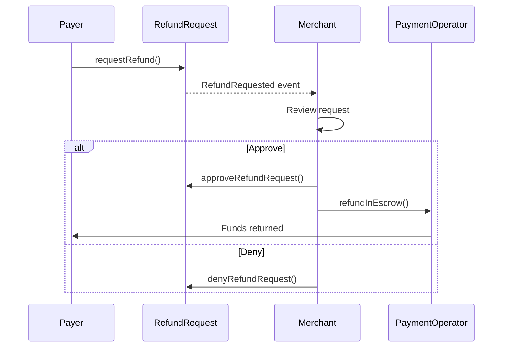

The Merchant SDK provides comprehensive tools for handling refund requests from payers.

## Get Pending Refund Requests

List all pending refund requests for your payments:

```typescript
const pendingRequests = await merchant.getPendingRefundRequests();

console.log(`${pendingRequests.length} pending requests`);

for (const hash of pendingRequests) {
  const details = await merchant.getPaymentDetails(hash);
  console.log(`Request for payment: ${hash}`);
  console.log(`  Payer: ${details.payer}`);
  console.log(`  Amount: ${details.maxAmount}`);
}
```

## Check If Refund Request Exists

Verify if a specific payment has a refund request:

```typescript
const hasRequest = await merchant.hasRefundRequest(paymentInfo);

if (hasRequest) {
  const status = await merchant.getRefundStatus(paymentInfo);
  console.log('Refund request status:', RequestStatus[status]);
}
```

## Approve a Refund Request

Approve a refund request from a payer:

```typescript
const { txHash } = await merchant.approveRefundRequest(paymentInfo);
console.log('Refund approved:', txHash);
```

<Warning>
Approving a request changes its status but doesn't transfer funds. You must also call `refundInEscrow()` to execute the refund.
</Warning>

## Execute the Refund

After approving, execute the actual fund transfer:

```typescript
// Approve first
await merchant.approveRefundRequest(paymentInfo);

// Then execute the refund
const { txHash } = await merchant.refundInEscrow(paymentInfo);
console.log('Refund executed:', txHash);
```

### Combined Approve and Execute

```typescript
async function processRefund(
  merchant: X402rMerchant,
  paymentInfo: PaymentInfo
) {
  // Approve the request
  const { txHash: approveTx } = await merchant.approveRefundRequest(paymentInfo);
  console.log('Approved:', approveTx);

  // Execute the refund
  const { txHash: refundTx } = await merchant.refundInEscrow(paymentInfo);
  console.log('Refunded:', refundTx);

  return { approveTx, refundTx };
}
```

## Deny a Refund Request

Deny a refund request if it's not valid:

```typescript
const { txHash } = await merchant.denyRefundRequest(paymentInfo);
console.log('Refund denied:', txHash);
```

## Get Refund Status

Check the status of a refund request:

```typescript
import { RequestStatus } from '@x402r/core';

const status = await merchant.getRefundStatus(paymentInfo);

switch (status) {
  case RequestStatus.Pending:
    console.log('Awaiting your decision');
    break;
  case RequestStatus.Approved:
    console.log('You approved this refund');
    break;
  case RequestStatus.Denied:
    console.log('You denied this refund');
    break;
  case RequestStatus.Cancelled:
    console.log('Payer cancelled the request');
    break;
}
```

## Example: Automated Refund Processing

```typescript
import { X402rMerchant } from '@x402r/merchant';
import { RequestStatus, PaymentState } from '@x402r/core';

interface RefundPolicy {
  autoApproveUnder: bigint;  // Auto-approve refunds under this amount
  autoApproveWithin: number; // Auto-approve if requested within N seconds
}

async function processRefundsWithPolicy(
  merchant: X402rMerchant,
  policy: RefundPolicy
) {
  const pending = await merchant.getPendingRefundRequests();

  for (const hash of pending) {
    const details = await merchant.getPaymentDetails(hash);
    const authTime = await merchant.getAuthorizationTime(details, recorderAddress);

    const timeSinceAuth = Date.now() / 1000 - Number(authTime);
    const isSmallAmount = details.maxAmount < policy.autoApproveUnder;
    const isRecent = timeSinceAuth < policy.autoApproveWithin;

    if (isSmallAmount || isRecent) {
      // Auto-approve
      await merchant.approveRefundRequest(details);
      await merchant.refundInEscrow(details);
      console.log(`Auto-approved refund: ${hash}`);
    } else {
      // Requires manual review
      console.log(`Manual review required: ${hash}`);
    }
  }
}

// Usage
const policy: RefundPolicy = {
  autoApproveUnder: BigInt('10000000'), // 10 USDC
  autoApproveWithin: 3600,              // 1 hour
};

await processRefundsWithPolicy(merchant, policy);
```

## Refund Request Workflow



## Best Practices

<AccordionGroup>
  <Accordion title="Respond promptly" icon="clock">
    Quick responses improve customer satisfaction and reduce disputes escalating to arbiters.
  </Accordion>

  <Accordion title="Document denials" icon="file-lines">
    When denying a refund, consider notifying the payer with a reason to avoid arbiter escalation.
  </Accordion>

  <Accordion title="Automate where possible" icon="robot">
    Set up policies to auto-approve low-risk refunds (small amounts, recent purchases, etc.).
  </Accordion>

  <Accordion title="Monitor for patterns" icon="chart-line">
    Track refund patterns to identify issues with your product or service.
  </Accordion>
</AccordionGroup>

## Next Steps

<CardGroup cols={2}>
  <Card title="Server Helpers" icon="server" href="/sdk/merchant/server-helpers">
    Integrate refunds into x402 servers.
  </Card>
  <Card title="Event Subscriptions" icon="bell" href="/sdk/merchant/subscriptions">
    Watch for refund requests in real-time.
  </Card>
</CardGroup>
