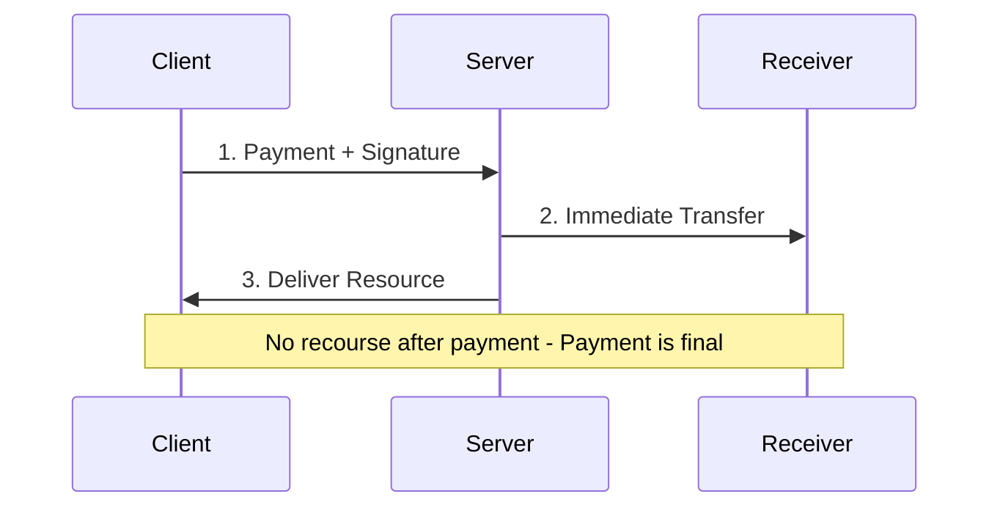
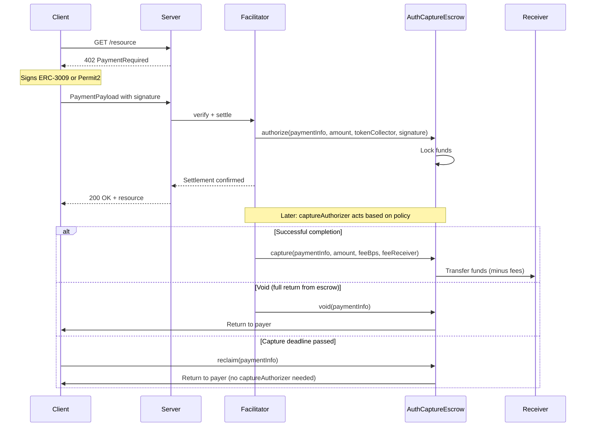

## Overview

The **`authCapture` scheme** for x402 v2 uses the audited [Commerce Payments Protocol](https://github.com/base/commerce-payments) (`AuthCaptureEscrow` + token collectors) directly, no fork. The client signs a single signature (ERC-3009 or Permit2). The facilitator submits it, either locking funds in escrow for later capture (two-phase) or sending them directly to the receiver with refund capability (single-shot).

Unlike `exact`, which has no mechanism for returning funds, `authCapture` supports returning funds to the client through void, refund, and reclaim.

## Settlement Paths

The scheme supports two settlement paths, selected via `extra.autoCapture`:

| `autoCapture` | Behavior |
|:---|:---|
| `false` (default) | Two-phase. Funds held in escrow. CaptureAuthorizer can capture, void, or refund. Client can reclaim if the capture deadline passes. |
| `true` | Single-shot. Funds sent directly to the receiver. CaptureAuthorizer can refund post-settlement. |

### Two-phase (`autoCapture: false`, default)

```
AUTHORIZE -> RESOURCE DELIVERED -> CAPTURE / VOID -> (REFUND)
```

<Steps>
  <Step title="Authorize">
    Client authorization is submitted, funds locked in escrow via `AuthCaptureEscrow.authorize()`. The token collector executes the client's signature (ERC-3009 `receiveWithAuthorization` or Permit2 `permitTransferFrom`) to pull tokens into escrow.
  </Step>

  <Step title="Resource Delivered">
    Server returns the resource (HTTP 200).
  </Step>

  <Step title="Capture or Void">
    The captureAuthorizer can capture (capture funds to the receiver) or void (return escrowed funds to the client). Capture conditions are policy-defined per captureAuthorizer (time-locked, arbiter-approved, etc.).
  </Step>

  <Step title="Reclaim">
    If `captureDeadline` passes without capture, the client can reclaim funds directly from the escrow without captureAuthorizer involvement.
  </Step>

  <Step title="Refund (Optional)">
    After capture, the captureAuthorizer can refund within the `refundDeadline` window.
  </Step>
</Steps>

### Single-shot (`autoCapture: true`)

```
CHARGE -> RESOURCE DELIVERED -> (REFUND)
```

<Steps>
  <Step title="Charge">
    Client authorization is submitted, funds sent directly to receiver via `AuthCaptureEscrow.charge()`. No escrow hold.
  </Step>

  <Step title="Resource Delivered">
    Server returns the resource (HTTP 200).
  </Step>

  <Step title="Refund (Optional)">
    The captureAuthorizer can refund within the `refundDeadline` window.
  </Step>
</Steps>

No capture, void, or reclaim, funds are never held in escrow.

## Visual Flow

### Exact Payment (Immediate Settlement)



### authCapture (Two-phase)



### Key Differences

| Aspect | Exact | authCapture |
|---|---|---|
| **Settlement** | Immediate on request | Via escrow (two-phase) or direct with refund (single-shot) |
| **Payer Protection** | None (payment final) | Refundable in both paths |
| **Resource Delivery** | After payment clears | Immediately after authorization |
| **Recourse** | No recourse | Reclaim after capture deadline, refund via captureAuthorizer |
| **Fee System** | None | Configurable (min/max bounds, client-signed) |
| **Use Case** | Trusted, low-value, instant | High-value, variable cost, disputes |

## CaptureAuthorizer

The **captureAuthorizer** is the address authorized to authorize/capture/void/refund/charge a payment. The escrow contract gates those operations on `msg.sender`. In x402's facilitator-submits flow that means either the facilitator's EOA, or any smart contract that ends up calling the escrow (e.g., an arbiter contract with dispute logic, a multisig, etc.).

| Use Case | CaptureAuthorizer |
|---|---|
| Session billing | EOA that tracks usage off-chain, captures periodically |
| Time-locked escrow | Contract that releases after a period expires |
| Dispute resolution | Arbiter contract that decides capture vs refund |
| Immediate (exact-like) | Facilitator with `autoCapture: true` for instant settlement |
| Streaming payments | Contract that performs time-proportional captures |

## Message Format

### PaymentRequirements (402 Response)

Server sends this to request payment:

```json
{
  "x402Version": 2,
  "accepts": [{
    "scheme": "authCapture",
    "network": "eip155:8453",
    "amount": "1000000",
    "asset": "0x833589fCD6eDb6E08f4c7C32D4f71b54bdA02913",
    "payTo": "0xReceiverAddress",
    "maxTimeoutSeconds": 60,
    "extra": {
      "name": "USDC",
      "version": "2",
      "captureAuthorizer": "0xCaptureAuthorizerAddress",
      "captureDeadline": 1740758554,
      "refundDeadline": 1741276954,
      "minFeeBps": 0,
      "maxFeeBps": 1000,
      "feeRecipient": "0xFeeRecipientAddress",
      "autoCapture": false,
      "assetTransferMethod": "eip3009"
    }
  }]
}
```

A server MAY list multiple `accepts[]` entries with different `assetTransferMethod` values so clients can pick the method matching their token approvals.

### PaymentPayload: EIP-3009 (default)

Client sends this with a signed ERC-3009 authorization:

```json
{
  "x402Version": 2,
  "resource": {
    "url": "https://api.example.com/resource",
    "method": "GET"
  },
  "accepted": {
    "scheme": "authCapture",
    "network": "eip155:8453",
    "amount": "1000000",
    "asset": "0x833589fCD6eDb6E08f4c7C32D4f71b54bdA02913",
    "payTo": "0xReceiverAddress",
    "maxTimeoutSeconds": 60,
    "extra": { "..." }
  },
  "payload": {
    "authorization": {
      "from": "0xPayerAddress",
      "to": "0xEIP3009TokenCollectorAddress",
      "value": "1000000",
      "validAfter": "0",
      "validBefore": "1740675754",
      "nonce": "0xf374...3480"
    },
    "signature": "0x2d6a...571c",
    "salt": "0x0000000000000000000000000000000000000000000000000000000000000abc"
  }
}
```

### PaymentPayload: Permit2

When `extra.assetTransferMethod === "permit2"`, the client signs a Permit2 `PermitTransferFrom`:

```json
{
  "x402Version": 2,
  "resource": { "url": "https://api.example.com/resource", "method": "GET" },
  "accepted": { "scheme": "authCapture", "...": "..." },
  "payload": {
    "permit2Authorization": {
      "from": "0xPayerAddress",
      "permitted": {
        "token": "0x833589fCD6eDb6E08f4c7C32D4f71b54bdA02913",
        "amount": "1000000"
      },
      "spender": "0xPermit2TokenCollectorAddress",
      "nonce": "11021048692073456...",
      "deadline": "1740675754"
    },
    "signature": "0x2d6a...571c",
    "salt": "0x0000000000000000000000000000000000000000000000000000000000000abc"
  }
}
```

The merchant address is bound through the deterministic nonce (no witness struct).

## Field Reference

### Required Extra Fields

| Field | Type | Description |
|---|---|---|
| `name` | string | EIP-712 token-domain name (e.g., `"USDC"`). Used for ERC-3009 signing only. |
| `version` | string | EIP-712 token-domain version (e.g., `"2"`). |
| `captureAuthorizer` | address | Address authorized to authorize/capture/void/refund/charge. Committed on-chain as `PaymentInfo.operator`. |
| `captureDeadline` | uint48 | Absolute Unix seconds: capture must occur before this. Encoded as `authorizationExpiry`. |
| `refundDeadline` | uint48 | Absolute Unix seconds: refunds allowed until this. Encoded as `refundExpiry`. |
| `feeRecipient` | address | Fee recipient. Set to `address(0)` to let the captureAuthorizer specify any non-zero recipient at capture/charge time. |
| `minFeeBps` | uint16 | Minimum fee in basis points the captureAuthorizer must take. `0` = no minimum. |
| `maxFeeBps` | uint16 | Maximum fee in basis points the captureAuthorizer can take. |

### Optional Extra Fields

| Field | Type | Description | Default |
|---|---|---|---|
| `autoCapture` | `bool` | `true` → facilitator calls `charge()` (atomic). `false` → `authorize()` (two-phase). | `false` |
| `assetTransferMethod` | `"eip3009"` \| `"permit2"` | Which token collector to use. | `"eip3009"` |

<Note>
**Fee Configuration:** Fees are enforced on-chain in the `PaymentInfo` struct. The escrow rejects captures/charges that fall outside `[minFeeBps, maxFeeBps]`. If `feeRecipient` is non-zero, the actual fee recipient at capture/charge must match.
</Note>

## Nonce Derivation

The signature nonce is the payer-agnostic `PaymentInfo` hash. Payer is zeroed; everything else is the values that will appear on-chain.

```
paymentInfoHash = keccak256(abi.encode(PAYMENT_INFO_TYPEHASH, paymentInfoWithZeroPayer))
nonce           = keccak256(abi.encode(chainId, AUTH_CAPTURE_ESCROW_ADDRESS, paymentInfoHash))
```

Freshness is enforced by `salt`: each signing call generates a fresh `bytes32` salt, so two payers signing concurrently produce distinct nonces with no collision risk.

## Verification Logic

The facilitator performs these checks in order:

1. **Type guard**: Payload matches `Eip3009Payload` or `Permit2Payload` (includes `signature` and `salt`).
2. **Scheme match**: `requirements.scheme === "authCapture"` and `payload.accepted.scheme === "authCapture"`.
3. **Network match**: `payload.accepted.network === requirements.network` and format is `eip155:<chainId>`.
4. **Extra validation**: All required `extra` fields present.
5. **Method routing**: `extra.assetTransferMethod` (default `"eip3009"`) matches the payload shape.
6. **Deadline ordering**: `refundDeadline >= captureDeadline`, `captureDeadline > now + 6s`, and the payload's `validBefore` (EIP-3009) or `deadline` (Permit2) `<= captureDeadline`.
7. **Time window**: `validBefore` / `deadline > now + 6s` (not expired) and `validAfter <= now` (active, EIP-3009 only).
8. **Spender / collector match**: `authorization.to === EIP3009_TOKEN_COLLECTOR_ADDRESS` (EIP-3009) or `permit2Authorization.spender === PERMIT2_TOKEN_COLLECTOR_ADDRESS` (Permit2).
9. **Token match**: `permit2Authorization.permitted.token === requirements.asset` (Permit2 only, EIP-3009 binds via signing domain).
10. **Signature verify**: Recover signer from EIP-712 (`ReceiveWithAuthorization` or `PermitTransferFrom`); must match payer.
11. **Amount**: Authorization amount matches `requirements.amount`.
12. **Nonce match**: Reconstruct `PaymentInfo` from extra + salt + payer + requirements; recompute the payer-agnostic hash; assert it matches the wire nonce. This transitively enforces equality on every field encoded in `PaymentInfo` (receiver, token, deadlines, fee bounds, feeRecipient).
13. **Simulate**: Call `AuthCaptureEscrow.authorize(...)` or `.charge(...)` via `eth_call` to verify success.

### EIP-6492 Support

For smart wallet clients, the signature may be EIP-6492 wrapped (containing deployment bytecode). The facilitator extracts the inner ECDSA signature for verification. The on-chain `ERC6492SignatureHandler` in the token collector handles wallet deployment during settlement.

## Settlement Logic

1. **Re-verify** the payload (catch expired/invalid payloads before spending gas).
2. **Determine function**: `extra.autoCapture === true ? "charge" : "authorize"`.
3. **Resolve collector**: `EIP3009_TOKEN_COLLECTOR_ADDRESS` or `PERMIT2_TOKEN_COLLECTOR_ADDRESS` (per `assetTransferMethod`).
4. **Encode `collectorData`**: raw ERC-3009 signature, or ABI-encoded Permit2 signature.
5. **Call escrow**: `AuthCaptureEscrow.<functionName>(paymentInfo, amount, tokenCollector, collectorData)`.
6. **Wait for receipt**: 60s timeout.
7. **Return result**: tx hash, network, payer.

## PaymentInfo Struct

This is the on-chain Solidity struct. The `payer` field is not included in the JSON payload, it is derived from the signature recovery at settlement time. Wire-format `extra` uses spec-level field names; the on-chain struct keeps canonical names so the EIP-712 typehash matches the AuthCaptureEscrow contract byte-for-byte.

```solidity
struct PaymentInfo {
    address operator;            // = extra.captureAuthorizer
    address payer;               // payload-derived
    address receiver;            // = requirements.payTo
    address token;               // = requirements.asset
    uint120 maxAmount;           // = requirements.amount
    uint48  preApprovalExpiry;   // = now + maxTimeoutSeconds (client-derived)
    uint48  authorizationExpiry; // = extra.captureDeadline
    uint48  refundExpiry;        // = extra.refundDeadline
    uint16  minFeeBps;
    uint16  maxFeeBps;
    address feeReceiver;         // = extra.feeRecipient
    uint256 salt;                // = payload.salt (client-generated, fresh per request)
}
```

### Expiry Ordering

The contract enforces: `preApprovalExpiry <= authorizationExpiry <= refundExpiry`

| Expiry | Wire field | Enforced At | Effect |
|---|---|---|---|
| `preApprovalExpiry` | derived | `authorize()` / `charge()` | Blocks settlement after this time |
| `authorizationExpiry` | `captureDeadline` | `capture()` | Blocks capture; allows `reclaim()` |
| `refundExpiry` | `refundDeadline` | `refund()` | Blocks refund requests |

## Safety Guarantees

The escrow contract enforces invariants on-chain:

<CardGroup cols={2}>
  <Card title="No Overcharging" icon="shield-check">
    Settlement amount is capped by client-signed `maxAmount`. Attempting to exceed the limit reverts.
  </Card>

  <Card title="Replay Prevention" icon="lock">
    Each payment has a unique nonce derived from `(chainId, escrowAddress, paymentInfoHash)`. The nonce is consumed on-chain at settlement.
  </Card>

  <Card title="Payer Reclaim" icon="clock">
    After `captureDeadline`, the payer can reclaim escrowed funds directly without captureAuthorizer approval.
  </Card>

  <Card title="Fee Bounds" icon="receipt">
    Min/max fee bounds in `PaymentInfo` are client-signed and enforced on-chain. The captureAuthorizer must respect these limits.
  </Card>
</CardGroup>

<Warning>
**CaptureAuthorizer Trust Required:** The captureAuthorizer controls when and how much to capture. Choose carefully and understand the capture policy. See [Operators](/contracts/overview#payment-operator) for examples.
</Warning>

## Error Codes

### Verification Errors

| Error Code | Description |
|---|---|
| `invalid_payload_format` | Payload doesn't match `Eip3009Payload` or `Permit2Payload`. |
| `unsupported_scheme` | Scheme is not `authCapture`. |
| `network_mismatch` | Payload network doesn't match requirements. |
| `invalid_network` | Network format is not `eip155:<chainId>`. |
| `invalid_authCapture_extra` | Extra is missing required fields. |
| `unsupported_asset_transfer_method` | `assetTransferMethod` is not `"eip3009"` or `"permit2"`. |
| `payload_method_mismatch` | Payload shape doesn't match `assetTransferMethod`. |
| `capture_deadline_expired` | `captureDeadline <= now + 6s`. |
| `invalid_deadline_ordering` | Deadlines violate `now + maxTimeoutSeconds <= captureDeadline <= refundDeadline`. |
| `authorization_expired` | EIP-3009 `validBefore` (or Permit2 `deadline`) `<= now + 6s`. |
| `authorization_not_yet_valid` | EIP-3009 `validAfter > now`. |
| `invalid_authCapture_signature` | Signature verification failed. |
| `amount_mismatch` | Authorization value doesn't match `requirements.amount`. |
| `token_collector_mismatch` | `to` / `spender` doesn't match the canonical collector for the method. |
| `token_mismatch` | Permit2 `permitted.token` doesn't match `requirements.asset`. |
| `nonce_mismatch` | Wire nonce doesn't match the recomputed payer-agnostic `PaymentInfo` hash. |
| `insufficient_balance` | Payer balance is less than required amount. |
| `simulation_failed` | Settlement simulation reverted with an unmapped error. |

### Settlement Errors

| Error Code | Description |
|---|---|
| `verification_failed` | Re-verification before settlement failed. |
| `transaction_reverted` | On-chain transaction reverted after confirmation. |

## vs Exact Scheme

The `authCapture` scheme adds an authorization step before settlement (or refundability for single-shot). For simple immediate payments where trust and refundability aren't concerns, the `exact` scheme remains more efficient.

See [Comparison](/x402-integration/comparison) for detailed trade-offs.

## Next Steps

<CardGroup cols={2}>
  <Card title="Overview" icon="globe" href="/x402-integration/overview">
    Understand why escrow is needed for HTTP payments.
  </Card>

  <Card title="Comparison" icon="scale-balanced" href="/x402-integration/comparison">
    Compare authCapture vs exact schemes in detail.
  </Card>

  <Card title="Smart Contracts" icon="code" href="/contracts/overview">
    Learn about the escrow and captureAuthorizer contracts.
  </Card>

  <Card title="SDK Overview" icon="rocket" href="/sdk/overview">
    Build your first authCapture payment flow.
  </Card>
</CardGroup>

## References

- [Commerce Payments Protocol](https://blog.base.dev/commerce-payments-protocol)
- [AuthCaptureEscrow Contract](https://github.com/base/commerce-payments)
- [EIP-3009: Transfer With Authorization](https://eips.ethereum.org/EIPS/eip-3009)
- [Uniswap Permit2](https://docs.uniswap.org/contracts/permit2/overview)
- [x402r authCapture Scheme Reference Implementation](https://github.com/BackTrackCo/x402r-scheme)
