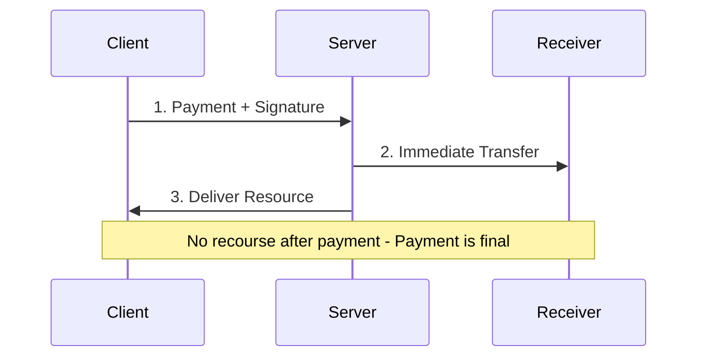
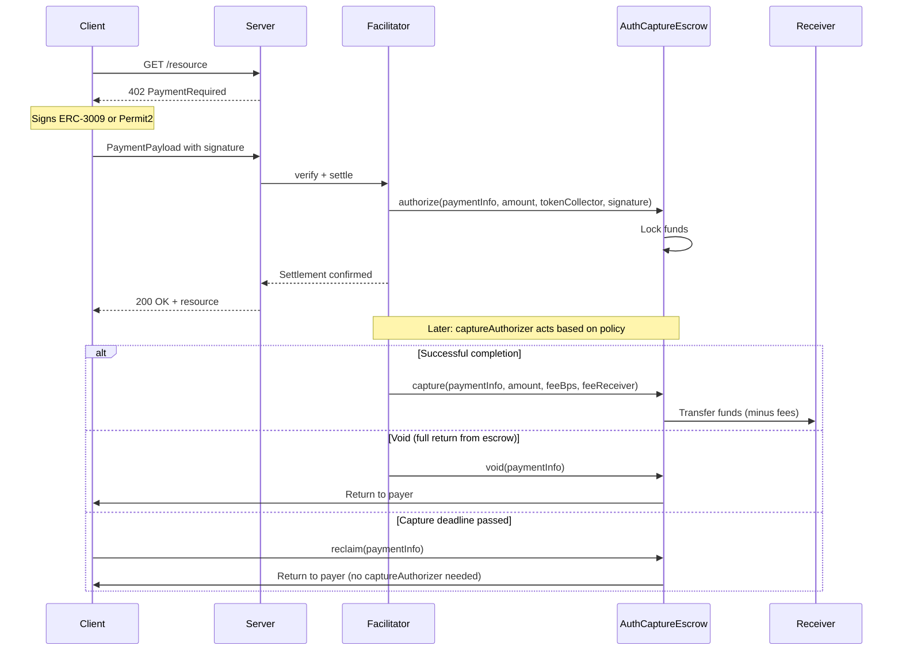

## Overview

The **`auth-capture` scheme** for x402 v2 uses the audited [Commerce Payments Protocol](https://github.com/base/commerce-payments) (`AuthCaptureEscrow` + token collectors) directly, no fork. The client signs a single signature (ERC-3009 or Permit2). The facilitator submits it, either locking funds in escrow for later capture (two-phase) or sending them directly to the receiver with refund capability (single-shot).

Unlike `exact`, which has no mechanism for returning funds, `auth-capture` supports returning funds to the client through void, refund, and reclaim.

## Settlement Paths

The scheme supports two settlement paths, selected via `extra.autoCapture`:

| `autoCapture` | Behavior |
|:---|:---|
| `false` (default) | Two-phase. Funds held in escrow. CaptureAuthorizer can capture, void, or refund. Client can reclaim if the capture deadline passes. |
| `true` | Single-shot. Funds sent directly to the receiver. CaptureAuthorizer can refund post-settlement. |

### Two-phase (`autoCapture: false`, default)

```
AUTHORIZE -> RESOURCE DELIVERED -> CAPTURE / VOID -> (REFUND)
```

<Steps>
  <Step title="Authorize">
    The facilitator submits the client's authorization, locking funds in escrow via `AuthCaptureEscrow.authorize()`. The token collector executes the client's signature (ERC-3009 `receiveWithAuthorization` or Permit2 `permitTransferFrom`) to pull tokens into escrow.
  </Step>

  <Step title="Resource Delivered">
    Server returns the resource (HTTP 200).
  </Step>

  <Step title="Capture or Void">
    The captureAuthorizer can capture (capture funds to the receiver) or void (return escrowed funds to the client). Capture conditions are policy-defined per captureAuthorizer (time-locked, arbiter-approved, etc.).
  </Step>

  <Step title="Reclaim">
    If `captureDeadline` passes without capture, the client can reclaim funds directly from the escrow without captureAuthorizer involvement.
  </Step>

  <Step title="Refund (Optional)">
    After capture, the captureAuthorizer can refund within the `refundDeadline` window.
  </Step>
</Steps>

### Single-shot (`autoCapture: true`)

```
CHARGE -> RESOURCE DELIVERED -> (REFUND)
```

<Steps>
  <Step title="Charge">
    The facilitator submits the client's authorization, sending funds directly to the receiver via `AuthCaptureEscrow.charge()`. No escrow hold.
  </Step>

  <Step title="Resource Delivered">
    Server returns the resource (HTTP 200).
  </Step>

  <Step title="Refund (Optional)">
    The captureAuthorizer can refund within the `refundDeadline` window.
  </Step>
</Steps>

No capture, void, or reclaim, funds are never held in escrow.

## Visual Flow

### Exact Payment (Immediate Settlement)



### auth-capture (Two-phase)



### Key Differences

| Aspect | Exact | auth-capture |
|---|---|---|
| **Settlement** | Immediate on request | Via escrow (two-phase) or direct with refund (single-shot) |
| **Payer Protection** | None (payment final) | Refundable in both paths |
| **Resource Delivery** | After payment clears | Immediately after authorization |
| **Recourse** | No recourse | Reclaim after capture deadline, refund via captureAuthorizer |
| **Fee System** | None | Configurable (min/max bounds, client-signed) |
| **Use Case** | Trusted, low-value, instant | High-value, variable cost, disputes |

## CaptureAuthorizer

The **captureAuthorizer** is the address that may call `authorize`, `capture`, `void`, `refund`, or `charge` on a payment. The escrow contract gates those operations on `msg.sender`. In x402's facilitator-submits flow that means either the facilitator's EOA, or any smart contract that ends up calling the escrow (for example, an arbiter contract with dispute logic or a multisig).

| Use Case | CaptureAuthorizer |
|---|---|
| Session billing | EOA that tracks usage off-chain, captures periodically |
| Time-locked escrow | Contract that releases after a period expires |
| Dispute resolution | Arbiter contract that decides capture vs refund |
| Immediate (exact-like) | Facilitator with `autoCapture: true` for instant settlement |
| Streaming payments | Contract that performs time-proportional captures |

## vs Exact Scheme

The `auth-capture` scheme adds an authorization step before settlement (or refundability for single-shot). For simple immediate payments where trust and refundability aren't concerns, the `exact` scheme remains more efficient.

## Next Steps

<CardGroup cols={2}>
  <Card title="Wire Format" icon="file-code" href="/x402-integration/auth-capture/wire-format">
    PaymentRequirements and PaymentPayload shapes for EIP-3009 and Permit2.
  </Card>

  <Card title="Verification and Settlement" icon="shield-check" href="/x402-integration/auth-capture/verification-and-settlement">
    The 13-step verification flow, settlement logic, and error codes.
  </Card>

  <Card title="PaymentInfo Struct" icon="cube" href="/x402-integration/auth-capture/payment-info">
    On-chain struct, expiry ordering, and safety guarantees.
  </Card>

  <Card title="SDK Overview" icon="rocket" href="/sdk/overview">
    Build your first auth-capture payment flow.
  </Card>
</CardGroup>

## References

- [Commerce Payments Protocol](https://blog.base.dev/commerce-payments-protocol)
- [AuthCaptureEscrow Contract](https://github.com/base/commerce-payments)
- [EIP-3009: Transfer With Authorization](https://eips.ethereum.org/EIPS/eip-3009)
- [Uniswap Permit2](https://docs.uniswap.org/contracts/permit2/overview)
- [x402r auth-capture Scheme Reference Implementation](https://github.com/BackTrackCo/x402r-scheme)
