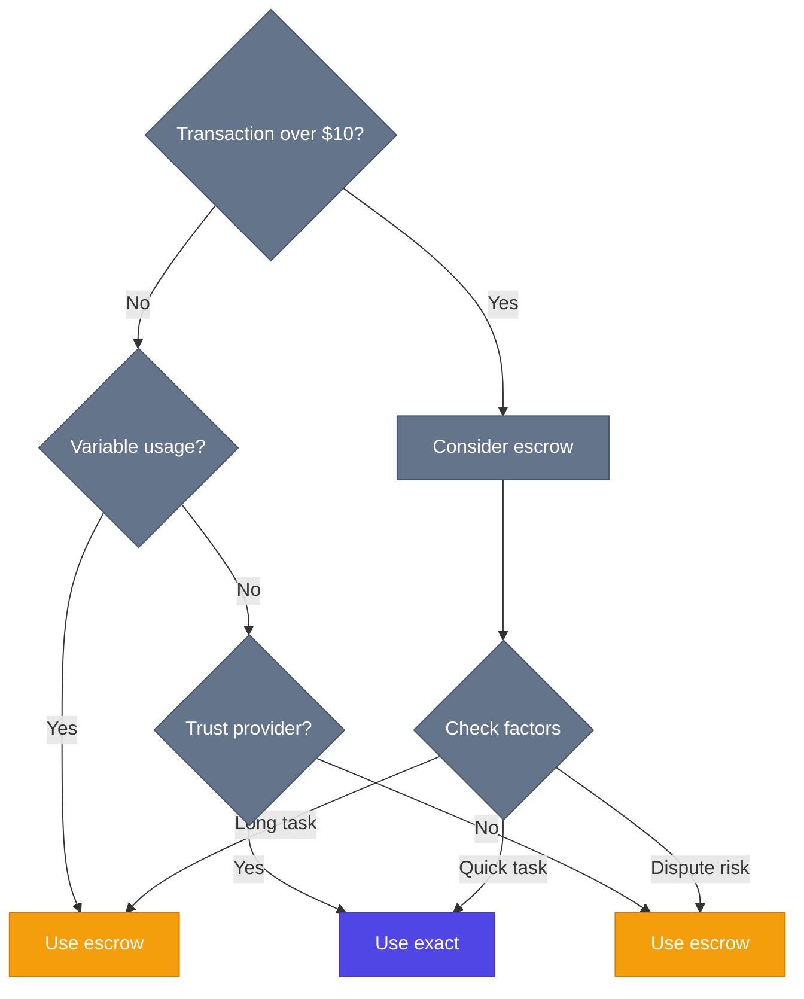

## At a Glance

<CardGroup cols={2}>
  <Card title="exact" icon="bolt">
    **Immediate settlement**

    Payment happens instantly when request is made. Simple, fast, minimal overhead.

    Best for trusted services and low-value transactions.
  </Card>

  <Card title="escrow" icon="lock">
    **Deferred settlement**

    Funds locked until conditions are met. Authorization separate from capture.

    Best for high-value, usage-based, or disputed transactions.
  </Card>
</CardGroup>

## Feature Comparison

| Feature | exact | escrow |
|---------|-------|--------|
| **Settlement Timing** | Immediate | Deferred (conditional) |
| **Payer Protection** | None (payment final) | Refund possible until capture |
| **Receiver Risk** | No risk (paid upfront) | Must wait for release |
| **Gas Cost** | Single transaction | Two transactions (auth + capture) |
| **Complexity** | Minimal (direct transfer) | Higher (operator logic) |
| **Variable Pricing** | Not supported | Supported (authorize max, capture actual) |
| **Dispute Resolution** | Not possible | Supported via operator |
| **Multi-Request Sessions** | Every request needs signature | One auth, multiple captures |
| **Trust Required** | High (payment irreversible) | Lower (escrow protects payer) |

## When to Use Each

### Use `exact` when:

<AccordionGroup>
  <Accordion title="Low-value transactions">
    For small purchases where the cost of a dispute exceeds the transaction value.

    **Example:** $0.01 API call - not worth the escrow overhead
  </Accordion>

  <Accordion title="Trusted relationships">
    When you trust the service provider and don't need refund protection.

    **Example:** Paying your own infrastructure or established services
  </Accordion>

  <Accordion title="Immediate delivery">
    Service is delivered instantly and verifiable on the spot.

    **Example:** Static content, database lookups, instant responses
  </Accordion>

  <Accordion title="Minimizing gas costs">
    Single transaction is cheaper than two (auth + capture).

    **Example:** High-frequency micro-transactions where gas matters
  </Accordion>
</AccordionGroup>

### Use `escrow` when:

<AccordionGroup>
  <Accordion title="High-value transactions">
    Significant amounts where you need recourse if service fails.

    **Example:** $500 training job - you want protection if it fails
  </Accordion>

  <Accordion title="Unknown final cost">
    Usage-based billing where you don't know the exact amount upfront.

    **Example:** LLM API calls charged by tokens (authorize $10, use $6.50, refund $3.50)
  </Accordion>

  <Accordion title="Long-running work">
    Tasks that take hours or days to complete.

    **Example:** Video rendering, data processing, training jobs
  </Accordion>

  <Accordion title="Dispute-prone services">
    Services where quality is subjective or verification is needed.

    **Example:** Freelance work, custom deliverables, SLA-based services
  </Accordion>

  <Accordion title="Multi-request sessions">
    Many small requests under one authorization.

    **Example:** 1,000 API calls at $0.01 each = one $10 auth, periodic captures
  </Accordion>
</AccordionGroup>

## Cost Analysis

### exact Scheme

<Info>
**Gas Cost: 1 transaction**
- ERC-20 transfer: ~50k gas
- **Total: ~50,000 gas**

**Example (Base, 0.001 gwei gas price):**
- Gas cost: ~$0.00005
- For $10 payment: 0.0005% overhead
</Info>

### escrow Scheme

<Info>
**Gas Cost: 2 transactions**
- authorize(): ~150k gas
- capture(): ~80k gas
- **Total: ~230,000 gas**

**Example (Base, 0.001 gwei gas price):**
- Gas cost: ~$0.00023
- For $10 payment: 0.0023% overhead
</Info>

<Note>
**Amortization:** For multi-request sessions, the auth cost is amortized across many captures. 1 auth + 10 captures is cheaper than 10 exact payments.
</Note>

## Security Comparison

### exact Scheme

| Risk | Severity | Mitigation |
|------|----------|-----------|
| Service non-delivery | **High** | None - payment is final |
| Overcharging | **Medium** | Verify amount before signing |
| Malicious server | **High** | Trust required |

**Trust Model:** You must fully trust the service provider. Once payment is sent, you have no recourse.

### escrow Scheme

| Risk | Severity | Mitigation |
|------|----------|-----------|
| Service non-delivery | **Low** | Refund before capture |
| Overcharging | **None** | `maxAmount` enforced on-chain |
| Malicious operator | **Medium** | Choose trusted operators, set expiry |
| Operator disappeared | **Low** | Payer can reclaim after `authorizationExpiry` |

**Trust Model:** You must trust the operator contract logic, but funds are protected by on-chain invariants.

<Warning>
**Operator Selection Critical:** The operator contract controls when funds are released. A malicious or buggy operator can lock funds. Always audit operator code or use verified implementations.
</Warning>

## User Experience

### exact Scheme Flow

```
1. Server: "Pay $10"
2. Client: [Signs payment]
3. Client: [Sends request with signature]
4. Server: [Receives payment + delivers service]
5. Done
```

**Steps:** 3 (request → sign → deliver)

**Latency:** Single round-trip

### escrow Scheme Flow

```
1. Server: "Authorize up to $10"
2. Client: [Signs authorization]
3. Client: [Sends request with signature]
4. Server: [Locks $10 in escrow + delivers service]
5. Server: [Calls operator to capture actual amount]
6. Done
```

**Steps:** 4 (request → sign → deliver → capture)

**Latency:** Service delivery same as exact, but capture happens async

<Tip>
**Perception:** From the user's perspective, escrow and exact feel the same during the request. The capture happens in the background.
</Tip>

## Example Scenarios

### Scenario 1: Simple API Call

**Service:** Weather API lookup
**Cost:** $0.01
**Trust:** High (established provider)
**Decision:** ✅ **Use exact**

Why: Low value, instant delivery, trusted service. Escrow overhead not worth it.

### Scenario 2: LLM Agent Session

**Service:** 100 GPT-4 calls
**Cost:** $0.05-$0.20 per call (variable)
**Trust:** Medium (new provider)
**Decision:** ✅ **Use escrow**

Why: Variable pricing, multiple requests, moderate trust. Authorize $20 max, capture actual usage.

### Scenario 3: Training Job

**Service:** Train ML model on GPU cluster
**Cost:** $500
**Duration:** 48 hours
**Decision:** ✅ **Use escrow**

Why: High value, long-running, need verification before payment. Release after job completes successfully.

### Scenario 4: Freelance Work

**Service:** Custom logo design
**Cost:** $200
**Dispute Risk:** High (subjective quality)
**Decision:** ✅ **Use escrow with arbiter**

Why: Subjective deliverable, need dispute resolution. Arbiter operator releases on approval or mediates disputes.

### Scenario 5: Micro-Transaction Spam

**Service:** Rate-limited API (1000 req/sec)
**Cost:** $0.0001 per request
**Volume:** 100,000 requests/day
**Decision:** ✅ **Use escrow with batch captures**

Why: Too many requests to sign individually. Authorize $10 daily, server batches captures hourly.

## Performance Comparison

### Throughput

| Metric | exact | escrow |
|--------|-------|--------|
| Requests/second | 1000+ | 1000+ (auth), 100+ (capture) |
| On-chain TPS impact | High (every request) | Low (periodic captures) |
| Signature overhead | Per-request | Per-session |

### Latency

| Phase | exact | escrow |
|-------|-------|--------|
| Request latency | +50ms (sign + verify) | +50ms (sign + verify) |
| Settlement latency | Immediate | Async (seconds to days) |
| Finality | Instant | After capture |

## Hybrid Approach

You can support **both schemes** and let clients choose:

```json
{
  "x402Version": 2,
  "accepts": [
    {
      "scheme": "exact",
      "network": "eip155:8453",
      "amount": "10000000",
      "asset": "0x833589fCD6eDb6E08f4c7C32D4f71b54bdA02913",
      "payTo": "0xReceiver..."
    },
    {
      "scheme": "escrow",
      "network": "eip155:8453",
      "maxAmountRequired": "10000000",
      "asset": "0x833589fCD6eDb6E08f4c7C32D4f71b54bdA02913",
      "payTo": "0xReceiver...",
      "extra": {
        "escrowAddress": "0xEscrow...",
        "operatorAddress": "0xOperator..."
      }
    }
  ]
}
```

**Client decides based on:**
- Transaction value
- Trust level
- Gas price
- Urgency

## Migration Strategy

### From exact to escrow

Existing `exact` integrations can add `escrow` support:

1. Deploy operator contract
2. Add `escrow` to `accepts` array
3. Keep `exact` as fallback
4. Clients upgrade when ready

### From escrow to exact

If escrow proves unnecessary:

1. Add `exact` to `accepts` array
2. Monitor which scheme clients prefer
3. Deprecate `escrow` if unused

<Tip>
**Start with exact, add escrow when needed.** Don't over-engineer. Most simple services work fine with exact.
</Tip>

## Decision Tree



## Next Steps

<CardGroup cols={2}>
  <Card title="Overview" icon="globe" href="/x402-integration/overview">
    Learn about x402 and why escrow matters.
  </Card>

  <Card title="Escrow Spec" icon="file-contract" href="/x402-integration/escrow-scheme">
    Complete technical specification.
  </Card>

  <Card title="Smart Contracts" icon="code" href="/contracts/overview">
    Understand operator implementations.
  </Card>

  <Card title="SDK Installation" icon="rocket" href="/sdk/installation">
    Build your first payment flow.
  </Card>
</CardGroup>
