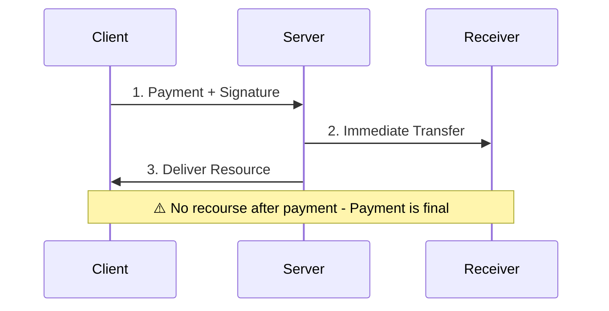
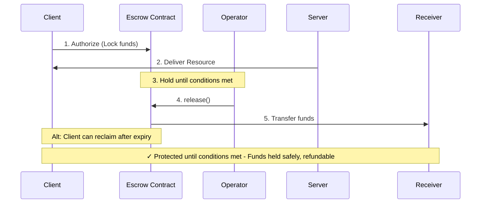
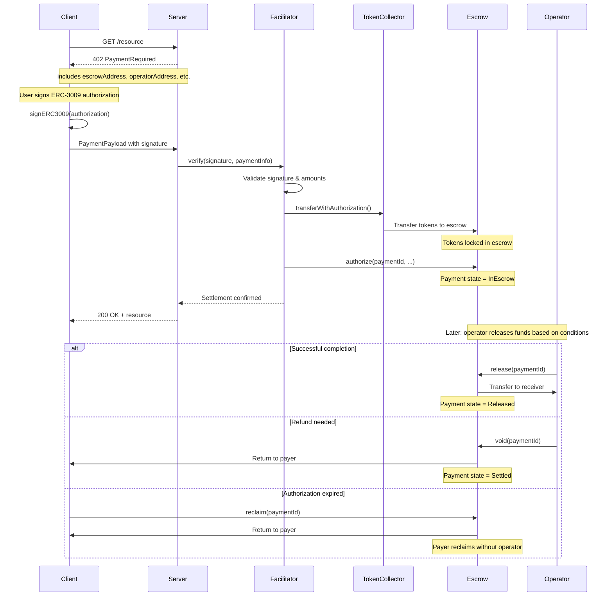

## Overview

The **escrow scheme** for x402 v2 leverages the [Base Commerce Payments Protocol](https://github.com/base/commerce-payments) to enable secure, conditional fund handling using the auth/capture pattern.

<Note>
This proposal is based on [Agentokratia's escrow proposal (#834)](https://github.com/coinbase/x402/issues/834) and extends it to support arbitrary operator implementations using audited on-chain escrow contracts.
</Note>

## Auth/Capture Pattern

The escrow scheme provides four primitives:

<Steps>
  <Step title="Authorize">
    Lock funds in escrow at request time. Client signs ERC-3009 authorization, facilitator calls `escrow.authorize()` to pull tokens into escrow contract.
  </Step>

  <Step title="Capture">
    Release earned amount to receiver. Operator calls `escrow.release()` based on configured conditions (time elapsed, work verified, etc.).
  </Step>

  <Step title="Void">
    Return unused funds to payer. Operator calls `escrow.void()` for full refunds during escrow period.
  </Step>

  <Step title="Reclaim">
    Payer safety valve if operator disappears. After `authorizationExpiry`, payer can reclaim funds directly without operator approval.
  </Step>
</Steps>

## Visual Flow

### Exact Payment (Immediate Settlement)



### Escrow Payment (Deferred Settlement)



### Key Differences

| Aspect | Exact | Escrow |
|--------|-------|--------|
| **Settlement** | Immediate on request | Deferred until conditions met |
| **Payer Protection** | None (payment final) | Refundable until capture |
| **Resource Delivery** | After payment clears | Immediately after authorization |
| **Recourse** | No recourse | Can reclaim after expiry |
| **Use Case** | Trusted, low-value, instant | High-value, variable cost, disputes |

## Operator Flexibility

The **operator** is the key abstraction. Different implementations enable different payment patterns:

| Use Case | Operator Behavior |
|----------|-------------------|
| Session billing | Track usage off-chain, capture periodically |
| Time-locked escrow | Release after period expires |
| Dispute resolution | Arbiter decides release vs refund |
| Immediate (exact-like) | Use `charge()` for instant settlement |
| Streaming payments | Time-proportional captures |

## Message Format

### PaymentRequired (402 Response)

Server sends this to request payment:

```json
{
  "x402Version": 2,
  "accepts": [{
    "scheme": "escrow",
    "network": "eip155:8453",
    "amount": "10000000",
    "asset": "0x833589fCD6eDb6E08f4c7C32D4f71b54bdA02913",
    "payTo": "0xReceiver...",
    "extra": {
      "name": "USDC",
      "version": "2",
      "escrowAddress": "0xEscrow...",
      "operatorAddress": "0xOperator...",
      "authorizeAddress": "0xOperator...",
      "tokenCollector": "0xCollector...",
      "minDeposit": "5000000",
      "maxDeposit": "100000000",
      "authorizationExpirySeconds": 259200,
      "refundExpirySeconds": 31536000,
      "minFeeBps": 0,
      "maxFeeBps": 0,
      "feeReceiver": "0xFeeReceiver..."
    }
  }]
}
```

### PaymentPayload (Client Response)

Client sends this with signed authorization:

```json
{
  "x402Version": 2,
  "scheme": "escrow",
  "payload": {
    "authorization": {
      "from": "0xPayer...",
      "to": "0xCollector...",
      "value": "10000000",
      "validAfter": "0",
      "validBefore": "1734567890",
      "nonce": "0x..."
    },
    "signature": "0x...",
    "paymentInfo": {
      "operator": "0xOperator...",
      "receiver": "0xReceiver...",
      "token": "0x833589fCD6eDb6E08f4c7C32D4f71b54bdA02913",
      "maxAmount": "10000000",
      "authorizationExpiry": 4294967295,
      "refundExpiry": 281474976710655,
      "minFeeBps": 0,
      "maxFeeBps": 0,
      "feeReceiver": "0xFeeReceiver...",
      "salt": "0x..."
    }
  }
}
```

## Field Reference

### Required Extra Fields

| Field | Type | Description |
|-------|------|-------------|
| `escrowAddress` | address | AuthCaptureEscrow contract address on the specified network |
| `operatorAddress` | address | Address with capture/void authority (stored in PaymentInfo.operator) |
| `tokenCollector` | address | ERC-3009/Permit2 token collector contract address |

### Optional Extra Fields

| Field | Type | Description | Default |
|-------|------|-------------|---------|
| `authorizeAddress` | address | Where facilitator calls authorize() | `operatorAddress` if operator is a contract, `escrowAddress` if operator is an EOA |
| `minDeposit` | uint256 | Minimum accepted deposit amount (wei) | No minimum |
| `maxDeposit` | uint256 | Maximum accepted deposit amount (wei) | No maximum |
| `authorizationExpirySeconds` | uint32 | Seconds until payer can reclaim funds | `type(uint32).max` (effectively never) |
| `refundExpirySeconds` | uint48 | Seconds until refunds are no longer allowed | `type(uint48).max` (effectively never) |
| `minFeeBps` | uint16 | Minimum fee in basis points | `0` |
| `maxFeeBps` | uint16 | Maximum fee in basis points | `0` |
| `feeReceiver` | address | Address receiving fees | `operatorAddress` |

<Note>
**Fee Configuration:** Fees are enforced on-chain in the PaymentInfo struct. The operator contract cannot charge more than `maxFeeBps` or less than `minFeeBps`.
</Note>

## Authorization vs Capture

Understanding the two-phase process:

### Phase 1: Authorization (HTTP Request)

```typescript
// Client signs ERC-3009 authorization
const authorization = {
  from: payerAddress,
  to: tokenCollectorAddress,
  value: maxAmount,
  validAfter: 0,
  validBefore: deadline,
  nonce: randomNonce()
};

const signature = await signERC3009(authorization);

// Send to server in PaymentPayload
await fetch('/resource', {
  headers: {
    'X-Payment': JSON.stringify({
      x402Version: 2,
      scheme: 'escrow',
      payload: { authorization, signature, paymentInfo }
    })
  }
});

// Server calls facilitator to settle
// Facilitator calls escrow.authorize() on-chain
// Funds locked in escrow contract
```

### Phase 2: Capture (After Work)

```typescript
// Later: operator decides to release funds
// This could be:
// - Immediate (for exact-like behavior)
// - After time period (escrow period elapsed)
// - After verification (arbiter approved)
// - Batch settlement (multiple captures from one authorization)

await operator.release(paymentId);
// or
await operator.charge(paymentId, partialAmount);
// or
await operator.void(paymentId); // full refund
```

## Safety Guarantees

The escrow contract enforces invariants on-chain:

<CardGroup cols={2}>
  <Card title="No Overcharging" icon="shield-check">
    Operator cannot capture more than authorized `maxAmount`. Attempting to exceed the limit reverts the transaction.
  </Card>

  <Card title="No Double-Spend" icon="lock">
    Funds are locked at authorization. Payer cannot use the same tokens elsewhere until void/reclaim.
  </Card>

  <Card title="Payer Reclaim" icon="clock">
    If `authorizationExpiry` is set, payer can reclaim funds after expiry without operator approval.
  </Card>

  <Card title="Fee Bounds" icon="receipt">
    Min/max fee bounds in PaymentInfo are enforced on-chain. Operator must respect these limits.
  </Card>
</CardGroup>

<Warning>
**Operator Trust Required:** The operator contract controls when and how much to release. Choose operators carefully and understand their release conditions. See [Operators](/contracts/overview#payment-operator) for details.
</Warning>

## Sequence Diagram



## Self-Hosted Facilitator

x402r ships a self-hosted facilitator service at `x402r-sdk/apps/facilitator/` that implements x402's facilitator protocol for escrow payments. This service:

1. Exposes a `/supported` endpoint with escrow scheme configuration (operator, escrow, and token collector addresses)
2. Verifies payment signatures via `/verify`
3. Settles payments on-chain via `/settle` by calling `authorize()` on the PaymentOperator

Merchant servers use x402's standard `paymentMiddleware` with an `HTTPFacilitatorClient` pointing to this service, so they don't need to handle blockchain interactions directly.

See [Examples](/sdk/examples) for the complete setup guide.

## vs Exact Scheme

The `escrow` scheme adds an authorization step before settlement. For simple immediate payments where trust is not a concern, the `exact` scheme remains more efficient.

See [Comparison](/x402-integration/comparison) for detailed trade-offs.

## Next Steps

<CardGroup cols={2}>
  <Card title="Overview" icon="globe" href="/x402-integration/overview">
    Understand why escrow is needed for HTTP payments.
  </Card>

  <Card title="Comparison" icon="scale-balanced" href="/x402-integration/comparison">
    Compare escrow vs exact schemes in detail.
  </Card>

  <Card title="Smart Contracts" icon="code" href="/contracts/overview">
    Learn about escrow and operator contracts.
  </Card>

  <Card title="SDK Installation" icon="rocket" href="/sdk/installation">
    Build your first escrow-based payment flow.
  </Card>
</CardGroup>

## References

- [Base Commerce Payments Protocol](https://blog.base.dev/commerce-payments-protocol)
- [AuthCaptureEscrow Contract](https://github.com/base/commerce-payments)
- [EIP-3009: Transfer With Authorization](https://eips.ethereum.org/EIPS/eip-3009)
- [x402r Operator Contracts](https://github.com/BackTrackCo/x402r-contracts)
- [x402 Protocol](https://github.com/coinbase/x402)
