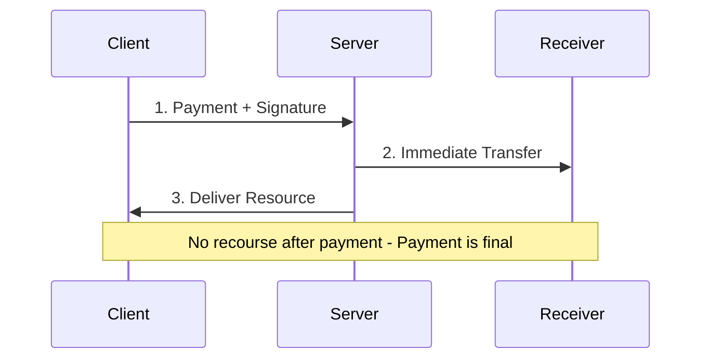
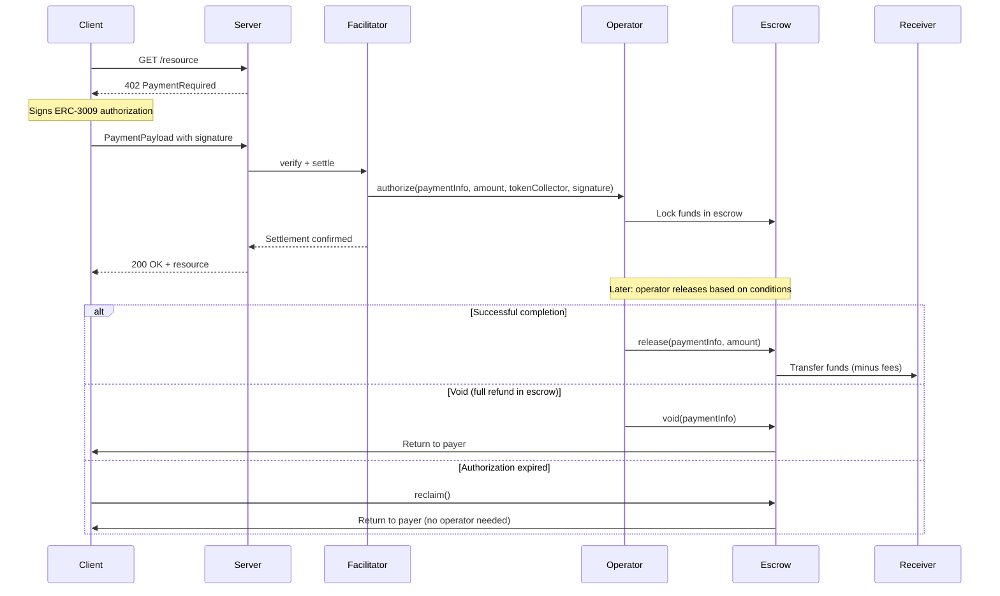

## Overview

The **escrow scheme** for x402 v2 uses the [Commerce Payments Protocol](https://github.com/base/commerce-payments) contract stack to enable secure, conditional fund handling. The client signs a single ERC-3009 authorization. The facilitator submits it to an operator, which handles token collection, escrow locking, and fee distribution in one transaction.

<Note>
This spec is based on the [escrow scheme proposal (Issue #1011)](https://github.com/coinbase/x402/issues/1011) and the [spec PR (#1425)](https://github.com/coinbase/x402/pull/1425). It uses audited on-chain escrow contracts from the Commerce Payments Protocol.
</Note>

## Settlement Methods

The scheme supports two settlement paths:

| Method | Behavior |
|:-------|:---------|
| `authorize` (default) | Funds held in escrow. Can be captured, voided, reclaimed, or refunded. |
| `charge` | Funds sent directly to receiver. Refundable post-settlement. |

### Authorize (Default)

```
AUTHORIZE -> RESOURCE DELIVERED -> CAPTURE / VOID -> (REFUND)
```

<Steps>
  <Step title="Authorize">
    Client authorization is submitted — funds locked in escrow via `operator.authorize()`. The operator calls the token collector to execute `receiveWithAuthorization` with the client's ERC-3009 signature, then routes funds into the escrow contract.
  </Step>

  <Step title="Resource Delivered">
    Server returns the resource (HTTP 200).
  </Step>

  <Step title="Capture or Void">
    The operator can capture (release funds to receiver via `operator.release()`) or void (return escrowed funds to client). Capture conditions are configurable per operator (time-locked, arbiter-approved, etc.).
  </Step>

  <Step title="Reclaim">
    If `authorizationExpiry` passes without capture, the client can reclaim funds directly from escrow without operator approval.
  </Step>

  <Step title="Refund (Optional)">
    After capture, the operator can refund within the `refundExpiry` window via `operator.refundPostEscrow()`.
  </Step>
</Steps>

### Charge

```
CHARGE -> RESOURCE DELIVERED -> (REFUND)
```

<Steps>
  <Step title="Charge">
    Client authorization is submitted — funds sent directly to receiver via `operator.charge()`. No escrow hold.
  </Step>

  <Step title="Resource Delivered">
    Server returns the resource (HTTP 200).
  </Step>

  <Step title="Refund (Optional)">
    The operator can refund within the `refundExpiry` window via `operator.refundPostEscrow()`.
  </Step>
</Steps>

No capture, void, or reclaim — funds are never held in escrow.

## Visual Flow

### Exact Payment (Immediate Settlement)



### Escrow Payment (Deferred Settlement)



### Key Differences

| Aspect | Exact | Escrow |
|--------|-------|--------|
| **Settlement** | Immediate on request | Deferred until conditions met |
| **Payer Protection** | None (payment final) | Refundable until capture |
| **Resource Delivery** | After payment clears | Immediately after authorization |
| **Recourse** | No recourse | Reclaim after expiry, refund via operator |
| **Fee System** | None | Configurable (min/max bounds, client-signed) |
| **Use Case** | Trusted, low-value, instant | High-value, variable cost, disputes |

## Operator Flexibility

The **operator** is the key abstraction. Different implementations enable different payment patterns:

| Use Case | Operator Behavior |
|----------|-------------------|
| Session billing | Track usage off-chain, capture periodically |
| Time-locked escrow | Release after period expires |
| Dispute resolution | Arbiter decides release vs refund |
| Immediate (exact-like) | Use `charge()` for instant settlement |
| Streaming payments | Time-proportional captures |

## Message Format

### PaymentRequirements (402 Response)

Server sends this to request payment:

```json
{
  "x402Version": 2,
  "accepts": [{
    "scheme": "escrow",
    "network": "eip155:8453",
    "amount": "1000000",
    "asset": "0x833589fCD6eDb6E08f4c7C32D4f71b54bdA02913",
    "payTo": "0xReceiverAddress",
    "maxTimeoutSeconds": 60,
    "extra": {
      "name": "USDC",
      "version": "2",
      "escrowAddress": "0xe050bB89eD43BB02d71343063824614A7fb80B77",
      "operatorAddress": "0xOperatorAddress",
      "tokenCollector": "0xcE66Ab399EDA513BD12760b6427C87D6602344a7",
      "settlementMethod": "authorize",
      "minFeeBps": 0,
      "maxFeeBps": 1000,
      "feeReceiver": "0xOperatorAddress"
    }
  }]
}
```

### PaymentPayload (Client Response)

Client sends this with signed authorization:

```json
{
  "x402Version": 2,
  "resource": {
    "url": "https://api.example.com/resource",
    "method": "GET"
  },
  "accepted": {
    "scheme": "escrow",
    "network": "eip155:8453",
    "amount": "1000000",
    "asset": "0x833589fCD6eDb6E08f4c7C32D4f71b54bdA02913",
    "payTo": "0xReceiverAddress",
    "maxTimeoutSeconds": 60,
    "extra": { "..." }
  },
  "payload": {
    "authorization": {
      "from": "0xPayerAddress",
      "to": "0xcE66Ab399EDA513BD12760b6427C87D6602344a7",
      "value": "1000000",
      "validAfter": "0",
      "validBefore": "1740672154",
      "nonce": "0xf374...3480"
    },
    "signature": "0x2d6a...571c",
    "paymentInfo": {
      "operator": "0xOperatorAddress",
      "receiver": "0xReceiverAddress",
      "token": "0x833589fCD6eDb6E08f4c7C32D4f71b54bdA02913",
      "maxAmount": "1000000",
      "preApprovalExpiry": 1740672154,
      "authorizationExpiry": 4294967295,
      "refundExpiry": 281474976710655,
      "minFeeBps": 0,
      "maxFeeBps": 1000,
      "feeReceiver": "0xOperatorAddress",
      "salt": "0x0000...0001"
    }
  }
}
```

## Field Reference

### Required Extra Fields

| Field | Type | Description |
|-------|------|-------------|
| `name` | string | EIP-712 domain name for the token (e.g., `"USDC"`) |
| `version` | string | EIP-712 domain version (e.g., `"2"`) |
| `escrowAddress` | address | AuthCaptureEscrow contract address on the specified network |
| `operatorAddress` | address | Operator contract address (stored in PaymentInfo.operator) |
| `tokenCollector` | address | ERC-3009 token collector contract address |

### Optional Extra Fields

| Field | Type | Description | Default |
|-------|------|-------------|---------|
| `settlementMethod` | `"authorize"` \| `"charge"` | Settlement path | `"authorize"` |
| `minFeeBps` | uint16 | Minimum fee in basis points | `0` |
| `maxFeeBps` | uint16 | Maximum fee in basis points | `0` |
| `feeReceiver` | address | Address receiving fees | `address(0)` (flexible) |
| `preApprovalExpirySeconds` | uint48 | ERC-3009 signature validity / pre-approval deadline (seconds from now) | `type(uint48).max` |
| `authorizationExpirySeconds` | uint48 | Deadline for capturing escrowed funds (seconds from now) | `type(uint48).max` |
| `refundExpirySeconds` | uint48 | Deadline for refund requests (seconds from now) | `type(uint48).max` |

<Note>
**Fee Configuration:** Fees are enforced on-chain in the PaymentInfo struct. The operator contract cannot charge more than `maxFeeBps` or less than `minFeeBps`. If `feeReceiver` is set, the actual fee recipient at capture/charge must match.
</Note>

## Nonce Derivation

The ERC-3009 nonce is deterministically derived from the payment parameters:

```
nonce = keccak256(abi.encode(chainId, escrowAddress, paymentInfoHash))
```

This ties the off-chain signature to the specific chain, escrow contract, and payment terms — preventing cross-chain or cross-contract replay. The nonce is consumed on-chain at settlement.

## Verification Logic

The facilitator performs these checks in order:

1. **Type guard** — Verify `payload` contains `authorization`, `signature`, and `paymentInfo` fields
2. **Scheme match** — Verify `scheme === "escrow"`
3. **Network match** — Verify network format is `eip155:<chainId>` and matches between requirements and payload
4. **Extra validation** — Verify `extra` contains required fields (`escrowAddress`, `operatorAddress`, `tokenCollector`)
5. **Time window** — Verify `validBefore > now + 6s` (not expired) and `validAfter <= now` (active)
6. **ERC-3009 signature** — Recover signer from EIP-712 typed data (`ReceiveWithAuthorization` primary type) and verify matches `authorization.from`
7. **Amount** — Verify `authorization.value === requirements.amount`
8. **Recipient match** — Verify `authorization.to === extra.tokenCollector`
9. **Token match** — Verify `paymentInfo.token === requirements.asset`
10. **Receiver match** — Verify `paymentInfo.receiver === requirements.payTo`
11. **Simulate** — Call `operator.authorize(...)` or `operator.charge(...)` via `eth_call` to verify success

### EIP-6492 Support

For smart wallet clients, the signature may be EIP-6492 wrapped (containing deployment bytecode). The facilitator extracts the inner ECDSA signature for verification. The on-chain `ERC6492SignatureHandler` in the token collector handles wallet deployment during settlement.

## Settlement Logic

Settlement is performed by the facilitator calling the operator:

1. **Re-verify** the payload (catch expired/invalid payloads before spending gas)
2. **Determine function** — `settlementMethod === "charge" ? "charge" : "authorize"`
3. **Call operator** — `operator.<fn>(paymentInfo, amount, tokenCollector, collectorData)`
4. **Wait for receipt** — Confirm transaction success (60s timeout)
5. **Return result** — Transaction hash, network, and payer address

The operator handles:

- Calling the token collector to execute `receiveWithAuthorization` with the client's ERC-3009 signature
- Routing funds to escrow (authorize) or directly to receiver (charge)
- Validating fee bounds against the client-signed `PaymentInfo`

## PaymentInfo Struct

This is the on-chain Solidity struct. The `payer` field is not included in the JSON payload — it is derived from `authorization.from` at settlement time.

```solidity
struct PaymentInfo {
    address operator;           // Operator address
    address payer;              // Derived from authorization.from (not in payload)
    address receiver;           // Fund recipient (payTo)
    address token;              // ERC-20 token address
    uint120 maxAmount;          // Maximum authorized amount
    uint48  preApprovalExpiry;  // ERC-3009 validBefore / pre-approval deadline
    uint48  authorizationExpiry;// Capture deadline (authorize path only)
    uint48  refundExpiry;       // Refund request deadline
    uint16  minFeeBps;          // Minimum acceptable fee (basis points)
    uint16  maxFeeBps;          // Maximum acceptable fee (basis points)
    address feeReceiver;        // Fee recipient (address(0) = flexible)
    uint256 salt;               // Client-provided entropy
}
```

### Expiry Ordering

The contract enforces: `preApprovalExpiry <= authorizationExpiry <= refundExpiry`

| Expiry | Enforced At | Effect |
|:-------|:------------|:-------|
| `preApprovalExpiry` | `authorize()` / `charge()` | Blocks settlement after this time |
| `authorizationExpiry` | `capture()` | Blocks capture; enables `reclaim()` |
| `refundExpiry` | `refund()` | Blocks refund requests |

## Safety Guarantees

The escrow contract enforces invariants on-chain:

<CardGroup cols={2}>
  <Card title="No Overcharging" icon="shield-check">
    Settlement amount is capped by client-signed `maxAmount`. Attempting to exceed the limit reverts the transaction.
  </Card>

  <Card title="Replay Prevention" icon="lock">
    Each payment has a unique nonce derived from `(chainId, escrowAddress, paymentInfoHash)`. The nonce is consumed on-chain at settlement.
  </Card>

  <Card title="Payer Reclaim" icon="clock">
    After `authorizationExpiry`, payer can reclaim escrowed funds directly without operator approval.
  </Card>

  <Card title="Fee Bounds" icon="receipt">
    Min/max fee bounds in PaymentInfo are client-signed and enforced on-chain. The operator must respect these limits.
  </Card>
</CardGroup>

<Warning>
**Operator Trust Required:** The operator contract controls when and how much to release. Choose operators carefully and understand their release conditions. See [Operators](/contracts/overview#payment-operator) for details.
</Warning>

## Error Codes

### Verification Errors

| Error Code | Description |
|:-----------|:------------|
| `invalid_payload_format` | Payload missing `authorization`, `signature`, or `paymentInfo` |
| `unsupported_scheme` | Scheme is not `escrow` |
| `network_mismatch` | Payload network does not match requirements |
| `invalid_network` | Network format is not `eip155:<chainId>` |
| `invalid_escrow_extra` | Missing required extra fields (`escrowAddress`, `operatorAddress`, `tokenCollector`) |
| `authorization_expired` | `validBefore <= now + 6s` |
| `authorization_not_yet_valid` | `validAfter > now` |
| `invalid_escrow_signature` | ERC-3009 signature verification failed |
| `amount_mismatch` | `authorization.value !== requirements.amount` |
| `token_collector_mismatch` | `authorization.to !== extra.tokenCollector` |
| `token_mismatch` | `paymentInfo.token !== requirements.asset` |
| `receiver_mismatch` | `paymentInfo.receiver !== requirements.payTo` |
| `insufficient_balance` | Payer balance is less than required amount |
| `simulation_failed` | Settlement simulation via `eth_call` failed |

### Settlement Errors

| Error Code | Description |
|:-----------|:------------|
| `verification_failed` | Re-verification before settlement failed |
| `transaction_reverted` | On-chain transaction reverted after confirmation |

## vs Exact Scheme

The `escrow` scheme adds an authorization step before settlement. For simple immediate payments where trust is not a concern, the `exact` scheme remains more efficient.

See [Comparison](/x402-integration/comparison) for detailed trade-offs.

## Next Steps

<CardGroup cols={2}>
  <Card title="Overview" icon="globe" href="/x402-integration/overview">
    Understand why escrow is needed for HTTP payments.
  </Card>

  <Card title="Comparison" icon="scale-balanced" href="/x402-integration/comparison">
    Compare escrow vs exact schemes in detail.
  </Card>

  <Card title="Smart Contracts" icon="code" href="/contracts/overview">
    Learn about escrow and operator contracts.
  </Card>

  <Card title="SDK Overview" icon="rocket" href="/sdk/overview">
    Build your first escrow-based payment flow.
  </Card>
</CardGroup>

## References

- [Escrow Scheme Proposal (Issue #1011)](https://github.com/coinbase/x402/issues/1011)
- [Escrow Scheme Specification (PR #1425)](https://github.com/coinbase/x402/pull/1425)
- [Commerce Payments Protocol](https://blog.base.dev/commerce-payments-protocol)
- [AuthCaptureEscrow Contract](https://github.com/base/commerce-payments)
- [EIP-3009: Transfer With Authorization](https://eips.ethereum.org/EIPS/eip-3009)
- [x402r Operator Contracts](https://github.com/BackTrackCo/x402r-contracts)
- [x402r Escrow Scheme](https://github.com/BackTrackCo/x402r-scheme)
- [x402 Protocol](https://github.com/coinbase/x402)
