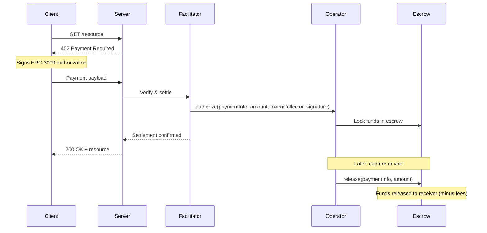

## What is X402?

**X402** is an HTTP payment protocol that uses the `402 Payment Required` status code to enable machine-to-machine payments. It allows servers to request payment from clients using standardized headers and payload formats.

Think of it as "Stripe for the programmable internet" - agents, robots, and autonomous systems can pay for API access, compute time, or any HTTP resource.

## Payment Schemes

X402 v2 supports multiple payment schemes:

<CardGroup cols={2}>
  <Card title="exact" icon="bolt">
    Immediate settlement - payment happens instantly when request is made.

    **Best for:** Simple purchases, low-value transactions, trusted services
  </Card>

  <Card title="escrow" icon="lock">
    Deferred settlement - funds locked until conditions are met.

    **Best for:** High-value transactions, usage-based billing, long-running tasks
  </Card>
</CardGroup>

## Why Escrow?

The `exact` scheme works well for immediate-delivery payments, but creates friction for:

### High-Value Transactions
**Problem:** No recourse if service fails after payment

```
Client pays $500 → Server crashes → Money lost
```

**Escrow Solution:** Funds held until work is verified

```
Client authorizes $500 → Work completes → Operator releases → Server receives
```

### Variable Pricing
**Problem:** Usage-based billing requires estimating upfront

Consider an LLM agent making API calls:
- Unknown final cost (depends on tokens used)
- Can't pay exact amount in advance
- Server needs guarantee of payment

**Escrow Solution:** Authorize max amount, capture actual usage

```
Client authorizes $10 → Uses $6.50 → Operator captures $6.50 → Refund $3.50
```

### Long-Running Tasks
**Problem:** Work takes hours or days to complete

```
Client pays for video rendering → 48 hours later → How to verify completion?
```

**Escrow Solution:** Conditional release with verification

```
Client authorizes → Work progresses → Client verifies → Release on approval
```

### Multi-Request Sessions
**Problem:** Signing 1,000 individual requests is impractical

```
Agent makes 1,000 API calls at $0.01 each
= 1,000 signatures + 1,000 on-chain transactions
```

**Escrow Solution:** One authorization, multiple captures

```
Client authorizes $10 once → Server tracks usage → Periodic batch capture
```

## How x402r Extends X402

x402r provides the **escrow scheme implementation** for x402:

1. **Base Commerce Payments Integration**
   - Audited escrow contracts from Base
   - Auth/capture pattern for deferred settlement
   - On-chain safety guarantees

2. **Operator Contracts**
   - Conditional release logic
   - Dispute resolution
   - Fee distribution
   - Time-based release

3. **Payment Facilitator**
   - Validates ERC-3009 signatures
   - Settles authorizations on-chain
   - Tracks payment state

4. **Developer Tools**
   - TypeScript SDK
   - Deployment scripts
   - Example implementations

## Payment Flow



## Use Cases

<AccordionGroup>
  <Accordion title="AI Agent API Access">
    LLM agent needs to call external APIs with variable token costs.

    **Flow:**
    1. Agent authorizes $20 max
    2. Makes 50 API calls totaling $12.50
    3. Server captures $12.50
    4. Agent reclaims unused $7.50
  </Accordion>

  <Accordion title="Compute Marketplace">
    Client needs GPU cluster for training job.

    **Flow:**
    1. Client authorizes $500 for 48-hour job
    2. Training completes in 36 hours ($375)
    3. Client verifies results
    4. Operator releases $375, refunds $125
  </Accordion>

  <Accordion title="Data Access Sessions">
    Application needs access to real-time data feed.

    **Flow:**
    1. App authorizes $100 for monthly access
    2. Provider streams data
    3. Provider captures $3.33 daily (30-day billing)
    4. Automatic refund if service interrupted
  </Accordion>

  <Accordion title="Freelance Services">
    Client hires developer for project work.

    **Flow:**
    1. Client authorizes $2000 in escrow
    2. Developer completes milestones
    3. Arbiter verifies each milestone
    4. Operator releases payment on approval
    5. Dispute resolution if disagreement
  </Accordion>
</AccordionGroup>

## Key Concepts

### Authorization
Lock funds in escrow without immediate transfer. Client signs an ERC-3009 authorization allowing the escrow contract to pull tokens.

### Capture
Release authorized funds to the receiver. The operator contract decides when and how much to release based on configured conditions.

### Void
Return funds to payer before capture. Used for full refunds during the escrow period.

### Reclaim
Safety valve for payer. If authorization expires without capture, payer can reclaim funds directly from escrow.

### Operator
Smart contract that controls capture/void logic. Different operators enable different payment patterns:
- **Time-locked**: Release after period expires
- **Arbiter-controlled**: Third party decides release
- **Usage-based**: Capture proportional to consumption
- **Immediate**: Behaves like `exact` scheme

## Next Steps

<CardGroup cols={2}>
  <Card title="Escrow Scheme Spec" icon="file-contract" href="/x402-integration/escrow-scheme">
    Complete technical specification for the escrow payment scheme.
  </Card>

  <Card title="Comparison" icon="scale-balanced" href="/x402-integration/comparison">
    Detailed comparison of escrow vs exact schemes.
  </Card>

  <Card title="Smart Contracts" icon="code" href="/contracts/overview">
    Understand the escrow and operator contracts.
  </Card>

  <Card title="SDK Overview" icon="rocket" href="/sdk/overview">
    Get started building with x402r.
  </Card>
</CardGroup>
